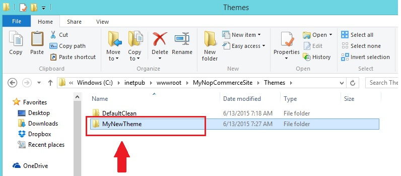

# নপকমার্স থিম ইনস্টল / প্রয়োগ

ধরে নেওয়া যাক আপনি একটি নতুন থিম ডাউনলোড করেছেন যা একটি জিপ ফাইলে রয়েছে।

১. আপনার জিপ ফাইলের সামগ্রীগুলি বের করুন এবং নীচের চিত্রের মতো "থিমস" ফোল্ডারে এটি অনুলিপি করুন:

২. প্রশাসক বিভাগে যান (`http://www.yourdomain.com/admin`)
৩. কনফিগারেশন → সেটিংস → সাধারণ এবং বিবিধ সেটিংসে যান
৪. ডিফল্ট স্টোর থিম **থেকে নতুন থিম নির্বাচন করুন** এবং **সংরক্ষণ করুন** ক্লিক করুন।

এখন, পাবলিক স্টোরে যান। আপনার নিজের ওয়েবসাইটে নতুন থিমটি দেখতে পারা উচিত।  
