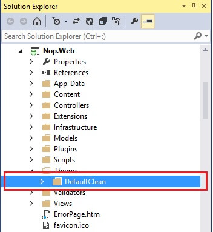
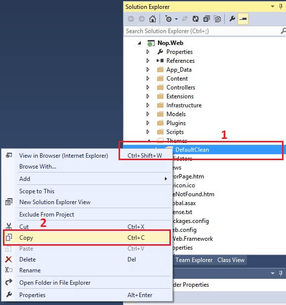
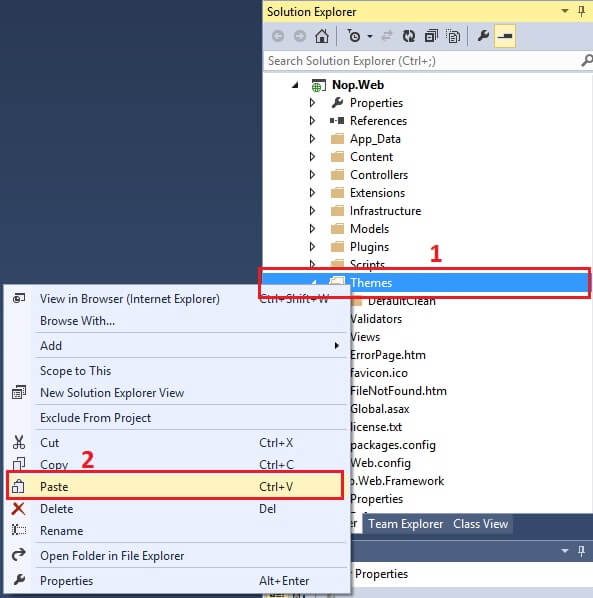
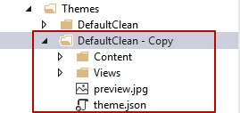
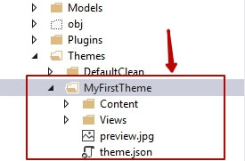
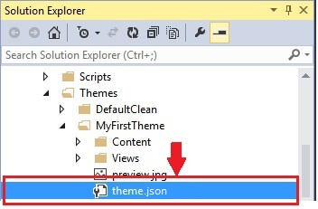
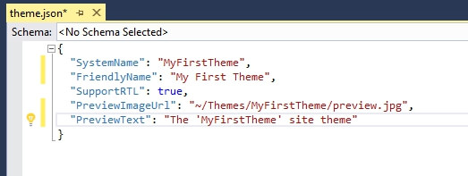
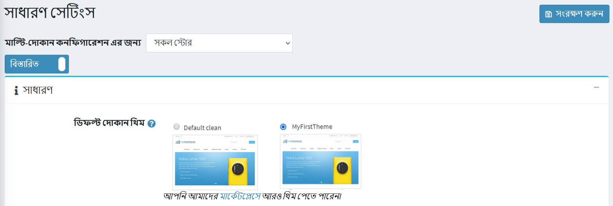

# আপনার নিজস্ব থিম তৈরি / রচনা (বর্তমান / ডিফল্ট থিম ব্যবহার)

Microsoft Visual Studio তে আপনার নপকমার্স সমাধান বা ওয়েবসাইট (ওয়েব সংস্করণ) খুলুন - এই অবস্থানে যান:

* যদি সোর্স কোড ব্যবহার করা হয়: `\Nop.Web\Themes\`
* যদি ওয়েব সংস্করণ ব্যবহার করা হয়: `\[Project Root]\Themes\`

১. যে কোনও ডিফল্ট / বর্তমান থিম নির্বাচন করুন

 

২. এখন, থিমটিতে রাইট ক্লিক করুন * নির্বাচন করুন **COPY**
    

৩. এখন "থিম" ফোল্ডারটি নির্বাচন করুন → রাইট ক্লিক করুন → **PASTE**
    

৪. আপনি "ডিফল্ট / বর্তমান থিমের অনুলিপি" এর মতো কিছু পাবেন
    

৫. এটির নতুন নাম দিন - আপনার নতুন থিমের নাম হিসাবে আপনি যা পছন্দ করেন - উদাহরণস্বরূপ, আসুন বলা যাক: MyFirstTheme
    

৬. এখন আপনার নতুন থিম ফোল্ডারের ভিতরে "মাইফারস্টেম" → খোলা `theme.json`
    

৭. আপনার নতুন থিমের নাম "মাই ফার্স্ট থিম" দিয়ে বর্তমান / বিদ্যমান থিমের নামটি পরিবর্তন করুন
    

৮. এখন, আপনার নতুন থিম ফোল্ডারের ভিতরে **"MyFirstTheme" → Content → Images** আপনার নতুন চিত্রগুলিকে "images" ডিরেক্টরিতে যুক্ত করুন  এবং আপনার প্রয়োজনীয়তা অনুসারে আপনার `style.css` - আপডেট / কাস্টমাইজ করা শুরু করুন।

আপনি যদি পরিবর্তনগুলি পরীক্ষা করতে চান → প্রশাসন বিভাগে যান আপনার নতুন থিম প্রয়োগ করুন পরিবর্তন সংরক্ষণ করুন এবং আপনার পাবলিক স্টোরের পূর্বরূপ দেখুন।
    