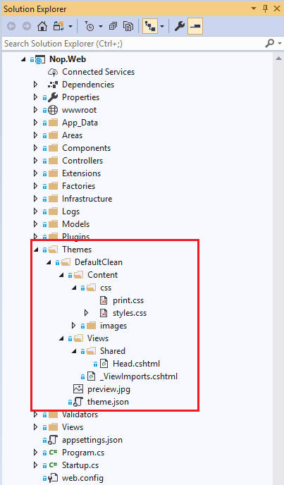

# ওভারভিউ (ডিজাইনার গাইড)

## থিম কি

একটি থিম সম্পত্তি সেটিংয়ের একটি সংগ্রহ যা আপনাকে পৃষ্ঠাগুলি এবং নিয়ন্ত্রণগুলির চিত্র সংজ্ঞায়িত করতে এবং তারপরে কোনও ওয়েব অ্যাপ্লিকেশনের পৃষ্ঠাগুলিতে, পুরো ওয়েব অ্যাপ্লিকেশন জুড়ে বা কোনও সার্ভারের সমস্ত ওয়েব অ্যাপ্লিকেশন জুড়ে ধারাবাহিকভাবে চিত্রটি প্রকাশ করে।

থিমগুলি উপাদানগুলির একটি সেট দ্বারা গঠিত: স্কিনস, ক্যাসকেডিং স্টাইল শীট (সিএসএস), চিত্র এবং অন্যান্য সংস্থানগুলি। সর্বনিম্ন, একটি থিমে স্কিন থাকবে। থিমগুলি আপনার ওয়েব সাইটে বা আপনার ওয়েব সার্ভারে বিশেষ ডিরেক্টরিতে সংজ্ঞায়িত করা হয়।

একটি থিম একটি ক্যাসকেডিং স্টাইল শীট (`.CSS` ফাইল) অন্তর্ভুক্ত করতে পারে। আপনি যখন থিম ফোল্ডারে একটি `.CSS` ফাইল স্থাপন করেন তখন স্টাইল শীটটি থিমের অংশ হিসাবে স্বয়ংক্রিয়ভাবে প্রয়োগ করা হয়। আপনি থিম ফোল্ডারে ফাইলের নাম এক্সটেনশন `.CSS` ব্যবহার করে একটি স্টাইল শীট সংজ্ঞায়িত করেছেন। (সূত্র: [msdn.microsoft.com](https://msdn.microsoft.com))

## নপকমার্স থিমের সংজ্ঞা

একটি নপকমার্স থিম মূলত সমস্ত পৃষ্ঠাগুলি বা একটি সম্পূর্ণ ওয়েবসাইট জুড়ে একটি সামঞ্জস্যপূর্ণ বিন্যাস এবং উপস্থিতি জন্য ব্যবহৃত হয়। নপকমার্স থিমটিতে পৃষ্ঠার উপস্থিতি এবং সহায়ক চিত্রগুলির জন্য স্টাইল শীট সহ বেশ কয়েকটি সহায়ক ফাইল রয়েছে।

**নপকমার্সে থিম (গুলি) এর অবস্থান**: সমস্ত থিমগুলি এর অধীনে অবস্থিত `[nopCommerce root folder]/Themes/`