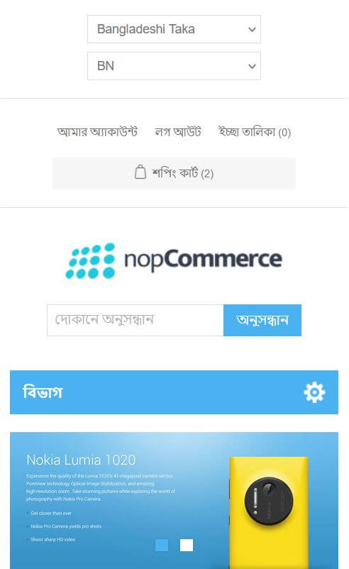

# প্রতিক্রিয়াশীল নকশা

**প্রতিক্রিয়াশীল নকশা বোঝা|** প্রতিক্রিয়াশীল ওয়েব ডিজাইন হ'ল একটি ওয়েবসাইটের ডিজাইন যা কোনও ডেস্কটপ, স্মার্টফোন, ট্যাবলেট এবং অন্যান্য মোবাইল ডিভাইসের ক্ষেত্রে বিষয়বস্তুটি সঠিকভাবে ফিট করার জন্য বিভিন্ন স্ক্রিনের আকার অনুযায়ী তার বিন্যাসকে পরিবর্তন করে। এই সংজ্ঞায়, এখানে "সঠিকভাবে" একটি কীওয়ার্ড রয়েছে - এই প্রসঙ্গে, "সঠিকভাবে" দ্বারা, এর অর্থ ধারাবাহিক। প্রতিক্রিয়াশীল ডিজাইনে কাজ করার সময়, ওয়েব বিকাশকারীদের নিশ্চিত করতে হবে যে কোনও ওয়েবসাইটের ব্যবহারকারীর অভিজ্ঞতা তাদের স্ক্রিনের আকার নির্বিশেষে সমস্ত ডিভাইস জুড়েই ধারাবাহিক থাকবে। (উৎস: [নপকমার্স ব্লগ](https://www.nopcommerce.com/why-a-responsive-design-should-be-a-priority-for-your-business-website))

* মোবাইল ডিভাইসের সংখ্যা খুব দ্রুত গতিতে বৃদ্ধি পাচ্ছে এবং বিভিন্ন স্ক্রিনের আকার / স্ক্রিন রেজোলিউশনের কারণে, ব্যবহারকারীদের অভিজ্ঞতাকে ওয়েবসাইট জুড়ে একই বা অনুরূপ রাখার জন্য ওয়েব ডেভেলপারদের দ্বারা একটি প্রতিক্রিয়াশীল ডিজাইন পদ্ধতির ব্যবহার করা হয়।

* হ্যাঁ, নপকমার্স ডিফল্ট লেআউট / থিমটি এমন একটি প্রতিক্রিয়াশীল ডিজাইনকে সমর্থন করে যা সমস্ত স্ক্রিন মাপের জন্য অনুকূলিত হয় এবং এই পদ্ধতির সিএসএস এ মিডিয়া-কোয়েরিগুলির মাধ্যমে পরিচালিত হয়। এটি আপনার অনলাইন ইকমার্স স্টোর লেআউটটিকে স্ক্রিনের আকারের উপর নির্ভর করে দেখার ক্ষেত্রটি স্বয়ংক্রিয়ভাবে সামঞ্জস্য করে আপনার ওয়েবসাইটের সামগ্রী প্রদর্শন করতে দেয়।

**প্রতিক্রিয়াশীল নকশা দেখা।** আপনার ব্রাউজার উইন্ডোটিকে কেবল পুনরায় আকার দিন এবং এর আকার হ্রাস করতে থাকুন। ব্রাউজার উইন্ডোজের আকার হ্রাস পাওয়ায় আপনি দেখতে পাবেন নপকমার্স সাইটটি সেই অনুযায়ী সামগ্রীটি সামঞ্জস্য করবে।

