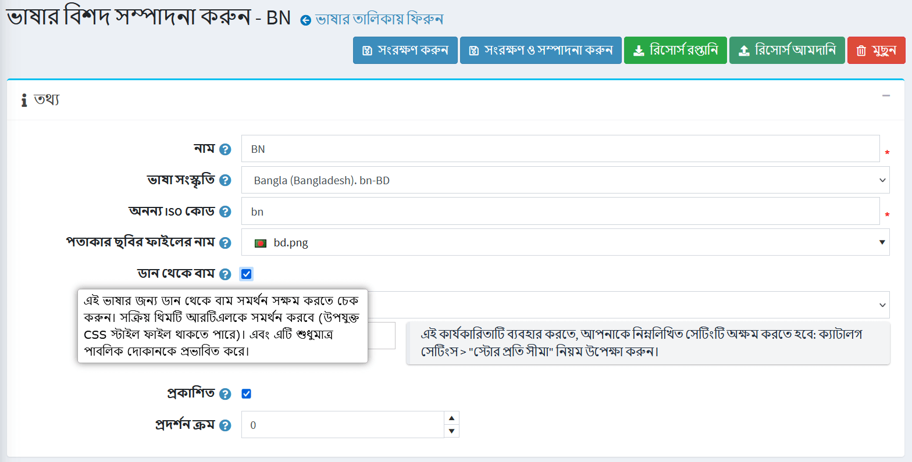
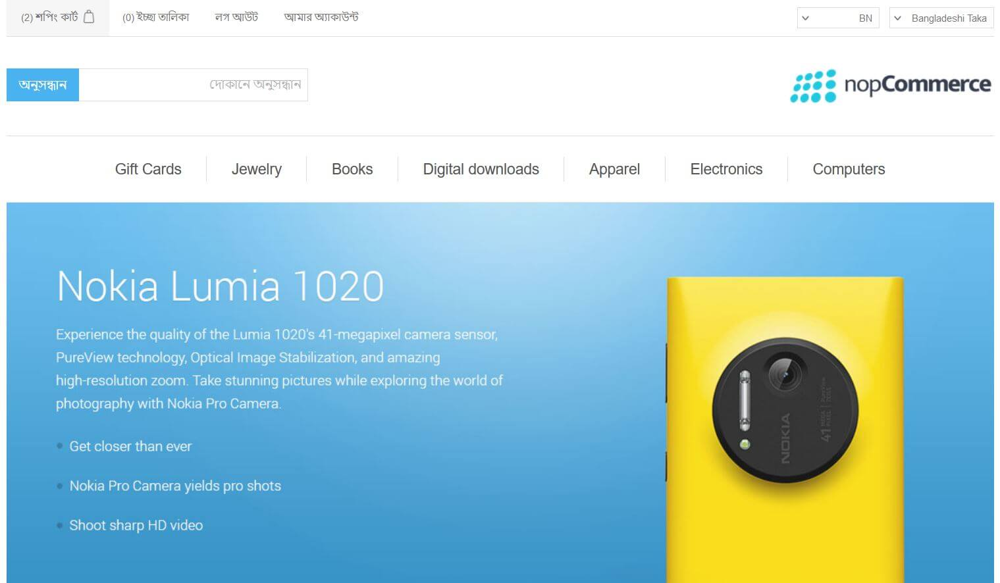
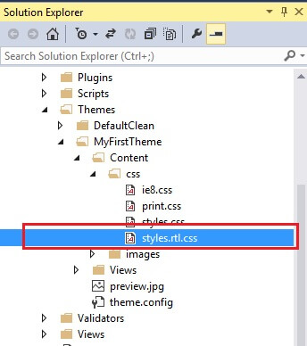

# ডান থেকে বাম থিম

নপকমার্স পাবলিক স্টোর থিমের ডান থেকে বাম সংস্করণকেও সমর্থন করে।

নপকমার্স ডিফল্ট পাবলিক স্টোর থিম **DefaultClean** ডান থেকে বাম সংস্করণ স্টাইল শীটের বৈশিষ্ট্য নিয়ে আসে।

থিমটির "বাম থেকে বাম" সংস্করণ সক্ষম করতে, দয়া করে `প্রশাসন → কনফিগারেশন → ভাষাগুলিতে` যান, একটি ভাষা **সম্পাদনা করুন** ক্লিক করুন এবং নিশ্চিত করুন যে **ডান থেকে বাম** বিকল্প সক্ষম হয়েছে|

এখন, আপনি যদি পাবলিক স্টোরটি দেখেন তবে এটি দেখতে এরকম দেখাবে:

আরটিএল সমর্থনের জন্য ব্যবহৃত স্টাইলগুলি `styles.rtl.css` ফাইলে রয়েছে।

