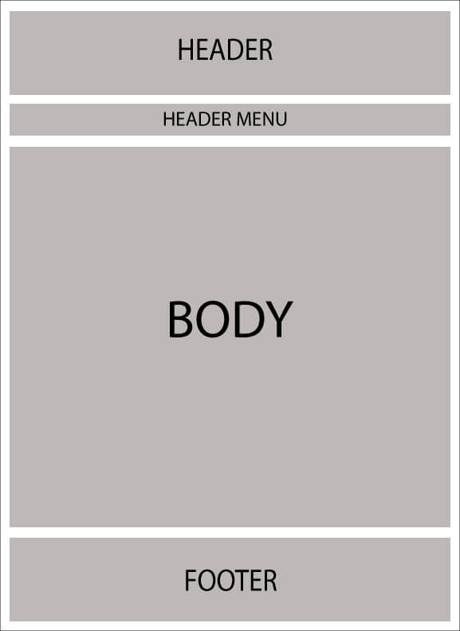
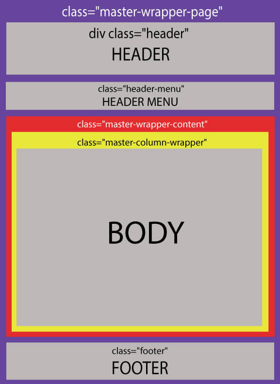
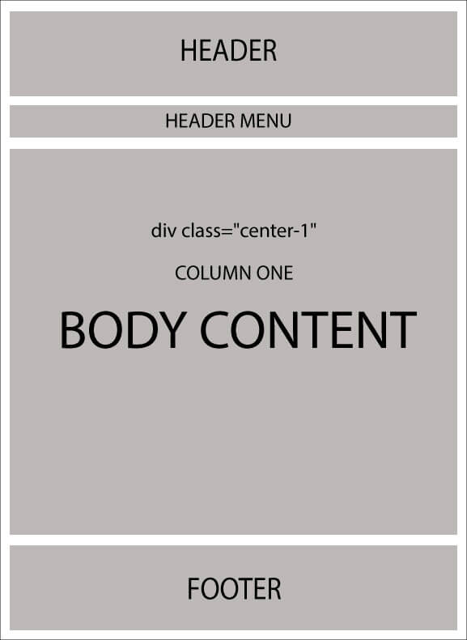
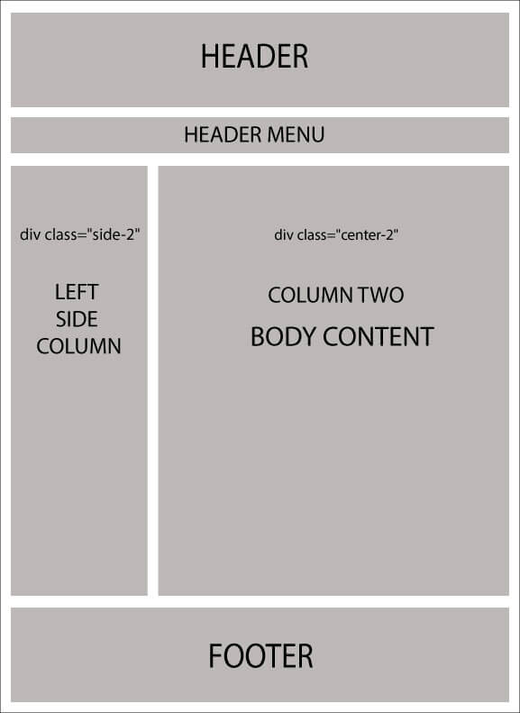

# লেআউট / ডিজাইন বোঝা

লেআউট কি? প্রতিটি ওয়েব ডেভেলপার / ডিজাইনার ওয়েবসাইটের সমস্ত পৃষ্ঠায় একটি সামঞ্জস্যপূর্ণ চেহারা এবং অনুভূতি বজায় রাখতে চায়। কিছুদিন আগে, এএসপি.নেট ২.০ এ "মাস্টার পৃষ্ঠাগুলি" ধারণাটি চালু হয়েছিল যা .aspx পৃষ্ঠাগুলির মাধ্যমে ম্যাপিংয়ের মাধ্যমে ওয়েবসাইটটির ধারাবাহিক চেহারা বজায় রাখতে সহায়তা করে।

রেজার এই জাতীয় ধারণাকে সমর্থন করে "লেআউটগুলি" নামে একটি বৈশিষ্ট্য সহ। মূলত, এটি আপনাকে একটি সাধারণ সাইট টেমপ্লেট সংজ্ঞায়িত করতে দেয় এবং তারপরে এটির চেহারা এবং আপনার ওয়েবসাইটের সমস্ত দর্শন / পৃষ্ঠাগুলি জুড়ে অনুভব করতে পারে।

নপকমার্সে, ২ টি বিভিন্ন ধরণের লেআউট রয়েছে:

* `_ColumnsOne.cshtml`
* `_ColumnsTwo.cshtml`

এই সমস্ত ২ টি লেআউটটিকে মূলত একটি প্রধান লেআউট বলা হয়: `_Root.cshtml`. `_Root.cshtml` নিজে থেকেই উত্তরাধিকার সূত্রে প্রাপ্ত `_Root.Head.cshtml`. `_Root.Head.cshtml` ফাইলটি যেখানে আপনি সিএসএস স্টাইলশীট এবং jquery ফাইলগুলি লিঙ্ক করেছেন কিনা তা খতিয়ে দেখার দরকার (আপনি এখানে আরও `.css` এবং `.js` ফাইল যুক্ত / লিঙ্ক করতে পারেন)। নপকমার্সে এই সমস্ত লেআউটের অবস্থান নিম্নরূপ: `[nopCommerce root directory]/Views/Shared/...`. আপনি যদি সোর্স কোড সংস্করণ ব্যবহার করেন তবে: `\Presentation\Nop.Web\Views\Shared\...`

* **_Root.cshtml এর লেআউট**

    

* **`_Root.cshtml` এর লেআউট (সিএসএস শ্রেণির ক্ষেত্রে)**

    

এখন নিম্নলিখিত ২ টি লেআউটগুলি `_Root.cshtml` এর শরীরকে ওভাররাইড করে:

* `_ColumnsOne.cshtml`

    এই ক্ষেত্রে, দেহের বিন্যাসে কোনও পরিবর্তন নেই, সুতরাং কাঠামোটি `_Root.cshtml` এর মতো অনেকটা একইরকম থেকে যায়:

    

* `_ColumnsTwo.cshtml`

    এই ক্ষেত্রে, শরীরের গঠনে ২ টি কলাম রয়েছে:

    
