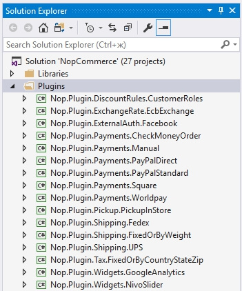
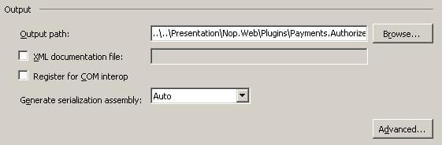
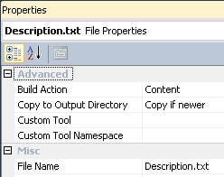
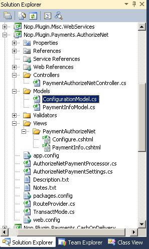

# কিভাবে নপকমার্স ৩.৯০ এর জন্য প্লাগইন লিখব (এবং পূর্ববর্তী সংস্করণ)

> কম্পিউটিংয়ে, একটি প্লাগ-ইন (বা প্লাগইন) হল সফটওয়্যার উপাদানগুলির একটি সেট যা একটি বড় সফ্টওয়্যার অ্যাপ্লিকেশন (উইকিপিডিয়া) -এ নির্দিষ্ট ক্ষমতা যোগ করে।

প্লাগইনগুলি নপকমার্স এর কার্যকারিতা প্রসারিত করতে ব্যবহৃত হয়। নপকমার্স এর বিভিন্ন ধরণের প্লাগইন রয়েছে। উদাহরণস্বরূপ, পেমেন্ট মেথড (যেমন পেপাল), কর প্রদানকারী, শিপিং মেথড গণনা মেথড (যেমন ইউপিএস, ইউএসপি, ফেডেক্স), উইজেট (যেমন 'লাইভ চ্যাট' ব্লক) এবং আরও অনেকগুলি। নপকমার্স ইতিমধ্যেই বিভিন্ন প্লাগইন দিয়ে বিতরণ করা হয়েছে। আপনি [নপকমার্স অফিসিয়াল সাইট](https://www.nopcommerce.com/marketplace) এ বিভিন্ন প্লাগইন সার্চ করে দেখতে পারেন যে কেউ ইতিমধ্যে আপনার প্রয়োজন অনুসারে প্লাগইন তৈরি করেছে কিনা। যদি তা না হয় তবে এই নিবন্ধটি আপনাকে আপনার নিজস্ব প্লাগইন তৈরির প্রক্রিয়ার মাধ্যমে নির্দেশনা দেবে।
প্লাগইনগুলি নপকমার্স এর কার্যকারিতা প্রসারিত করতে ব্যবহৃত হয়। নপকমার্স এর বিভিন্ন ধরণের প্লাগইন রয়েছে। উদাহরণস্বরূপ, পেমেন্ট মেথড (যেমন পেপাল), কর প্রদানকারী, শিপিং মেথড গণনা মেথড (যেমন ইউপিএস, ইউএসপি, ফেডেক্স), উইজেট (যেমন 'লাইভ চ্যাট' ব্লক) এবং আরও অনেকগুলি।

## প্লাগইন গঠন, প্রয়োজনীয় ফাইল এবং লোকেশন

১. প্রথমে আপনাকে যা করতে হবে তা হল সমাধানের মধ্যে একটি নতুন *`ক্লাস লাইব্রেরি`* প্রকল্প তৈরি করা। আপনার সমাধানের মূলে সমস্ত প্লাগইনগুলিকে `\Plugins` ডিরেক্টরিতে স্থাপন করা একটি ভাল অভ্যাস (`\Nop.Web` ডিরেক্টরিতে অবস্থিত `\Plugins` সাবডিরেক্টরিতে মিশে না যা ইতিমধ্যে নিযুক্ত প্লাগইনগুলির জন্য ব্যবহৃত হয়)। সমস্ত প্লাগইনগুলিকে `Plugins` সমাধান ফোল্ডারে স্থাপন করা একটি ভাল অভ্যাস (আপনি সমাধান ফোল্ডার সম্পর্কে আরও তথ্য পেতে পারেন [এখানে](http://msdn.microsoft.com/library/sx2027y2.aspx))।

একটি প্লাগইন প্রকল্পের জন্য প্রস্তাবিত নাম হল **`Nop.Plugin.{Group}.{Name}`**। **`{Group}`** আপনার প্লাগইন গ্রুপ (উদাহরণস্বরূপ,*পেমেন্ট*অথবা*শিপিং*)। **`{Name}`** আপনার প্লাগইন নাম (উদাহরণস্বরূপ,*পেপ্যাল স্ট্যান্ডার্ড*)। উদাহরণস্বরূপ, পেপ্যাল স্ট্যান্ডার্ড পেমেন্ট প্লাগইনটির নিম্নলিখিত নাম রয়েছে: **`Nop.Plugin.Payments.PayPalStandard`**। কিন্তু দয়া করে নোট করুন যে এটি একটি প্রয়োজনীয়তা নয়। এবং আপনি একটি প্লাগইন এর জন্য যেকোনো নাম নির্বাচন করতে পারেন। উদাহরণস্বরূপ, `MyGreatPlugin`।



২. একবার প্লাগইন প্রজেক্ট তৈরি হয়ে গেলে প্রোজেক্ট বিল্ড আউটপুট পাথ আপডেট করুন। সেট করুন `..\..\Presentation\Nop.Web\Plugins\{Group}.{Name}`। উদাহরণস্বরূপ, Authorize.NET পেমেন্ট প্লাগিনে নিম্নলিখিত আউটপুট পাথ রয়েছে: `..\..\Presentation\Nop.Web\Plugins\Payments.AuthorizeNet`। এটি সম্পন্ন হওয়ার পরে, উপযুক্ত প্লাগইন DLL গুলি স্বয়ংক্রিয়ভাবে `\Presentation\Nop.Web\Plugins` ডিরেক্টরিতে অনুলিপি করা হবে যা বৈধ প্লাগইনগুলির জন্য নপকমার্স কোর দ্বারা অনুসন্ধান করা হয়। কিন্তু দয়া করে মনে রাখবেন যে এটি একটি বাধ্যতামূলক নয়। এবং আপনি একটি প্লাগইন এর জন্য কোন আউটপুট ডিরেক্টরি নাম পছন্দ করতে পারেন।



    - প্রকল্প মেনুতে, Properties ক্লিক করুন।
     - Build ট্যাবে ক্লিক করুন।
     - আউটপুট পাথ বক্সের পাশে ব্রাউজ বোতামে ক্লিক করুন এবং একটি নতুন বিল্ড আউটপুট ডিরেক্টরি নির্বাচন করুন।

     আপনার সমস্ত বিদ্যমান কনফিগারেশন ("Debug" এবং "Release") এর উপরে বর্ণিত পদক্ষেপগুলি করা উচিত। 

৩. পরবর্তী ধাপ হল প্রতিটি প্লাগইন এর জন্য প্রয়োজনীয় একটি `Description.txt` ফাইল তৈরি করা। এই ফাইলটিতে আপনার প্লাগইন বর্ণনা করে মেটা তথ্য রয়েছে। শুধু অন্য কোন বিদ্যমান প্লাগইন থেকে এই ফাইলটি অনুলিপি করুন এবং আপনার প্রয়োজনের জন্য এটি পরিবর্তন করুন। উদাহরণস্বরূপ, পেপ্যাল স্ট্যান্ডার্ড পেমেন্ট প্লাগইনটিতে নিম্নলিখিত `Description.txt` ফাইল রয়েছে:

```txt
    Group: Payment methods
    FriendlyName: PayPal Standard
    SystemName: Payments.PayPalStandard
    Version: 1.28
    SupportedVersions: 3.90
    Author: nopCommerce team
    DisplayOrder: 1
    FileName: Nop.Plugin.Payments.PayPalStandard.dll
    Description: This plugin allows paying with PayPal Standard
```

    প্রকৃতপক্ষে সমস্ত ক্ষেত্র স্ব-বর্ণনামূলক, কিন্তু এখানে কিছু নোট রয়েছে। **SystemName** ক্ষেত্রটি অনন্য হওয়া উচিত। **Version** ক্ষেত্র হল আপনার প্লাগিনের একটি সংস্করণ নম্বর; আপনি এটি আপনার পছন্দ মত কোন মান সেট করতে পারেন। **** ক্ষেত্রটিতে কমা দ্বারা পৃথক সমর্থিত নপকমার্স সংস্করণের একটি তালিকা থাকতে পারে (নিশ্চিত করুন যে নপকমার্স এর বর্তমান সংস্করণটি এই তালিকায় অন্তর্ভুক্ত করা হয়েছে, অন্যথায়, এটি লোড হবে না)। **FileName** ক্ষেত্রের নিম্নলিখিত বিন্যাস আছে *Nop.Plugin।{Group}।{Name}.dll* (এটি আপনার প্লাগইন সমাবেশ ফাইলের নাম)। নিশ্চিত করুন যে এই ফাইলের "Copy to Output Directory" সম্পত্তি "Copy if newer" এ সেট করা আছে। 



৪. আপনি একটি web.config ফাইল তৈরি করুন এবং নিশ্চিত করুন যে এটি আউটপুটে অনুলিপি করা হয়েছে। শুধু যে কোন বিদ্যমান প্লাগইন থেকে এটি অনুলিপি করুন।

> [!IMPORTANT]
> এগিয়ে গিয়ে নিশ্চিত করুন যে সমস্ত তৃতীয় পক্ষের সমাবেশ রেফারেন্সগুলির (স্থানীয় লাইব্রেরিগুলি যেমন Nop.Services.dll বা Nop.Web.Framework.dll সহ) "Copy local" বৈশিষ্ট্যগুলি "False" (অনুলিপি করবেন না) সেট করা আছে।

৫. পরবর্তী ধাপ হল প্রতিটি প্লাগইন এর জন্য প্রয়োজনীয় একটি `plugin.json` ফাইল তৈরি করা। এই ফাইলটিতে আপনার প্লাগইন বর্ণনা করে মেটা তথ্য রয়েছে। শুধু অন্য কোন বিদ্যমান প্লাগইন থেকে এই ফাইলটি অনুলিপি করুন এবং আপনার প্রয়োজনের জন্য এটি পরিবর্তন করুন। `Plugin.json` ফাইল সম্পর্কে তথ্যের জন্য, দয়া করে [plugin.json](xref:bn/developer/plugins/plugin_json) ফাইল দেখুন।

৬. সর্বশেষ প্রয়োজনীয় পদক্ষেপ হল একটি শ্রেণী তৈরি করা যা **`IPlugin`** ইন্টারফেস (`Nop.Core.Plugins` namespace) প্রয়োগ করে। নপকমার্স এর **`BasePlugin`** ক্লাস আছে যা ইতিমধ্যে কিছু `IPlugin` মেথড প্রয়োগ করে এবং আপনাকে সোর্স কোডের নকল এড়াতে দেয়। নপকমার্স আপনাকে `IPlugin` থেকে প্রাপ্ত কিছু নির্দিষ্ট ইন্টারফেস প্রদান করে। উদাহরণস্বরূপ, আমাদের `IPaymentMethod` ইন্টারফেস আছে যা নতুন পেমেন্ট মেথড প্লাগইন তৈরিতে ব্যবহৃত হয়। এতে কিছু মেথড রয়েছে যা শুধুমাত্র পেমেন্ট মেথডের জন্য নির্দিষ্ট যেমন *`ProcessPayment ()`* অথবা *`GetAdditionalHandlingFee ()`*। বর্তমানে নপকমার্স এর নিম্নলিখিত নির্দিষ্ট প্লাগইন ইন্টারফেস রয়েছে:

- **IPaymentMethod**. এই প্লাগইনগুলি পেমেন্ট প্রক্রিয়াকরণের জন্য ব্যবহৃত হয়।
- **IShippingRateComputationMethod**. এই প্লাগইনগুলি গ্রহণযোগ্য ডেলিভারি মেথড এবং উপযুক্ত শিপিং হার পুনরুদ্ধারের জন্য ব্যবহৃত হয়।
   যেমন, UPS, UPS, FedEx ইত্যাদি।
- **IPickupPointProvider**. এই প্লাগইনগুলি পিকআপ পয়েন্ট প্রদানের জন্য ব্যবহৃত হয়।
- **ITaxProvider**. কর প্রদানকারীরা করের হার পাওয়ার জন্য ব্যবহার করা হয়।
- **IExchangeRateProvider**. মুদ্রা বিনিময় হার পেতে ব্যবহৃত।
- **IDiscountRequirementRule**. আপনাকে নতুন ছাড়ের নিয়ম তৈরি করতে দেয় যেমন "গ্রাহকের বিলিং দেশ হওয়া উচিত ..."
- **IExternalAuthenticationMethod**. বাহ্যিক প্রমাণীকরণ মেথড যেমন ফেসবুক, টুইটার, ওপেনআইডি ইত্যাদি তৈরিতে ব্যবহৃত হয়।
- **IWidgetPlugin**. এটি আপনাকে উইজেট তৈরি করতে দেয়। আপনার সাইটের কিছু অংশে উইজেট রেন্ডার করা হয়। উদাহরণস্বরূপ, এটি আপনার সাইটের বাম কলামে একটি "লাইভ চ্যাট" ব্লক হতে পারে।
- **IMiscPlugin**. যদি আপনার প্লাগইন উপরের কোন ইন্টারফেসের সাথে মানানসই না হয়।

> [!IMPORTANT]
> গুরুত্বপূর্ণ নোট: প্রতিটি প্রকল্প তৈরির পরে, পরিবর্তন করার আগে সমাধানটি পরিষ্কার করুন। কিছু সম্পদ ক্যাশে করা হবে এবং ডেভেলপার পাগলামি হতে পারে।

## অনুরোধগুলি পরিচালনা করা। কন্ট্রোলার, মডেল এবং ভিউ

এখন আপনি **প্রশাসন → কনফিগারেশন → লোকাল প্লাগইন** এ গিয়ে প্লাগইন দেখতে পারেন। কিন্তু আপনি যেমন অনুমান করেছেন আমাদের প্লাগইন কিছুই করে না। এটির কনফিগারেশনের জন্য ইউজার ইন্টারফেসও নেই। প্লাগইন কনফিগার করার জন্য একটি পৃষ্ঠা তৈরি করা যাক।

আমাদের এখন যা করতে হবে তা হল একটি কন্ট্রোলার, একটি মডেল এবং একটি ভিউ তৈরি করা।

- একটি ASP.NET MVC ওয়েবসাইটের বিরুদ্ধে করা অনুরোধের সাড়া দেওয়ার জন্য MVC কন্ট্রোলার দায়ী। প্রতিটি ব্রাউজারের অনুরোধ একটি নির্দিষ্ট নিয়ামককে ম্যাপ করা হয়।

- একটি ভিউতে HTML মার্কআপ এবং সামগ্রী রয়েছে যা ব্রাউজারে পাঠানো হয়। একটি `ASP.NET MVC` অ্যাপ্লিকেশনের সাথে কাজ করার সময় একটি ভিউ একটি পৃষ্ঠার সমতুল্য।

- একটি MVC মডেলে আপনার সমস্ত অ্যাপ্লিকেশন যুক্তি রয়েছে যা একটি ভিউ বা কন্ট্রোলার নয়।
আপনি MVC প্যাটার্ন সম্পর্কে আরও তথ্য পেতে পারেন [এখানে](http://www.asp.net/mvc/tutorials/older-versions/overview/understanding-models-views-and-controllers-cs).

সুতরাং শুরু করি:

- **মডেল তৈরি করুন**। নতুন প্লাগিনে একটি **মডেল** ফোল্ডার যোগ করুন, এবং তারপর একটি নতুন মডেল ক্লাস যোগ করুন যা আপনার প্রয়োজন অনুসারে।
- **ভিউ তৈরি করুন**। নতুন প্লাগিনে একটি **ভিউস** ফোল্ডার যোগ করুন, তারপর একটি {Name} ফোল্ডার যোগ করুন (যেখানে {Name} আপনার প্লাগইন নাম), এবং অবশেষে `Configure.cshtml` নামে একটি `cshtml` ফাইল যোগ করুন। গুরুত্বপূর্ণ নোট: সংস্করণ 2.00-3.30 এর জন্য দৃশ্যটি একটি এমবেডেড রিসোর্স হিসাবে চিহ্নিত করা উচিত। এবং সংস্করণ 3.40 ভিউ শুরু করে, নিশ্চিত করুন যে ভিউ ফাইলের "Build Action" প্রপার্টি "Content" এ সেট করা আছে এবং "Copy to Output Directory" প্রপার্টি "Copy if newer" সেট করা আছে।
- **কন্ট্রোলার তৈরি করুন**। নতুন প্লাগিনে একটি কন্ট্রোলার ফোল্ডার যোগ করুন, এবং তারপর একটি নতুন নিয়ামক শ্রেণী যোগ করুন। একটি ভাল অভ্যাস হল প্লাগইন কন্ট্রোলারদের নাম দেওয়া `{Group}{Name}Controller.cs`। উদাহরণস্বরূপ, PaymentAuthorizeNetController। অবশ্যই এইভাবে নিয়ামকদের নাম দেওয়ার প্রয়োজন নেই (তবে কেবল একটি সুপারিশ)। তারপরে কনফিগারেশন পৃষ্ঠার জন্য একটি উপযুক্ত কর্ম মেথড তৈরি করুন (অ্যাডমিন এলাকায়)। এর নাম দিন "Configure"। একটি মডেল ক্লাস প্রস্তুত করুন এবং এটি নিম্নলিখিত ভিউতে পাস করুন। নপকমার্স সংস্করণ 2.00-3.30 এর জন্য আপনাকে এম্বেডেড ভিউ পাথ পাস করতে হবে - "Nop.Plugin.{Group}.{Name}.Views. {Group}{Name}.Configure"। এবং নপকমার্স ভার্সন 40.40০ শুরু করলে আপনার ভিজ্যুয়াল ভিউ পাথ পাস করতে হবে - `~/Plugins/{PluginOutputDirectory}/Views/{ControllerName}/Configure.cshtml`। উদাহরণস্বরূপ, Authorize.NET পেমেন্ট প্লাগইন খুলুন এবং PaymentAuthorizeNetController এর বাস্তবায়ন দেখুন।

    > [!TIP]
    >
    > - উপরে বর্ণিত ধাপগুলি সম্পূর্ণ করার সবচেয়ে সহজ উপায় হল অন্য কোন প্লাগইন খুলে এই ফাইলগুলিকে আপনার প্লাগইন প্রকল্পে অনুলিপি করা। তারপরে কেবল উপযুক্ত ক্লাস এবং ডিরেক্টরিগুলির নাম পরিবর্তন করুন।
     >
     > - যদি আপনি নিয়ন্ত্রকের একটি নির্দিষ্ট কর্ম মেথডে প্রশাসকদের (দোকানের মালিকদের) অ্যাক্সেস সীমাবদ্ধ করতে চান, তাহলে শুধু [AdminAuthorize] অ্যাট্রিবিউট দিয়ে এটি চিহ্নিত করুন।

     উদাহরণস্বরূপ, Authorize.NET প্লাগইন এর প্রজেক্ট কাঠামো নিচের ছবির মত দেখাচ্ছে

    

## রুটস

এখন আমাদের উপযুক্ত প্লাগইন রুট নিবন্ধন করতে হবে। ASP.NET রাউটিং নির্দিষ্ট MVC কন্ট্রোলার ক্রিয়ায় আগত ব্রাউজার অনুরোধ ম্যাপ করার জন্য দায়ী। আপনি রাউটিং সম্পর্কে আরও তথ্য পেতে পারেন [এখানে](http://www.asp.net/mvc/tutorials/older-versions/controllers-and-routing/asp-net-mvc-routing-overview-cs)। সুতরাং পরবর্তী পদক্ষেপগুলি অনুসরণ করুন:

- কিছু নির্দিষ্ট প্লাগইন ইন্টারফেস (উপরে বর্ণিত) এবং "IMiscPlugin" ইন্টারফেসের নিম্নলিখিত মেথড রয়েছে: "GetConfigurationRoute"। এটি একটি নিয়ামক ক্রিয়ায় একটি রুট ফিরিয়ে দেওয়া উচিত যা প্লাগইন কনফিগারেশনের জন্য ব্যবহৃত হয়। আপনার প্লাগইন ইন্টারফেসের "GetConfigurationRoute" মেথড প্রয়োগ করুন। এই মেথডটি প্লাগইন কনফিগারেশনের জন্য কোন রুট ব্যবহার করা হয় সে সম্পর্কে নপকমার্স কে অবহিত করে। যদি আপনার প্লাগিনে কনফিগারেশন পৃষ্ঠা না থাকে, তাহলে "GetConfigurationRoute" শূন্য হয়ে ফিরে আসা উচিত। উদাহরণস্বরূপ নীচের কোডটি দেখুন:

    ```csharp
    public void GetConfigurationRoute(out string actionName,
                out string controllerName,
                out RouteValueDictionary routeValues)
    {
        actionName = "Configure";
        controllerName = "PaymentAuthorizeNet";
        routeValues = new RouteValueDictionary()
        {
            { "Namespaces", "Nop.Plugin.Payments.AuthorizeNet.Controllers" },
            { "area", null }
        };
    }
    ```

- (ঐচ্ছিক) যদি আপনার কিছু কাস্টম রুট যোগ করার প্রয়োজন হয়, তাহলে `RouteProvider.cs` ফাইল তৈরি করুন। এটি নপকমার্স সিস্টেমকে প্লাগইন রুট সম্পর্কে অবহিত করে। উদাহরণস্বরূপ, নিম্নলিখিত RouteProvider ক্লাস একটি নতুন রুট যোগ করে যা আপনার ওয়েব ব্রাউজার খুলে এবং `http://www.yourStore.com/Plugins/PaymentPayPalStandard/PDTHandler` URL (PayPal প্লাগইন দ্বারা ব্যবহৃত) এ নেভিগেট করে ব্যবহার করা যায়:-

```csharp
        public partial class RouteProvider : IRouteProvider
        {
            public void RegisterRoutes(RouteCollection routes)
            {
                 routes.MapRoute("Plugin.Payments.PayPalStandard.PDTHandler",
                     "Plugins/PaymentPayPalStandard/PDTHandler",
                     new { controller = "PaymentPayPalStandard", action = "PDTHandler" },
                     new[] { "Nop.Plugin.Payments.PayPalStandard.Controllers"  }
                );
            }
    
            public int Priority
            {
                get
                {
                    return 0;
                }
            }
        }
```

একবার আপনি আপনার প্লাগইন ইনস্টল করে কনফিগারেশন মেথড যোগ করলে আপনি **প্রশাসন → কনফিগারেশন → লোকাল প্লাগইন** এর অধীনে আপনার প্লাগইন কনফিগার করার জন্য একটি লিঙ্ক পাবেন।

## "Install" এবং "Uninstall" মেথডগুলি পরিচালনা করা

এই পদক্ষেপটি ঐচ্ছিক। কিছু প্লাগইন প্লাগইন ইনস্টলেশনের সময় অতিরিক্ত যুক্তির প্রয়োজন হতে পারে। উদাহরণস্বরূপ, একটি প্লাগইন নতুন লোকেল সম্পদ সন্নিবেশ করতে পারে। সুতরাং আপনার `IPlugin` বাস্তবায়ন খুলুন (বেশিরভাগ ক্ষেত্রে এটি `BasePlugin` শ্রেণী থেকে উদ্ভূত হবে) এবং নিম্নলিখিত মেথডগুলি ওভাররাইড করুন:

- **Install**. প্লাগইন ইনস্টলেশনের সময় এই মেথডটি চালু হয়। আপনি এখানে যেকোনো সেটিংস শুরু করতে পারেন, নতুন লোকাল রিসোর্স সন্নিবেশ করতে পারেন, অথবা কিছু নতুন ডাটাবেস টেবিল তৈরি করতে পারেন (প্রয়োজন হলে)।

- **Uninstall**. প্লাগইন আনইনস্টল করার সময় এই মেথডটি চালু হয়।

> [!IMPORTANT]
> আপনি যদি এই মেথডগুলির মধ্যে একটিকে ওভাররাইড করেন তবে এর ভিত্তি বাস্তবায়ন গোপন করবেন না।

উদাহরণস্বরূপ, ওভাররাইড করা `Install` মেথডে নিম্নলিখিত মেথড কল অন্তর্ভুক্ত করা উচিত: *`base.Install()`*। *PayPalStandard* প্লাগইন এর `Install` মেথডটি নিচের কোডের মত দেখায়।

উদাহরণস্বরূপ, Authorize.NET প্লাগইন এর প্রজেক্ট কাঠামো নিচের ছবির মত দেখাচ্ছে

```csharp
    public override void Install()
    {
        var settings = new AuthorizeNetPaymentSettings()
        {
            UseSandbox = true,
            TransactMode = TransactMode.Authorize,
            TransactionKey = "123",
            LoginId = "456"
        };
        _settingService.SaveSetting(settings);
        base.Install();
    }
```

> [!TIP]
>ইনস্টল করা প্লাগইনগুলির তালিকা `\App_Data\installedPlugins.txt` তে অবস্থিত। ইনস্টলেশনের সময় তালিকা তৈরি করা হয়।

## নপকমার্স আপগ্রেড করলে প্লাগইন ভেঙ্গে যেতে পারে

কিছু প্লাগইন পুরনো হয়ে যেতে পারে এবং নপকমার্স এর নতুন সংস্করণের সাথে আর কাজ করবে না। নতুন সংস্করণে আপগ্রেড করার পরে যদি আপনার সমস্যা হয়, তাহলে প্লাগইনটি মুছুন এবং একটি নতুন সংস্করণ পাওয়া যায় কিনা তা দেখতে অফিসিয়াল নপকমার্স ওয়েবসাইটে যান। অনেক প্লাগইন লেখক নতুন সংস্করণকে সামঞ্জস্য করতে তাদের প্লাগইনগুলি আপগ্রেড করবে, তবে কেউ কেউ করবে না এবং তাদের প্লাগইন নপকমার্সের উন্নতির সাথে অপ্রচলিত হয়ে যাবে। তবে বেশিরভাগ ক্ষেত্রে, আপনি কেবল একটি উপযুক্ত `plugin.json` ফাইল খুলতে পারেন এবং **SupportedVersions** ক্ষেত্র আপডেট করতে পারেন।

## উপসংহার

আশা করি এটি আপনাকে নপকমার্স দিয়ে শুরু করবে এবং আপনাকে আরও বিস্তৃত প্লাগইন তৈরির জন্য প্রস্তুত করবেন।
