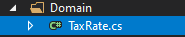

# কিভাবে নপকমার্স এর জন্য ট্যাক্স প্লাগইন লিখব

নপকমার্স কার্যকারিতা প্রসারিত করতে, প্লাগইন ব্যবহার করা হয়। "PickupInStore" এবং "PayPal Standard" এর মতো বিভিন্ন ধরণের প্লাগইন রয়েছে যা ইতিমধ্যে নপকমার্স ডিস্ট্রোতে রয়েছে। আপনি [নপকমার্স অফিসিয়াল সাইট](https://www.nopcommerce.com/marketplace) এ বিভিন্ন প্লাগইন সার্চ করে দেখতে পারেন যে কেউ ইতিমধ্যে আপনার প্রয়োজন অনুসারে প্লাগইন তৈরি করেছে কিনা। যদি আপনি একটি খুঁজে না পান, তাহলে আপনি সঠিক জায়গায় আছেন কারণ এই নিবন্ধটি আপনাকে প্লাগইন তৈরির প্রক্রিয়ার মাধ্যমে নির্দেশ করবে, বিশেষ করে ট্যাক্স প্লাগইন, আপনার প্রয়োজন অনুযায়ী।

## প্লাগইন স্ট্রাকচার, প্রয়োজনীয় ফাইল এবং লোকেশন

১. সমাধানের মধ্যে একটি নতুন "Class Library" প্রকল্প তৈরি করে শুরু করুন। আপনার প্লাগইনটি উৎসের মূল ফোল্ডারে অবস্থিত **Plugins** ডিরেক্টরিতে রাখার সুপারিশ করা হয়, যেখানে অন্যান্য প্লাগইন এবং উইজেট ইতিমধ্যেই থাকে।


> [!NOTE]
> এই প্রেজেন্টেশনটি `Presentation\Nop.Web` ডিরেক্টরিতে বিদ্যমান একটিকে বিভ্রান্ত করবেন না। Nop.Web ডিরেক্টরিতে প্লাগইন ডিরেক্টরিতে প্লাগইন সংকলিত ফাইল রয়েছে।

একটি প্লাগইন প্রকল্পের জন্য প্রস্তাবিত নাম হল `Nop.Plugin.{Group}.{Name}`. `{Group}` হল আপনার প্লাগইন গ্রুপ (উদাহরণস্বরূপ, `পেমেন্ট` বা `শিপিং`)। `{Name}` আপনার প্লাগইন নাম (উদাহরণস্বরূপ, `FixedOrByCountryStateZip`)। উদাহরণস্বরূপ, `FixedOrByCountryStateZip` ট্যাক্স প্লাগইনটির নিম্নলিখিত নাম রয়েছে: `Nop.Plugin.Tax.FixedOrByCountryStateZip`। কিন্তু দয়া করে মনে রাখবেন যে এটি একটি প্রয়োজনীয়তা নয়। এবং আপনি একটি প্লাগইন জন্য কোন নাম চয়ন করতে পারেন। উদাহরণস্বরূপ, `MyFirstTaxPlugin`। একটি সমাধানের প্লাগইন ডিরেক্টরি কাঠামো নিম্নলিখিত মত দেখাচ্ছে।


২. প্লাগইন প্রজেক্ট তৈরি হয়ে গেলে, **.csproj** ফাইলের বিষয়বস্তু যেকোনো উপলভ্য টেক্সট এডিটর অ্যাপ্লিকেশন ব্যবহার করে আপডেট করা উচিত। নিম্নলিখিত একটি দিয়ে বিষয়বস্তু প্রতিস্থাপন করুন:

```xml
    <Project Sdk="Microsoft.NET.Sdk">
        <PropertyGroup>
            <TargetFramework>netcoreapp2.2</TargetFramework>
            <Copyright>SOME_COPYRIGHT</Copyright>
            <Company>YOUR_COMPANY</Company>
            <Authors>SOME_AUTHORS</Authors>
            <PackageLicenseUrl>PACKAGE_LICENSE_URL</PackageLicenseUrl>
            <PackageProjectUrl>PACKAGE_PROJECT_URL</PackageProjectUrl>
            <RepositoryUrl>REPOSITORY_URL</RepositoryUrl>
            <RepositoryType>Git</RepositoryType>
            <OutputPath>..\..\Presentation\Nop.Web\Plugins\PLUGIN_OUTPUT_DIRECTORY</OutputPath>
            <OutDir>$(OutputPath)</OutDir>
            <!--Set this parameter to true to get the dlls copied from the NuGet cache to the output of your        project. You need to set this parameter to true if your plugin has a nuget package to ensure that       the dlls copied from the NuGet cache to the output of your project-->
            <CopyLocalLockFileAssemblies>true</CopyLocalLockFileAssemblies>
        </PropertyGroup>
        <ItemGroup>
            <ProjectReference Include="..\..\Presentation\Nop.Web.Framework\Nop.Web.Framework.csproj" />
            <ClearPluginAssemblies Include="$(MSBuildProjectDirectory)\..\..\Build\ClearPluginAssemblies.sproj" />
        </ItemGroup>
        <!-- This target execute after "Build" target -->
        <Target Name="NopTarget" AfterTargets="Build">
            <!-- Delete unnecessary libraries from plugins path -->
            <MSBuild Projects="@(ClearPluginAssemblies)" Properties="PluginPath=$(MSBuildProjectDirectory)\ $    (OutDir)" Targets="NopClear" />
        </Target>
    </Project>
```

> [!NOTE]
> **PLUGIN_OUTPUT_DIRECTORY** প্লাগইন নাম দ্বারা প্রতিস্থাপন করা উচিত, উদাহরণস্বরূপ, `Tax.FixedOrByCountryStateZip`।

৩. **.csproj** ফাইল আপডেট করার পর, `plugin.json` ফাইল যোগ করতে হবে যা প্লাগইন এর জন্য প্রয়োজন। এই ফাইলটিতে আপনার প্লাগইন বর্ণনা করে মেটা তথ্য রয়েছে। শুধু অন্য কোন বিদ্যমান প্লাগইন/উইজেট থেকে এই ফাইলটি অনুলিপি করুন এবং আপনার প্রয়োজনের জন্য এটি পরিবর্তন করুন। `Plugin.json` ফাইল সম্পর্কে তথ্যের জন্য, দয়া করে দেখুন [plugin.json file](xref:en/developer/plugins/plugin_json).

৪. সর্বশেষ প্রয়োজনীয় ধাপ হল একটি ক্লাস তৈরি করা যা `BasePlugin` (`Nop.Core.Plugins` namespace) এবং `ITaxProvider` ইন্টারফেস (`Nop.Services.Tax` namespace) প্রয়োগ করে। **ITaxProvider** `GetTaxRate` মেথড প্রয়োগ করে যা টাইপ প্রদান করে **CalculateTaxResult** (ট্যাক্স রেট থাকে, ত্রুটি থাকে এবং বুলিয়ান সাফল্যের অবস্থা থাকে) কাস্টম যুক্তির উপর ভিত্তি করে, সাধারণত গ্রাহকের ঠিকানার উপর ভিত্তি করে।

## অনুরোধগুলি পরিচালনা। কন্ট্রোলার, মডেল এবং ভিউ

এখন আপনি প্লাগইন এ গিয়ে দেখতে পারেন **Admin area** → **Configuration** → **Local Plugins**.


যখন একটি প্লাগইন/উইজেট ইনস্টল করা হয়, আপনি দেখতে পাবেন **Uninstall** বাটন। এটি একটি ভাল অভ্যাস যে আপনি প্লাগইন/উইজেট আনইনস্টল করুন যা কর্মক্ষমতা উন্নতির জন্য প্রয়োজনীয় নয়।


যখন একটি প্লাগইন/উইজেট ইনস্টল করা বা আনইনস্টল করা হয় না তখন **Install** এবং **Delete** বাটন থাকবে।

> [!NOTE]
> ডিলিট করলে সার্ভার থেকে ফিজিক্যাল ফাইল মুছে যাবে।

কিন্তু আপনি যেমন অনুমান করেছেন আমাদের প্লাগইন কিছুই করে না। এটির কনফিগারেশনের জন্য ইউজার ইন্টারফেসও নেই। প্লাগইন কনফিগার করার জন্য একটি পৃষ্ঠা তৈরি করা যাক।

আমাদের এখন যা করতে হবে তা হল একটি নিয়ামক, একটি মডেল, একটি ভিউ এবং একটি ভিউ কম্পোনেন্ট তৈরি করা।

* এমভিসি কন্ট্রোলাররা একটি `ASP.NET MVC` ওয়েবসাইটের বিরুদ্ধে করা অনুরোধের সাড়া দেওয়ার জন্য দায়ী। প্রতিটি ব্রাউজারের অনুরোধ একটি নির্দিষ্ট নিয়ামককে ম্যাপ করা হয়।
* একটি ভিউতে এইচটিএমএল মার্কআপ এবং সামগ্রী রয়েছে যা ব্রাউজারে পাঠানো হয়। একটি ভিউ একটি পৃষ্ঠার সমতুল্য যখন একটি `ASP.NET MVC` অ্যাপ্লিকেশনের সাথে কাজ করে।
* একটি ভিউ কম্পোনেন্ট যা প্রয়োগ করে **NopViewComponent** যার মধ্যে যুক্তি এবং কোড রয়েছে একটি ভিউ রেন্ডার করার জন্য।
* একটি এমভিসি মডেলে আপনার সমস্ত অ্যাপ্লিকেশন যুক্তি রয়েছে যা একটি ভিউ বা নিয়ামক নয়।

সুতরাং শুরু করি:

* **Create the model**. নতুন প্লাগিনে একটি `Models` ফোল্ডার যোগ করুন, এবং তারপর একটি নতুন মডেল শ্রেণী যোগ করুন যা আপনার প্রয়োজন অনুসারে।
* **Create the view**. নতুন প্লাগিনে একটি `Views` ফোল্ডার যোগ করুন, এবং তারপর `Configure.cshtml` নামে একটি `.cshtml` ফাইল যোগ করুন। ভিউ ফাইলের **Build Action** প্রপার্টি সেট করুন **Content**, এবং **Copy to Output Directory** প্রোপার্টি **Copy always** সেট করা হয়েছে। মনে রাখবেন যে কনফিগারেশন পৃষ্ঠায় *_ConfigurePlugin* লেআউট ব্যবহার করা উচিত।

```html
@model Nop.Plugin.Tax.FixedOrByCountryStateZip.Models.ConfigurationModel

@{
    Layout = "_ConfigurePlugin";
}

<div class="form-group">
    <div class="col-md-12">
        <div class="onoffswitch">
            <input type="checkbox" name="onoffswitch" class="onoffswitch-checkbox" id="advanced-settings-mode" checked="@Model.CountryStateZipEnabled">
            <label class="onoffswitch-label" for="advanced-settings-mode">
                <span class="onoffswitch-inner"
                      data-locale-basic="@T("Plugins.Tax.FixedOrByCountryStateZip.Fixed")"
                      data-locale-advanced="@T("Plugins.Tax.FixedOrByCountryStateZip.TaxByCountryStateZip")"></span>
                <span class="onoffswitch-switch"></span>
            </label>
        </div>
    </div>
</div>
<script>
    function checkAdvancedSettingsMode(advanced) {
        if (advanced) {
            $("body").addClass("advanced-settings-mode");
            $("body").removeClass("basic-settings-mode");
        } else {
            $("body").removeClass("advanced-settings-mode");
            $("body").addClass("basic-settings-mode");
        }
    }
    checkAdvancedSettingsMode($("#advanced-settings-mode").is(':checked'));
    $(document).ready(function() {
        $("#advanced-settings-mode").click(function() {
            checkAdvancedSettingsMode($(this).is(':checked'));
            $.ajax({
                cache: false,
                url: "@Url.Action("SaveMode", "FixedOrByCountryStateZip")",
                type: "POST",
                data: {
                    value: $(this).is(':checked')
                },
                dataType: "json",
                error: function (jqXHR, textStatus, errorThrown) {
                    $("#saveModeAlert").click();
                }
            });
            ensureDataTablesRendered();
        });
    });
</script>
<nop-alert asp-alert-id="saveModeAlert" asp-alert-message="@T("Admin.Common.Alert.Save.Error")" />

@await Html.PartialAsync("~/Plugins/Tax.FixedOrByCountryStateZip/Views/_FixedRate.cshtml")
@await Html.PartialAsync("~/Plugins/Tax.FixedOrByCountryStateZip/Views/_CountryStateZip.cshtml", Model)
```

* আপনার `Views` ডিরেক্টরিতে **_ ViewImports.cshtml** ফাইল আছে তা নিশ্চিত করুন। আপনি এটি অন্য কোন বিদ্যমান প্লাগইন বা উইজেট থেকে কপি করতে পারেন।


* **Create the controller**. নতুন প্লাগিনে একটি `কন্ট্রোলার` ফোল্ডার যোগ করুন, এবং তারপর একটি নতুন কন্ট্রোলার শ্রেণী যোগ করুন। প্লাগইন কন্ট্রোলারদের নাম দেওয়া একটি ভাল অভ্যাস ***{Group}{Name}Controller.cs**। উদাহরণস্বরূপ, `FixedOrByCountryStateZipController`। অবশ্যই এইভাবে নিয়ামকদের নাম দেওয়ার প্রয়োজন নেই (তবে কেবল একটি সুপারিশ)। তারপরে কনফিগারেশন পৃষ্ঠার জন্য একটি উপযুক্ত কর্ম মেথড তৈরি করুন (অ্যাডমিন এলাকায়)। এর নাম রাখি `Configure`। একটি মডেল শ্রেণী প্রস্তুত করুন এবং এটি একটি ভিজ্যুয়াল ভিউ পাথ ব্যবহার করে নিম্নলিখিত ভিউতে পাস করুন: **~/Plugins/{PluginOutputDirectory}/Views/Configure.cshtml**।

```cs
public IActionResult Configure()
{
    if (!_permissionService.Authorize(StandardPermissionProvider.ManageTaxSettings))
        return AccessDeniedView();

    var taxCategories = _taxCategoryService.GetAllTaxCategories();
    if (!taxCategories.Any())
        return Content("No tax categories can be loaded");

    var model = new ConfigurationModel { CountryStateZipEnabled = _countryStateZipSettings.CountryStateZipEnabled };
    //stores
    model.AvailableStores.Add(new SelectListItem { Text = "*", Value = "0" });
    var stores = _storeService.GetAllStores();
    foreach (var s in stores)
        model.AvailableStores.Add(new SelectListItem { Text = s.Name, Value = s.Id.ToString() });
    //tax categories
    foreach (var tc in taxCategories)
        model.AvailableTaxCategories.Add(new SelectListItem { Text = tc.Name, Value = tc.Id.ToString() });
    //countries
    var countries = _countryService.GetAllCountries(showHidden: true);
    foreach (var c in countries)
        model.AvailableCountries.Add(new SelectListItem { Text = c.Name, Value = c.Id.ToString() });
    //states
    model.AvailableStates.Add(new SelectListItem { Text = "*", Value = "0" });
    var defaultCountry = countries.FirstOrDefault();
    if (defaultCountry != null)
    {
        var states = _stateProvinceService.GetStateProvincesByCountryId(defaultCountry.Id);
        foreach (var s in states)
            model.AvailableStates.Add(new SelectListItem { Text = s.Name, Value = s.Id.ToString() });
    }

    return View("~/Plugins/Tax.FixedOrByCountryStateZip/Views/Configure.cshtml", model);
}
```

* আপনার কর্ম মেথডের জন্য নিম্নলিখিত বৈশিষ্ট্যগুলি ব্যবহার করুন:

```cs
[AuthorizeAdmin] //confirms access to the admin panel
[Area(AreaNames.Admin)] //specifies the area containing a controller or action
[AdminAntiForgery] //Helps prevent malicious scripts from submitting forged page requests.
```

উদাহরণস্বরূপ, `FixedOrByCountryStateZip` প্লাগইনটি খুলুন এবং `FixedOrByCountryStateZipController` এর বাস্তবায়ন দেখুন।
তারপরে প্রতিটি প্লাগইন যার একটি কনফিগারেশন পৃষ্ঠা রয়েছে তার জন্য আপনাকে একটি কনফিগারেশন ইউআরএল নির্দিষ্ট করতে হবে। `BasePlugin` নামের বেস ক্লাসে `GetConfigurationPageUrl` মেথড আছে যা একটি কনফিগারেশন ইউআরএল প্রদান করে:

```cs
public override string GetConfigurationPageUrl()
{
    return $"{_webHelper.GetStoreLocation()}Admin/{CONTROLLER_NAME}/{ACTION_NAME}";
}
```

যেখানে *{CONTROLLER_NAME}* আপনার নিয়ামকের একটি নাম এবং *{ACTION_NAME}* হল কর্মের নাম (সাধারণত এটি `Configure`)।

গ্রাহকের ঠিকানা অনুযায়ী বিভিন্ন কর হার নির্ধারণের জন্য, একটি নতুন টেবিল প্রয়োজন যা কর সম্পর্কিত সমস্ত তথ্য রেকর্ড করে। এই উদ্দেশ্যে, `Domain` ফোল্ডার যোগ করা হয় যেখানে আমরা একটি ক্লাস যোগ করি যা **BaseEntity** বর্গকে প্রসারিত করে। এই ক্ষেত্রে `TaxRate.cs`।



আরেকটি ফোল্ডার `Data` যোগ করা হয়েছে যা মানচিত্র শ্রেণী (es) এবং অবজেক্ট কনটেক্সট ক্লাস (es) নিয়ে গঠিত। ম্যাপিং ক্লাস প্রয়োগ করে **`NopEntityTypeConfiguration <T>`** (`Nop.Data.Mapping` namespace)। এখানে, কনফিগার মেথডটি ওভাররাইড করা হয়েছে।

```cs
public override void Configure(EntityTypeBuilder<TaxRate> builder)
{
    builder.ToTable(nameof(TaxRate));
    builder.HasKey(rate => rate.Id);

    builder.Property(rate => rate.Percentage).HasColumnType("decimal(18, 4)");
}
```

অবজেক্ট কনটেক্সট ক্লাস **DbContext** ক্লাস (`Microsoft.EntityFrameworkCore` namespace) এবং **IDbContext** ইন্টারফেস (`Nop.Data` namespace) প্রয়োগ করে। এই `IDbContext` ইন্টারফেসটিতে টেবিল তৈরি, মুছে ফেলা এবং অন্যান্য কাস্টম অ্যাকশন সম্পর্কিত মেথড রয়েছে যেমন মডেল অনুযায়ী কাঁচা SQL ক্যোয়ারী চালানো যা পূর্বে `Domain` ফোল্ডারে যুক্ত করা হয়েছিল।

```cs
public class CountryStateZipObjectContext : DbContext, IDbContext
{
    #region Ctor

    public CountryStateZipObjectContext(DbContextOptions<CountryStateZipObjectContext> options) : base(options)
    {
    }

    #endregion

    #region Utilities

    /// <summary>
    /// Further configuration the model
    /// </summary>
    /// <param name="modelBuilder">Model muilder</param>
    protected override void OnModelCreating(ModelBuilder modelBuilder)
    {
        modelBuilder.ApplyConfiguration(new TaxRateMap());
        base.OnModelCreating(modelBuilder);
    }

    #endregion

    #region Methods

    /// <summary>
    /// Creates a DbSet that can be used to query and save instances of entity
    /// </summary>
    /// <typeparam name="TEntity">Entity type</typeparam>
    /// <returns>A set for the given entity type</returns>
    public new virtual DbSet<TEntity> Set<TEntity>() where TEntity : BaseEntity
    {
        return base.Set<TEntity>();
    }

    /// <summary>
    /// Generate a script to create all tables for the current model
    /// </summary>
    /// <returns>A SQL script</returns>
    public virtual string GenerateCreateScript()
    {
        return Database.GenerateCreateScript();
    }

    /// <summary>
    /// Creates a LINQ query for the query type based on a raw SQL query
    /// </summary>
    /// <typeparam name="TQuery">Query type</typeparam>
    /// <param name="sql">The raw SQL query</param>
    /// <param name="parameters">The values to be assigned to parameters</param>
    /// <returns>An IQueryable representing the raw SQL query</returns>
    public virtual IQueryable<TQuery> QueryFromSql<TQuery>(string sql, params object[] parameters) where TQuery : class
    {
        throw new NotImplementedException();
    }

    /// <summary>
    /// Creates a LINQ query for the entity based on a raw SQL query
    /// </summary>
    /// <typeparam name="TEntity">Entity type</typeparam>
    /// <param name="sql">The raw SQL query</param>
    /// <param name="parameters">The values to be assigned to parameters</param>
    /// <returns>An IQueryable representing the raw SQL query</returns>
    public virtual IQueryable<TEntity> EntityFromSql<TEntity>(string sql, params object[] parameters) where TEntity : BaseEntity
    {
        throw new NotImplementedException();
    }

    /// <summary>
    /// Executes the given SQL against the database
    /// </summary>
    /// <param name="sql">The SQL to execute</param>
    /// <param name="doNotEnsureTransaction">true - the transaction creation is not ensured; false - the transaction creation is ensured.</param>
    /// <param name="timeout">The timeout to use for command. Note that the command timeout is distinct from the connection timeout, which is commonly set on the database connection string</param>
    /// <param name="parameters">Parameters to use with the SQL</param>
    /// <returns>The number of rows affected</returns>
    public virtual int ExecuteSqlCommand(RawSqlString sql, bool doNotEnsureTransaction = false, int? timeout = null, params object[] parameters)
    {
        using (var transaction = Database.BeginTransaction())
        {
            var result = Database.ExecuteSqlCommand(sql, parameters);
            transaction.Commit();

            return result;
        }
    }

    /// <summary>
    /// Detach an entity from the context
    /// </summary>
    /// <typeparam name="TEntity">Entity type</typeparam>
    /// <param name="entity">Entity</param>
    public virtual void Detach<TEntity>(TEntity entity) where TEntity : BaseEntity
    {
        throw new NotImplementedException();
    }

    /// <summary>
    /// Install object context
    /// </summary>
    public void Install()
    {
        //create tables
        this.ExecuteSqlScript(GenerateCreateScript());
    }

    /// <summary>
    /// Uninstall object context
    /// </summary>
    public void Uninstall()
    {
        //drop the table
        this.DropPluginTable(nameof(TaxRate));
    }

    #endregion
}
```

ট্যাক্স রেটের জন্য **CRUD** অপারেশন, পরিষেবা তৈরি করা হয়। এই ক্ষেত্রে, ইন্টারফেস **ICountryStateZipService** এবং ক্লাস **CountryStateZipService** তৈরি করা হয়েছে। এতে '`InsertTaxRate`, `UpdateTaxRate`, `DeleteTaxRate`, `GetAllTaxRates` এবং `GetTaxRateById` এর মতো মেথড রয়েছে। এই মেথডের নামগুলি স্ব-ব্যাখ্যামূলক এবং নিয়ন্ত্রকদের দ্বারা সেবন করা হবে। প্রয়োজনীয়তা অনুযায়ী অন্যান্য মেথড চালু/যোগ করা যেতে পারে।

### ICountryStateZipService.cs

```cs
public partial interface ICountryStateZipService
{
    /// <summary>
    /// Deletes a tax rate
    /// </summary>
    /// <param name="taxRate">Tax rate</param>
    void DeleteTaxRate(TaxRate taxRate);

    /// <summary>
    /// Gets all tax rates
    /// </summary>
    /// <returns>Tax rates</returns>
    IPagedList<TaxRate> GetAllTaxRates(int pageIndex = 0, int pageSize = int.MaxValue);

    /// <summary>
    /// Gets a tax rate
    /// </summary>
    /// <param name="taxRateId">Tax rate identifier</param>
    /// <returns>Tax rate</returns>
    TaxRate GetTaxRateById(int taxRateId);

    /// <summary>
    /// Inserts a tax rate
    /// </summary>
    /// <param name="taxRate">Tax rate</param>
    void InsertTaxRate(TaxRate taxRate);

    /// <summary>
    /// Updates the tax rate
    /// </summary>
    /// <param name="taxRate">Tax rate</param>
    void UpdateTaxRate(TaxRate taxRate);
}
```

#### CountryStateZipService.cs

```cs
public partial class CountryStateZipService : ICountryStateZipService
{
    #region Fields

    private readonly IEventPublisher _eventPublisher;
    private readonly IRepository<TaxRate> _taxRateRepository;
    private readonly ICacheManager _cacheManager;

    #endregion

    #region Ctor

    /// <summary>
    /// Ctor
    /// </summary>
    /// <param name="eventPublisher">Event publisher</param>
    /// <param name="cacheManager">Cache manager</param>
    /// <param name="taxRateRepository">Tax rate repository</param>
    public CountryStateZipService(IEventPublisher eventPublisher,
        ICacheManager cacheManager,
        IRepository<TaxRate> taxRateRepository)
    {
        _eventPublisher = eventPublisher;
        _cacheManager = cacheManager;
        _taxRateRepository = taxRateRepository;
    }

    #endregion

    #region Methods

    /// <summary>
    /// Deletes a tax rate
    /// </summary>
    /// <param name="taxRate">Tax rate</param>
    public virtual void DeleteTaxRate(TaxRate taxRate)
    {
        if (taxRate == null)
            throw new ArgumentNullException(nameof(taxRate));

        _taxRateRepository.Delete(taxRate);

        //event notification
        _eventPublisher.EntityDeleted(taxRate);
    }

    /// <summary>
    /// Gets all tax rates
    /// </summary>
    /// <returns>Tax rates</returns>
    public virtual IPagedList<TaxRate> GetAllTaxRates(int pageIndex = 0, int pageSize = int.MaxValue)
    {
        var key = string.Format(ModelCacheEventConsumer.TAXRATE_ALL_KEY, pageIndex, pageSize);
        return _cacheManager.Get(key, () =>
        {
            var query = from tr in _taxRateRepository.Table
                        orderby tr.StoreId, tr.CountryId, tr.StateProvinceId, tr.Zip, tr.TaxCategoryId
                        select tr;
            var records = new PagedList<TaxRate>(query, pageIndex, pageSize);
            return records;
        });
    }

    /// <summary>
    /// Gets a tax rate
    /// </summary>
    /// <param name="taxRateId">Tax rate identifier</param>
    /// <returns>Tax rate</returns>
    public virtual TaxRate GetTaxRateById(int taxRateId)
    {
        if (taxRateId == 0)
            return null;

       return _taxRateRepository.GetById(taxRateId);
    }

    /// <summary>
    /// Inserts a tax rate
    /// </summary>
    /// <param name="taxRate">Tax rate</param>
    public virtual void InsertTaxRate(TaxRate taxRate)
    {
        if (taxRate == null)
            throw new ArgumentNullException(nameof(taxRate));

        _taxRateRepository.Insert(taxRate);

        //event notification
        _eventPublisher.EntityInserted(taxRate);
    }

    /// <summary>
    /// Updates the tax rate
    /// </summary>
    /// <param name="taxRate">Tax rate</param>
    public virtual void UpdateTaxRate(TaxRate taxRate)
    {
        if (taxRate == null)
            throw new ArgumentNullException(nameof(taxRate));

        _taxRateRepository.Update(taxRate);

        //event notification
        _eventPublisher.EntityUpdated(taxRate);
    }

    #endregion
}
```

শেষ জিনিস, আমাদের প্রয়োজন পরিষেবাগুলি নিবন্ধন করা এবং অ্যাপ্লিকেশন প্রারম্ভে প্লাগইন ডিবি প্রসঙ্গ কনফিগার করা। এর জন্য, **Infrastructure** ফোল্ডার যোগ করা হয়েছে যার মধ্যে ক্লাস রয়েছে – `DependencyRegister` এবং `PluginDbStartup`।

**DependencyRegister** ক্লাস প্রয়োগ করে `IDependencyRegister` ইন্টারফেস (`Nop.Core.Infrastructure.DependencyManagement` namespace) যার `Register` মেথড আছে.

```cs
public class DependencyRegistrar : IDependencyRegistrar
{
    /// <summary>
    /// Register services and interfaces
    /// </summary>
    /// <param name="builder">Container builder</param>
    /// <param name="typeFinder">Type finder</param>
    /// <param name="config">Config</param>
    public virtual void Register(ContainerBuilder builder, ITypeFinder typeFinder, NopConfig config)
    {
        builder.RegisterType<FixedOrByCountryStateZipTaxProvider>().As<ITaxProvider>().InstancePerLifetimeScope();
        builder.RegisterType<CountryStateZipService>().As<ICountryStateZipService>().InstancePerLifetimeScope();

        //data context
        builder.RegisterPluginDataContext<CountryStateZipObjectContext>("nop_object_context_tax_country_state_zip");

        //override required repository with our custom context
        builder.RegisterType<EfRepository<TaxRate>>().As<IRepository<TaxRate>>()
            .WithParameter(ResolvedParameter.ForNamed<IDbContext>("nop_object_context_tax_country_state_zip"))
            .InstancePerLifetimeScope();
    }

    /// <summary>
    /// Order of this dependency registrar implementation
    /// </summary>
    public int Order => 1;
}
```

একইভাবে, **PluginDbStartup** শ্রেণী `INopStartup` ইন্টারফেস (`Nop.Core.Infrastructure` namespace) প্রয়োগ করে যার `ConfigureServices` এবং `Configure` মেথড আছে। এই উদাহরণের জন্য, `ConfigureServices` মেথডে বস্তুর প্রসঙ্গ যোগ করা হয়েছে।

```cs
public class PluginDbStartup : INopStartup
{
    /// <summary>
    /// Add and configure any of the middleware
    /// </summary>
    /// <param name="services">Collection of service descriptors</param>
    /// <param name="configuration">Configuration of the application</param>
    public void ConfigureServices(IServiceCollection services, IConfiguration configuration)
    {
        //add object context
        services.AddDbContext<CountryStateZipObjectContext>(optionsBuilder =>
        {
            optionsBuilder.UseSqlServerWithLazyLoading(services);
        });
    }

    /// <summary>
    /// Configure the using of added middleware
    /// </summary>
    /// <param name="application">Builder for configuring an application's request pipeline</param>
    public void Configure(IApplicationBuilder application)
    {
    }

    /// <summary>
    /// Gets order of this startup configuration implementation
    /// </summary>
    public int Order => 11;
}
```

## ট্যাক্স প্লাগইন এর প্রকল্প কাঠামো


## "Install" এবং "Uninstall" মেথডগুলি পরিচালনা করা

এই পদক্ষেপটি ঐচ্ছিক। কিছু প্লাগইন এর ইনস্টলেশনের সময় অতিরিক্ত যুক্তির প্রয়োজন হতে পারে। উদাহরণস্বরূপ, একটি প্লাগইন নতুন লোকেল সম্পদ সন্নিবেশ করতে পারে বা প্রয়োজনীয় টেবিল বা সেটিংস মান যোগ করতে পারে। সুতরাং আপনার `BasePlugin` বাস্তবায়ন খুলুন এবং নিম্নলিখিত মেথডগুলি ওভাররাইড করুন:

* `Install`. প্লাগইন ইনস্টলেশনের সময় এই মেথডটি চালু করা হবে। আপনি এখানে যেকোনো সেটিংস শুরু করতে পারেন, নতুন লোকাল রিসোর্স সন্নিবেশ করতে পারেন, অথবা কিছু নতুন ডাটাবেস টেবিল তৈরি করতে পারেন (প্রয়োজন হলে)।

```cs
public override void Install()
{
    //database objects
    _objectContext.Install();

    //settings
    _settingService.SaveSetting(new FixedOrByCountryStateZipTaxSettings());

    //locales
    _localizationService.AddOrUpdatePluginLocaleResource("Plugins.Tax.FixedOrByCountryStateZip.Fixed", "Fixed rate");
    _localizationService.AddOrUpdatePluginLocaleResource("Plugins.Tax.FixedOrByCountryStateZip.TaxByCountryStateZip", "By Country");
    _localizationService.AddOrUpdatePluginLocaleResource("Plugins.Tax.FixedOrByCountryStateZip.Fields.TaxCategoryName", "Tax category");
    _localizationService.AddOrUpdatePluginLocaleResource("Plugins.Tax.FixedOrByCountryStateZip.Fields.Rate", "Rate");
    _localizationService.AddOrUpdatePluginLocaleResource("Plugins.Tax.FixedOrByCountryStateZip.Fields.Store", "Store");
    _localizationService.AddOrUpdatePluginLocaleResource("Plugins.Tax.FixedOrByCountryStateZip.Fields.Store.Hint", "If an asterisk is selected, then this shipping rate will apply to all stores.");
    _localizationService.AddOrUpdatePluginLocaleResource("Plugins.Tax.FixedOrByCountryStateZip.Fields.Country", "Country");
    _localizationService.AddOrUpdatePluginLocaleResource("Plugins.Tax.FixedOrByCountryStateZip.Fields.Country.Hint", "The country.");
    _localizationService.AddOrUpdatePluginLocaleResource("Plugins.Tax.FixedOrByCountryStateZip.Fields.StateProvince", "State / province");
    _localizationService.AddOrUpdatePluginLocaleResource("Plugins.Tax.FixedOrByCountryStateZip.Fields.StateProvince.Hint", "If an asterisk is selected, then this tax rate will apply to all customers from the given country, regardless of the state.");
    _localizationService.AddOrUpdatePluginLocaleResource("Plugins.Tax.FixedOrByCountryStateZip.Fields.Zip", "Zip");
    _localizationService.AddOrUpdatePluginLocaleResource("Plugins.Tax.FixedOrByCountryStateZip.Fields.Zip.Hint", "Zip / postal code. If zip is empty, then this tax rate will apply to all customers from the given country or state, regardless of the zip code.");
    _localizationService.AddOrUpdatePluginLocaleResource("Plugins.Tax.FixedOrByCountryStateZip.Fields.TaxCategory", "Tax category");
    _localizationService.AddOrUpdatePluginLocaleResource("Plugins.Tax.FixedOrByCountryStateZip.Fields.TaxCategory.Hint", "The tax category.");
    _localizationService.AddOrUpdatePluginLocaleResource("Plugins.Tax.FixedOrByCountryStateZip.Fields.Percentage", "Percentage");
    _localizationService.AddOrUpdatePluginLocaleResource("Plugins.Tax.FixedOrByCountryStateZip.Fields.Percentage.Hint", "The tax rate.");
    _localizationService.AddOrUpdatePluginLocaleResource("Plugins.Tax.FixedOrByCountryStateZip.AddRecord", "Add tax rate");
    _localizationService.AddOrUpdatePluginLocaleResource("Plugins.Tax.FixedOrByCountryStateZip.AddRecordTitle", "New tax rate");

    base.Install();
}
```

* `Uninstall`. প্লাগইন আনইনস্টল করার সময় এই মেথডটি চালু করা হবে। আপনি ইনস্টলেশনের সময় প্লাগইন দ্বারা পূর্বে আরম্ভ করা সেটিংস, লোকেল রিসোর্স, বা ডাটাবেস টেবিল অপসারণ করতে পারেন।

```cs
public override void Uninstall()
{
    //settings
    _settingService.DeleteSetting<FixedOrByCountryStateZipTaxSettings>();

    //fixed rates
    var fixedRates = _taxCategoryService.GetAllTaxCategories()
        .Select(taxCategory => _settingService.GetSetting(string.Format(FixedOrByCountryStateZipDefaults.FixedRateSettingsKey, taxCategory.Id)))
        .Where(setting => setting != null).ToList();
    _settingService.DeleteSettings(fixedRates);

    //database objects
    _objectContext.Uninstall();

    //locales
    _localizationService.DeletePluginLocaleResource("Plugins.Tax.FixedOrByCountryStateZip.Fixed");
    _localizationService.DeletePluginLocaleResource("Plugins.Tax.FixedOrByCountryStateZip.TaxByCountryStateZip");
    _localizationService.DeletePluginLocaleResource("Plugins.Tax.FixedOrByCountryStateZip.Fields.TaxCategoryName");
    _localizationService.DeletePluginLocaleResource("Plugins.Tax.FixedOrByCountryStateZip.Fields.Rate");
    _localizationService.DeletePluginLocaleResource("Plugins.Tax.FixedOrByCountryStateZip.Fields.Store");
    _localizationService.DeletePluginLocaleResource("Plugins.Tax.FixedOrByCountryStateZip.Fields.Store.Hint");
    _localizationService.DeletePluginLocaleResource("Plugins.Tax.FixedOrByCountryStateZip.Fields.Country");
    _localizationService.DeletePluginLocaleResource("Plugins.Tax.FixedOrByCountryStateZip.Fields.Country.Hint");
    _localizationService.DeletePluginLocaleResource("Plugins.Tax.FixedOrByCountryStateZip.Fields.StateProvince");
    _localizationService.DeletePluginLocaleResource("Plugins.Tax.FixedOrByCountryStateZip.Fields.StateProvince.Hint");
    _localizationService.DeletePluginLocaleResource("Plugins.Tax.FixedOrByCountryStateZip.Fields.Zip");
    _localizationService.DeletePluginLocaleResource("Plugins.Tax.FixedOrByCountryStateZip.Fields.Zip.Hint");
    _localizationService.DeletePluginLocaleResource("Plugins.Tax.FixedOrByCountryStateZip.Fields.TaxCategory");
    _localizationService.DeletePluginLocaleResource("Plugins.Tax.FixedOrByCountryStateZip.Fields.TaxCategory.Hint");
    _localizationService.DeletePluginLocaleResource("Plugins.Tax.FixedOrByCountryStateZip.Fields.Percentage");
    _localizationService.DeletePluginLocaleResource("Plugins.Tax.FixedOrByCountryStateZip.Fields.Percentage.Hint");
    _localizationService.DeletePluginLocaleResource("Plugins.Tax.FixedOrByCountryStateZip.AddRecord");
    _localizationService.DeletePluginLocaleResource("Plugins.Tax.FixedOrByCountryStateZip.AddRecordTitle");

    base.Uninstall();
}
```

> [!IMPORTANT]
> আপনি যদি এই মেথডগুলির মধ্যে একটিকে ওভাররাইড করেন তবে এর ভিত্তি বাস্তবায়ন গোপন করবেন না -base.Install() এবং base.Uninstall().
