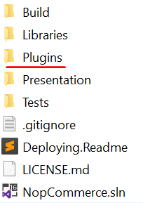
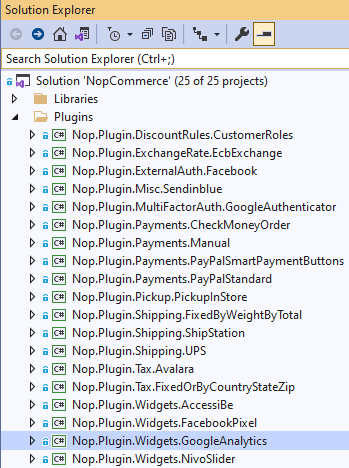
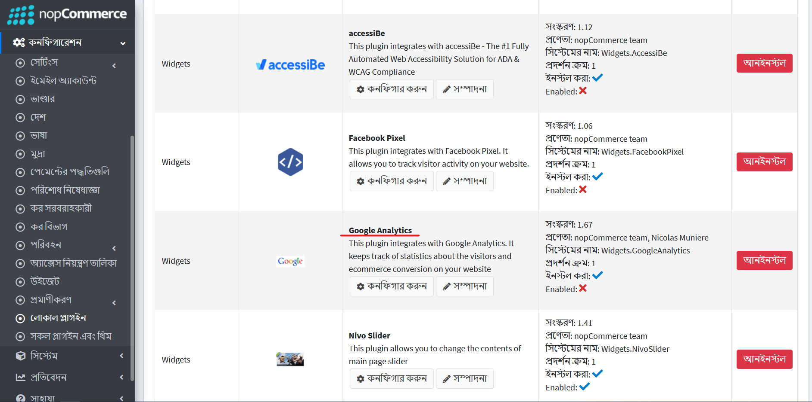
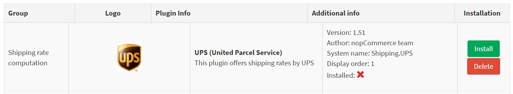
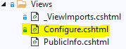
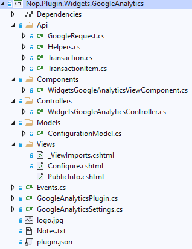

---
title: নপকমার্স এর জন্য কিভাবে একটি উইজেট লিখব
uid: bn/developer/plugins/how-to-write-widget-for-nopCommerce
author: git.nopsg
contributors: git.AfiaKhanom
---

# নপকমার্স এর জন্য কিভাবে একটি উইজেট লিখব

নপকমার্সের কার্যকারিতা প্রসারিত করতে, উইজেট ব্যবহার করা হয়। [NivoSlider](https://github.com/nopSolutions/nopCommerce/tree/master/src/Plugins/Nop.Plugin.Widgets.NivoSlider) এবং [Google Analytics](https://github.com/nopSolutions/nopCommerce/tree/master/src/Plugins/Nop.Plugin.Widgets.GoogleAnalytics) এর মতো বিভিন্ন ধরনের উইজেট রয়েছে। যা ইতিমধ্যে নপকমার্স এর রেপোতে আছে। নপকমার্স মার্কেটপ্লেসে ইতিমধ্যে বিভিন্ন উইজেট রয়েছে (বিনামূল্যে এবং প্রদেয় উভয়ই) যা আপনার প্রয়োজনীয়তা পূরণ করতে পারে। যদি আপনি একটি খুঁজে না পান, তাহলে আপনি সঠিক জায়গায় আছেন কারণ এই নিবন্ধটি আপনাকে আপনার প্রয়োজন অনুযায়ী উইজেট তৈরির প্রক্রিয়ার মাধ্যমে নির্দেশনা দেবে।

## উইজেটের গঠন, প্রয়োজনীয় ফাইল এবং অবস্থান

১. সমাধানের মধ্যে একটি নতুন **Class Library** প্রকল্প তৈরি করে শুরু করুন। আপনার উইজেটটি উৎসের মূল ফোল্ডারে অবস্থিত **Plugins** ডিরেক্টরিতে রাখার পরামর্শ দেওয়া হয়, যেখানে অন্যান্য উইজেট এবং প্লাগইনগুলি ইতিমধ্যেই থাকে।



> [!NOTE]
> এই প্রেজেন্টেশনটি যেটি `Presentation\Nop.Web` ডিরেক্টরিতে আছে তার সাথে বিভ্রান্ত হবেন না। Nop.Web ডিরেক্টরিতে প্লাগইন ডিরেক্টরিতে প্লাগইন সংকলিত ফাইল রয়েছে।

একটি উইজেট প্রকল্পের জন্য প্রস্তাবিত নাম হল `Nop.Plugin.Widgets। {Name}`।`{Name}` আপনার উইজেটের নাম (উদাহরণস্বরূপ, "**GoogleAnalytics**")। উদাহরণস্বরূপ, *Google Analytics widget* নিম্নলিখিত নাম রয়েছে: `Nop.Plugin.Widgets.GoogleAnalytics`। কিন্তু দয়া করে মনে রাখবেন যে এটি একটি প্রয়োজনীয়তা নয়। এবং আপনি একটি উইজেটের জন্য যেকোনো নাম নির্বাচন করতে পারেন। উদাহরণস্বরূপ, "*MyFirstNopWidget*"। একটি সমাধানের প্লাগইন ডিরেক্টরি কাঠামো নিম্নলিখিত মত দেখাচ্ছে।



২. একবার উইজেট প্রজেক্ট তৈরি হয়ে গেলে, **.csproj** ফাইলের বিষয়বস্তু যেকোনো উপলভ্য টেক্সট এডিটর অ্যাপ্লিকেশন ব্যবহার করে আপডেট করা উচিত। নিম্নলিখিত একটি দিয়ে বিষয়বস্তু প্রতিস্থাপন করুন:

```xml
    <Project Sdk="Microsoft.NET.Sdk">
        <PropertyGroup>
            <TargetFramework>net5.0</TargetFramework>
            <Copyright>SOME_COPYRIGHT</Copyright>
            <Company>YOUR_COMPANY</Company>
            <Authors>SOME_AUTHORS</Authors>
            <PackageLicenseUrl>PACKAGE_LICENSE_URL</PackageLicenseUrl>
            <PackageProjectUrl>PACKAGE_PROJECT_URL</PackageProjectUrl>
            <RepositoryUrl>REPOSITORY_URL</RepositoryUrl>
            <RepositoryType>Git</RepositoryType>
            <OutputPath>..\..\Presentation\Nop.Web\Plugins\WIDGET_OUTPUT_DIRECTORY</OutputPath>
            <OutDir>$(OutputPath)</OutDir>
            <!--Set this parameter to true to get the dlls copied from the NuGet cache to the output of your    project. You need to set this parameter to true if your plugin has a nuget package to ensure that   the dlls copied from the NuGet cache to the output of your project-->
            <CopyLocalLockFileAssemblies>true</CopyLocalLockFileAssemblies>
        </PropertyGroup>
        <ItemGroup>
            <ProjectReference Include="..\..\Presentation\Nop.Web.Framework\Nop.Web.Framework.csproj" />
            <ClearPluginAssemblies Include="$(MSBuildProjectDirectory)\..\..\Build\ClearPluginAssemblies.csproj" />
        </ItemGroup>
        <!-- This target execute after "Build" target -->
        <Target Name="NopTarget" AfterTargets="Build">
            <!-- Delete unnecessary libraries from plugins path -->
            <MSBuild Projects="@(ClearPluginAssemblies)" Properties="PluginPath=$(MSBuildProjectDirectory)\ $(OutDir)" Targets="NopClear" />
        </Target>
    </Project>
```

> [!NOTE]
> **WIDGET_OUTPUT_DIRECTORY** প্লাগইন নাম দ্বারা প্রতিস্থাপন করা উচিত, উদাহরণস্বরূপ *Widgets.GoogleAnalytics*।

৩. *.csproj*ফাইল আপডেট করার পর, **plugin.json** ফাইল যোগ করতে হবে যা উইজেটের জন্য প্রয়োজন। এই ফাইলে আপনার উইজেট বর্ণনা করে মেটা তথ্য রয়েছে। শুধু অন্য কোন বিদ্যমান প্লাগইন/উইজেট থেকে এই ফাইলটি অনুলিপি করুন এবং আপনার প্রয়োজনের জন্য এটি পরিবর্তন করুন। `Plugin.json` ফাইল সম্পর্কে তথ্যের জন্য, দয়া করে দেখুন [plugin.json file](xref:bn/developer/plugins/plugin_json)।

সর্বশেষ প্রয়োজনীয় পদক্ষেপ হল একটি ক্লাস তৈরি করা যা **BasePlugin** (*Nop.Core.Plugins*namespace) এবং **IWidgetPlugin** ইন্টারফেস (*Nop.Services.Cms*namespace) প্রয়োগ করে। IWidgetPlugin আপনাকে উইজেট তৈরি করতে দেয়। আপনার সাইটের কিছু অংশে উইজেট রেন্ডার করা হয়। উদাহরণস্বরূপ, এটি আপনার সাইটের নিচের ডানদিকে একটি লাইভ চ্যাট ব্লক হতে পারে।

## অনুরোধগুলি পরিচালনা করা। কন্ট্রোলার, মডেল এবং ভিউ

এখন আপনি গিয়ে উইজেট দেখতে পারেন **প্রশাসন → কনফিগারেশন → লোকাল প্লাগইন**.



যখন একটি প্লাগইন/উইজেট ইনস্টল করা হয়, আপনি দেখতে পাবেন **Uninstall** বাটন। *কর্মক্ষমতা উন্নতির জন্য, এটি একটি ভাল অভ্যাস যে আপনি প্লাগইন/উইজেটগুলি আনইনস্টল করুন যা প্রয়োজনীয় নয়*।


যখন একটি প্লাগইন/উইজেট ইনস্টল বা আনইনস্টল করা হয় না তখন **Install** এবং **Delete** বাটন থাকবে। *ডিলিট করলে সার্ভার থেকে ফিজিক্যাল ফাইল মুছে যাবে*।

কিন্তু আপনি যেমন অনুমান করেছেন আমাদের উইজেট কিছুই করে না। এটির কনফিগারেশনের জন্য ইউজার ইন্টারফেসও নেই। উইজেট কনফিগার করার জন্য একটি পৃষ্ঠা তৈরি করা যাক।

আমাদের এখন যা করতে হবে তা হল একটি কন্ট্রোলার, একটি মডেল, একটি ভিউ এবং একটি ভিউ কম্পোনেন্ট তৈরি করা।

- **MVC controllers** একটি*ASP.NET MVC*ওয়েবসাইটের বিরুদ্ধে করা অনুরোধের সাড়া দেওয়ার জন্য দায়ী। প্রতিটি ব্রাউজারের অনুরোধ একটি নির্দিষ্ট নিয়ামককে ম্যাপ করা হয়।
- একটি ভিউতে রয়েছে **HTML** মার্কআপ এবং সামগ্রী যা ব্রাউজারে পাঠানো হয়। একটি দৃশ্য একটি পৃষ্ঠার সমতুল্য যখন একটি *ASP.NET MVC* অ্যাপ্লিকেশনের সাথে কাজ করে।
- একটি ভিউ কম্পোনেন্ট যা প্রয়োগ করে **NopViewComponent** যার মধ্যে যুক্তি এবং কোড রয়েছে একটি ভিউ রেন্ডার করার জন্য।
- **MVC model** আপনার সমস্ত অ্যাপ্লিকেশন যুক্তি রয়েছে যা একটি ভিউ বা নিয়ামক অন্তর্ভুক্ত নয়।

সুতরাং শুরু করি:

১. মডেল তৈরি করুন। নতুন উইজেটে একটি 'মডেলস' ফোল্ডার যোগ করুন, এবং তারপর একটি নতুন মডেল শ্রেণী যোগ করুন যা আপনার প্রয়োজন অনুসারে।

২. ভিউ তৈরি করুন। নতুন উইজেটে একটি `Views` ফোল্ডার যোগ করুন, এবং তারপর `Configure.cshtml` নামে একটি `cshtml` ফাইল যোগ করুন। ভিউ ফাইলের "**Build Action**" প্রপার্টি সেট করুন "**Content**", এবং "**Copy to Output Directory**" প্রপার্টি "**Copy always**" সেট করা আছে। মনে রাখবেন কনফিগারেশন পৃষ্ঠায় "**_ConfigurePlugin**" লেআউট ব্যবহার করা উচিত।

```cs
    @{
        Layout = "_ConfigurePlugin";
     }
```

৩. আপনার `Views` ডিরেক্টরিতে **_ViewImports.cshtml** ফাইল আছে তা নিশ্চিত করুন। আপনি এটি অন্য কোন বিদ্যমান প্লাগইন বা উইজেট থেকে কপি করতে পারেন।



৪. কন্ট্রোলার তৈরি করুন। নতুন উইজেটে একটি `Controllers` ফোল্ডার যোগ করুন, এবং তারপর একটি নতুন নিয়ামক শ্রেণী যোগ করুন। একটি ভাল অভ্যাস হল প্লাগইন কন্ট্রোলারদের নাম দেওয়া `Widgets{Name}Controller.cs`। উদাহরণস্বরূপ, **WidgetsGoogleAnalyticsController**। অবশ্যই কন্ট্রোলারদের এইভাবে নাম দেওয়ার প্রয়োজন নেই, তবে কেবল একটি সুপারিশ। তারপরে কনফিগারেশন পৃষ্ঠার জন্য একটি উপযুক্ত কর্ম মেথড তৈরি করুন (অ্যাডমিন এলাকায়)। এর নাম দিন "কনফিগার করুন"। একটি মডেল শ্রেণী প্রস্তুত করুন এবং একটি ভিজ্যুয়াল ভিউ পাথ ব্যবহার করে নিম্নলিখিত ভিউতে পাঠান: `~/Plugins/{PluginOutputDirectory}/Views/Configure.cshtml`।

```cs
    public async Task<IActionResult> Configure()
    {
        if (!await _permissionService.AuthorizeAsync(StandardPermissionProvider.ManageWidgets))
            return AccessDeniedView();

        //load settings for a chosen store scope
        var storeScope = await _storeContext.GetActiveStoreScopeConfigurationAsync();
        var myWidgetSettings = await _settingService.LoadSettingAsync<MyWidgetSettings>(storeScope);

        var model = new ConfigurationModel
        {
            // configuration model settings here
        };

        if (storeScope > 0)
        {
            // override settings here based on store scope
        }

        return View("~/Plugins/Widgets.MyFirstNopWidget/Views/Configure.cshtml", model);
    }
```

৫. আপনার কর্ম মেথডের জন্য নিম্নলিখিত বৈশিষ্ট্যগুলি ব্যবহার করুন:

```cs
    [AutoValidateAntiforgeryToken]
    [AuthorizeAdmin] //confirms access to the admin panel
    [Area(AreaNames.Admin)] //specifies the area containing a controller or action
    [AdminAntiForgery] //Helps prevent malicious scripts from submitting forged page requests.
```

উদাহরণস্বরূপ, `GoogleAnalytics` উইজেট খুলুন এবং `WidgetsGoogleAnalyticsController` এর বাস্তবায়ন দেখুন।
তারপরে প্রতিটি উইজেটের জন্য যার একটি কনফিগারেশন পৃষ্ঠা রয়েছে আপনার একটি কনফিগারেশন ইউআরল নির্দিষ্ট করা উচিত। **BasePlugin** নামক বেস ক্লাসের রয়েছে `GetConfigurationPageUrl` মেথড যা একটি কনফিগারেশন ইউআরল প্রদান করে:

```cs
    public override string GetConfigurationPageUrl()
    {
        return $"{_webHelper.GetStoreLocation()}Admin/{CONTROLLER_NAME}/{ACTION_NAME}";
    }
```

যেখানে `{CONTROLLER_NAME}` আপনার নিয়ামকের একটি নাম এবং `{ACTION_NAME}` একটি কর্মের নাম (সাধারণত এটি "কনফিগার")।    প্রতিটি উইজেট উইজেট জোনের একটি তালিকা নির্দিষ্ট করা উচিত। **IWidgetPlugin** নামক বেস ক্লাসে রয়েছে `GetWidgetZones` মেথড যা উইজেট জোনগুলির একটি তালিকা প্রদান করে যেখানে এটি রেন্ডার করা হবে।

```cs
    public Task<IList<string>> GetWidgetZonesAsync()
    {
        return Task.FromResult<IList<string>>(new List<string> {PublicWidgetZones.HeadHtmlTag });
    }
```

আপনি এটি থেকে পাবলিক উইজেট জোনের একটি তালিকা খুঁজে পেতে পারেন [link](https://github.com/nopSolutions/nopCommerce/blob/master/src/Presentation/Nop.Web.Framework/Infrastructure/PublicWidgetZones.cs) এবং এটি অনুসরণ করে অ্যাডমিন উইজেট জোন [link](https://github.com/nopSolutions/nopCommerce/blob/master/src/Presentation/Nop.Web.Framework/Infrastructure/AdminWidgetZones.cs).
`GetWidgetZonesAsync` ছাড়াও, **IWidgetPlugin** এর `GetWidgetViewComponentName` মেথড রয়েছে যা ViewComponent নাম প্রদান করে। এটি "*widgetZone*" নামটি প্যারামিটার হিসেবে গ্রহণ করে এবং নির্বাচিত উইজেট জোনের উপর ভিত্তি করে ভিন্ন দৃশ্য উপস্থাপন করতে ব্যবহার করা যেতে পারে।

```cs
    public string GetWidgetViewComponentName(string widgetZone)
    {
        return "MyFirstWidget";
    }
```

## Google Analytics উইজেটের প্রকল্প কাঠামো



## "InstallAsync" এবং "UninstallAsync" মেথডগুলি পরিচালনা করা

এই পদক্ষেপটি ঐচ্ছিক। কিছু উইজেট এর ইনস্টলেশনের সময় অতিরিক্ত যুক্তির প্রয়োজন হতে পারে। উদাহরণস্বরূপ, একটি উইজেট নতুন লোকেল সম্পদ বা সেটিংস মান সন্নিবেশ করতে পারে। সুতরাং আপনার **IWidgetPlugin** বাস্তবায়ন খুলুন (বেশিরভাগ ক্ষেত্রে এটি **BasePlugin** ক্লাস থেকে উদ্ভূত হবে) এবং নিম্নলিখিত মেথডগুলি ওভাররাইড করুন:

১. **InstallAsync**. প্লাগইন ইনস্টলেশনের সময় এই মেথডটি চালু করা হবে। আপনি এখানে যেকোনো সেটিংস শুরু করতে পারেন, নতুন লোকাল রিসোর্স সন্নিবেশ করতে পারেন, অথবা কিছু নতুন ডাটাবেস টেবিল তৈরি করতে পারেন (প্রয়োজন হলে)।

```cs
    public override async Task InstallAsync()
    {
        // custom logic like adding settings, locale resources and database table(s) here

        await base.InstallAsync();
    }
```

২. **UninstallAsync**. প্লাগইন আনইনস্টল করার সময় এই মেথডটি চালু করা হবে। আপনি ইনস্টলেশনের সময় উইজেট দ্বারা পূর্বে আরম্ভ করা সেটিংস, লোকেল রিসোর্স, বা ডাটাবেস টেবিল অপসারণ করতে পারেন।

```cs
    public override async Task UninstallAsync()
    {
        // custom logic like removing settings, locale resources and database table(s) which was created during widget installation

        await base.UninstallAsync();
    }
```

> [!IMPORTANT]
> যদি আপনি এই মেথডগুলির মধ্যে একটিকে ওভাররাইড করেন তবে এর বেস বাস্তবায়ন লুকিয়ে রাখবেন না - **base.InstallAsync()** এবং **base.UninstallAsync()** যা উপরের ছবিতে চিহ্নিত করা হয়েছে।
