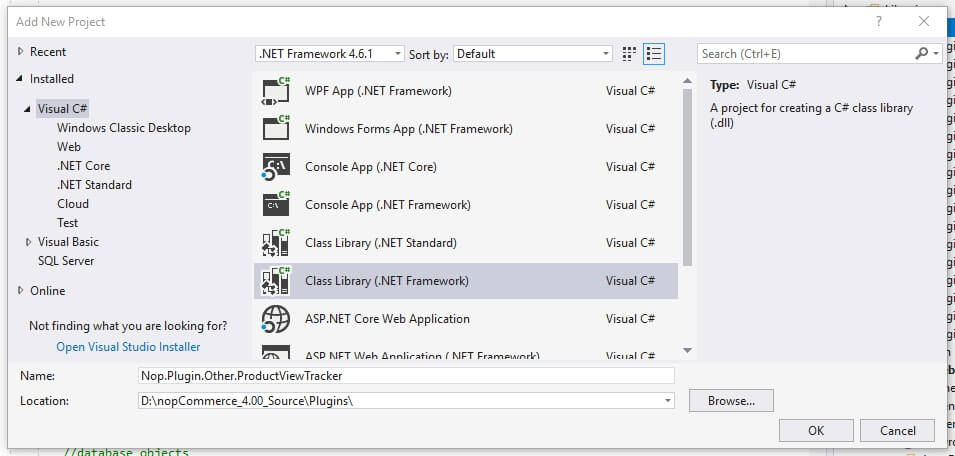
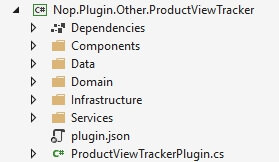

# ডেটা অ্যাক্সেস সহ প্লাগইন" (4.20 এবং নীচে)

এই টিউটোরিয়ালে আমি একটি প্রোডাক্ট ভিউ ট্র্যাকার বাস্তবায়নের জন্য নপকমার্স প্লাগইন আর্কিটেকচার ব্যবহার করব। আমরা ডেভেলপমেন্ট শুরু করার আগে এটি খুবই গুরুত্বপূর্ণ যে আপনি নীচে তালিকাভুক্ত টিউটোরিয়ালগুলি পড়েছেন, বুঝতে পেরেছেন এবং সফলভাবে সম্পন্ন করেছেন। আমি পূর্ববর্তী নিবন্ধগুলিতে আচ্ছাদিত কিছু ব্যাখ্যা এড়িয়ে যাচ্ছি, তবে আপনি প্রদত্ত লিঙ্কগুলি ব্যবহার করে পুনরায় সংক্ষেপ করতে পারেন।

- [ডেভেলপার টিউটোরিয়াল](xref:bn/developer/tutorials/index)
- [একটি বিদ্যমান এন্টিটি আপডেট করা। কীভাবে একটি নতুন প্রপারটি যুক্ত করবেন।](xref:bn/developer/tutorials/update-existing-entity)
- [কিভাবে নপকমার্স 4.20 এর জন্য একটি প্লাগইন লিখবেন](xref:bn/developer/plugins/how-to-write-plugin-4.20)

আমরা ডেটা অ্যাক্সেস স্তর দিয়ে কোডিং শুরু করব, পরিষেবা স্তরে এগিয়ে যাব এবং অবশেষে নির্ভরতা ইনজেকশনের উপর শেষ করব।

> [!NOTE]
> এই প্লাগইনটির ব্যবহারিক প্রয়োগ প্রশ্নবিদ্ধ, কিন্তু আমি এমন একটি বৈশিষ্ট্য সম্পর্কে ভাবতে পারিনি যা নপকমার্স এর সাথে আসে নি এবং যুক্তিসঙ্গত আকারের পোস্টে ফিট হবে। আপনি যদি এই প্লাগইনটি উত্পাদন পরিবেশে ব্যবহার করেন তবে আমি কোনও ওয়ারেন্টি অফার করি না। আমি সবসময় সাফল্যের গল্পে আগ্রহী এবং আমি এটা শুনে খুশি হব যে পোস্টটি কেবল একটি শিক্ষাগত মূল্যের চেয়ে বেশি প্রদান করেছে।

## শুরু করা

একটি নতুন ক্লাস লাইব্রেরি প্রকল্প তৈরি করুন "Nop.Plugin.Misc.ProductViewTracker"।



নিম্নলিখিত ফোল্ডার এবং `plugin.json` ফাইল যোগ করুন।



`Plugin.json` ফাইল সম্পর্কে তথ্যের জন্য, দয়া করে দেখুন [plugin.json file](xref:bn/developer/plugins/plugin_json).

তারপর নিম্নলিখিত প্রকল্পের রেফারেন্স যোগ করুন: Nop.Core, Nop.Data, Nop.Web.Framework

## ডেটা অ্যাক্সেস লেয়ার (A.K.A. নপকমার্স এ নতুন এন্টিটি তৈরি করা)

"ডোমেন" নেমস্পেসের ভিতরে আমরা ProductViewTrackerRecord নামে একটি পাবলিক ক্লাস তৈরি করতে যাচ্ছি। এই ক্লাস BaseEntity প্রসারিত করে, কিন্তু এটি অন্যথায় একটি খুব বিরক্তিকর ফাইল। মনে রাখার মতো কিছু হল যে সমস্ত বৈশিষ্ট্যগুলি ভার্চুয়াল হিসাবে চিহ্নিত করা হয়েছে এবং এটি কেবল মজা করার জন্য নয়। ডাটাবেস সত্তাগুলিতে ভার্চুয়াল বৈশিষ্ট্যগুলি প্রয়োজন কারণ সত্তা ফ্রেমওয়ার্ক কীভাবে ক্লাসগুলিকে তাত্ক্ষণিক এবং ট্র্যাক করে। আরেকটি বিষয় লক্ষ্য করা যায় যে আমাদের ন্যাভিগেশন প্রপার্টি (রিলেশনাল প্রপার্টি) নেই এবং আমি সেগুলো পরে আরো বিস্তারিতভাবে কভার করব।

```csharp
namespace Nop.Plugin.Other.ProductViewTracker.Domain
{
    public class ProductViewTrackerRecord : BaseEntity
    {
        public virtual int ProductId { get; set; }
        public virtual string ProductName { get; set; }
        public virtual int CustomerId { get; set; }
        public virtual string IpAddress { get; set; }
        public virtual bool IsRegistered { get; set; }
    }
}
```

**ফাইলের অবস্থান**: নির্দিষ্ট কিছু ফাইল কোথায় থাকা উচিত তা বের করতে নামস্থান বিশ্লেষণ করুন এবং সেই অনুযায়ী ফাইল তৈরি করুন।

পরবর্তী ক্লাস তৈরি করা হচ্ছে সত্তা ফ্রেমওয়ার্ক ম্যাপিং ক্লাস। ম্যাপিং ক্লাসের ভিতরে আমরা কলাম, টেবিল সম্পর্ক এবং ডাটাবেস টেবিল ম্যাপ করি।

```csharp
namespace Nop.Plugin.Other.ProductViewTracker.Data
{
    public class ProductViewTrackerRecordMap : NopEntityTypeConfiguration<ProductViewTrackerRecord>
    {
        /// <summary>
        /// Configures the entity
        /// </summary>
        /// <param name="builder">The builder to be used to configure the entity</param>
        public override void Configure(EntityTypeBuilder<ProductViewTrackerRecord> builder)
        {
            builder.ToTable(nameof(ProductViewTrackerRecord));
            //Map the primary key
            builder.HasKey(record => record.Id);
            //Map the additional properties
            builder.Property(record => record.ProductId);
            //Avoiding truncation/failure
            //so we set the same max length used in the product tame
            builder.Property(record => record.ProductName).HasMaxLength(400);
            builder.Property(record => record.IpAddress);
            builder.Property(record => record.CustomerId);
            builder.Property(record => record.IsRegistered);
        }
    }
}
```

ডেটা অ্যাক্সেস লেয়ারের পরবর্তী ক্লাস হল সবচেয়ে জটিল এবং সবচেয়ে গুরুত্বপূর্ণ ক্লাস। সত্তা ফ্রেমওয়ার্ক অবজেক্ট কনটেক্সট একটি পাস-থ্রু ক্লাস যা আমাদের ডাটাবেস অ্যাক্সেস দেয় এবং সত্তার অবস্থা ট্র্যাক করতে সাহায্য করে (যেমন যোগ, আপডেট, মুছে দিন)। প্রসঙ্গটি ডাটাবেস স্কিমা তৈরি করতে বা বিদ্যমান স্কিমা আপডেট করতেও ব্যবহৃত হয়। কাস্টম কনটেক্সট ক্লাসে আমরা পূর্বে বিদ্যমান সত্তাগুলিকে উল্লেখ করতে পারি না কারণ এই ধরনেরগুলি ইতিমধ্যে অন্য বস্তুর প্রসঙ্গের সাথে যুক্ত। এ কারণেই আমাদের ট্র্যাকিং রেকর্ডে জটিল ন্যাভিগেশন বৈশিষ্ট্য নেই।

```csharp
namespace Nop.Plugin.Other.ProductViewTracker.Data
{
    public class ProductViewTrackerRecordObjectContext : DbContext, IDbContext
    {
        public ProductViewTrackerRecordObjectContext(DbContextOptions<ProductViewTrackerRecordObjectContext> options) : base(options)
        {
        }
        protected override void OnModelCreating(ModelBuilder modelBuilder)
        {
            modelBuilder.ApplyConfiguration(new ProductViewTrackerRecordMap());
            base.OnModelCreating(modelBuilder);
        }

        public new virtual DbSet<TEntity> Set<TEntity>() where TEntity : BaseEntity
        {
            return base.Set<TEntity>();
        }

        public virtual string GenerateCreateScript()
        {
            return Database.GenerateCreateScript();
        }

        public virtual IQueryable<TQuery> QueryFromSql<TQuery>(string sql) where TQuery : class
        {
            throw new NotImplementedException();
        }

        public virtual IQueryable<TEntity> EntityFromSql<TEntity>(string sql, params object[] parameters) where TEntity : BaseEntity
        {
            throw new NotImplementedException();
        }

        public virtual int ExecuteSqlCommand(RawSqlString sql, bool doNotEnsureTransaction = false, int? timeout = null, params object[] parameters)
        {
            using (var transaction = Database.BeginTransaction())
            {
                var result = Database.ExecuteSqlCommand(sql, parameters);
                transaction.Commit();
                return result;
            }
        }

        public void Install()
        {
               //create the table
               this.ExecuteSqlScript(GenerateCreateScript());
        }
        public void Uninstall()
        {
               //drop the table
               this.DropPluginTable(nameof(ProductViewTrackerRecord));
        }

        public IList<TEntity> ExecuteStoredProcedureList<TEntity>(string commandText, params object[] parameters) where TEntity : BaseEntity, new()
        {
            throw new NotImplementedException();
        }

        public IEnumerable<TElement> SqlQuery<TElement>(string sql, params object[] parameters)
        {
            throw new NotImplementedException();
        }
        public int ExecuteSqlCommand(string sql, bool doNotEnsureTransaction = false, int? timeout = null, params object[] parameters)
        {
            throw new NotImplementedException();
        }

        public virtual void Detach<TEntity>(TEntity entity) where TEntity : BaseEntity
        {
            throw new NotImplementedException();
        }

        public IQueryable<TQuery> QueryFromSql<TQuery>(string sql, params object[] parameters) where TQuery : class
        {
            throw new NotImplementedException();
        }

        public virtual bool ProxyCreationEnabled
        {
            get => ProxyCreationEnabled;
            set => ProxyCreationEnabled = value;
        }

        public virtual bool AutoDetectChangesEnabled
        {
            get => AutoDetectChangesEnabled;
            set => AutoDetectChangesEnabled = value;
        }
    }
}
```

## অ্যাপ্লিকেশন স্টার্টআপ

এই অংশটি আমরা আগের ধাপে তৈরি করা রেকর্ড অবজেক্ট প্রসঙ্গ নিবন্ধন করি।

```csharp
using Microsoft.AspNetCore.Builder;
using Microsoft.Extensions.Configuration;
using Microsoft.Extensions.DependencyInjection;
using Nop.Core.Infrastructure;
using Nop.Plugin.Other.ProductViewTracker.Data;
using Nop.Web.Framework.Infrastructure.Extensions;

namespace Nop.Plugin.Misc.RepCred.Infrastructure
{
    /// <summary>
    /// Represents object for the configuring plugin DB context on application startup
    /// </summary>
    public class PluginDbStartup : INopStartup
    {
        /// <summary>
        /// Add and configure any of the middleware
        /// </summary>
        /// <param name="services">Collection of service descriptors</param>
        /// <param name="configuration">Configuration of the application</param>
        public void ConfigureServices(IServiceCollection services, IConfiguration configuration)
        {
            //add object context
            services.AddDbContext<ProductViewTrackerRecordObjectContext>(optionsBuilder =>
            {
                optionsBuilder.UseSqlServerWithLazyLoading(services);
            });
        }

        /// <summary>
        /// Configure the using of added middleware
        /// </summary>
        /// <param name="application">Builder for configuring an application's request pipeline</param>
        public void Configure(IApplicationBuilder application)
        {
        }

        /// <summary>
        /// Gets order of this startup configuration implementation
        /// </summary>
        public int Order => 11;
    }
}
```

## সার্ভিস স্তর

সার্ভিস স্তরটি ডেটা অ্যাক্সেস স্তর এবং উপস্থাপনা স্তরকে সংযুক্ত করে। যেহেতু কোডে যেকোনো ধরনের দায়িত্ব ভাগ করা খারাপ ফর্ম তাই প্রতিটি স্তরকে বিচ্ছিন্ন করতে হবে। সার্ভিস স্তরটি ব্যবসায়িক যুক্তি দিয়ে ডেটা স্তরকে আবৃত করে এবং উপস্থাপনা স্তরটি সার্ভিস স্তরের উপর নির্ভর করে। কারণ আমাদের কাজটি খুবই ছোট আমাদের সার্ভিস লেয়ারটি রিপোজিটরির সাথে যোগাযোগ করা ছাড়া আর কিছুই করে না (নপকমার্স- এর রিপোজিটরি বস্তুর প্রসঙ্গের সম্মুখভাগ হিসেবে কাজ করে)।

```csharp
namespace Nop.Plugin.Other.ProductViewTracker.Services
{
    public interface IProductViewTrackerService
    {
        /// <summary>
        /// Logs the specified record.
        /// </summary>
        /// <param name="record">The record.</param>
        void Log(ProductViewTrackerRecord record);
    }
}

namespace Nop.Plugin.Other.ProductViewTracker.Services
{
    public class ProductViewTrackerService : IProductViewTrackerService
    {
        private readonly IRepository<ProductViewTrackerRecord> _productViewTrackerRecordRepository;
        public ViewTrackingService(IRepository<ProductViewTrackingRecord> productViewTrackerRecordRepository)
        {
            _productViewTrackerRecordRepository = productViewTrackerRecordRepository;
        }

        /// <summary>
        /// Logs the specified record.
        /// </summary>
        /// <param name="record">The record.</param>
        public virtual void Log(ProductViewTrackerRecord record)
        {
            if (record == null)
                throw new ArgumentNullException(nameof(record));
            _productViewTrackerRecordRepository.Insert(record);
        }
    }
}
```

## ডেপেনডেনসি ইনজেকশন

মার্টিন ফাউলার ডেপেনডেনসি ইনজেকশন বা ইনভার্সন অব কন্ট্রোল এর একটি দুর্দান্ত বর্ণনা লিখেছেন। আমি তার কাজের নকল করতে যাচ্ছি না, এবং আপনি তার নিবন্ধটি এখানে খুঁজে পেতে পারেন । ডেপেনডেনসি ইনজেকশন বস্তুর জীবনচক্র পরিচালনা করে এবং নির্ভরশীল বস্তুর ব্যবহারের দৃষ্টান্ত প্রদান করে। প্রথমে আমাদের নির্ভরতা ধারকটি কনফিগার করতে হবে যাতে এটি বুঝতে পারে যে কোন বস্তুগুলি এটি নিয়ন্ত্রণ করবে এবং সেই বস্তুগুলি তৈরির ক্ষেত্রে কোন নিয়মগুলি প্রযোজ্য হতে পারে।

```csharp
namespace Nop.Plugin.Other.ProductViewTracker.Infrastructure
{
    public class DependencyRegistrar : IDependencyRegistrar
    {
        private const string CONTEXT_NAME = "nop_object_context_product_view_tracker";

        public virtual void Register(ContainerBuilder builder, ITypeFinder typeFinder, NopConfig config)
        {
            builder.RegisterType<ProductViewTrackerService>().As<IProductViewTrackerService>().InstancePerLifetimeScope();

            //data context
            builder.RegisterPluginDataContext<ProductViewTrackerRecordObjectContext>(CONTEXT_NAME);

            //override required repository with our custom context
            builder.RegisterType<EfRepository<ProductViewTrackerRecord>>()
            .As<IRepository<ProductViewTrackerRecord>>()
            .WithParameter(ResolvedParameter.ForNamed<IDbContext>(CONTEXT_NAME))
            .InstancePerLifetimeScope();
        }

        public int Order => 1;
    }
}
```

উপরের কোডটিতে আমরা বিভিন্ন ধরণের অবজেক্ট নিবন্ধন করি যাতে সেগুলি পরে কন্টল্লার নিয়ন্ত্রক, সার্ভিস এবং সংগ্রহস্থলে প্রবেশ করা যায়। এখন যেহেতু আমরা নতুন বিষয়গুলি কভার করেছি আমি পুরোনো কিছু ফিরিয়ে আনব যাতে আমরা প্লাগইনটি শেষ করতে পারি।

## ভিউ উপাদান

আসুন একটি ভিউ কম্পোনেন্ট তৈরি করি:

```csharp
namespace Nop.Plugin.Other.ProductViewTracker.Components
{
    [ViewComponent(Name = "ProductViewTracker")]
    public class ProductViewTrackerViewComponent : NopViewComponent
    {
        private readonly IProductService _productService;
        private readonly IProductViewTrackerService _productViewTrackerService;
        private readonly IWorkContext _workContext;
        public ProductViewTrackerViewComponent(IWorkContext workContext,
        IProductViewTrackerService productViewTrackerService,
        IProductService productService)
        {
            _workContext = workContext;
            _productViewTrackerService = productViewTrackerService;
            _productService = productService;
        }
        public IViewComponentResult Invoke(int productId)
        {
            //Read from the product service
            Product productById = _productService.GetProductById(productId);
            //If the product exists we will log it
            if (productById != null)
            {
                //Setup the product to save
                var record = new ProductViewTrackerRecord();
                record.ProductId = productId;
                record.ProductName = productById.Name;
                record.CustomerId = _workContext.CurrentCustomer.Id;
                record.IpAddress = _workContext.CurrentCustomer.LastIpAddress;
                record.IsRegistered = _workContext.CurrentCustomer.IsRegistered();
                //Map the values we're interested in to our new entity
                _productViewTrackerService.Log(record);
            }
            return Content("");
        }
    }
}
```

## প্লাগইন ইনস্টলার

```csharp
namespace Nop.Plugin.Other.ProductViewTracker
{
    public class ProductViewTrackerPlugin : BasePlugin
    {
        private readonly ProductViewTrackerRecordObjectContext _context;
        public ProductViewTrackerPlugin(ProductViewTrackerRecordObjectContext context)
        {
            _context = context;
        }
        public override void Install()
        {
            _context.Install();
            base.Install();
        }
        public override void Uninstall()
        {
            _context.Uninstall();
            base.Uninstall();
        }
    }
}
```

## ব্যবহার

ট্র্যাকিং কোড `ProductTemplate.Simple.cshtml` এবং` ProductTemplate.Grouped.cshtml` ফাইলে যোগ করা উচিত। এইগুলি পণ্য টেমপ্লেট।

```csharp
@await Component.InvokeAsync("ProductViewTrackerIndex", new { productId = Model.Id })
```

পুনশ্চ. আপনি এটি একটি উইজেট হিসাবে প্রয়োগ করতে পারেন। এই ক্ষেত্রে আপনাকে একটি cshtml ফাইল সম্পাদনা করতে হবে না।
