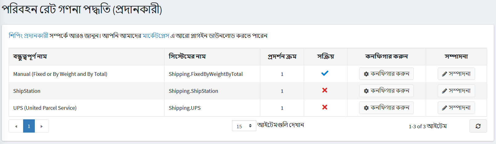

# কিভাবে আমার নিজের শিপিং রেট গণনা মেথড কোড করব

যদি গ্রাহকদের কিছু শিপেবল পণ্য থাকে, তারা চেকআউটের সময় একটি শিপিং বিকল্প বেছে নিতে পারে। এই শিপিং বিকল্পগুলি শিপিং রেট গণনা মেথড (যেমন ইউপিএস, ইউএসপিএস, ফেডেক্স, ইত্যাদি) থেকে ফেরত দেওয়া হয়। শিপিং রেট গণনা মেথডগুলি নপকমার্স এ প্লাগইন হিসাবে প্রয়োগ করা হয়। আপনি একটি নতুন শিপিং রেট গণনা মেথড কোডিং শুরু করার আগে [নপকমার্স ৪.৪০ এর জন্য একটি প্লাগইন কিভাবে লিখবেন](xref:bn/developer/plugins/how-to-write-plugin-4.40) পড়ার পরামর্শ দিচ্ছি। নিবন্ধটি আপনাকে একটি প্লাগইন তৈরির প্রয়োজনীয় পদক্ষেপগুলি ব্যাখ্যা করবে। তাই আসলে একটি শিপিং রেট গণনা মেথড হল একটি সাধারণ প্লাগইন যা একটি **IShippingRateComputationMethod** ইন্টারফেস প্রয়োগ করে (`Nop.Services.Shipping` নপকমার্স)। সুতরাং সমাধানের জন্য একটি নতুন শিপিং প্লাগইন প্রকল্প (ক্লাস লাইব্রেরি) যোগ করুন এবং শুরু করা যাক।

## কন্ট্রোলার, ভিউ, মডেল

একটি কন্ট্রোলার এবং একটি উপযুক্ত **Configure** অ্যাকশান মেথড এবং একটি ভিউ যোগ করুন। এগুলি সংজ্ঞায়িত করবে কিভাবে একজন দোকান মালিক অ্যাডমিন প্যানেলে কনফিগারেশন অপশন দেখেন **প্রশাসন → কনফিগারেশন → পরিবহন  → পরিবহন প্রদানকারী**। এই নিবন্ধটি কীভাবে প্লাগইনগুলি কনফিগার করতে হয় তা ব্যাখ্যা করে না, তবে আপনি এটি সম্পর্কে আরও তথ্য পেতে পারেন [এখানে](xref:en/getting-started/configure-shipping/shipping-providers/index)।



একবার এই ধাপটি সম্পন্ন হলে, আপনি শিপিং বিকল্পগুলি পাওয়ার জন্য প্রয়োজনীয় ব্যবসায়িক যুক্তি যুক্ত করতে শুরু করতে পারেন।

## শিপিং অপশন

এখন আপনাকে একটি ক্লাস তৈরি করতে হবে যা **IShippingRateComputationMethod** ইন্টারফেস প্রয়োগ করে। এই ক্লাসটি সমস্ত প্রকৃত কাজ করবে। যখন নপকমার্স শিপিং মোট হিসাব করে বা উপলব্ধ শিপিং অপশনগুলির একটি তালিকা পাওয়ার প্রয়োজন হয়, তখন আপনার ক্লাসের **GetShippingOptions** বা **GetFixedRate** মেথড বলা হবে। এখানে কিভাবে UPSComputationMethod ক্লাস সংজ্ঞায়িত করা হয় ("ইউপিএস" মেথড):

```csharp
public class UPSComputationMethod : BasePlugin, IShippingRateComputationMethod
```

- **IShippingRateComputationMethod** ইন্টারফেসের বেশ কয়েকটি মেথড এবং বৈশিষ্ট্য রয়েছে যা বাস্তবায়নের জন্য প্রয়োজন।

- **ShippingRateComputationMethodType**। এই প্রোপার্টি নির্দেশ করে কিভাবে আপনার শিপিং রেট গণনা কাজ করে। এটি **Offline** বা **Realtime** হতে পারে। **Offline** প্লাগইনগুলি হার পেতে কোন তৃতীয় পক্ষের সাইট ব্যবহার করে না (এই ধরনের মেথডের উদাহরণ "স্থির বা ওজন অনুযায়ী")। এই প্লাগইনগুলি স্থানীয় ডেটাবেস থেকে সমস্ত প্রয়োজনীয় তথ্য পায়। **Realtime** প্লাগইনগুলি হার পাওয়ার জন্য তৃতীয় পক্ষের সাইট ব্যবহার করে (উদাহরণস্বরূপ, ইউপিএস)।
- **GetShippingOptions**। চেকআউটের সময় যখন কোন গ্রাহক একটি শিপিং বিকল্প বেছে নেয় তখন এই মেথডটি সর্বদা প্রয়োগ করা হয়। এই মেথডটি ফিরে আসে **GetShippingOptionResponse** যা **ShippingOption** বস্তুর একটি তালিকা ধারণ করে। প্রতিটি **ShippingOption** অবজেক্টে কিছু শিপিং অপশন সম্পর্কে তথ্য থাকে যেমন অপশন নাম (উদাহরণস্বরূপ, "বাই গ্রাউন্ড"), এর রেট (উদাহরণস্বরূপ, 10 ইউএসডি) এবং অন্যান্য তথ্য। আপনার সমস্ত যুক্তি এখানে রাখুন (আপনার ডাটাবেস থেকে রেট পান অথবা তৃতীয় পক্ষের সাইট যেমন ইউপিএস থেকে তাদের অনুরোধ করুন)।
- **GetFixedRate**। যেমন আপনি ইতিমধ্যে জানেন **GetShippingOptions** চেকআউটের সময় শিপিং অপশন পেতে ব্যবহৃত হয় ("শিপিং মেথড নির্বাচন করুন" পৃষ্ঠায়)। তবে কখনও কখনও শিপিংয়ের বিকল্পটি বেছে নেওয়ার আগে আমাদের শিপিং রেট জানতে হবে (উদাহরণস্বরূপ, শপিং কার্ট পৃষ্ঠায়)। এই ক্ষেত্রে আপনি একটি নির্দিষ্ট হার ফিরিয়ে দিতে পারেন। উদাহরণস্বরূপ, আপনার শিপিং রেট গণনা মেথড শুধুমাত্র একটি শিপিং বিকল্প প্রদান করে, এবং গ্রাহক "শিপিং মেথড নির্বাচন করুন" পৃষ্ঠায় এটি নির্বাচন না করা পর্যন্ত অপেক্ষা করার দরকার নেই। যদি আপনার নির্দিষ্ট হার সমর্থিত না হয় তবে রিটার্ন হবে **null**। এই ক্ষেত্রে গ্রাহকরা শপিং কার্টে "শিপিং মোট" এর পাশে নিম্নলিখিত বার্তাটি দেখতে পাবেন: "চেকআউটের সময় গণনা করা"।
- **GetConfigurationPageUrl**। আপনার মনে আছে আমরা আগের ধাপে একটি কন্ট্রোলার তৈরি করেছি। এই মেথডটি তার কনফিগার মেথডের একটি ইউআরএল ফেরত দেওয়া উচিত। উদাহরণ স্বরূপ:

```csharp
public override string GetConfigurationPageUrl()
{
    return $"{_webHelper.GetStoreLocation()}Admin/FixedOrByWeight/Configure";
}
```

## উপসংহার

আশা করি এটি আপনাকে একটি নতুন পেমেন্ট পদ্ধতি যুক্ত করে শুরু করবেন।
