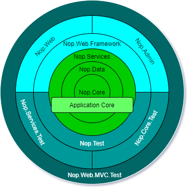

# নপকমার্স এর আর্কিটেকচার

## ভূমিকা

নপকমার্স একটি অত্যন্ত স্বনির্ধারিত এবং নমনীয়, মাল্টি-স্টোর, মাল্টি-ভেন্ডার, এসইও বন্ধুত্বপূর্ণ, সম্পূর্ণ বৈশিষ্ট্যযুক্ত ওপেন সোর্স ই-কমার্স সমাধান। যা মাইক্রোসফট `ASP.NET Core` ফ্রেমওয়ার্কের উপরে নির্মিত। নপকমার্স সর্বদা সর্বশেষ প্রযুক্তির সাথে আপ টু ডেট থাকে এবং সর্বোত্তম অনুশীলন অনুসরণ করে।

## ওভারভিউ

এই নথিটি নপকমার্স সিস্টেমের একটি বিস্তৃত স্থাপত্য ওভারভিউ প্রদান করে। এই ডকুমেন্টেশন নতুন নপকমার্স ডেভেলপারদের জন্য লক্ষ্য করা হয়েছে। এই ডকুমেন্টেশনে আমরা নপকমার্স সলিউশনে প্রতিটি প্রকল্প অন্বেষণ করব, সেই প্রকল্পগুলির মধ্যে নির্ভরতা ইত্যাদি।

## নপকমার্স আর্কিটেকচারের ওভারভিউ

নপকমার্স হল অন্যতম জনপ্রিয় এবং সফল `Dot NET based` ওপেন সোর্স `E-Commerce` সমাধান। নপকমার্স এর সাফল্য কেবলমাত্র এর কারণ নয় যে এটি আধুনিক ই-কমার্স সলিউশনের জন্য প্রয়োজনীয় বেশিরভাগ বৈশিষ্ট্য বাক্সের বাইরে রয়েছে এবং এটির  অত্যন্ত কাস্টমাইজযোগ্য এবং ব্যবহারকারী বান্ধব, কিন্তু কারণ নপকমার্স সমাধান সমানভাবে সংগঠিত এবং ডেভেলপার বান্ধব। নপকমার্স এর প্রধান শক্তি হল এর নমনীয়, বর্ধনযোগ্য স্থাপত্য এবং সুসংগঠিত সোর্স কোড। নপকমার্স স্থাপত্য পেঁয়াজ স্থাপত্যের খুব কাছাকাছি। যা মূলত কোড কাপলিং নিয়ন্ত্রণে মনোযোগী। এই আর্কিটেকচার অনুসারে সমস্ত কোড স্তরের উপর আরো কেন্দ্রীয়ভাবে নির্ভর করতে পারে, কিন্তু কোডটি কোর থেকে আরও স্তরের উপর নির্ভর করতে পারে না। অন্য কথায়, সমস্ত সংযোজন কেন্দ্রের দিকে।

যার অর্থ প্রকল্পগুলি কেবলমাত্র অন্যান্য প্রকল্পগুলির উপর নির্ভরশীলতা থাকতে পারে যা বর্তমান প্রকল্প থেকে অভ্যন্তরে থাকে। উদাহরণস্বরূপ যদি আপনি উপরের চিত্রটি দেখেন `Nop.Data` প্রকল্পটি `Nop.Data` প্রকল্পের উপর নির্ভর করতে পারে এবং `Nop.Data` এবং নির্ভরতা থাকতে পারে, কিন্তু nop.Core `Nop.Data` এর উপর একইভাবে `Nop.Data` নির্ভর করতে পারে না। পরিষেবার `Nop.Data` এবং `Nop.Core` থাকতে পারে এবং এটি নির্ভরতা কিন্তু `Nop.Core` বা `Nop.Data` - এর `Nop.Service` তাদের নির্ভরতা হিসেবে থাকতে পারে না। যার অর্থ প্রকল্পগুলি কেবলমাত্র নির্ভরশীলতা হিসাবে অন্য প্রকল্প থাকতে পারে যদি এটি অভ্যন্তরীণভাবে থাকে বা বর্তমান কেন্দ্রের স্তর থেকে আরও বেশি কেন্দ্র থাকে। যা কোড decoupling জন্য চাবি। এই পন্থা/স্থাপত্যের প্রধান বৈশিষ্ট্য/সুবিধা হল, এখন যদি আমরা অ্যাপ্লিকেশন কোর পরীক্ষা করতে চাই তাহলে আমাদের অ্যাপ্লিকেশনের জন্য কোন `UI` না থাকলেও আমরা তা করতে পারি, কারণ অ্যাপ্লিকেশন কোর নির্ভর করে না `UI layer`। অথবা আমরা আমাদের `UI framework` কে `Razor` ভিউ ইঞ্জিন এবং `JQuery` থেকে `Angular` বা `React` বা `Vue` থেকে আমাদের অ্যাপ্লিকেশন কোরকে প্রভাবিত না করে পরিবর্তন করতে পারি এবং মোবাইল অ্যাপ্লিকেশন বা ডেস্কটপ অ্যাপ্লিকেশন তৈরি করতে একই কোর ব্যবহার করতে পারি। এবং এই সব আমাদের অ্যাপ্লিকেশন কোর কোড একটি বিট পরিবর্তন ছাড়া।

## নপকমার্স সমাধান এ প্রকল্পগুলি ব্যাখ্যা করুন

### Application Core

এটি নপকমার্স আর্কিটেকচার সিস্টেমের সবচেয়ে ভিতরের স্তর। এটি আবেদনের মূল বিষয়। সমস্ত ডেটা অ্যাক্সেস লজিক এবং বিজনেস ক্লাস এই স্তরের ভিতরে থাকে। নপকমার্স সলিউশনে আমরা "Libraries" ডিরেক্টরিতে এই স্তরের সমস্ত প্রকল্প খুঁজে পেতে পারি। নপকমার্স আর্কিটেকচার অনুসারে এই স্তরে আরও তিনটি স্তর/প্রকল্প রয়েছে।

#### Nop.Core

এই প্রকল্পে নপকমার্স এর জন্য মূল শ্রেণীর একটি সেট রয়েছে। এই প্রকল্পটি স্থাপত্যের কেন্দ্রে। এই প্রকল্পের সমাধানের অন্যান্য প্রকল্পের উপর কোন নির্ভরতা নেই। এই প্রকল্পে মূল ক্লাস রয়েছে যা ডোমেন সত্তা, ক্যাশিং, ইভেন্ট এবং অন্যান্য সহায়ক শ্রেণীর মতো সম্পূর্ণ সমাধানের সাথে ভাগ করা হয়।

#### Nop.Data

এই প্রকল্পটি  `Nop.Core` প্রকল্পের ঠিক পরেই থাকে। সুতরাং, এই প্রকল্পটির প্রকল্পের উপর নির্ভরতা রয়েছে যা এই প্রকল্প থেকে মধ্যম দিকে স্থাপত্যের মধ্যে যেটি  `Nop.Core` প্রকল্প। `Nop.Core` প্রকল্পের পাশে এটি সমাধানের অন্য কোন প্রকল্পের উপর কোন নির্ভরতা নেই। `Nop.Data` প্রকল্পটিতে একটি ডাটাবেস বা অন্যান্য ডেটা স্টোর থেকে পড়া এবং লেখার জন্য ক্লাস এবং ফাংশনগুলির একটি সেট রয়েছে। এটি আপনার ব্যবসায়িক বস্তু থেকে ডেটা-অ্যাক্সেস যুক্তিকে আলাদা করতে সাহায্য করে।

#### Nop.Services

নপকমার্স আর্কিটেকচারে এটি অ্যাপ্লিকেশন কোর এর বাইরেরতম স্তর। এই প্রকল্পটি অ্যাপ্লিকেশন কোর এর অন্যান্য সমস্ত প্রকল্পের উপর নির্ভরশীল। এই প্রকল্পে মূল পরিষেবাগুলির একটি সেট রয়েছে, ব্যবসায়িক যুক্তি, বৈধতা বা ডেটা সম্পর্কিত গণনা, যদি প্রয়োজন হয়। কিছু লোক এটাকে বিজনেস অ্যাক্সেস লেয়ার (BAL) বলে। এই স্তরটি এই স্তর থেকে অন্য সব স্তরের জন্য একটি ডেটা অ্যাক্সেস স্তর হিসাবে কাজ করে। নপকমার্স কোর লেয়ারের বাইরে অন্য লেয়ারের ডিকপল কোর করার জন্য এই পদ্ধতি ব্যবহার করছে। এর সাথে যদি আমরা অ্যাপ্লিকেশন কোর এর জন্য লজিক পরিবর্তন করতে চাই তাহলে এটি অ্যাপ্লিকেশন লেয়ারের উপর নির্ভরশীল অন্যান্য স্তরগুলিকে ভাঙ্গবে না অথবা কমপক্ষে কমপক্ষে অন্যান্য লেয়ারে কোড পরিবর্তন করে অ্যাপ্লিকেশন কোরের উপর নির্ভর করে। এই পদ্ধতিটি নির্মাণ নির্ভরতা ইনজেকশনের জন্যও আদর্শ।

### UI Layer

এই স্তরটি "Application Core" এর বাইরে থাকে। নপকমার্স সমাধানে আমরা "Presentation" ডিরেক্টরিের ভিতরে এই স্তরটির সমস্ত প্রকল্প খুঁজে পেতে পারি। সমস্ত উপস্থাপনা যুক্তি এবং ইউআই এই স্তরে থাকে। এটি এমন স্তর যেখানে ইউআই ব্যবহারকারী উপস্থাপনা করতে পারে। নপকমার্স এ এই স্তরটির আরও দুটি স্তর রয়েছে।

#### Nop.Web.Framework

এই স্তরটি "Presentation layer" এর অভ্যন্তরীণ স্তর এই স্তরটির "Application Core" স্তরের উপর নির্ভরতা রয়েছে। এই প্রকল্পটি একটি শ্রেণী গ্রন্থাগার প্রকল্প। এই প্রকল্পটি উপস্থাপনা স্তরের জন্য "Framework" হিসাবে কাজ করে। এতে শেয়ার করা যুক্তি রয়েছে যা নপকমার্স "public Website" এবং "Admin panel" উভয় দ্বারা ব্যবহৃত হয়।

#### Nop.Web

নপকমার্স আর্কিটেকচারে এটি "Presentation Layer" এর বাইরেরতম স্তর। এই প্রকল্পে প্রকৃত ই-কমার্স ফ্রন্ট এন্ড ওয়েবসাইট ইউজার ইন্টারফেস রয়েছে। এটি আসল ওয়েবসাইট যার সাথে ব্যবহারকারী ইন্টারঅ্যাক্ট করতে পারে। এটি একটি "Asp .NET Core" অ্যাপ্লিকেশন। এই প্রকল্পের `Nop.Web.Framework` এবং "Application Core" এর উপর নির্ভরতা রয়েছে। এটি `Nop.Web.Framework` এর উপর নির্ভর করে সাধারণ যুক্তির জন্য যা এই এবং "Admin" এর মধ্যে ভাগ করা হয় এবং ডেটা অ্যাক্সেস এবং ডেটা ম্যানিপুলেশনের জন্য "Application Core" এর উপর নির্ভর করে।

#### Admin

নপকমার্স এ এটি `Nop.Web` প্রকল্পের মতো একই স্তরের অন্তর্গত। প্রকৃতপক্ষে এটি একটি এলাকা হিসাবে `Nop.Web` প্রকল্পের ভিতরে থাকে। এটি ইউআই (ইউজার ইন্টারফেস), কিন্তু উপস্থাপনার এই অংশটিতে অ্যাডমিন প্যানেলের জন্য ইউআই রয়েছে। অ্যাডমিন প্যানেল হল যেখানে পাবলিক ওয়েবসাইটের সমস্ত বিষয়বস্তু রক্ষণাবেক্ষণ করা হয় এবং যেখান থেকে আমরা আমাদের পাবলিক ওয়েবসাইটের কার্যক্রম পর্যবেক্ষণ করতে পারি। যেহেতু পাবলিক ওয়েবসাইটটি কোন সীমাবদ্ধতা ছাড়াই অ্যাক্সেস করা যায় কিন্তু "Admin panel" এর অ্যাক্সেসের জন্য কিছু প্রমাণীকরণ এবং অনুমোদনের প্রয়োজন হয় কারণ এতে এমন তথ্য রয়েছে যা কেবলমাত্র সাইট প্রশাসকের অ্যাক্সেসের অধিকার রয়েছে।

### Test Layer

এই স্তরটি "Presentation Layer" হিসাবে একই স্তরে থাকে, "Application Core" এর ঠিক বাইরে এই স্তরটি প্রয়োগের বিভিন্ন অংশগুলি পরীক্ষা করার বিষয়ে। নপকমার্স এ পরীক্ষা করা সহজ এবং আরো নির্ভরযোগ্য যে কারণে স্থাপত্যটি এটি সিস্টেম ডিজাইনের জন্য অনুসরণ করে। নপকমার্স সলিউশনে আমরা "Tests" ডাইরেক্টরির ভিতরে এই লেয়ারের সমস্ত ডিরেক্টরি খুঁজে পেতে পারি। নপকমার্স "Unit Testing" এর জন্য *NUnit* প্যাকেজ ব্যবহার করে।

#### Nop.Tests

এই স্তরটি "Test layer" এর অভ্যন্তরীণ স্তর এই স্তরটির "Application Core" স্তরের উপর নির্ভরতা রয়েছে। এই প্রকল্পে পরীক্ষার জন্য মূল যুক্তি রয়েছে।

#### Nop.Services.Tests

এই প্রকল্পটি "Test Layer" এর বাইরেরতম স্তরে থাকে। এই প্রকল্পটি "Unit Testing" `Nop.Service` প্রকল্পের জন্য নির্মিত। এই প্রকল্পে প্রতিটি অপারেশনের জন্য প্রতিটি সার্ভিস ক্লাস পরীক্ষা করার যুক্তি রয়েছে।

#### Nop.Core.Tests

এই প্রকল্পটি `Nop.Service.Test` হিসাবে একই স্তরে বাস করে। এই প্রকল্পটি `Nop.Core` প্রকল্পের "Unit Testing" এর জন্য তৈরি করা হয়েছে, এটি ক্যাশিং, ডোমেইন সত্ত্বা ইত্যাদি পরীক্ষা করে।

#### Nop.Web.Tests

এই প্রকল্পটি নপকমার্স এর উপস্থাপনা স্তরটি পরীক্ষা করার জন্য ব্যবহার করা যেতে পারে, যেখানে "Public website" এবং "Admin Panel" রয়েছে।
