# কিভাবে আজুর এ নপকমার্স স্থাপন করা যায়

## আজুর এ একটি ভিএম তৈরি করুন

নপকমার্স ওয়েব অ্যাপ্লিকেশনগুলি হোস্ট করার জন্য, এবং **WebDeploy** ব্যবহার করে প্রকাশ করার অনুমতি দেওয়ার জন্য একটি আজুর ভার্চুয়াল মেশিন স্থাপনের জন্য প্রয়োজনীয় পদক্ষেপগুলির এই নির্দেশনা।

### একটি নতুন ভিএম তৈরি করুন

১. লগ ইন করুন [আজুর পোর্টালে](https://portal.azure.com/)

২. **Add** বাটনে ক্লিক করুন

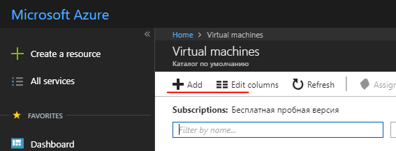

৩. *Windows Server 2016 VM* *Get Started* ক্যাটাগরিতে অথবা যেকোনো উইন্ডোজ সার্ভার ২০১৬ কম্পিউট ক্যাটাগরিতে নির্বাচন করুন, যেমন **Windows Server 2016 Datacenter**

৪. নতুন ভিএম কনফিগার করার জন্য প্রয়োজনীয় ক্ষেত্রগুলি সম্পূর্ণ করুন।

- ব্যবহারকারীর নাম/পাসওয়ার্ড। ভিএম অ্যাক্সেস করতে আপনার এটির প্রয়োজন হবে। আরডিপি দ্বারা ভিএম -এ সংযোগের জন্য এটি অ্যাডমিন অ্যাকাউন্ট।
- রিসোর্স গ্রুপ। এই "virtual folder" এর নাম যা এই ভিএম এর জন্য তৈরি সমস্ত সম্পদ ধারণ করে। আপনি রিসোর্স গ্রুপ ডিলিট করে এই প্রক্রিয়া চলাকালীন তৈরি করা সব রিসোর্স মুছে ফেলতে পারেন।

### ভিএম -তে উপাদান এবং বৈশিষ্ট্যগুলি কনফিগার করুন

১. ডিএনএস-নাম:

- [আজুর পোর্টালে](https://portal.azure.com/) থেকে, আপনার ভার্চুয়াল মেশিনের ওভারভিউ পৃষ্ঠায় যান।
- ডিএনএস নামের অধীনে, **Configure** ক্লিক করুন
- একটি বিশ্বব্যাপী অনন্য DNS নাম প্রদান করুন। (নামটি যাচাই করার সময় একটি সবুজ টিক উপস্থিত হয়।)
- কনফিগারেশন সেভ করতে **Save** ক্লিক করুন।

### আজুর ফায়ারওয়াল নিয়ম কনফিগার করুন

১. আজুর পোর্টালে ইনবাউন্ড ফায়ারওয়াল নিয়ম কনফিগার করুন। নেটওয়ার্কিং বিভাগে নতুন ফায়ারওয়াল এন্ট্রি তৈরি করতে ইনবাউন্ড পোর্ট নিয়ম যুক্ত করুন:

- এইসটিটিপি - পোর্ট ৮০ (অগ্রাধিকার ১০০)
- ওয়েব ডিপ্লয় - পোর্ট ৮১৭২ (অগ্রাধিকার ১০১০)
- আরডিপি - পোর্ট ৩৩৮৯ (অগ্রাধিকার ৩২০)
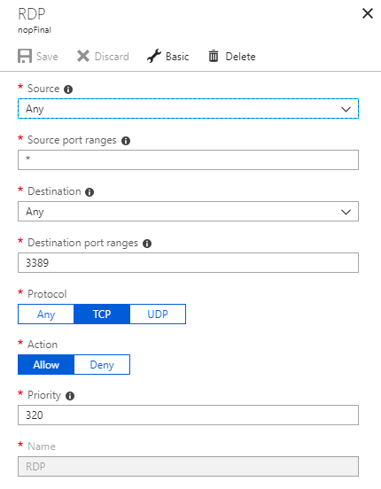

২. পোর্টালে আউটবাউন্ড ফায়ারওয়াল নিয়ম কনফিগার করুন। *Networking* বিভাগে নতুন ফায়ারওয়াল এন্ট্রি তৈরি করতে আউটবাউন্ড পোর্ট নিয়ম যোগ করুন:

- আরডিপি - পোর্ট ৩৩৮৯ (অগ্রাধিকার ১০০)

### লগইন এবং পাসওয়ার্ড ব্যবহার করে ভিএম (আরডিপি) এর সাথে সংযোগ করুন

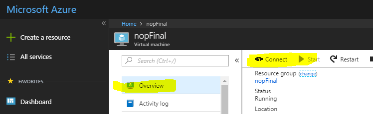

### আইআইএস (ওয়েব সার্ভার) এবং ASP.NET 4.6 ইনস্টল করুন

১. **Server Manager Dashboard** (সার্ভার ম্যানেজার - ড্যাশবোর্ড প্রথম প্রারম্ভে খোলে)

২. পছন্দ করুন **2 Add roles and features**

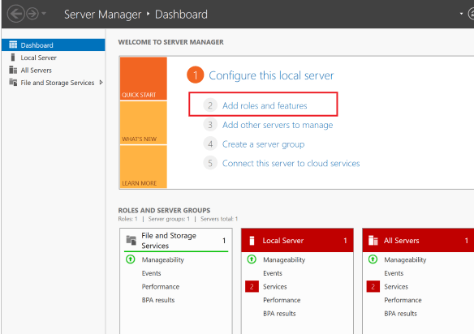

৩. ডিফল্টগুলি গ্রহণ করুন এবং সার্ভার রোলস বিভাগে অগ্রসর হওয়ার জন্য তিনবার **Next** টিপুন।

৪. নির্বাচন করুন **Web Server (IIS)**

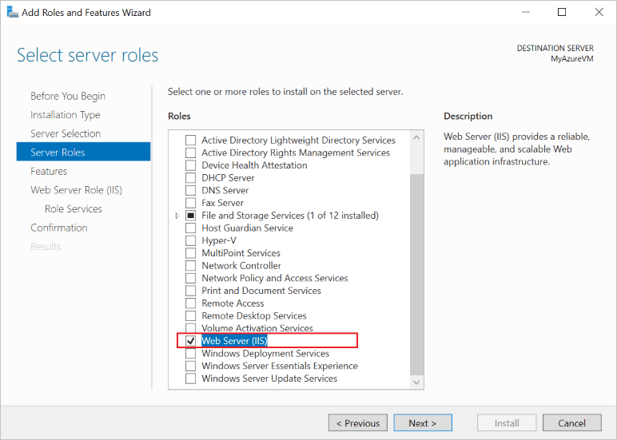

৫. অনুরোধ করা হলে, *IIS Management Console* এর অতিরিক্ত ইনস্টলেশন নিশ্চিত করুন।

৬. *Web Server Role (IIS) --> Roles Services section* অগ্রগতির জন্য **Next** তিনবার চাপুন।

৭. **Management** সার্ভিস নির্বাচন করুন, যা ওয়েব ডিপ্লয় (পোর্ট ৮১৭২ এর মাধ্যমে) সক্ষম করার জন্য প্রয়োজনীয়। অনুরোধ করা হলে, ASP.NET 4.6 এর অতিরিক্ত ইনস্টলেশন নিশ্চিত করুন।

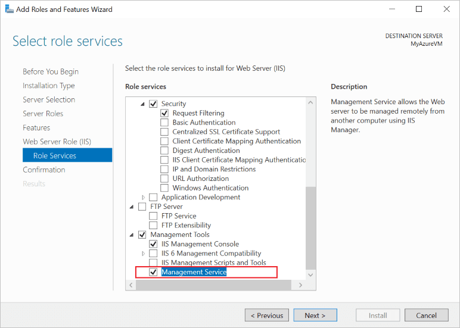

৮. কনফিগারেশন নিশ্চিত করতে **Next** নির্বাচন করুন, তারপর আইআইএস সেটআপ সম্পূর্ণ করতে **Install**।

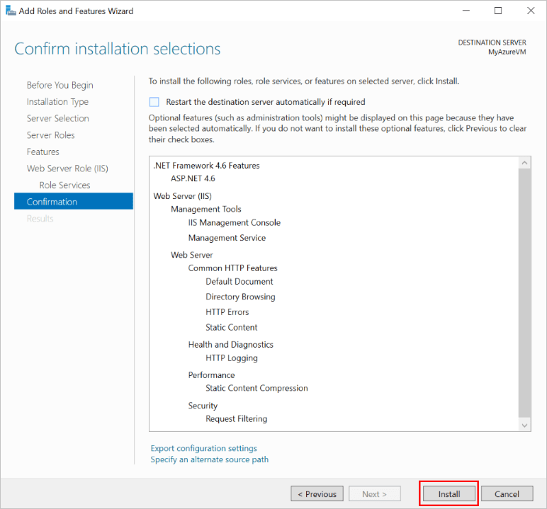

ইনস্টলেশন সম্পন্ন হলে:

- আইআইএস পোর্ট ৮০ এর জন্য তৈরি অভ্যন্তরীণ ফায়ারওয়াল নিয়মের সাথে ইনস্টল এবং চলমান।
- ওয়েব ম্যানেজমেন্ট সার্ভিস ৮১৭২ পোর্টের জন্য তৈরি অভ্যন্তরীণ ফায়ারওয়াল নিয়মের সাথে ইনস্টল করা আছে।

### আইই উন্নত নিরাপত্তা কনফিগার করুন (বন্ধ)

একটি নতুন আজুর ভিএম- এ, ডিফল্ট নিরাপত্তা নিয়ম ইন্টারনেট এক্সপ্লোরারের মাধ্যমে এক্সিকিউটেবল ডাউনলোড হতে বাধা দেয়। ওয়েব ডিপ্লয় এক্সিকিউটেবল ডাউনলোড করার জন্য, আপনাকে প্রথমে আইই বর্ধিত নিরাপত্তা নিষ্ক্রিয় করতে হবে।

১. **Server Manager** এ, বাম দিকে **Local Server** বিভাগটি খুলুন।

২. প্রধান প্যানেলে, "**IE Enhanced Security Configuration:**" এর পাশে, অন নির্বাচন করুন।

৩. প্রদর্শিত ডায়ালগে, **Off for Administrators** নির্বাচন করুন, **On for Users** নির্বাচন করুন, তারপর **OK** নির্বাচন করুন।

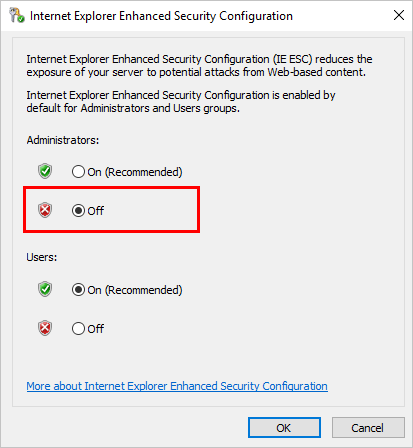

### ওয়েব স্থাপনা ইনস্টল করুন

১. ইন্টারনেট এক্সপ্লোরার চালু করুন।

২. ডিফল্ট নিরাপত্তা সেটিংস গ্রহণ করুন।

৩. [Download](https://www.microsoft.com/download/details.aspx?id=43717) *WebDeploy_amd64_en-US.msi*

৪. ওয়েব স্থাপনার জন্য ইনস্টলেশন ধাপগুলি অনুসরণ করুন

৫. সমস্ত উপাদান ইনস্টল করার জন্য সম্পূর্ণ বিকল্পটি চয়ন করুন

### সর্বশেষ সংস্করণ ইনস্টল করুন [NET Core SDK](https://www.microsoft.com/net/download/all)

### প্যাকেজ ইনস্টল করুন [.NET Core Windows Server Hosting](https://www.microsoft.com/net/download/all)

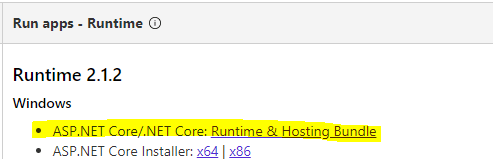

আইআইএস ASP.NET কোর ওয়েব অ্যাপ্লিকেশন হোস্ট করতে ব্যবহৃত হয়, এর ভূমিকা প্রক্সি সার্ভারে হ্রাস পাবে। আইআইএস -এ ASP.NET কোর অ্যাপ্লিকেশনগুলির হোস্টিং নেটিভ *AspNetCoreModuleV2* ব্যবহার করে ঘটে, যা *Kestrel* ওয়েব সার্ভারে অনুরোধগুলি পুননির্দেশ করার জন্য কনফিগার করা হয়। এই মডিউলটি বাহ্যিক প্রক্রিয়া `dotnet.exe` এর শুরু নিয়ন্ত্রণ করে, যার মধ্যে অ্যাপ্লিকেশনটি হোস্ট করা হয় এবং আইআইএস থেকে সমস্ত অনুরোধ এই হোস্ট প্রক্রিয়ায় ফরওয়ার্ড করে।

এই প্যাকেজটি ইনস্টল করার পরে, কমান্ড লাইনে **iisreset** কমান্ডটি চালান বা আইআইএস ম্যানুয়ালি পুনরায় চালু করুন যাতে সার্ভার পরিবর্তনগুলি প্রয়োগ করে।

### আইআইএস কনফিগার

১. আপনাকে অবশ্যই wwwroot ফোল্ডারের অনুমতি দিতে হবে। **IIS Manager** এ নির্বাচিত সাইটের সাথে, **Edit Permissions** চয়ন করুন এবং নিশ্চিত করুন যে *IUSR*, *IIS_IUSRS*, অথবা অ্যাপ্লিকেশন পুলের জন্য কনফিগার করা ব্যবহারকারী রিড এবং এক্সিকিউট অধিকার সহ একজন অনুমোদিত ব্যবহারকারী । এই ব্যবহারকারীদের কেউ উপস্থিত না থাকলে, *Read & Execute* অধিকারের সাথে ব্যবহারকারী হিসাবে *IUSR* যোগ করুন।

   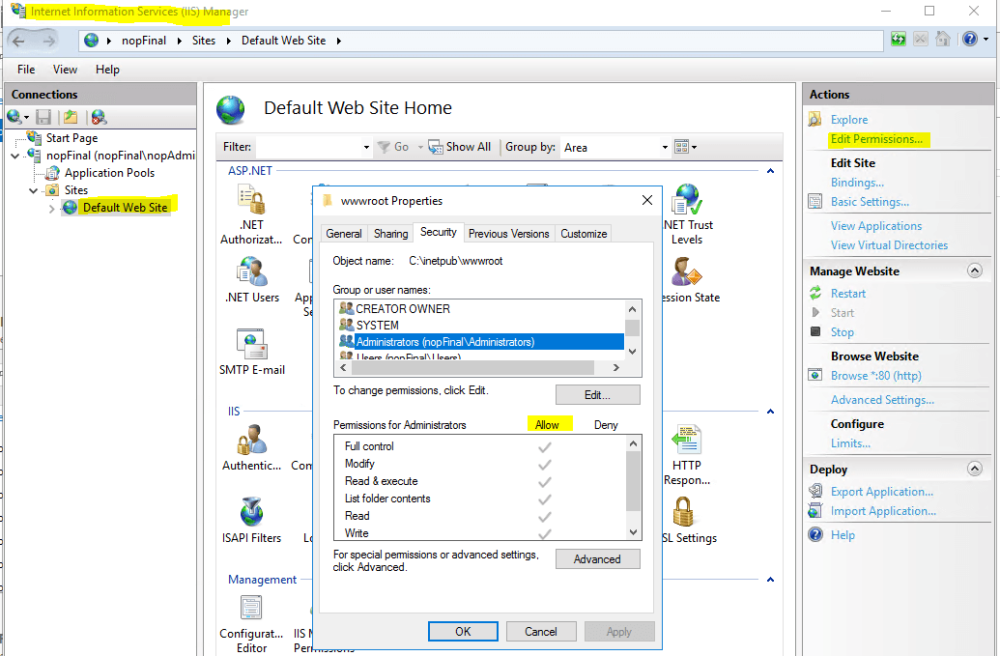

২. আইআইএস পুনরায় চালু করতে ডান প্যানেলে **Restart** ক্লিক করুন

এখন প্রকল্পটি প্রকাশ করার জন্য সবকিছু প্রস্তুত।

## মাইক্রোসফ্ট ভিজ্যুয়াল স্টুডিও থেকে একটি আজুর ভিএম এ নপকমার্স প্রকাশ করুন

নপকমার্স অ্যাপ্লিকেশন প্রকাশ করা অন্য কোন ASP.NET কোর অ্যাপ্লিকেশন প্রকাশের থেকে আলাদা নয়। অতএব, প্রকাশনা চালানোর জন্য সর্বনিম্ন প্রয়োজনীয়তা বর্ণনা করা হবে। আরো বিস্তারিত পাওয়া যাবে [এখনে](https://docs.microsoft.com/aspnet/core/tutorials/publish-to-azure-webapp-using-vs?view=aspnetcore-2.1#deploy-the-app-to-azure).

## `Nop.Web` প্রকাশ করুন

১. মাইক্রোসফট ভিজ্যুয়াল স্টুডিওতে আপনার ওয়েব অ্যাপ সমাধান খুলুন। *Solution Explorer* -এ প্রকল্পটির ডান-ক্লিক করুন এবং **Publish** নির্বাচন করুন।

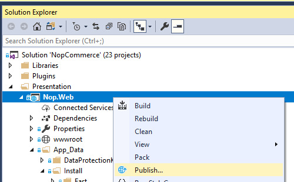

২. **Microsoft Azure Virtual Machines** না পাওয়া পর্যন্ত প্রকাশনার অপশনগুলির মাধ্যমে স্ক্রোল করার জন্য পৃষ্ঠার ডানদিকে তীরটি ব্যবহার করুন। বিদ্যমান ভার্চুয়াল মেশিনের তালিকা থেকে উপযুক্ত ভিএম নির্বাচন করুন।

৩. নির্বাচন করুন **Create Profile**।

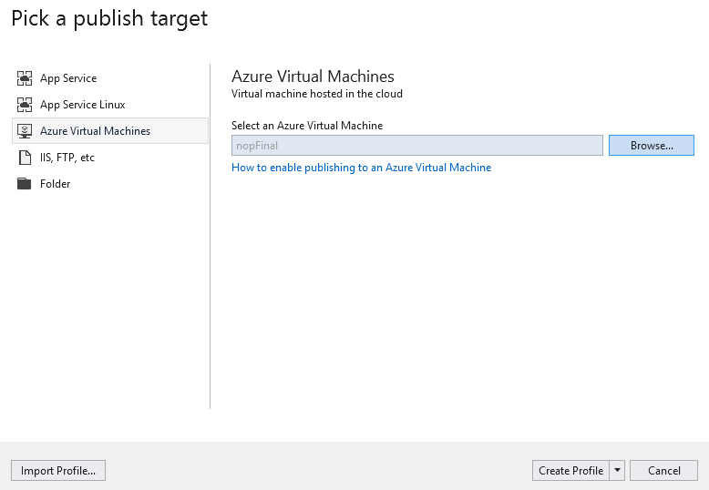

৪. প্রকাশের প্রোফাইল সেটিংস দেখতে এবং সংশোধন করতে, **Configure** নির্বাচন করুন। আপনি সঠিক তথ্য প্রবেশ করেছেন তা নিশ্চিত করতে **Validate Connection**  বোতামটি ব্যবহার করুন।

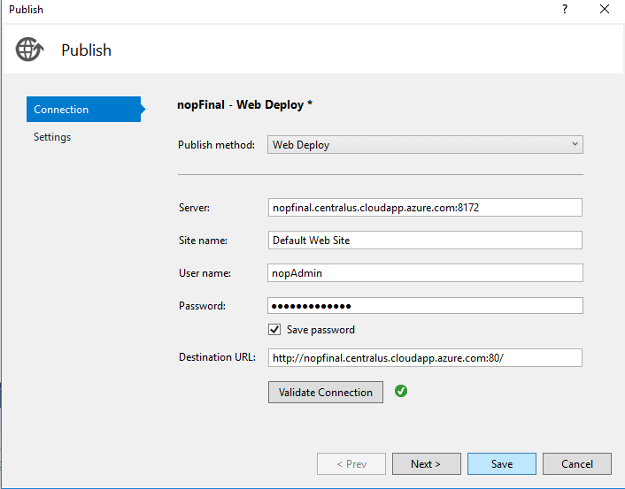

৫. যদি আপনি নিশ্চিত করতে চান যে ওয়েব সার্ভারে প্রতিটি আপলোডের পরে ওয়েব অ্যাপ্লিকেশনের একটি পরিষ্কার কপি রয়েছে (এবং অন্য কোন ফাইল পূর্ববর্তী স্থাপনার কাছ থেকে ঝুলন্ত অবস্থায় নেই), আপনি **Remove additional files at destination** চেকবক্স চেক করতে পারেন **Settings** ট্যাবে। সতর্কতা: এই সেটিং দিয়ে প্রকাশ করা ওয়েব সার্ভারে বিদ্যমান সমস্ত ফাইল মুছে দেয় (*wwwroot* ডিরেক্টরি)। এই বিকল্পটি সক্রিয় করে প্রকাশ করার আগে নিশ্চিত হয়ে নিন যে আপনি মেশিনের অবস্থা জানেন।

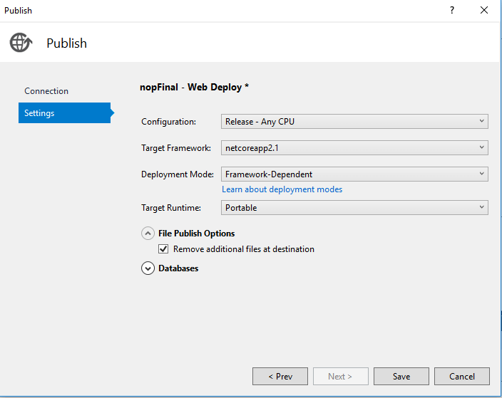

৬. নির্বাচন করুন **Save**।

৭. নির্বাচন করুন **Publish** প্রকাশ শুরু করতে।

আপনি এখন আপনার ওয়েব অ্যাপটি একটি আজুর ভার্চুয়াল মেশিনে প্রকাশ হয়েছে।

## সম্ভাব্য সমস্যা এবং সমাধান

[আরও](https://docs.microsoft.com/aspnet/core/host-and-deploy/aspnet-core-module) সমস্যাটি কী তা সঠিকভাবে বুঝতে, আপনাকে লগিং সক্ষম করতে হবে web.config- এ stdoutLog সক্ষম করতে হবে:

```sh
    stdoutLogEnabled="true" stdoutLogFile=".\logs\stdout"
```

## আইআইএস web.config সনাক্ত করতে সক্ষম নয়

সমাধান:  [support.microsoft.com](http://support.microsoft.com/kb/942055)
