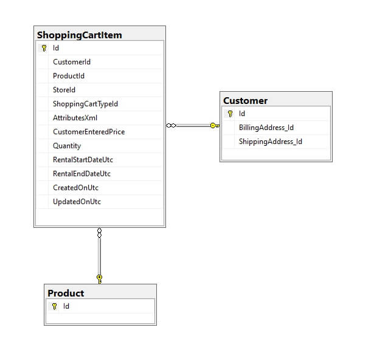

# ডিফল্ট ডাটাবেস স্কিমা

এই নিবন্ধে, আমরা ডাটাবেস স্কিমাটি দেখব যা প্রাথমিক ইনস্টলেশনের সময় ইনস্টল করা আছে এবং যা ৯০% ক্ষেত্রে অপরিবর্তিত রয়েছে।

আমরা সম্পূর্ণ স্কিমা আনব না কিন্তু ১২৬ টেবিল তৈরির জন্য ডিফল্ট ইনস্টলেশন বর্ণনা করব।

এই ধরনের একটি স্কিম সহজেই বোঝার জন্য আসুন এটিকে কম্পোনেন্ট অংশে বিভক্ত করি। নীচে, আমরা টেবিলগুলিকে সর্বাধিক প্রাকৃতিক এবং বোধগম্য উপায়ে গ্রুপ করেছি:

* [গ্রাহকদের তথ্য](#customers-info)
* [পণ্যের তথ্য](#products-info)
  * [পণ্য বৈশিষ্ট্য](#product-attributes)
  * [টিয়ার মূল্য](#tier-price)
  * [গুদাম দ্বারা তালিকা](#inventory-by-warehouses)
* [অর্ডার](#orders)
* [পরিবহন](#shipments)
* [ছাড়](#discounts)
* [শপিং কার্ট](#shopping-cart)
* [ঠিকানা](#addresses)

## গ্রাহকদের তথ্য


এই ডায়াগ্রামে টেবিলের একটি সেট দেখানো হয়েছে যাতে মৌলিক গ্রাহকের তথ্য রয়েছে। এটি লিঙ্কগুলির দিক নির্দেশ করে।

আমরা টেবিল এবং ক্ষেত্রের উদ্দেশ্য অনুসন্ধান করব না, কারণ তাদের নাম যথেষ্ট সেলফ-ডেস্ক্রিপটিভ।

### বৈশিষ্ট্য (গ্রাহকদের তথ্য)

* **Customer** টেবিলে আমাদের তিনটি ক্ষেত্র রয়েছে যা আসলে ফরেন কী হিসাবে সংজ্ঞায়িত করা উচিত কিন্তু বাস্তবে, সেগুলি নয়:
    1. AffiliateId
    1. VendorId
    1. RegisteredInStoreId

    এটি ইচ্ছাকৃতভাবে করা হয়েছে যাতে অপ্রয়োজনীয় সংযোগের সাথে সিস্টেমটি অতিরিক্ত লোড না হয়, যেহেতু এই ক্ষেত্রগুলি প্রতিটি অনলাইন স্টোরে ব্যবহার করা হয় না।

* ব্যবহারকারীর কিছু ডেটা  টেবিলে সংরক্ষণ করা হয়। ডিফল্টরূপে, এই টেবিলে আমরা নিম্নলিখিত ডেটা সংরক্ষণ করি:
  * First name
  * Last name
  * Gender
  * Date of birthday
  * Company
  * Customer Address
  * Phone

    এই টেবিলের গঠন নীচে উপস্থাপন করা হয়েছে:

    

    .উল্লিখিত গ্রাহকের ডেটা ছাড়াও, এই টেবিলটি অন্যান্য সত্তাগুলির জন্য যে কোনও ডেটা সংরক্ষণ করতে পারে। আমরা এই টেবিলটি উদ্দেশ্যমূলকভাবে যুক্ত করেছি যাতে আপনি টেবিলের কাঠামো পরিবর্তন না করে যেকোন সত্তাকে প্রসারিত করতে পারেন।

    উপরন্তু, এই টেবিলটি এক্সএমএল ফরম্যাটে বিক্রেতাদের এবং গ্রাহকদের জন্য নির্বাচিত মান সহ কাস্টম **Customer attributes** এবং **Vendor attributes** সংরক্ষণ করে। এটি কেমন দেখাচ্ছে তা বুঝতে নিম্নলিখিত সারিগুলি দেখুন:

    

    *value* কলাম থেকে এক্সএমএল স্ট্রিং এর উদাহরণে আমরা দেখতে পাই কিভাবে একটি নির্দিষ্ট বিক্রেতার জন্য অ্যাট্রিবিউট মান ঠিকভাবে সংরক্ষণ করা হয়:

      ```csharp
    <Attributes><VendorAttribute ID="2"><VendorAttributeValue><Value>1</Value></VendorAttributeValue></VendorAttribute></Attributes>
      ```

    যেমন আপনি দেখতে পারেন যে আইডি ১ সহ বিক্রেতার শুধুমাত্র একটি বিক্রেতার বৈশিষ্ট্য রয়েছে। এই বৈশিষ্ট্যের আইডি ২ আছে এবং এর মান ১।

    কাস্টম গ্রাহকের বৈশিষ্ট্যগুলির বিক্রেতার বৈশিষ্ট্যগুলির মতো একই কাঠামো রয়েছে। নিচের স্ক্রিনশটটি  **Customer attributes** এবং **Vendor attributes** এবং তাদের মানগুলির মধ্যে সম্পর্কের প্রতিনিধিত্ব করে:

    

## পণ্যের তথ্য


চিত্রটিতে, আপনি পণ্যের জন্য বেস ডেটা দেখতে পারেন (নীচে পণ্য তথ্য সারণির স্কিমা)। একটি নিয়ম হিসাবে, এই ডেটা ৯৯% ক্ষেত্রে ব্যবহার করা হয়।


### বৈশিষ্ট্য (পণ্যের তথ্য)

স্টোর সেটিংসের উপর নির্ভর করে, এই স্কিমের সাথে অতিরিক্ত টেবিল সংযুক্ত হতে পারে। উদাহরণস্বরূপ, একাধিক গুদামের মধ্যে পণ্যের পরিমাণ বিতরণ করা।


অথবা যদি আপনি পণ্য রিভিউ কার্যকারিতা ব্যবহার করতে চান:


### পণ্য বৈশিষ্ট্য

তারপরে নীচে উপস্থাপিত বৈশিষ্ট্যগুলির বৈশিষ্ট্য এবং তাদের সংমিশ্রণগুলি বিবেচনা করা যাক:


### টিয়ার মূল্য

আপনি যদি পণ্যের জন্য টায়ার প্রাইসিং ব্যবহার করেন তাহলে আপনাকে নিম্নলিখিত স্কিমের দিকেও মনোযোগ দিতে হবে:


### গুদাম দ্বারা তালিকা

এই বৈশিষ্ট্যটি প্রায়শই ব্যবহৃত হয় না তা সত্ত্বেও, একটি বিশেষ গুদামে পণ্যগুলির হিসাবের জন্য একটি স্কিম দেওয়া দরকারী হতে পারে:


## অর্ডার 


এই চিত্রটিতে, আমরা অর্ডার ডেটা সম্পর্কিত টেবিলগুলি দেখতে পারি। **Order** টেবিলে নিম্নলিখিত কাঠামো রয়েছে:


কোন বিষয়ে মন্তব্য করার প্রয়োজন নেই, যেহেতু চিত্র থেকে সবকিছু পরিষ্কার হওয়া উচিত এবং ক্ষেত্রের নামগুলি যথেষ্ট সেলফ-ডেস্ক্রিপটিভ। এটি শুধুমাত্র লক্ষ করা উচিত যে **RewardPointsHistory** টেবিলটি শুধুমাত্র তখনই ব্যবহার করা হয় যদি *Reward points system* স্টোরের জন্য সক্রিয় হয়।

## পরিবহন


ডায়াগ্রামে সমস্ত টেবিলের উদ্দেশ্য, আগের মতো, কোনও প্রশ্ন উত্থাপন করে না। যাইহোক, আসুন কয়েকটি পয়েন্টে মনোযোগ দিন। **ShippingMethod** টেবিল সংযুক্ত প্লাগইনগুলির তালিকা পরিচালনা করতে ব্যবহৃত হয় এবং নির্দিষ্ট শিপিং পদ্ধতিটি **Order** টেবিলের*ShippingRateComputationMethodSystemName* এবং *ShippingMethod* ক্ষেত্রগুলিতে সংরক্ষিত থাকে।

**ShipmentItem** টেবিলের*OrderItemId*ক্ষেত্রটি মূলত **OrderItem** টেবিলের একটি রেফারেন্স।

## ছাড়


উপরের চিত্র থেকে, আমরা দেখতে পাচ্ছি যে ছাড় তিনটি গ্রুপে প্রয়োগ করা যেতে পারে:  **Products**, **Manufacturers**, **Categories**
এবং প্লাগইন দ্বারা নিয়ন্ত্রিত বিভিন্ন নিয়ম দ্বারা কনফিগার করা যেতে পারে (``IDiscountRequirementRule``)।

**DiscountRequirement**টেবিলে, *InteractionTypeId* ফিল্ডে অবশ্যই ``RequirementGroupInteractionType`` গণনায় উল্লেখিত মানগুলির মধ্যে একটি থাকতে হবে:

```csharp
/// <summary>
/// Represents an interaction type within the group of requirements
/// </summary>
public enum RequirementGroupInteractionType
{
    /// <summary>
    /// All requirements within the group must be met
    /// </summary>
    And = 0,

    /// <summary>
    /// At least one of the requirements within the group must be met 
    /// </summary>
    Or = 2
}
```

## শপিং কার্ট

দোকানের আরেকটি গুরুত্বপূর্ণ অংশ হল একটি শপিং কার্ট। আমাদের ক্ষেত্রে এই মেকানিজমের স্কিম খুবই সহজ:



শুধুমাত্র লক্ষ্য করার মতো বিষয় হল এই স্কিমটি একটি উইশলিস্টের জন্যও ব্যবহার করা হয়। এই দুটি প্রকার আলাদা করার জন্য, *ShoppingCartTypeId* ক্ষেত্রটি ব্যবহার করা হয়। এই ক্ষেত্রের মানগুলি অবশ্যই **ShoppingCartType** গণনার মানগুলির সাথে মেলে:

```csharp
/// <summary>
/// Represents a shopping cart type
/// </summary>
public enum ShoppingCartType
{
    /// <summary>
    /// Shopping cart
    /// </summary>
    ShoppingCart = 1,

    /// <summary>
    /// Wishlist
    /// </summary>
    Wishlist = 2
}
```

## ঠিকানা 

সম্ভবত আপনি ডেলিভারি এবং গ্রাহক ঠিকানা উভয়ই ঠিকানা সংরক্ষণে জড়িত টেবিল স্কিমাতেও আগ্রহী হবেন:


আপনি বুঝতে পারছেন, স্ট্যান্ডার্ড ইনস্টলেশনের মধ্যে আরও অনেক টেবিল রয়েছে। আমরা তাদের সব বর্ণনা করি না, যেহেতু তাদের অনেকের কোন সংযোগ নেই এবং শুধুমাত্র একটি নির্দিষ্ট উদ্দেশ্যে পরিবেশন করা হয়, অন্যরা খুব কমই ব্যবহৃত হয়।
