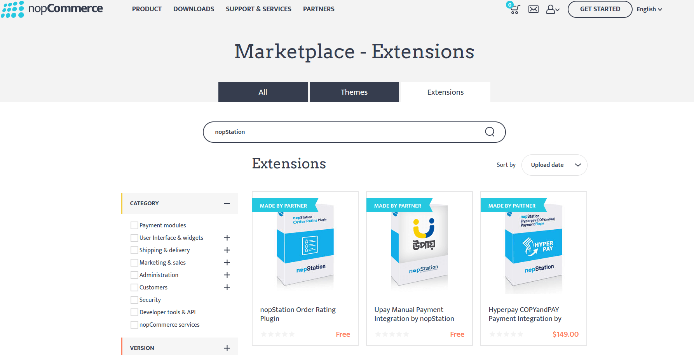

---
title: প্লাগইন সিস্টেমের বর্ণনা
uid: bn/developer/tutorials/description-of-plugin-system
author: git.nopsg
contributors: git.AfiaKhanom
---

# প্লাগইন সিস্টেমের বর্ণনা

## কীভাবে একটি নতুন প্লাগইন সিস্টেম শুরু করবেন (কীভাবে একটি নতুন প্লাগইন প্রকল্প তৈরি করবেন)

নপকমার্স দোকানের কার্যকারিতা বাড়ানোর জন্য নপকমার্স প্লাগইন সিস্টেম ব্যবহার করে। প্লাগইনগুলি স্বাধীন প্রোগ্রাম বা উপাদানগুলির একটি সেট যা কিছু নির্দিষ্ট কার্যকারিতা বাড়ানোর জন্য একটি বিদ্যমান সিস্টেমে যোগ করা যেতে পারে এবং প্রক্রিয়া চলাকালীন মূল সিস্টেমকে প্রভাবিত না করে সিস্টেম থেকে সরানো যেতে পারে।

> [!NOTE]
> কিভাবে একটি প্লাগইন তৈরি করতে হয় সে সম্পর্কে আরও তথ্যের জন্য আপনি  দেখতে পারেন [**এই পৃষ্ঠাটি**](xref:bn/developer/plugins/index)

## কিভাবে নপকমার্স দোকান থেকে প্লাগইন অনুসন্ধান এবং ব্যবহার করবেন

নপকমার্স এ ইতিমধ্যেই বেশ কিছু প্লাগইন আছে যা আগে থেকেই তৈরি এবং বাক্সের বাইরে ব্যবহারের জন্য উপলব্ধ। আপনি নপকমার্স অফিসিয়াল স্টোর থেকে ইতিমধ্যে পাওয়া বেশ কয়েকটি প্লাগইন অনুসন্ধান এবং খুঁজে পেতে পারেন এবং দেখতে পারেন যে কেউ ইতিমধ্যে আপনার প্রয়োজন অনুসারে একটি প্লাগইন তৈরি করেছে কিনা। যদি তা না হয় তবে আপনি সর্বদা আপনার প্রয়োজন অনুসারে আপনার জিতে যাওয়া প্লাগইনটি তৈরি করতে পারেন। কিন্তু এখানে দেখা যাক কিভাবে নপকমার্স দোকান থেকে প্লাগইন খুঁজে বের করা যায় এবং ব্যবহার করা যায়। সেই জন্য নপকমার্স এর একটি বাজার জায়গা আছে যেখানে আমরা বিভিন্ন থিম এবং প্লাগইন খুঁজে পেতে পারি। আপনি এখানে যেতে ভিজিট করতে পারেন [nopCommerce Marketplace](https://www.nopcommerce.com/marketplace).



এখানে আপনি তিনটি ট্যাব দেখতে পারেন। **All tab** সব থিম এবং এক্সটেনশন থাকে, **Themes tab** সব নপকমার্স থিম থাকে যা নপকমার্স ওয়েবসাইট স্কিনের জন্য, এবং সবশেষে **Extensions tab** যেখানে আমরা প্লাগইন খুঁজে পেতে পারি। সুতরাং এক্সটেনশন ট্যাবে যান। এখানে আপনি সমস্ত বিনামূল্যে এবং বাণিজ্যিক প্লাগইন খুঁজে পেতে পারেন। আপনি চান একটি নির্দিষ্ট প্লাগইন খুঁজে পেতে, আপনি এখান থেকে অনুসন্ধান করতে পারেন। ডানদিকে আপনি পরিস্রাবণ বিভাগটি খুঁজে পেতে পারেন যেখানে আপনি আপনার ফিল্টারিংকে সংকুচিত করতে পারেন। আপনার অনুসন্ধান করা প্লাগইনটি খুঁজে পাওয়ার পরে কেবল ডাউনলোড এবং ইনস্টল করুন। প্রতিটি প্লাগইন এর ডাউনলোড পৃষ্ঠায় কিভাবে প্লাগইন ব্যবহার করতে হয় তার সম্পূর্ণ বিবরণ আছে, তাই সেই বর্ণনাগুলি পড়তে ভুলবেন না।

## ইন্টারফেস `IPlugin`

`IPlugin` হল একটি ইন্টারফেস যা প্লাগইন ইনস্টল বা আনইনস্টল করার সময় ব্যবহৃত কার্যকারিতা প্রকাশ করে। প্রতিটি প্লাগইন প্রকল্পের একটি শ্রেণী থাকতে হবে যা এই ইন্টারফেসটিকে অন্তর্নিহিত করে যাতে নপকমার্স সেই প্রকল্পটিকে প্লাগইন হিসাবে বিবেচনা করে।

### মেথড `GetConfigurationPageUrl`

```cs
string GetConfigurationPageUrl()
```

যখন আমরা প্লাগইনটি ইনস্টল করি তখন আমরা একটি `Configuration` বোতাম দেখতে পাব, তাই যদি আমরা এই পদ্ধতিটি আমাদের ক্লাসে প্রয়োগ করি তাহলে এই পদ্ধতিতে আমরা যে স্ট্রিং মানটি ফেরত দিই সেই `Configuration` বোতামের ইউআরএল হিসাবে ব্যবহার করা হবে।

### প্রপার্টি `PluginDescriptor`

```cs
PluginDescriptor PluginDescriptor{ get; set; }
```

এই প্রপার্টি বর্তমান প্লাগইন বর্ণনা করে এমন তথ্য পেতে বা সেট করতে ব্যবহৃত হয়। যখন আমরা একটি নতুন প্লাগইন বা উইজেট লিখি তখন আমাদের একটি **plugin.json** ফাইল তৈরি করতে হবে। নপকমার্স এই প্রপার্টির মান শুরু করতে একই ফাইল ব্যবহার করে।

### মেথড `InstallAsync`

```cs
Task InstallAsync();
```

প্লাগইন ইনস্টল করার সময় যে পদ্ধতিটি কার্যকর করা হয়, এই যুক্তিটি সাধারণত প্লাগইনটির সঠিক কনফিগারেশনের জন্য সেটিংস, লোকেল এবং অন্যান্য অবকাঠামোর সূচনা প্রয়োগ করে।

### মেথড `UninstallAsync`

```cs
Task UninstallAsync();
```

পদ্ধতিটি "InstallAsync" এর বিপরীত, এটি আনইনস্টল হওয়ার পরে প্লাগইনটিতে বরাদ্দ করা সমস্ত সম্পদ সম্পূর্ণরূপে মুছে ফেলা উচিত।

### মেথড `UpdateAsync`

```cs
Task UpdateAsync(string currentVersion, string targetVersion);
```

পদ্ধতিটি নির্দিষ্ট সংস্করণে প্লাগইন আপডেট করতে ব্যবহৃত হয়।

### মেথড `PreparePluginToUninstallAsync`

```cs
Task PreparePluginToUninstallAsync()
```

যখন আমরা প্লাগইনটির জন্য `UninstallAsync` বাটনে ক্লিক করি তখন এই পদ্ধতিটি চালু করা হবে। নপকমার্স সিস্টেম থেকে প্লাগইন আনইনস্টল করার আগে এই পদ্ধতির ভিতরে কোড কার্যকর করা হবে। এই পদ্ধতিতে আমরা আমাদের প্লাগইন আনইনস্টলেশন থেকে যাচাই করার জন্য যুক্তি লিখতে চাই। উদাহরণস্বরূপ এখানে আমরা অন্য প্লাগইন আছে কিনা তা পরীক্ষা করতে পারি যা প্লাগইন এর উপর নির্ভর করে আমরা আনইনস্টল করার চেষ্টা করছি। যদি তাই হয় তবে আমরা চাই না যে ব্যবহারকারীরা প্লাগইনটি আনইনস্টল করুন যতক্ষণ না প্লাগইনটি বর্তমান প্লাগইনটির উপর নির্ভর করে আনইনস্টল করা হয়।

## ক্লাস `PluginDescriptor`

নাম অনুসারে এই ক্লাসটি প্লাগইন সম্পর্কে বর্ণিত তথ্য ধারণ করে। আপনি যদি এই ক্লাসের *properties* কে **plugin.json** ফাইল থেকে *key* এর সাথে তুলনা করেন, তাহলে আপনি একই ধরনের গঠন দেখতে পাবেন। এর কারণ হল এই ক্লাস **PluginDescriptor.cs** সেই **plugin.json** ফাইলকে C# ক্লাসে ম্যাপ করতে ব্যবহৃত হয়, যাতে **plugin.json** এ প্রদত্ত তথ্য নপকমার্স ব্যবহার করতে পারে। সেই প্রপার্টিগুলি বাদ দিয়ে `PluginDescriptor` শ্রেণীতে আরও কিছু বৈশিষ্ট্য এবং সহায়ক পদ্ধতি রয়েছে।

### প্রপার্টি `Installed`

```cs
public virtual bool Installed { get; set; }
```

এই প্রপার্টি আমাদের নপকমার্স অ্যাপ্লিকেশনে প্লাগইন ইনস্টল করা আছে কিনা তা যাচাই করতে ব্যবহৃত হয়।

### প্রপার্টি `PluginType`

```cs
public virtual Type PluginType { get; set; }
```

এটি প্লাগিনের ধরন পেতে বা সেট করতে ব্যবহৃত হয়। এই প্রকারটি সেই ক্লাসের উল্লেখ করে যা প্লাগইন প্রকল্পে `IPlugin` ইন্টারফেস প্রয়োগ করে।

### প্রপার্টি `OriginalAssemblyFile`

```cs
public virtual string OriginalAssemblyFile { get; set; }
```

এটি আসল অ্যাসেম্বলি ফাইলটি পেতে বা সেট করতে ব্যবহৃত হয় যা থেকে একটি ছায়া কপি তৈরি করা হয়েছিল।

### প্রপার্টি `ReferencedAssembly`

```cs
public virtual Assembly ReferencedAssembly { get; set; }
```

এটি এমন অ্যাসেম্বলি পেতে বা সেট করতে হয় যা ছায়ায় অনুলিপি করা হয়েছে যা অ্যাপ্লিকেশনটিতে সক্রিয়।

### প্রপার্টি `ShowInPluginsList`

```cs
public virtual bool ShowInPluginsList { get; set; } = true;
```

আমরা প্লাগইন তালিকায় প্লাগইন দেখাতে চাই কি না তা নির্দেশ করতে এই প্রপার্টি ব্যবহার করা হয়।

### মেথড GetPluginDescriptorFromText

```cs
public static PluginDescriptor GetPluginDescriptorFromText(string text)
```

এই পদ্ধতিটি *json string* ইনপুট হিসেবে নেয় এবং *json string* বিশ্লেষণ করে `PluginDescriptor` টাইপ করে। এবং *json string* থেকে বিশ্লেষিত `PluginDescriptor` প্রদান করে।

### মেথড `Save`

```cs
public virtual void Save()
```

এটি হল `PluginDescriptor` থেকে **plugin.json** ফাইলে প্লাগইন বর্ণনা সংরক্ষণ করা।

### মেথড `CompareTo`

```cs
public int CompareTo(PluginDescriptor other)
```

এটি `PluginDescriptor` এর বর্তমান দৃষ্টান্তকে `PluginDescriptor` এর অন্যান্য উদাহরণের সাথে প্যারামিটারে সরবরাহকৃত প্রপার্টি *FriendlyName* এর সাথে তুলনা করে এবং একটি পূর্ণসংখ্যা প্রদান করে যা নির্দেশ করে যে এই দৃষ্টান্তটি নির্দিষ্ট প্যারামিটারের মতো সাজানোর ক্রমে একই অবস্থানের আগে, অনুসরণ, বা প্রদর্শিত হয় কিনা।

### মেথড `Instance`

```cs
public virtual TPlugin Instance<TPlugin>() where TPlugin : class, IPlugin
```

বর্তমান `PluginDescriptor` থেকে `PluginType` বৈশিষ্ট্যের *Plugin* এর উদাহরণ পেতে এই পদ্ধতি ব্যবহার করা হয়।

## ইন্টারফেস। `IPluginManager`

`IPluginManager` টাইপ ক্লাসের একটি জেনেরিক ইন্টারফেস। এটি বিভিন্ন ফিল্টার প্যারামিটার ব্যবহার করে প্লাগইন লোড করার জন্য ব্যবহৃত পদ্ধতি হ্রাস করে। আমরা এই ইন্টারফেসের বাস্তবায়ন খুঁজে পেতে পারি `PluginManager` নেমস্পেস `{Nop.Services.Plugins}` এর অধীনে অবস্থিত।
