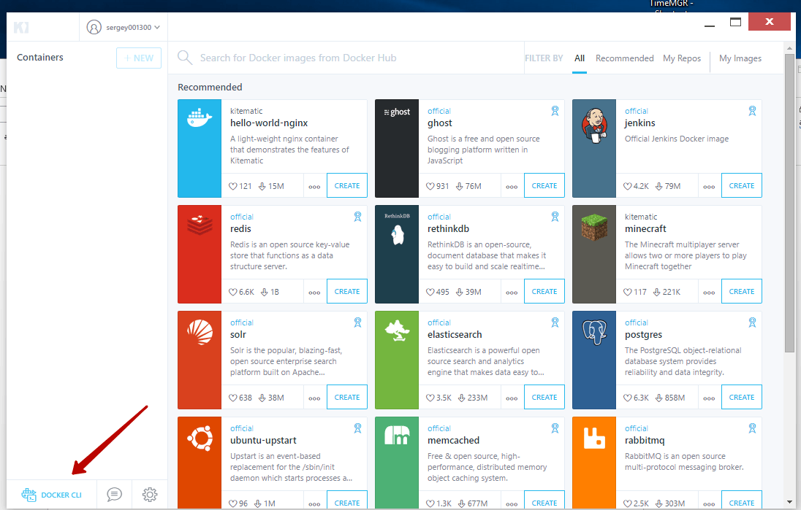
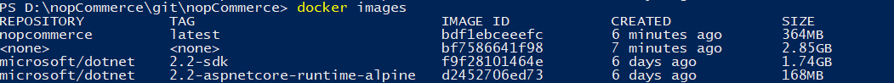
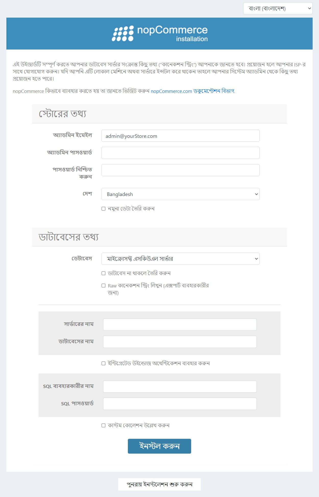

# ডকার

এই ডকুমেন্ট একটি ডকার কন্টেইনার নির্মাণ এবং চালানোর জন্য ধাপে ধাপে নির্দেশিকা বর্ণনা করে।

১. **Preparing for the deployment of virtual Docker** উইন্ডোজ পরিবেশে।

আপনাকে [Kitematic](https://kitematic.com/) অ্যাপ্লিকেশনটি ডাউনলোড এবং ইনস্টল করতে হবে। এই প্রোগ্রামটি আমাদের ভার্চুয়ালবক্সে একটি লিনাক্স ভার্চুয়াল মেশিনকে ডকার ইনস্টল করা এবং আমাদের প্রধান কম্পিউটার থেকে এটি পরিচালনা করার অনুমতি দেবে। প্রথম লঞ্চের পরে, আমরা বেছে নিই যে আমরা ভার্চুয়ালবক্সের মাধ্যমে কাজ করব এবং অ্যাপ্লিকেশনটি ইনস্টল এবং ভার্চুয়াল মেশিন চালু না হওয়া পর্যন্ত অপেক্ষা করব।

২. **Run the command shell** [Kitematic](https://kitematic.com/) ইন্টারফেসের মাধ্যমে ডকারের কাছে। এটি করার জন্য, কেবল ইন্টারফেসের ইনকন্সপিকাওয়াস বোতামে ক্লিক করুন।

   

পরবর্তী সমস্ত কাজ পরিচিত পাওয়ারশেল উইন্ডোতে হবে।

৩. **We collect the Docker container**. কমান্ডগুলি কার্যকর করার সুবিধার জন্য, ডকরিফিল যেখানে অবস্থিত সেই ডিরেক্টরিতে যান (নপকমার্স সোর্স ফাইলগুলির মূল ডিরেক্টরি)।

যে কমান্ডটি আমাদের প্রয়োজন:

```csharp
    docker build -t nopcommerce .]
```

এই কমান্ডটি "Dockerfile" ফাইলে বর্ণিত নির্দেশাবলী অনুসারে ধারক তৈরি করে। সমাবেশের প্রথম প্রবর্তনে অনেক সময় লাগবে, যেহেতু এটি। .Net Core অ্যাপ্লিকেশনের জন্য দুটি মৌলিক ছবি ডাউনলোড করতে হবে।

এসডিকে ধারণকারী প্রথম চিত্রটি অন্তর্বর্তী কন্টেইনারের জন্য প্রয়োজন, যা সমস্ত নির্ভরতা মেরামত করে অ্যাপ্লিকেশনটি একত্রিত করবে, এবং তারপর `Nop.Web` অ্যাপ্লিকেশনটি একটি পৃথক ডিরেক্টরিতে প্রকাশ করার প্রক্রিয়াটি সম্পাদন করবে, যেখান থেকে আপনি ফলাফল তৈরি করবেন *nopcommerce* নামের কন্টেইনারটি পরে )।

ইনস্টলেশনের পরে, যদি সবকিছু ঠিকঠাক হয় তবে পরবর্তী কমান্ডটি কার্যকর করুন:

```csharp
[docker images]
```

আমাদের এর অনুরূপ কিছু দেখা উচিত:

   

এটি সমস্ত লোড কন্টেইনারের একটি তালিকা, যার মধ্যে আমরা সহজেই আমাদের কন্টেইনার দেখতে পাচ্ছি, এটি তৈরি এবং যাওয়ার জন্য প্রস্তুত।

৪. **Run and test the container.**

প্রথমে, কমান্ড দিয়ে কন্টেইনারটি শুরু করি:

```csharp
    [docker run -d -p 80:80 nopcommerce]
```

এই কমান্ডটি পটভূমিতে আমাদের কন্টেইনার চালু করবে (পতাকা [-d]) এবং কন্টেইনার থেকে পোর্ট ৮০ সেট করবে হোস্ট মেশিনের পোর্ট ৮০ (পতাকা [–p])।

> [!TIP]
>
> আপনি পরবর্তী কমান্ড ব্যবহার করে চলমান পাত্রে তালিকা দেখতে পারেন:
>
>```csharp
> [docker ps]
> ```

যেহেতু আমরা একটি ভার্চুয়াল মেশিনের মাধ্যমে ডকার চালু করছি, আমাদের প্রথমে একটি আইপি ঠিকানা পেতে হবে যেখানে আমরা অ্যাপ্লিকেশনটির কাজ পরীক্ষা করতে পারি। এটি করার জন্য, কমান্ডটি চালান, যা পুননির্দেশ পরিষেবাটি শুরু করবে এবং আমাদের আইপি ঠিকানা দেবে যার উপর আমরা যাচাই করতে পারি যে অ্যাপ্লিকেশনটি শুরু হয়েছে।

```csharp
    [docker-machine ip]
```

এই ঠিকানায় ক্লিক করে, আমাদের নপকমার্স ইনস্টলেশন সহ পৃষ্ঠাটি দেখা উচিত।

   

এটি আমাদের যাচাই হবে যে কন্টেইনার তৈরি হচ্ছে, চালু হয়েছে এবং সফলভাবে কাজ করছে।

৫. কাজ কেবল তখনই কাজ করবে যদি আপনার একটি এসকিউএল সার্ভার থাকে যা আমাদের কন্টেইনার অ্যাক্সেস করতে পারে। কিন্তু, একটি নিয়ম হিসাবে, আমাদের এবং ব্যবহারকারীর পরিবেশ সীমিত, তাই আমরা একটি লেআউট ফাইল প্রস্তুত করেছি যা আপনাকে এসকিউএল সার্ভার ধারণকারী কন্টেইনারের সাথে একত্রে নপকমার্স ধারক স্থাপনের অনুমতি দেবে।

শুরু করার জন্য, সমস্ত পাত্র বন্ধ করুন যাতে হস্তক্ষেপ না হয়। এই জন্য কমান্ড ব্যবহার করুন:

```csharp
    [docker stop $ (docker ps -a -q)]
```

কন্টেইনারে রচনা স্থাপন করতে, কমান্ডটি ব্যবহার করুন:

```csharp
    [docker-compose up -d]
```

এই কমান্ডটি স্থাপনার জন্য docker-compose.yml ফাইলটি ব্যবহার করে, যা "nopcommerce_web" এবং "nopcommerce_database" দুটি কনটেইনার তৈরির বর্ণনা দেয়, যা অ্যাপ্লিকেশনগুলির একটি বান্ডেল এবং একটি ডাটাবেস প্রদান করে। এখন আমরা কমান্ডটি সম্পাদন করে পরীক্ষার জন্য আইপি ঠিকানা পাব:

```csharp
    [docker-machine ip]
```

এবং ব্রাউজারে এই ঠিকানায় পৃষ্ঠাটি খোলার মাধ্যমে আমরা যা চাই তা পরীক্ষা করতে সক্ষম হব। ডাটাবেস সার্ভারের সাথে সংযোগ করার জন্য, আমরা নিম্নলিখিত ডেটা ব্যবহার করি (docker-compose.yml ফাইলে বর্ণিত):

```csharp
    Server name: nopcommerce_mssql_server
    User: sa
    Password: nopCommerce_db_password
```

৬. পরীক্ষা শেষ হওয়ার পরে, আপনি সমস্ত পাত্রে অপসারণ করতে পারেন যাতে তারা পরের বার হস্তক্ষেপ না করে। দুটি কমান্ড এটি কার্যকর করতে সাহায্য করবে:

```csharp
    [docker stop $ (docker ps -a -q)]
```

এবং

```csharp
    [docker system prune -a]
```

## ডকার হাব

নপকমার্স ৪.২০ সংস্করণ থেকে শুরু করে, আমরা সম্পূর্ণ ছবিটি গিটহাব পরিষেবাতে প্রকাশ করি, আপনি [এই লিঙ্ক](https://hub.docker.com/r/nopcommerceteam/nopcommerce) দ্বারা উপলব্ধ সংস্করণগুলি পরীক্ষা করতে পারেন, অথবা সর্বশেষ সংস্করণটি ডাউনলোড করতে পারেন নিম্নলিখিত কমান্ড দিয়ে:

```csharp
    [docker pull nopcommerceteam/nopcommerce:latest]
```
