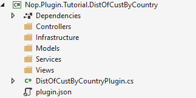
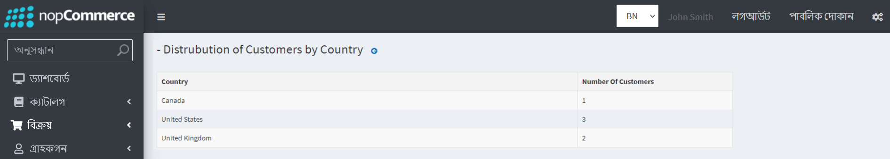

---
title: DataTables এর একটি রিপোর্টিং টেবিল সম্বলিত একটি পৃষ্ঠা তৈরির গাইড
uid: bn/developer/tutorials/guide-to-creating-a-page-containing-a-reporting-table-of-datatables
author: nop.sea
contributors: git.AfiaKhanom
---

# DataTables এর একটি রিপোর্টিং টেবিল সম্বলিত একটি পৃষ্ঠা তৈরির গাইড

এই টিউটোরিয়ালে আমরা কীভাবে অ্যাডমিন প্যানেলের জন্য কাস্টম কার্যকারিতা সহ নপকমার্স এর কার্যকারিতা বাড়ানো যায় এবং একটি প্রতিবেদন হিসাবে কিছু ডেটা সহ একটি টেবিল সহ একটি পৃষ্ঠা তৈরি করতে শিখব। তাই এই টিউটোরিয়ালটি শুরু করার আগে আপনার কিছু বিষয়ে পূর্ব জ্ঞান এবং বোঝার প্রয়োজন।

* [নপকমার্সের আর্কিটেকচার](xref:bn/developer/tutorials/source-code-organization).
* [নপকমার্সের প্লাগইন](xref:bn/developer/tutorials/guide-to-expanding-the-functionality-of-the-basic-functions-of-nop-commerce-through-a-plugin).
* [নপকমাসের রুট](xref:bn/developer/tutorials/register-new-routes).

আপনি যদি উপরের বিষয়গুলির সাথে পরিচিত না হন, তবে আমরা আপনাকে প্রথমে সেগুলি সম্পর্কে জানতে পরামর্শ দিই। যাইহোক, যদি আপনি স্বাচ্ছন্দ্য বোধ করেন বা কমপক্ষে উপরোক্ত বিষয়ে কিছু মৌলিক ধারণা পান তবে আপনি এই টিউটোরিয়ালটি চালিয়ে যাওয়ার জন্য যথেষ্ট ভাল।

তাই এই টিউটোরিয়ালে আমরা একটি পৃষ্ঠার সাথে একটি প্লাগইন তৈরি করব যার টেবিলটি দেশ অনুযায়ী ব্যবহারকারীদের বিতরণের তথ্য প্রদর্শন করে (বিলিং ঠিকানার উপর ভিত্তি করে)। উপরে উল্লেখিত কার্যকারিতা তৈরি করতে ধাপে ধাপে প্রক্রিয়াটি চলুন।

## নপকমার্স প্লাগইন প্রকল্প তৈরি

আমি ধরে নিচ্ছি যে আপনি ইতিমধ্যে জানেন যে কোথায় এবং কিভাবে নপকমার্স প্লাগইন প্রকল্প তৈরি করতে হবে এবং নপকমার্স মান অনুযায়ী প্রকল্পটি কনফিগার করতে হবে। যদি আপনি না জানেন তাহলে নপকমার্স প্লাগইন প্রকল্প কিভাবে তৈরি ও কনফিগার করতে হয় তা জানতে [এই পৃষ্ঠা](xref:bn/developer/plugins/how-to-write-plugin-4.40) লিঙ্কটি দেখতে পারেন।

আপনি যদি আপনার প্লাগইন প্রকল্পটি তৈরি এবং কনফিগার করার জন্য উপরের প্রদত্ত লিঙ্কটি অনুসরণ করেন তবে আপনি ফোল্ডার কাঠামোর সাথে শেষ করতে পারেন।



এবং আপনি এই ফোল্ডার/ডিরেক্টরি প্রতিটি ফাইল কি ধরনের জানেন। এখানে "DistOfCustByCountryPlugin.cs" ফাইলটি BasePlugin ক্লাসের অন্তর্নিহিত। এই টিউটোরিয়ালের স্বার্থে এই ফাইলটিতে আমরা যে মৌলিক কোডটি চাই তা এখানে।

```cs
public class DistOfCustByCountryPlugin: BasePlugin
    {
        public DistOfCustByCountryPlugin()
        {

        }

        public override string GetConfigurationPageUrl()
        {
            return $"{_webHelper.GetStoreLocation()}Admin/DistOfCustBuCountryPlugin/Configure";
        }

        public override async Task InstallAsync()
        {
            //Code you want to run while installing the plugin goes here.
             await base.InstallAsync();
        }

        public override async Task UninstallAsync()
        {
            //Code you want to run while Uninstalling the plugin goes here.
            await base.UninstallAsync();
        }
    }
```

এই ক্লাসের দুটি ওভাররাইড মেথড `InstallAsync` এবং `UninstallAsync` থেকে `BasePlugin` ক্লাস আছে। যদি আমরা প্লাগইন ইনস্টল এবং আনইনস্টল করার আগে কিছু করতে চাই তাহলে বেস ক্লাস থেকে ইনস্টল এবং আনইনস্টল পদ্ধতিতে কল করার আগে সেই কোডটি রাখবে। উদাহরণস্বরূপ যদি আমাদের প্লাগইনটি তার নিজস্ব টেবিল তৈরি করতে পারে তবে আমরা বেস ক্লাস থেকে ইনস্টল পদ্ধতিটি কল করার আগে আমরা সেই টেবিলটি তৈরি করব এবং একইভাবে ব্যবহারকারীরা আমাদের প্লাগইন আনইনস্টল করতে চাইলে আমরা আমাদের টেবিলটি ডাটাবেস থেকে মুছে ফেলতে চাই। এই ক্ষেত্রে আমরা বেস ক্লাস থেকে আনইনস্টল পদ্ধতি কল করার আগে টেবিলগুলি মুছে ফেলার জন্য কোড চালাতে চাই।

প্রথমে আসুন **Models** ফোল্ডারের ভিতরে **CustomersDistribution** নামে একটি মডেল তৈরি করি।

## #Models/ CustomersDistribution.cs

```cs
public record CustomersDistribution : BaseNopModel
{
    /// <summary>
    /// Country based on the billing address.
    /// </summary>
    public string Country { get; set; }

    /// <summary>
    /// Number of customers from specific country.
    /// </summary>
    public int NoOfCustomers { get; set; }
}
```

এছাড়াও *Models* ফোল্ডারের ভিতরে `CustomersByCountrySearchModel` নামে সার্চ মডেল যোগ করা যাক।

```cs
public record CustomersByCountrySearchModel : BaseSearchModel
{
}
```

নপকমার্স ডেটা অ্যাক্সেসের জন্য রিপোসিটোরি প্যাটার্ন ব্যবহার করে যা ডিপেন্ডেন্সি ইনজেকশন পদ্ধতির জন্য আদর্শ। এখন আসুন আমরা এমন একটি সার্ভিস তৈরি করি যা ডাটাবেস থেকে প্রয়োজনীয় তথ্য নিয়ে আসে। সেবার জন্য আমরা একটি ইন্টারফেস তৈরি করব এবং সেই ইন্টারফেস বাস্তবায়নকারী একটি সার্ভিস ক্লাস তৈরি করব।

## #Services/ ICustomersByCountry.cs

```cs
public interface ICustomersByCountry
{
    Task<List<CustomersDistribution>> GetCustomersDistributionByCountryAsync()
}
```

এখানে আমাদের শুধুমাত্র একটি পদ্ধতি বর্ণনা আছে কারণ এই প্লাগইনটির জন্য আমাদের অন্য কোন পদ্ধতির প্রয়োজন নেই।

## #Services/ CustomersByCountry.cs

```cs
public class CustomersByCountry : ICustomersByCountry
{
    private readonly IAddressService _addressService;
    private readonly ICountryService _countryService;
    private readonly ICustomerService _customerService;

    public CustomersByCountry(IAddressService addressService, 
        ICountryService countryService,
        ICustomerService customerService)
    {
        _addressService = addressService;
        _countryService = countryService;
        _customerService = customerService;
    }

    public async Task<List<CustomersDistribution>> GetCustomersDistributionByCountryAsync()
    {
        return await _customerService.GetAllCustomersAsync()
            .Where(c => c.ShippingAddressId != null)
            .Select(c => new
            {
                await (_countryService.GetCountryByAddressAsync(_addressService.GetAddressById(c.ShippingAddressId ?? 0))).Name,
                c.Username
            })
            .GroupBy(c => c.Name)
            .Select(cbc => new CustomersDistribution { Country = cbc.Key, NoOfCustomers = cbc.Count() }).ToList();
    }
}
```

এখানে আমরা **CustomersByCountry** নামে একটি ক্লাস তৈরি করছি যা **ICustomersByCountry** ইন্টারফেসের অন্তর্নিহিত। এছাড়াও, আমরা ডাটাবেস থেকে তথ্য পুনরুদ্ধার করার মেথড প্রয়োগ করছি। আমরা এই মেথডটি ব্যবহার করেছি যাতে আমরা কন্ট্রোলারকে এই সার্ভিসটি ইনজেকশনের জন্য ডিপেন্ডেন্সি ইনজেকশন কৌশলগুলি ব্যবহার করতে পারি।

এখন একটি কন্ট্রোলার ক্লাস তৈরি করা যাক। প্লাগইন কন্ট্রোলারদের নাম দেওয়ার একটি ভাল অভ্যাস হল {Group}{Name}Controller.cs। উদাহরণস্বরূপ, TutorialCustomersByCountryController, এখানে {Tutorial}{CustomersByCountry} কন্ট্রোলার ক্লাস। কিন্তু মনে রাখবেন যে {Group}{Name} দিয়ে কন্ট্রোলারের নাম দেওয়ার প্রয়োজন নেই, এটি নপকমার্স দ্বারা নামকরণ কনভেনশনের জন্য সুপারিশ করা হয়েছে তবে নামটিতে কন্ট্রোলার অংশটি। .Net MVC এর প্রয়োজনীয়তা।

## #Controllers/CustomersByCountryController.cs

```cs
    [AutoValidateAntiforgeryToken]
    [AuthorizeAdmin] //confirms access to the admin panel
    [Area(AreaNames.Admin)] //specifies the area containing a controller or action
    public class DistOfCustByCountryPluginController : BasePluginController
    {
        private readonly ICustomersByCountry _service;
        public DistOfCustByCountryPluginController(ICustomersByCountry service)
        {
            _service = service;
        }

        [HttpGet]
        public IActionResult Configure()
        {
            CustomersByCountrySearchModel customerSearchModel = new CustomersByCountrySearchModel
            {
                AvailablePageSizes = "10"
            };
            return View("~/Plugins/Tutorial.DistOfCustByCountry/Views/Configure.cshtml", customerSearchModel);
        }

        [HttpPost]
        public async Task<IActionResult> GetCustomersCountByCountry()
        {
            try
            {
                return Ok(new DataTablesModel { Data = await _service.GetCustomersDistributionByCountryAsync() });
            }
            catch (Exception ex)
            {
                return BadRequest(ex);
            }
        }
    }
```

কন্ট্রোলারে আমরা "ICustomersByCountry" সার্ভিসটি ইনজেকশন দিচ্ছি যা আমরা আগে তৈরি করেছি ডাটাবেস থেকে ডেটা পাওয়ার জন্য। এখানে আমরা দুটি অ্যাকশন তৈরি করেছি একটি টাইপ "HttpGet" এবং আরেকটি টাইপ "HttpPost"। "Configure" HttpGet অ্যাকশন "Configure.cshtml" নামে একটি ভিউ ফিরিয়ে দিচ্ছে যা আমরা এখনো তৈরি করিনি। এবং GetCustomersCountByCountry HttpPost অ্যাকশন যা জেসন ফরম্যাটে ডেটা পুনরুদ্ধার এবং ডেটা ফেরত দেওয়ার জন্য একটি ইনজেকশন পরিষেবা ব্যবহার করছে। এই কর্মটি ডেটা টেবিল দ্বারা বলা হবে যা DataTablesModel অবজেক্ট হিসাবে প্রতিক্রিয়া আশা করে। যাইহোক, এখানে আমরা ডেটা প্রপার্টি সেট করছি যা আসলে ডেটা যা টেবিলে উপস্থাপিত হবে।

এখন আসুন DataTables দিয়ে একটি ভিউ তৈরি করি যেখানে আমরা আমাদের ডেটা প্রদর্শন করতে পারি যা তখন আমাদের ব্যবহারকারীরা দেখতে পারে। পাশাপাশি একটি _ViewImports.cshtml ফাইল যা আমাদের ভিউ ফাইলের জন্য সমস্ত প্রয়োজনীয় রেফারেন্স আমদানি করার জন্য কোড ধারণ করে।

## #Views/ Configure.cshtml

```cs
@using Nop.Web.Framework.Models.DataTables
@{
    Layout = "_ConfigurePlugin";
}

@await Html.PartialAsync("Table", new DataTablesModel
{
    Name = "customersDistributionByCountry-grid",
    UrlRead = new DataUrl("GetCustomersCountByCountry", "TutorialCustomersByCountry"),
    Paging = false,
    ColumnCollection = new List<ColumnProperty>
    {
        new ColumnProperty(nameof(CustomersDistribution.Country))
        {
            Title = "Country",
            Width = "300"
        },
        new ColumnProperty(nameof(CustomersDistribution.NoOfCustomers))
        {
            Title = "Number Of Customers",
            Width = "100"
        }
    }
})
```

## #Views/_ViewImports.cshtml

```cs
@inherits Nop.Web.Framework.Mvc.Razor.NopRazorPage<TModel>
@addTagHelper *, Microsoft.AspNetCore.Mvc.TagHelpers
@addTagHelper *, Nop.Web.Framework

@using Microsoft.AspNetCore.Mvc.ViewFeatures
@using Nop.Web.Framework.UI
@using Nop.Web.Framework.Extensions
@using System.Text.Encodings.Web
@using Nop.Plugin.Tutorial.DistOfCustByCountry.Models
@using Nop.Web.Framework.Models.DataTables;
@using Microsoft.AspNetCore.Routing;
```

* "Configure.cshtml" এ আমরা "Table" নামে আংশিক ভিউ ব্যবহার করছি। এটি JQuery DataTables এর নপকমার্স বাস্তবায়ন। আমরা এই ফাইলটি `Nop.Web/Areas/Admin/Views/Shared/Table.cshtml` এর অধীনে খুঁজে পেতে পারি। সেখানে আপনি DataTables বাস্তবায়নের জন্য কোড দেখতে পারেন। এই ভিউ মডেলটি ডেটাটেবলের কনফিগারেশনের জন্য একটি DataTablesModel ক্লাস নেয়। আসুন আমরা DataTablesModel ক্লাসের জন্য যে সম্পত্তি সেট করেছি তা ব্যাখ্যা করি।
* **Name:** এটি DataTables এর জন্য একটি আইডি হিসাবে সেট করা হবে।
* **UrlRead:** এটি সেই ইউআরএল যেখান থেকে DataTables টেবিলে রেন্ডার করার জন্য ডেটা আনতে যাচ্ছে। এখানে আমরা "TutorialCustomersByCountry" কন্ট্রোলারের "GetCustomersCountByCountry" অ্যাকশনে ইউআরএল সেট করছি যেখানে আমরা DataTables এর ডেটা পাচ্ছি।
* **Paging:** এই প্রপার্টি DataTables এর জন্য পৃষ্ঠাঙ্কন সক্ষম বা নিষ্ক্রিয় করতে ব্যবহৃত হয়।
* **ColumnCollection:** এই প্রপার্টি কলাম কনফিগারেশন প্রপার্টি ধারণ করে।

আরও বেশ কয়েকটি প্রপার্টি রয়েছে যা আপনি প্রতিটি প্রপার্টির জন্য কী ব্যবহার করেন তা বোঝার জন্য খেলতে পারেন।

আমরা প্রায় সম্পন্ন করেছি কিন্তু এখনো সম্পূর্ণ হয়নি। যদি আপনি মনে রাখেন আমরা পূর্বে একটি সার্ভিস ইন্টারফেস এবং একটি সার্ভিস ক্লাস তৈরি করেছি যা সেই ইন্টারফেসটি উত্তরাধিকারসূত্রে পেয়েছে এবং আমরা সেই সার্ভিসটি আমাদের কন্ট্রোলারকে ইনজেকশন দিয়েছি। কিন্তু আমরা এখনও কোনো আইওসি কন্টেইনারে সেই সার্ভিস নিবন্ধন করিনি। সুতরাং, ডিপেন্ডেন্সি ইনজেকশনের জন্য সার্ভিস নিবন্ধন করার জন্য একটি ক্লাস তৈরি করা যাক।

## #Infrastructure/ DependencyRegistrar.cs

```cs
class DependencyRegistrar : IDependencyRegistrar
{
    public int Order => 1;

    public void Register(IServiceCollection services, ITypeFinder typeFinder, NopConfig config)
    {
        services.AddScoped<ICustomersByCountry, CustomersByCountry>();
    }
}
```

এখানে আমরা "IDependencyRegistrar" ইন্টারফেস থেকে উত্তরাধিকারসূত্রে পেয়েছি যা নপকমার্স দ্বারা প্রদান করা হয়েছে। এখানে আমাদের একটি "Register" মেথড এবং একটি পূর্ণসংখ্যা সম্পত্তি আদেশ বাস্তবায়ন করতে হবে। রেজিস্টার মেথড ভিতরে আমাদের অবশ্যই আমাদের প্লাগইন এর জন্য আমাদের সমস্ত সার্ভিস নিবন্ধন করতে হবে যেমন উপরের কোডে দেখানো হয়েছে। হুডের অধীনে এটি আমাদের সার্ভিস নিবন্ধনের জন্য অটোফ্যাক ব্যবহার করে। DependencyRegistrar হল নপকমার্স দ্বারা তৈরি একটি স্তর যা আমরা আমাদের ডিপেন্ডেন্সি নিবন্ধন করতে ব্যবহার করছি।

এখন শেষ ধাপ হল কন্ট্রোলার "TutorialCustomersByCountry" থেকে "GetCustomersCountByCountry" অ্যাকশনের জন্য আমাদের রুট নিবন্ধন করা। আমাদের "Configure" অ্যাকশনের জন্য রুট নিবন্ধন করার দরকার নেই কারণ আমরা ইতিমধ্যেই `DistOfCustByCountryPlugin` ক্লাসে নিবন্ধিত করেছি।

## #Infrastructure/RouteProvider

```cs
/// <summary>
/// Represents plugin route provider
/// </summary>
public class RouteProvider : IRouteProvider
{
    /// <summary>
    /// Register routes
    /// </summary>
    /// <param name="endpointRouteBuilder">Route builder</param>
    public void RegisterRoutes(IEndpointRouteBuilder endpointRouteBuilder)
    {
        //add route for the access token callback
        endpointRouteBuilder.MapControllerRoute("CustomersDistributionByCountry", "Plugins/Tutorial/CustomerDistByCountry/",
            new { controller = "TutorialCustomersByCountry", action = "GetCustomersCountByCountry" });
    }

    /// <summary>
    /// Gets a priority of route provider
    /// </summary>
    public int Priority => 0;
}
```

নপকমার্স রাউটিং সম্পর্কে আরও জানতে অনুগ্রহ করে দেখুন [এই পৃষ্ঠা](xref:bn/developer/tutorials/register-new-routes)

এখন শুধু আপনার প্রকল্প তৈরি করুন এবং চালান। প্রশাসনিক ব্যবহারকারী হিসাবে লগইন করুন এবং কনফিগারেশনের অধীনে LocalPlugins মেনুতে যান, সেখানে আপনি আপনার নতুন তৈরি প্লাগইন দেখতে পাবেন। প্লাগইনটি ইনস্টল করুন। ইনস্টলেশন সম্পন্ন হওয়ার পর আপনি আপনার প্লাগিনে একটি কনফিগারেশন বাটন দেখতে পাবেন। আপনি যদি এই টিউটোরিয়ালের মাধ্যমে সঠিকভাবে অনুসরণ করেন তাহলে আপনি আউটপুট দেখতে পাবেন:


