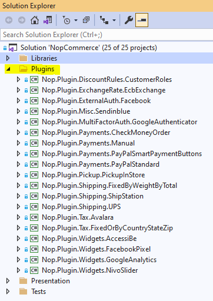
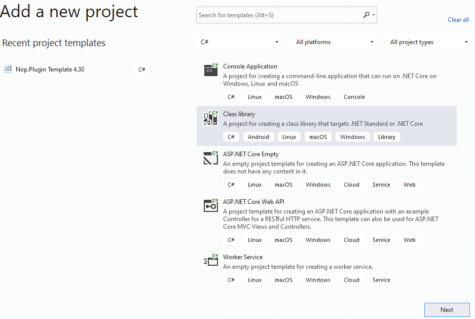
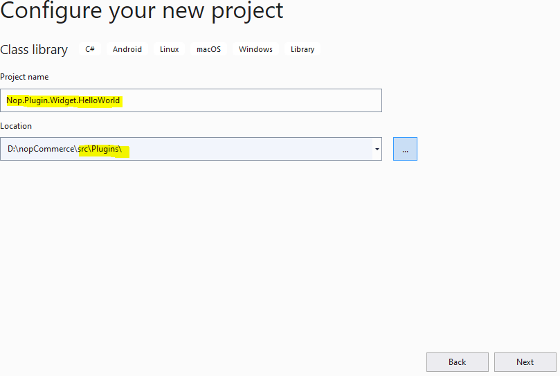
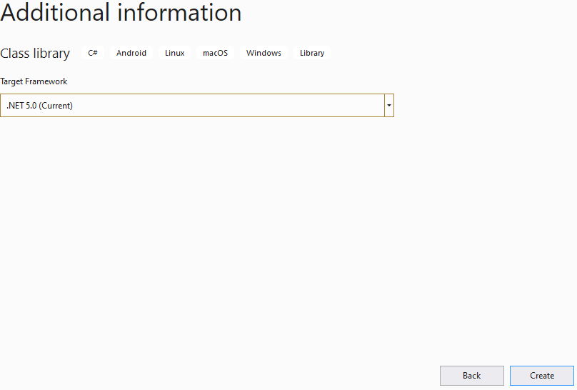
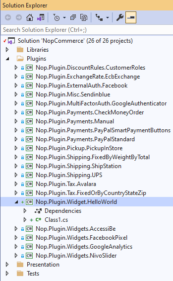
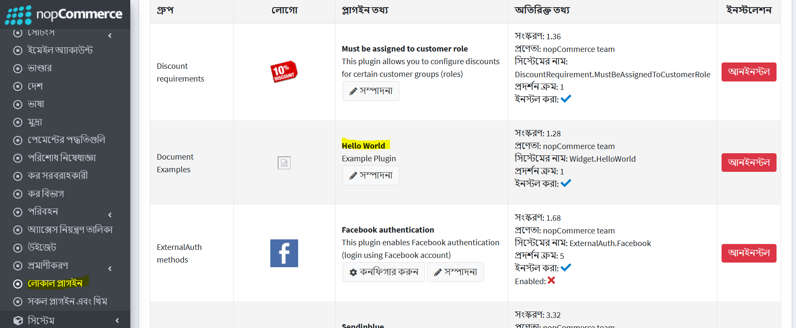
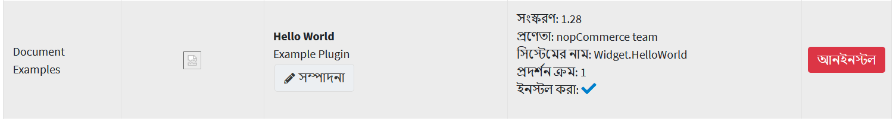
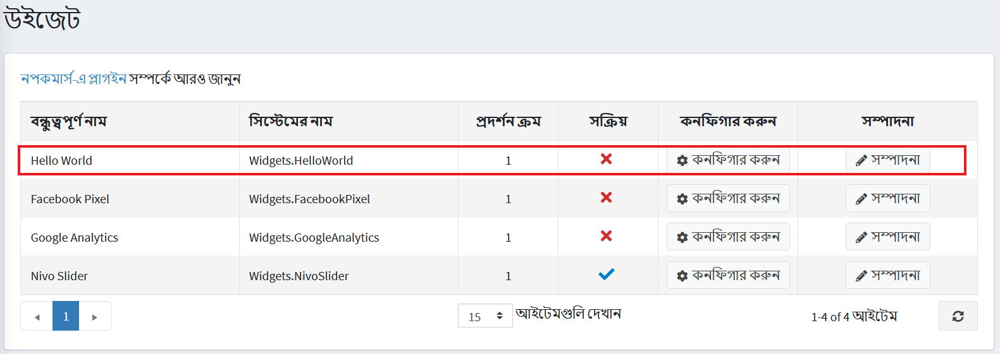
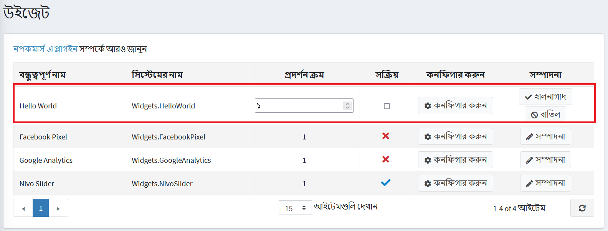
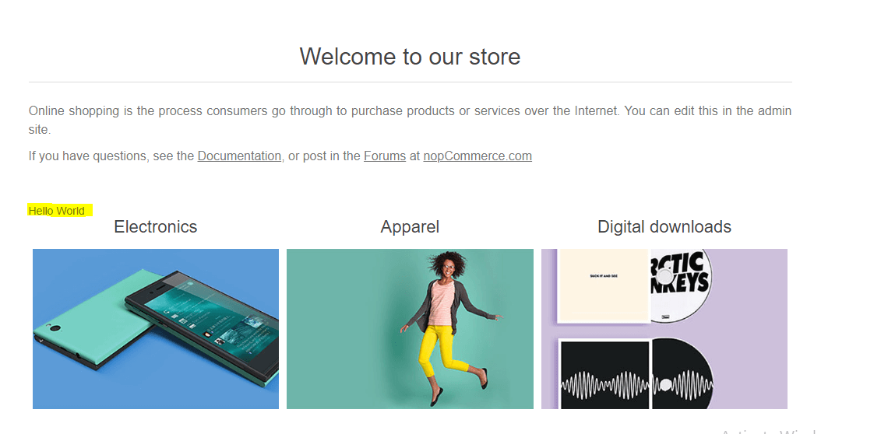

---
title: একটি প্লাগইন এর মাধ্যমে নপকমার্স এর মৌলিক কার্যকারিতা প্রসারিত করার জন্য একটি গাইড
uid: bn/developer/tutorials/guide-to-expanding-the-functionality-of-the-basic-functions-of-nop-commerce-through-a-plugin
author: nop.sea
contributors: git.AfiaKhanom, git.MDRashedKhanMenon
---

# একটি প্লাগইন এর মাধ্যমে নপকমার্স এর মৌলিক কার্যকারিতা প্রসারিত করার জন্য একটি গাইড

## ওভারভিউ

নপকমার্স অ্যাডমিন প্যানেলের কার্যকারিতা বাড়ানোর জন্য প্লাগইন সিস্টেম ব্যবহার করে এবং ওয়েবসাইটের কার্যকারিতা বাড়ানোর জন্য উইজেট সিস্টেম ব্যবহার করে। প্লাগইন এবং উইজেটগুলি স্বাধীন প্রোগ্রাম বা উপাদানগুলির একটি সেট যা কিছু নির্দিষ্ট কার্যকারিতা প্রসারিত করার জন্য একটি বিদ্যমান সিস্টেমে যোগ করা যেতে পারে এবং প্রক্রিয়া চলাকালীন মূল সিস্টেমকে প্রভাবিত না করে সিস্টেম থেকে সরানো যেতে পারে। সুতরাং প্লাগইন এবং উইজেটগুলির ধারণা ব্যবহার করে আমরা আমাদের সিস্টেমে আরও কার্যকারিতা যুক্ত করতে পারি এবং আমরা নপকমার্স সমাধানের মূল সোর্স কোড পরিবর্তন বা সম্পাদনা না করেই এটি তৈরি করতে পারি। যা আমাদের নপকমার্স সমাধানকে সর্বশেষ সংস্করণ বা পুরোনো সংস্করণে আপগ্রেড বা ডাউনগ্রেড করতে সক্ষম করে যেমনটি আমরা ইতোমধ্যেই তৈরি করা প্লাগইন এবং উইজেটগুলি পুনর্লিখন না করেই চাই।

## প্লাগইন এবং উইজেটের মধ্যে পার্থক্য

যেহেতু আমরা জানি প্লাগইন এবং উইজেট উভয়ই নপকমার্স সমাধানের কার্যকারিতা বাড়ানোর জন্য। ঠিক আছে তাহলে আপনি জিজ্ঞাসা করতে পারেন "তাদের মধ্যে পার্থক্য কি"। শেষ পর্যন্ত নপকমার্সে আপনি উইজেটকে প্লাগইন হিসেবে ভাবতে পারেন কিন্তু অতিরিক্ত বৈশিষ্ট্য সহ। উইজেট তৈরির জন্য প্রক্রিয়াটি বেশিরভাগই একটি প্লাগইন তৈরির মতো, কিন্তু উইজেট ব্যবহার করে আমরা কিছু ইউআই (ইউজার ইন্টারফেস) নপকমার্স পাবলিক ওয়েবসাইটকে নপকমার্স দ্বারা পূর্বনির্ধারিত কিছু নির্দিষ্ট এলাকায় দেখাতে পারি যা উইজেট-জোন নামে পরিচিত। যা আমরা শুধুমাত্র প্লাগইন এর মাধ্যমে অর্জন করতে পারি না। আপনি উইজেটকে প্লাগইন এর একটি সুপারসেট হিসেবে ভাবতে পারেন।

আমি মনে করি আপনি উইজেট এবং প্লাগইনগুলি কী, সেগুলি কখন ব্যবহার করা যায় এবং সেগুলি ব্যবহার করার সুবিধাগুলি সম্পর্কে আপনি আরও স্পষ্ট। সুতরাং, এখন চলুন এবং একটি সহজ উইজেট তৈরি করি যা পাবলিক সাইটে "Hello World" বার্তা দেখায়, যাতে নপকমার্সে একটি উইজেট তৈরি করা যায়।

## প্লাগইন প্রকল্প শুরু করুন

### ধাপ ১: একটি নতুন প্রকল্প তৈরি করুন

নপকমার্স অফিসিয়াল ওয়েবসাইটে যান এবং সর্বশেষ নপকমার্স সোর্স কোড ডাউনলোড করুন। যেহেতু এখনই সর্বশেষ সংস্করণ ৪.৪০, এই ডকুমেন্টেশন v৪.৪০ অনুযায়ী লেখা হয়েছে। আপনার নপকমার্স সমাধানটি আপনার প্রিয় IDE তে খুলুন (মাইক্রোসফট ভিজ্যুয়াল স্টুডিও সুপারিশ করা হয়েছে)। সেখানে আপনি একগুচ্ছ ফোল্ডার দেখতে পাবেন, যদি আপনি প্রকল্পের কাঠামো সম্পর্কে আরো জানতে চান, তাহলে প্রথমে নিবন্ধটি দেখুন ["সোর্স কোড সংগঠন"](xref:bn/developer/tutorials/source-code-organization) । সমাধানের ছাদে আপনি একটি *Plugins* ফোল্ডার দেখতে পাবেন, সেই ফোল্ডারটি প্রসারিত করুন এবং আপনি ডিফল্টরূপে নপকমার্স দিয়ে পাঠানো প্লাগইন প্রকল্পগুলির একটি তালিকা দেখতে পাবেন।



নতুন উইজেট প্রকল্প তৈরির জন্য, *Plugins* ফোল্ডারে ডান ক্লিক করুন: Add=>New Project। এর পরে যোগ করুন নতুন প্রকল্প উইন্ডো প্রদর্শিত হবে।



**Class Library** প্রকল্প টেমপ্লেট নির্বাচন করুন এবং পরবর্তী ধাপে যান, যেখানে আপনাকে প্রকল্পের নাম উল্লেখ করতে হবে।



নপকমার্স কিছু আদর্শ নামকরণ রূপান্তর অনুসরণ করে, যা আপনি নপকমার্স ডকুমেন্টেশন থেকে আরো তথ্য পেতে পারেন। নপকমার্স এর নামকরণ রূপান্তর অনুসরণ করে আমি আমার প্রকল্পের নাম হিসেবে `Nop.Plugin.Widget.HelloWorld` নির্বাচন করেছি। এবং অবস্থান */source/Plugins* ডিরেক্টরির ভিতরে থাকা উচিত। এখন "Next" ক্লিক করুন।



এটি প্লাগইন ডিরেক্টরিতে একটি নতুন প্রকল্প তৈরি করা উচিত। এবং আপনি আপনার সল্যুশনে দেখতে পারেন:



### ধাপ ২: উইজেট হিসেবে ব্যবহার করার জন্য আপনার নতুন প্রকল্প কনফিগার করুন

আমাদের প্রজেক্টে এটি একটি *Plugin*  বা *Widget* হিসাবে ব্যবহার করার জন্য আমাদের কয়েকটি জিনিস কনফিগার করতে হবে।

আপনি আপনার প্রজেক্ট তৈরির পর সফলভাবে তার `.csproj` ফাইলটি খুলুন, তার জন্য আপনার প্রজেক্টে ডান ক্লিক করুন এবং প্রসঙ্গ মেনু থেকে `{Your_Project_Name.csproj}` মেনুতে ক্লিক করুন এবং এর বিষয়বস্তু নিচের কোড দিয়ে প্রতিস্থাপন করুন।

```xml
<Project Sdk="Microsoft.NET.Sdk">
    <PropertyGroup>
        <TargetFramework>net5.0</TargetFramework>
        <Copyright>SOME_COPYRIGHT</Copyright>
        <Company>YOUR_COMPANY</Company>
        <Authors>SOME_AUTHORS</Authors>
        <PackageLicenseUrl>PACKAGE_LICENSE_URL</PackageLicenseUrl>
        <PackageProjectUrl>PACKAGE_PROJECT_URL</PackageProjectUrl>
        <RepositoryUrl>REPOSITORY_URL</RepositoryUrl>
        <RepositoryType>Git</RepositoryType>
        <OutputPath>..\..\Presentation\Nop.Web\Plugins\{PLUGIN_OUTPUT_DIRECTORY}</OutputPath>
        <OutDir>$(OutputPath)</OutDir>
        <!--Set this parameter to true to get the dlls copied from the NuGet cache to the output of your    project. You need to set this parameter to true if your plugin has a nuget package to ensure that   the dlls copied from the NuGet cache to the output of your project-->
        <CopyLocalLockFileAssemblies>false</CopyLocalLockFileAssemblies>
    </PropertyGroup>
    <ItemGroup>
        <ProjectReference Include="..\..\Presentation\Nop.Web.Framework\Nop.Web.Framework.csproj" />
        <ClearPluginAssemblies Include="$(MSBuildProjectDirectory)\..\..\Build\ClearPluginAssemblies.proj" />
    </ItemGroup>
    <!-- This target execute after "Build" target -->
    <Target Name="NopTarget" AfterTargets="Build">
        <!-- Delete unnecessary libraries from plugins path -->
        <MSBuild Projects="@(ClearPluginAssemblies)" Properties="PluginPath=$(MSBuildProjectDirectory)\ $(OutDir)" Targets="NopClear" />
    </Target>
</Project>
```

এখানে আপনার প্রকল্পের নাম দিয়ে `{Plugin_Output_Directory}` প্রতিস্থাপন করুন, আমার ক্ষেত্রে *Widget.HelloWorld*।

এটি কি করবে তা হল এই প্রকল্পের সাথে সম্পর্কিত সমস্ত dll ফাইলগুলিকে `Nop.Web/Plugin/{Plugin_Output_Directory}` এ কপি করে, কারণ `Nop.Web` এর ভিতরে *Plugin* ডিরেক্টরি হল সেই জায়গা যেখানে নপকমার্স প্লাগইন এবং উইজেট থেকে অনুসন্ধান করে। অ্যাডমিন প্যানেলে *Plugin* বা *Widget* তালিকায় প্রদর্শন করুন।

### ধাপ ৩: একটি plugin.json ফাইল তৈরি করুন

নপকমার্স এ তৈরি করা প্রতিটি *Plugin* বা *Widget* এর জন্য এই ফাইলটি প্রয়োজন। এই ফাইলটিতে আমাদের প্লাগইন সম্পর্কে মেটা তথ্য রয়েছে যা আমাদের প্লাগইন বর্ণনা করে। এতে আমাদের প্লাগইন এর নাম, নপকমার্স এর কোন সংস্করণটি টার্গেট/বিল্ট করা হয়েছে, আমাদের প্লাগইন সম্পর্কে কিছু বর্ণনা, আমাদের প্লাগইন এর সংস্করণ ইত্যাদি তথ্য রয়েছে। তথ্যের জন্য অনুগ্রহ করে নিবন্ধটি দেখুন [plugin.json ফাইল](xref:bn/developer/plugins/plugin_json)।

### ধাপ ৪: BasePlugin ক্লাস থেকে প্রসারিত একটি ক্লাস তৈরি করুন

প্রকৃতপক্ষে আমাদের এমন একটি ক্লাস থাকা দরকার যা `IPlugin` ইন্টারফেসের অন্তর্নিহিত যাতে নপকমার্স আমাদের প্রজেক্টকে প্লাগইন হিসেবে বিবেচনা করে। কিন্তু নপকমার্স এর ইতিমধ্যেই একটি ক্লাস `BasePlugin` রয়েছে যা `IPlugin` ইন্টারফেস থেকে উত্তরাধিকারসূত্রে প্রাপ্ত এবং সেই ইন্টারফেস থেকে সমস্ত মেথড প্রয়োগ করে। সুতরাং, `IPlugin` ইন্টারফেস থেকে উত্তরাধিকারী হওয়ার পরিবর্তে আমরা `BasePlugin` ক্লাস থেকে প্রসারিত করতে পারি। আমাদের প্লাগইন/উইজেট ইনস্টলেশন এবং আনইনস্টলেশন প্রক্রিয়া চলাকালীন যদি আমাদের কিছু যুক্তি থাকে তবে আমরা BasePlugin ক্লাস থেকে আমাদের ক্লাসে `InstallAsync` এবং `UninstallAsync` মেথডটি ওভাররাইড করতে পারি। পরিশেষে ক্লাস এই মত হওয়া উচিত

```cs
public class HelloWorldPlugin: BasePlugin
{
    public override async Task InstallAsync()
    {
        //Logic during installation goes here...

        await base.InstallAsync();
    }

    public override async Task UninstallAsync()
    {
        //Logic during uninstallation goes here...

         await base.UninstallAsync();
    }
}
```

এখন আপনার প্রকল্প তৈরি করুন এবং চালান। অ্যাডমিন প্যানেলে নেভিগেট করুন এবং **Configuration** এর অধীনে একটি **Local plugins** মেনু সেই মেনুতে ক্লিক করুন। এখানে আপনি তালিকাভুক্ত সমস্ত প্লাগইন দেখতে পাবেন যা `Nop.Web/Plugins` ডিরেক্টরিতে উপস্থিত রয়েছে। সেখানে আপনি আপনার নতুন তৈরি প্লাগইন দেখতে পাবেন। যদি আপনি না দেখতে পান তবে **Reload list of plugins** বাটনে ক্লিক করুন, এর পরে এটি আপনার অ্যাপ্লিকেশন পুনরায় চালু করবে এবং উপলব্ধ সমস্ত প্লাগইন তালিকাভুক্ত করবে। এখন আপনি সেই তালিকায় তালিকাভুক্ত আপনার প্লাগইন দেখতে পাবেন। আপনার প্লাগইন সারিতে উপস্থিত সবুজ **Install** বাটনে ক্লিক করুন।



এখন আপনি ইনস্টল বোতামে ক্লিক করার পরে, **Restart your application to apply changes** বোতামে ক্লিক করুন। এটি আপনার অ্যাপ্লিকেশন পুনরায় চালু করবে এবং আপনার প্লাগইন ইনস্টল করবে। ইনস্টলেশন সম্পন্ন হওয়ার পর আপনি একটি *Configure* এবং *Edit* বাটন এবং একটি *Uninstall* বাটন দেখতে পাবেন।

 এখন আপনার প্লাগইন ইন্সটল হয়ে গেছে। কিন্তু *Configure* বাটন কাজ করবে না, যেহেতু আমাদের প্লাগিনে কোন কনফিগার পেজ নেই।

## আমাদের পাবলিক সাইটে কিছু ইউআই দেখানোর জন্য একটি উইজেট তৈরি করুন

পূর্বে উল্লিখিত হিসাবে, *Widget* প্লাগইন হিসাবে একই কিন্তু অতিরিক্ত বৈশিষ্ট্য সহ। তাই আমরা এই একই প্লাগইন প্রকল্পটি উইজেটে রূপান্তর করতে এবং আমাদের পাবলিক সাইটে কিছু ইউআই রেন্ডার করতে ব্যবহার করতে পারি। তাহলে দেখা যাক কিভাবে আমরা একটি উইজেট তৈরি করতে এই প্লাগইনটি প্রসারিত করতে পারি।

প্রথমে আমাদের একটি `ViewComponent` তৈরি করতে হবে। প্রকল্পের মূলে একটি ডিরেক্টরি *Components* তৈরি করুন এবং একটি **`ViewComponent`** শ্রেণী তৈরি করুন। আমাদের এই ক্লাস থেকে `NopViewComponent` বেস ক্লাস থেকে প্রসারিত করতে হবে।

```cs
[ViewComponent(Name = "HelloWorldWidget")]
public class ExampleWidgetViewComponent: NopViewComponent
{
    public IViewComponentResult Invoke(string widgetZone)
    {
        return Content("Hello World");
    }
}
```

এখন সেই ক্লাস ওয়ানে যান যা আমাদের আগে তৈরি করা `BasePlugin` থেকে এবং `IWidgetPlugin` ইন্টারফেস থেকে অন্তর্নিহিত। এই ইন্টারফেসের দুটি ফাংশন ডিক্লারেশন `GetWidgetZones` এবং `GetWidgetViewComponentName` আছে যা আমাদের ক্লাসে বাস্তবায়ন করতে হবে।

```cs
public class HelloWorldPlugin: BasePlugin, IWidgetPlugin
{
    /// <summary>
    /// Gets a value indicating whether to hide this plugin on the widget list page in the admin area
    /// </summary>
    public bool HideInWidgetList => false;

    /// <summary>
    /// Gets a name of a view component for displaying widget
    /// </summary>
    /// <param name="widgetZone">Name of the widget zone</param>
    /// <returns>View component name</returns>
    public string GetWidgetViewComponentName(string widgetZone)
    {
        return "HelloWorldWidget";
    }
    
    /// <summary>
    /// Gets widget zones where this widget should be rendered
    /// </summary>
    /// <returns>
    /// A task that represents the asynchronous operation
    /// The task result contains the widget zones
    /// </returns>
    public Task<IList<string>> GetWidgetZonesAsync()
    {
        return Task.FromResult<IList<string>>(new List<string> { "home_page_before_categories" });        
    }

    public override async Task InstallAsync()
    {
        //Logic during installation goes here...

        await base.InstallAsync();
    }

    public override async Task UninstallAsync()
    {
        //Logic during uninstallation goes here...

         await base.UninstallAsync();
    }
}
```

যদি আপনি আপনার প্রকল্পটি তৈরি করেন এবং অ্যাডমিন প্যানেলে যান এবং **Configuration -> Widgets** এ যান। আপনি আপনার উইজেট তালিকাভুক্ত দেখতে পাবেন।



এখানে আপনি লক্ষ্য করতে পারেন যে এই উইজেটটিতে *Configure* বাটন নেই। কারণ আমরা এই উইজেটের জন্য একটি কনফিগারেশন ভিউ ফাইল তৈরি করিনি এবং `BasePlugin` ক্লাস থেকে `GetConfigurationPageUrl` মেথডটি ওভাররাইড করিনি। যেহেতু আমরা ইতিমধ্যেই আমাদের প্লাগইন ইন্সটল করে ফেলেছি তাই আমাদের আবার ইন্সটল করতে হবে না, কিন্তু এখানে আপনি দেখতে পাচ্ছেন যে উইজেটটি এখন সক্রিয় নয়। আমরা *Edit* বাটনে ক্লিক করে এটি সক্রিয় করতে পারি।



এখন আমরা উইজেট সক্রিয় করার পর এখন আমাদের উইজেটটি প্রত্যাশা অনুযায়ী কাজ করা উচিত। যদি আমরা ক্যাটাগরির আগে আমাদের হোম পেজে যাই তাহলে আমাদের অবশ্যই "Hello World" বার্তা দেখতে হবে যেমন হলুদে হাইলাইট করা ছবিতে দেখানো হয়েছে।


