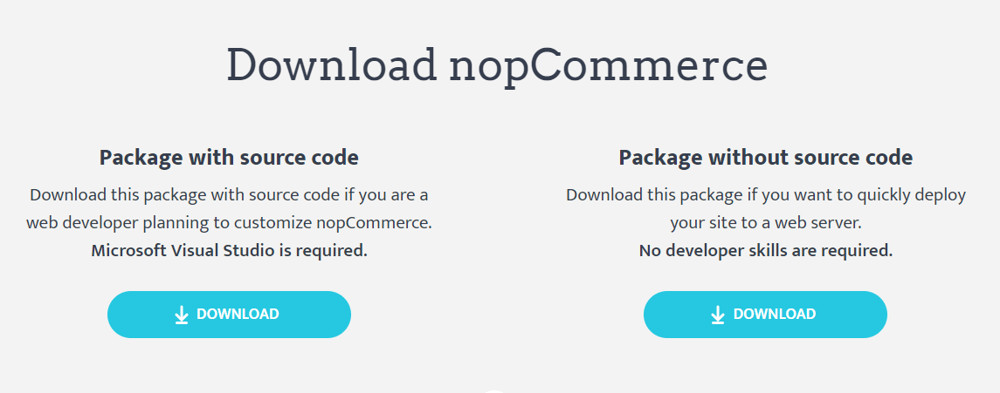
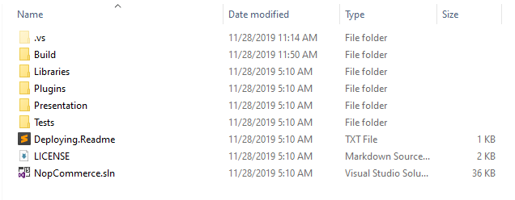
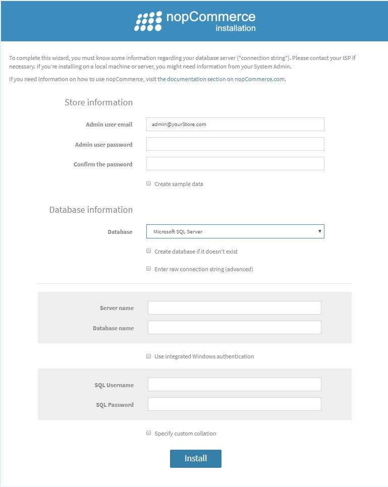

# নপকমার্সে কীভাবে ডেভেলপিং শুরু করবেন তার নির্দেশনা

নপকমার্স হল ওপেন সোর্স মাইক্রোসফট ASP.NET ভিত্তিক ইকমার্স সমাধান। এটি ডেভেলপারদের জন্য একটি মৌলিক নির্দেশিকা যে কিভাবে নপকমার্সে ডেভেলপিং শুরু করা যায়।

## ১. ডেভেলপমেন্টের জন্য প্রয়োজনীয় সরঞ্জাম

আপনি প্রযুক্তি এবং সিস্টেমের প্রয়োজনীয়তা সম্পর্কে জানতে পারেন **"[ডেভেলপমেন্টের জন্য প্রয়োজনীয় সরঞ্জাম](xref:bn/developer/tutorials/system-requirements-for-developing#2-tools-required-for-development)"** নিবন্ধ ।

## ২. নপকমার্সে ব্যবহৃত প্রযুক্তির স্ট্যাক

নপকমার্সের সবচেয়ে ভালো দিক হল এর সোর্স কোড সম্পূর্ণরূপে কাস্টমাইজ করা যায় এবং এর প্লাগযোগ্য আর্কিটেকচার প্লাগইন সিস্টেম ব্যবহার করে কাস্টম কার্যকারিতা বিকাশ এবং ব্যবসায়িক প্রয়োজনীয়তা অনুসরণ করা সহজ করে তোলে। এটি সুপরিচিত সফটওয়্যার স্থাপত্য, নিদর্শন এবং সর্বোত্তম নিরাপত্তা অনুশীলন অনুসরণ করে। এবং সর্বোপরি এটি সর্বশেষ প্রযুক্তি ব্যবহার করে শেষ ব্যবহারকারীদের সর্বোত্তম অভিজ্ঞতা প্রদান করে। সুতরাং, এই সমস্ত অর্জনের জন্য নপকমার্স তার স্থাপত্যে প্রযুক্তির একটি স্ট্যাক ব্যবহার করে।

* Application Layer
  * Razor View Engine

    এটি ক্লায়েন্ট সাইডে এইচটিএমএল পৃষ্ঠা রেন্ডার করা। রেজার ভিউ ইঞ্জিন হল একটি মার্কআপ সিনট্যাক্স যা আমাদের C# বা VB.NET ব্যবহার করে ওয়েব পেজে HTML এবং সার্ভার-সাইড কোড লিখতে সাহায্য করে।
  * JQuery

    এটি একটি জাভাস্ক্রিপ্ট লাইব্রেরি যা HTML পৃষ্ঠার UI এবং UX কার্যকারিতা প্রসারিত করতে ব্যবহৃত হয়।
  * Kendo UI

    Kendo UI হল ইন্টারেক্টিভ এবং উচ্চ-কর্মক্ষম ওয়েবসাইট এবং অ্যাপ্লিকেশন তৈরির জন্য একটি বিস্তৃত HTML5 ইউজার ইন্টারফেস ফ্রেমওয়ার্ক

* Business Layer
  * Fluent Validation

    এটি .NET এর জন্য একটি বৈধতা লাইব্রেরি যা বৈধতা বিধি তৈরির জন্য একটি সাবলীল ইন্টারফেস এবং ল্যাম্বদা এক্সপ্রেশন ব্যবহার করে।
  * AutoMapper

    অটোম্যাপার একটি সাধারণ লাইব্রেরি যা আমাদের একটি বস্তুর ধরনকে অন্য বস্তুর রূপান্তর করতে সহায়তা করে। এটি একটি কনভেনশন-ভিত্তিক অবজেক্ট-টু-অবজেক্ট ম্যাপার যার জন্য খুব কম কনফিগারেশন প্রয়োজন।
  * ASP.NET Core internal dependency injection

    ASP IOC ক্লাসগুলির মধ্যে ডিপেন্ডেন্সি পরিচালনা করে যাতে অ্যাপ্লিকেশনগুলি আকার এবং জটিলতার সাথে পরিবর্তিত হওয়া সহজ হয়।
  * Linq2DB

    Linq2DB .NET অ্যাপ্লিকেশনের জন্য একটি ওপেন সোর্স ORM ফ্রেমওয়ার্ক। এটি একটি .NET ফাউন্ডেশন প্রকল্প। এটি ডেভেলপারদের ডোমেইন নির্দিষ্ট ক্লাসের অবজেক্ট ব্যবহার করে ডেটা নিয়ে কাজ করতে সক্ষম করে অন্তর্নিহিত ডাটাবেস টেবিল এবং কলামগুলিতে যেখানে এই ডেটা সংরক্ষিত আছে। সুতরাং, এটি বিজনেস লেয়ার এবং ডেটা লেয়ারের মধ্যে সেতুবন্ধন।
  * FluentMigr
    Fluent Migrator হল .NET- এর জন্য একটি মাইগ্রেশন ফ্রেমওয়ার্ক। মাইগ্রেশনগুলি আপনার ডাটাবেস স্কিমা পরিবর্তন করার একটি কাঠামোগত উপায় এবং প্রচুর এসকিউএল স্ক্রিপ্ট তৈরির বিকল্প যা প্রতিটি ডেভেলপারকে ম্যানুয়ালি চালাতে হবে। মাইগ্রেশন একাধিক ডেটাবেসের জন্য একটি ডাটাবেস স্কিমা বিকশিত করার সমস্যার সমাধান করে (উদাহরণস্বরূপ, বিকাশকারীর স্থানীয় ডাটাবেস, পরীক্ষার ডাটাবেস এবং উৎপাদন ডাটাবেস)। ডাটাবেস স্কিমা পরিবর্তনগুলি C# এ লেখা ক্লাসগুলিতে বর্ণিত হয়েছে যা একটি সংস্করণ নিয়ন্ত্রণ ব্যবস্থায় চেক করা যায়।
* Data Layer
  * Microsoft SQL Server

    SQL Server হল মাইক্রোসফটের পূর্ণ বৈশিষ্ট্যযুক্ত রিলেশনাল ডাটাবেজ ম্যানেজমেন্ট সিস্টেম (RDBMS)।
  * MySQL Server

    MySQL বিশ্বের সবচেয়ে জনপ্রিয় ওপেন সোর্স ডাটাবেস। তার প্রমাণিত কর্মক্ষমতা, নির্ভরযোগ্যতা এবং সহজেই ব্যবহারযোগ্য, MySQL ওয়েব-ভিত্তিক অ্যাপ্লিকেশনগুলির জন্য ডাটাবেসের শীর্ষস্থানীয় পছন্দ হয়ে উঠেছে।
  * PostgreSQL

    PostgreSQL একটি শক্তিশালী, ওপেন সোর্স অবজেক্ট-রিলেশনাল ডাটাবেস সিস্টেম যা 30 বছরেরও বেশি সক্রিয় বিকাশের সাথে এটি নির্ভরযোগ্যতা, বৈশিষ্ট্য দৃড়তা এবং কর্মক্ষমতার জন্য একটি শক্তিশালী খ্যাতি অর্জন করেছে।
  * Redis (cache)

    Redis একটি ওপেন সোর্স (BSD লাইসেন্সপ্রাপ্ত), ইন-মেমরি ডেটা স্ট্রাকচার স্টোর, একটি ডাটাবেস, ক্যাশে এবং বার্তা দালাল হিসাবে ব্যবহৃত হয়। সুতরাং, নপকমার্স তে Redis পুরানো ডেটা ইন-মেমরি ক্যাশে ডেটাসেট হিসাবে সংরক্ষণ করতে ব্যবহৃত হয়। যা অ্যাপ্লিকেশনের গতি এবং কর্মক্ষমতা বৃদ্ধি করে।
  * Microsoft Azure(Optional)

    Azure হল একটি পাবলিক ক্লাউড কম্পিউটিং প্ল্যাটফর্ম যার মধ্যে রয়েছে অবকাঠামো যেমন একটি পরিষেবা (IaaS), একটি পরিষেবা হিসাবে প্ল্যাটফর্ম (PaaS), এবং একটি পরিষেবা হিসাবে সফটওয়্যার (SaaS) যা বিশ্লেষণ, ভার্চুয়াল কম্পিউটিং, স্টোরেজ, নেটওয়ার্কিং এর মতো পরিষেবার জন্য ব্যবহার করা যেতে পারে। , এবং আরো অনেক কিছু।

## ৩. কিভাবে প্রকল্পটি ডাউনলোড করে স্থানীয় মেশিনে চালানো যায়

আমরা নপকমার্স এর সাথে কাজ শুরু করার আগে আমাদের নিশ্চিত করতে হবে যে আমাদের স্থানীয় মেশিনটি কনফিগার করা আছে এবং নপকমার্সে বিকাশের জন্য আমাদের প্রয়োজনীয় সমস্ত সরঞ্জাম সঠিকভাবে ইনস্টল এবং সঠিকভাবে কাজ করছে তা নিশ্চিত করতে হবে। এখন, কীভাবে আমাদের স্থানীয় মেশিনে নপকমার্স ডাউনলোড এবং চালানো যায় সে সম্পর্কে ধাপে ধাপে নির্দেশাবলী দেওয়া যাক।

### ধাপ ১: নপকমার্স সোর্স কোড ডাউনলোড করুন

ডাউনলোড করতে দয়া করে [www.nopcommerce.com](https://www.nopcommerce.com/download-nopcommerce) দেখুন। সেখানে আপনি দুটি ডাউনলোড বাটন দেখতে পারেন একটি সোর্স কোড সহ এবং অন্যটি সোর্স কোড ছাড়া নিচের ছবিতে দেখানো হয়েছে।

যেহেতু আমরা ডেভেলপমেন্টের উদ্দেশ্যে নপকমার্স ডাউনলোড করছি তাই আমাদেরকে "Package with source code" ডাউনলোড করতে হবে যাতে নপকমার্সের সকল সোর্স কোড রয়েছে। নপকমার্স ডাউনলোড করার জন্য আপনাকে লগ ইন করতে হবে অথবা একটি নতুন অ্যাকাউন্ট নিবন্ধন করতে হবে। এখন আপনি একটি RAR ফাইল হিসাবে নপকমার্স ডাউনলোড করতে পারেন, এবং এটি আপনার পছন্দসই ফোল্ডারের অবস্থানে নিষ্কাশন করতে পারেন।

### ধাপ ২: Microsoft Visual Studio তে নপকমার্স সল্যুশন খুলুন

ফোল্ডারটি খুলুন। সেই ফোল্ডারের ভিতরে আপনি একগুচ্ছ ফাইল এবং ফোল্ডার দেখতে পাবেন যার মধ্যে নপকমার্স এর সকল সোর্স কোড রয়েছে।

সেখানে আপনি `.sln` এর এক্সটেনশন সহ একটি সমাধান ফাইলও দেখতে পাবেন, অনুগ্রহ করে আপনার Microsoft Visual Studio তে নপকমার্স প্রকল্পটি খুলতে সেই সল্যুশন ফাইলে ডাবল ক্লিক করুন।

### ধাপ 3: Microsoft Visual Studio ব্যবহার করে নপকমার্স প্রকল্প চালানো

প্রকল্প চালানোর জন্য নপকমার্সের জন্য আপনার আর কোন কনফিগারেশন থাকার প্রয়োজন নেই। নপকমার্স বক্সের বাইরে চলে যাওয়ার জন্য প্রস্তুত। সুতরাং, এখন আপনি ডিবাগিং মোডে প্রকল্প চালানোর জন্য ctrl+F5 বা শুধু F5 চাপিয়ে Microsoft Visual Studio ব্যবহার করে প্রকল্প চালাতে পারেন, অথবা আপনি Microsoft Visual Studio তে প্লে আইকন সহ ফিজিক্যাল বোতাম ব্যবহার করে চালাতে পারেন। আপনি প্রথমবার প্রকল্পটি চালানোর পরে আপনি নীচের মত একটি ইনস্টলেশন পৃষ্ঠা দেখতে পাবেন:

আপনার ইনস্টলেশন সম্পন্ন করার জন্য এখানে আপনাকে সমস্ত প্রয়োজনীয় তথ্য পূরণ করতে হবে।

#### দোকান তথ্য

এখানে আপনাকে একটি ইমেল ঠিকানা এবং পাসওয়ার্ড প্রদান করতে হবে যা আপনার নপকমার্স দোকানে আপনার প্রশাসক অ্যাকাউন্ট হিসাবে ব্যবহার করা হবে।

#### ডাটাবেস তথ্য

এখানে আপনি আপনার তথ্য প্রদান করতে চান যা আপনি এই প্রকল্পের জন্য ব্যবহার করতে চান।

এখানে আপনাকে আপনার ডাটাবেস স্টোরেজ নির্বাচন করতে হবে। আপনি MS SQL সার্ভার বা MySQL বা PostgreSQL ব্যবহার করতে পারেন। আপনি কোনটি ব্যবহার করতে চান তা আপনার সিদ্ধান্ত।

এই টিউটোরিয়ালের জন্য আমরা MS SQL সার্ভার ব্যবহার করব।

এছাড়াও আপনি চেকবক্স দেখতে পাবেন যদি আপনি না থাকলে ডাটাবেস তৈরি করতে চান কিনা, দয়া করে চেকবক্সটি চেক করুন।

আরও এগিয়ে গেলে আপনার সংযোগ স্ট্রিং সেট আপ করতে হবে। এর জন্য, আপনার কাছে দুটি বিকল্প রয়েছে। একটি হল "SQL Server name" এবং "Database name" দিয়ে ফর্ম পূরণ করা। এসকিউএল সার্ভারের নামে আপনাকে আপনার এসকিউএল সার্ভারের নাম প্রদান করতে হবে এবং ডাটাবেস নামে আপনাকে একটি ডাটাবেস নাম প্রদান করতে হবে যা আপনি তৈরি করতে চান অথবা যদি আপনার ইতিমধ্যে একটি থাকে তবে এটি তৈরি করবে না কিন্তু বিদ্যমান নামটি ব্যবহার করবে। যাইহোক, আপনি "Enter raw connection string" বিকল্পটিও চয়ন করতে পারেন তারপর আপনাকে নিজের দ্বারা সম্পূর্ণ সংযোগ স্ট্রিং লিখতে হবে। তারপরে আপনাকে প্রমাণীকরণের জন্য আপনার এসকিউএল সার্ভারের শংসাপত্র সরবরাহ করতে হবে।

আপনি এই সমস্ত তথ্য পূরণ করার পরে আপনাকে "install" বোতাম টিপতে হবে, ইনস্টলেশন সম্পন্ন করতে প্রায় 1 মিনিট সময় লাগবে, তারপরে আপনাকে অনলাইন শপ হোমপেজে পুননির্দেশিত করা হবে।

### ৪. HTTPS- এ চালানোর জন্য কিভাবে নপকমার্স কনফিগার করবেন

আপনার নপকমার্সের জন্য SSL/HTTPS সেট করার জন্য আপনাকে উপস্থাপনা ফোল্ডারের অধীনে `Nop.Web` প্রকল্পের সম্পত্তি উইন্ডোতে যেতে হবে কারণ এটি নপকমার্সের প্রারম্ভিক প্রকল্প। প্রপার্টি উইন্ডো খুলতে `Nop.Web` প্রকল্পে ডান ক্লিক করুন এবং প্রসঙ্গ মেনুর নীচে আপনি "Properties" নামে একটি মেনু দেখতে পাবেন, শুধু সেই মেনুতে ক্লিক করুন তারপর একটি প্রপার্টি উইন্ডো আসবে। প্রপার্টি উইন্ডোতে "Debug" ট্যাবে নেভিগেট করুন।

"Enable SSL" চেক করুন এবং এর পাশাপাশি HTTPS URL লিখুন। তারপর এই প্রকল্প সংরক্ষণ করুন।

এখন আপনার প্রকল্পটি আবার চালান এবং প্রদত্ত URL এ নেভিগেট করুন এবং আপনি দেখতে পাচ্ছেন যে এটি এখন SSL/HTTPS এ চলছে। সুতরাং আপনার ওয়েবপ্রজেক্টে HTTPS কনফিগার করার এটি একটি উপায় কিন্তু SSL কনফিগার করার আরেকটি উপায় রয়েছে। এর জন্য আপনার `Nop.Web` প্রজেক্টে যান এবং সেখানে প্রজেক্টটি প্রসারিত করুন আপনি আপনার প্রোজেক্ট স্ট্রাকচারে "Properties" নামে একটি ভার্চুয়াল ফাইল দেখতে পাবেন "Dependencies" এর ঠিক নীচে। সেখানে প্রোপার্টিজের ভিতরে আপনি একটি JSON ফাইল পাবেন যার নাম launchSetting.json। সেই ফাইলটি খুলুন এবং আপনি সেই ফাইলে ইতিমধ্যে লিখিত কনফিগারেশন সেটিংয়ের গুচ্ছ দেখতে পাবেন।

উপরের ফাইলে দেখানো সেই ফাইলটির ভিতরে আপনার একটি বিভাগ থাকতে পারে। সুতরাং SSL সক্ষম করার জন্য আপনাকে SSL সংযোগের জন্য যে বন্দরটি চালাতে চান সেখানে "sslPort" সম্পত্তির অধীনে 0 প্রতিস্থাপন করতে হবে, নিশ্চিত করুন যে পোর্টটি উপলব্ধ। পরীক্ষা করার জন্য, আপনার প্রকল্পটি চালান এবং `https://localhost:{yourPort}` এ নেভিগেট করুন।
