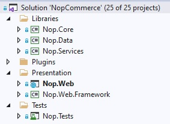

# সোর্স কোড সংগঠন

এই ডকুমেন্টটি ডেভেলপারদের জন্য নপকমার্সের সমাধান কাঠামোর একটি গাইড। এটি একটি নতুন নপকমার্স বিকাশকারীর জন্য একটি নথি যা নপকমার্স কোড বেস সম্পর্কে শেখা শুরু করে। প্রথমত, নপকমার্স সোর্স কোড পাওয়া বেশ সহজ। এটি একটি ওপেন সোর্স অ্যাপ্লিকেশন, তাই কোড পেতে আপনাকে যা করতে হবে তা কেবল ওয়েব সাইট থেকে ডাউনলোড করতে হবে। প্রকল্প এবং ফোল্ডারগুলি ভিজ্যুয়াল স্টুডিওতে প্রদর্শিত ক্রমে তালিকাভুক্ত করা হয়। আমরা সুপারিশ করি যে আপনি ভিজ্যুয়াল স্টুডিওতে নপকমার্স সমাধানটি খুলুন এবং এই নথিটি পড়ার সময় প্রকল্প এবং ফাইলগুলির মাধ্যমে ব্রাউজ করুন।

বেশিরভাগ প্রকল্প, ডিরেক্টরি এবং ফাইলের নামকরণ করা হয়েছে যাতে আপনি তাদের উদ্দেশ্য সম্পর্কে মোটামুটি ধারণা পেতে পারেন। উদাহরণস্বরূপ, আমি Nop.Plugin.Payments.PayPalStandard নামক প্রকল্পের ভিতরে দেখতে চাই না যে এটি কি করে তা অনুমান করতে।

## `\Libraries\Nop.Core`

Nop.Core প্রজেক্টে নপকমার্সের জন্য মূল ক্লাসের একটি সেট রয়েছে, যেমন ক্যাশিং, ইভেন্ট, হেলপার এবং ব্যবসায়িক বস্তু (উদাহরণস্বরূপ, অর্ডার এবং গ্রাহক এন্টিটি)।

## `\Libraries\Nop.Data`

Nop.Data প্রকল্পে একটি ডাটাবেস বা অন্যান্য ডেটা স্টোর থেকে পড়া এবং লেখার জন্য ক্লাস এবং ফাংশনগুলির একটি সেট রয়েছে। Nop.Data লাইব্রেরি আপনার ব্যবসায়িক বস্তু থেকে ডেটা-অ্যাক্সেস লজিক আলাদা করতে সাহায্য করে। নপকমার্স Linq2DB কোড-ফার্স্ট পদ্ধতি ব্যবহার করে। কোড-ফার্স্ট একজন ডেভেলপারকে সোর্স কোডে এন্টিটি সংজ্ঞায়িত করার অনুমতি দেয় (সমস্ত মূল এন্টিটি Nop.Core প্রকল্পে সংজ্ঞায়িত করা হয়), এবং তারপর C# ক্লাস থেকে ডাটাবেস তৈরি করতে Linq2DB এবং FluentMigrator ব্যবহার করুন। এজন্য একে কোড-ফার্স্ট বলা হয়। তারপরে আপনি LINQ ব্যবহার করে আপনার অবজেক্টগুলি কুয়েরি করতে পারেন, যা পর্দার পিছনে এসকিউএলে অনুবাদ করে এবং ডাটাবেসের বিরুদ্ধে কার্যকর করা হয়। দৃড়তা ম্যাপিং সম্পূর্ণরূপে কাস্টমাইজ করতে নপকমার্স [ফ্লুয়েন্ট এপিআই](https://fluentmigrator.github.io/articles/technical/fluent-api-create.html) ব্যবহার করে।

## `\Libraries\Nop.Services`

এই প্রকল্পে মূল পরিষেবাগুলির একটি সেট রয়েছে, ব্যবসায়িক যুক্তি, বৈধতা বা ডেটা সম্পর্কিত গণনা, যদি প্রয়োজন হয়। কিছু লোক এটাকে বিজনেস অ্যাক্সেস লেয়ার (BAL) বলে।

## Projects into `\Plugins\` solution folder

`\Plugins` হল একটি ভিজ্যুয়াল স্টুডিও সমাধান ফোল্ডার যেখানে প্লাগইন প্রকল্প রয়েছে। শারীরিকভাবে এটি আপনার সমাধানের মূলে অবস্থিত। কিন্তু প্লাগইন DLL গুলি স্বয়ংক্রিয়ভাবে `\Presentation\Nop.Web\Plugins` ডিরেক্টরিতে অনুলিপি করা হয় যা ইতিমধ্যেই মোতায়েন করা প্লাগ -ইনগুলির জন্য ব্যবহৃত হয় কারণ সব প্লাগইনগুলির বিল্ড আউটপুট পাথগুলি `..\..\Presentation\Nop.Web\Plugins\{Group}.{Name}`। এটি প্লাগইনগুলিকে কিছু বাহ্যিক ফাইল ধারণ করতে দেয়, যেমন স্ট্যাটিক সামগ্রী (সিএসএস বা জেএস ফাইল) প্রকল্পের মধ্যে ফাইলগুলি অনুলিপি না করে প্রকল্পটি চালাতে সক্ষম হবে।

## `\Presentation\Nop.Web`

`Nop.Web` একটি MVC ওয়েব অ্যাপ্লিকেশন প্রজেক্ট, পাবলিক স্টোরের একটি উপস্থাপনা স্তর যার মধ্যে প্রশাসনিক প্যানেলও রয়েছে একটি এলাকা হিসেবে অন্তর্ভুক্ত। আপনি যদি আগে `ASP.NET` ব্যবহার না করে থাকেন, অনুগ্রহ করে [এখানে](http://www.asp.net/) আরও তথ্য খুঁজুন। এটি এমন একটি অ্যাপ্লিকেশন যা আপনি আসলে চালান। এটি অ্যাপ্লিকেশনটির স্টার্টআপ প্রকল্প।

## `\Presentation\Nop.Web.Framework`

Nop.Web.Framework একটি ক্লাস লাইব্রেরি প্রকল্প যা 'Nop.Web' প্রকল্পের জন্য কিছু সাধারণ উপস্থাপনা বিষয় ধারণ করে।

## `\Test\Nop.Tests`

Nop.Tests হল একটি ক্লাস লাইব্রেরি প্রজেক্ট যা কিছু টেস্ট ক্লাস এবং অন্যান্য টেস্ট প্রজেক্টের জন্য হেল্পার থাকে। এর কোন পরীক্ষা নেই। নিম্নলিখিত নিবন্ধে nopCommerce এ UNIT পরীক্ষার বিষয়ে আরও পড়ুন: [ইউনিট টেস্টিং](xref:bn/developer/tutorials/unit-tests).

### `\Nop.Core.Tests`

Nop.Core.Tests হল Nop.Core প্রকল্পের পরীক্ষা প্রকল্প।

### `\Nop.Services.Tests`

Nop.Services.Tests হল Nop.Services প্রকল্পের পরীক্ষা প্রকল্প।

### `\Nop.Web.MVC.Tests`

Nop.Web.MVC.Tests উপস্থাপনা স্তর প্রকল্পগুলির জন্য পরীক্ষা প্রকল্প।

## টিউটোরিয়াল

- [নপকমার্স ইকমার্স প্ল্যাটফর্মের পিছনে আর্কিটেকচার](https://www.youtube.com/watch?v=6gLbizzSA9o&list=PLnL_aDfmRHwtJmzeA7SxrpH3-XDY2ue0a)
