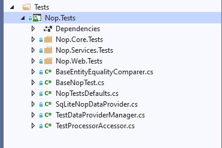
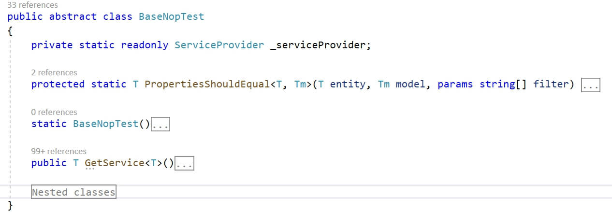

# ইউনিট টেস্ট

আমি মনে করি সবাই ইউনিট টেস্ট এর ধারণা সম্পর্কে জানে। আমরা জানি যে ইউনিটস টেস্ট কিসের জন্য ব্যবহৃত হয় এবং একমত যে এটি নির্ভরযোগ্য সফটওয়্যার তৈরির প্রক্রিয়ার একটি গুরুত্বপূর্ণ অংশ। এই নিবন্ধে, আমরা এই বিষয়গুলি নিয়ে আলোচনা করব না। আপনি সহজেই ইন্টারনেটে সমস্ত প্রয়োজনীয় তথ্য খুঁজে পেতে পারেন, উদাহরণস্বরূপ, লিঙ্কগুলি অনুসরণ করে:

* [https:/bn.wikipedia.org/wiki/Unit_testing](https://bn.wikipedia.org/wiki/Unit_testing)
* [https://docs.microsoft.com/dotnet/core/testing/unit-testing-best-practices](https://docs.microsoft.com/dotnet/core/testing/unit-testing-best-practices)
* [https://bn.wikipedia.org/wiki/Test-driven_development](https://bn.wikipedia.org/wiki/Test-driven_development)

এই নিবন্ধে, আমরা নপকমার্স প্রকল্পে পরীক্ষার বৈশিষ্ট্যগুলির সাথে পরিচিত হব এবং কীভাবে নতুন পরীক্ষা যুক্ত করতে এবং তাদের কর্মক্ষমতা পরীক্ষা করতে শিখব। আমরা একটি অ্যাবস্ট্রাক্ট টাস্ক পরীক্ষা করব না কিন্তু স্ক্র্যাচ থেকে বিদ্যমান কার্যকারিতার জন্য একটি পূর্ণাঙ্গ পরীক্ষা লিখব। নিবন্ধের শেষে, আপনাকে সমস্ত বর্ণিত কোড পরিবর্তনের সাথে উপযুক্ত কমিটের একটি রেফারেন্স প্রদান করা হবে।

## বৈশিষ্ট্য ওভারভিউ



স্ক্রিনশটে, আপনি Nop.Tests প্রকল্পের গঠন দেখতে পারেন। ``Nop.Core.Tests`` এর মতো ফোল্ডারগুলিতে সমাধানের সংশ্লিষ্ট প্রকল্পগুলির জন্য পরীক্ষা রয়েছে। অন্যান্য ফাইলগুলি অক্জিলিয়ারী এবং বেস ক্লাসের জন্য দায়ী। আসুন ``BaseNopTest`` ক্লাসটি দেখি।

### BaseNopTest

এটি প্রধান অ্যাবস্ট্রাক্ট ক্লাস যা পরীক্ষার জন্য IoC ধারককে প্রকাশ করে এবং আমাদের DI এর সকল সুবিধা ব্যবহার করতে দেয়।



এই ক্লাসে চাইল্ড ক্লাসের জন্য দুটি পদ্ধতি রয়েছে:

* ``PropertiesShouldEqual`` যা ডাটাবেস এন্টিটির সমস্ত ফিল্ডকে মডেলের ফিল্ডগুলির সাথে তুলনা করে।

* ``GetService`` যা DI এর সুবিধাগুলি ব্যবহার করার অনুমতি দেয় এবং পরীক্ষার জন্য প্রয়োজনীয় ক্লাস তৈরিতে স্বস্তি দেয়।

**IoC** কন্টেইনারের সূচনা ক্লাসের স্ট্যাটিক কন্সট্রাকটরে করা হয়; এই কনস্ট্রাক্টরটিতে প্রচুর পরিমাণে কোড রয়েছে।

## IScheduleTaskService

উদাহরণস্বরূপ, আমরা একটি ক্লাসের জন্য পরীক্ষা তৈরি করব যা ``IScheduleTaskService`` ইন্টারফেস প্রয়োগ করে।

```csharp
public partial interface IScheduleTaskService
{
    System.Threading.Tasks.Task DeleteTaskAsync(ScheduleTask task);

    Task<ScheduleTask> GetTaskByIdAsync(int taskId);

    Task<ScheduleTask> GetTaskByTypeAsync(string type);

    Task<IList<ScheduleTask>> GetAllTasksAsync(bool showHidden = false);

    System.Threading.Tasks.Task InsertTaskAsync(ScheduleTask task);

    System.Threading.Tasks.Task UpdateTaskAsync(ScheduleTask task);
}
```

আপনি দেখতে পাচ্ছেন এটি একটি সহজ ইন্টারফেস। কিন্তু একই সময়ে, এটি nopCommerce কে গ্রাহকদের ইমেইল বার্তা পাঠানোর মতো অত্যন্ত গুরুত্বপূর্ণ কাজ সম্পাদন করতে দেয়। সুতরাং আমাদের নিশ্চিত হওয়া দরকার যে এটি সঠিকভাবে কাজ করে। এরপরে, আমরা প্রতিটি ইন্টারফেস পদ্ধতির জন্য পরীক্ষা লিখব।

> [!NOTE]
> আমরা **TDD** ব্যবহার করি না কিন্তু আমরা এই পদ্ধতির বিরুদ্ধে নই। কার্যকারিতার নির্ভরযোগ্যতা আমাদের জন্য গুরুত্বপূর্ণ, এবং পরীক্ষার নির্দিষ্ট পদ্ধতি নয়।

## ScheduleTaskServiceTests ক্লাস

প্রকল্পে একটি নতুন ``ScheduleTaskServiceTests`` ক্লাস যোগ করুন (Nop.Tests\Nop.Services.Tests\Tasks)। এর কোড নিচে দেখানো হয়েছে:

```csharp
using NUnit.Framework;

namespace Nop.Tests.Nop.Services.Tests.Tasks
{
    [TestFixture]
    public class ScheduleTaskServiceTests : ServiceTest
    {
    }
}
```

এটি পরীক্ষার টেমপ্লেট। এই কোড থেকে, আমরা দেখতে পাচ্ছি যে nopCommerce পরীক্ষার জন্য **NUnit framework** ব্যবহার করে।
দুটি পয়েন্ট মনোযোগ দিতে হবে:

১. আমাদের ক্লাসে **TestFixture** অ্যাট্রিবিউট আছে যা ইঞ্জিনকে বলে যে এই ক্লাসটি পরীক্ষা সহ একটি ক্লাস।
২. আমরা সরাসরি ``BaseNopTest`` ক্লাসের উত্তরাধিকারী নই কিন্তু অন্য একটি বিমূর্ত ক্লাসের উত্তরাধিকারী - ``ServiceTest`` যা কনফিগারেশনে প্রধান প্লাগইন যুক্ত করে।

পরের ধাপ হল আমাদের পরীক্ষা শুরু করার জন্য একটি মেথড যোগ করা। নিয়ম হিসাবে, এই ধরনের মেথডকে বলা হয় **SetUp**। এই মেথডে, আমরা একটি ক্লাসের উদাহরণ পাই যা ``IScheduleTaskService`` ইন্টারফেস প্রয়োগ করে, যা আমাদের পরীক্ষা করা হবে।

```csharp
private IScheduleTaskService _scheduleTaskService;

[OneTimeSetUp]
public void SetUp()
{
    _scheduleTaskService = GetService<IScheduleTaskService>();
}
```

যেমন আপনি দেখতে পাচ্ছেন, **SetUp** মেথডটি **OneTimeSetUp** অ্যাট্রিবিউটের সাথে ঘোষণা করা উচিত এবং আপনি **SetUp** অ্যাট্রিবিউট ব্যবহার করতে পারেন। এই দুটি বৈশিষ্ট্যের মধ্যে পার্থক্য কেবল মেথডে কলগুলির সংখ্যা: প্রথম ক্ষেত্রে, **SetUp** মেথডটি সমস্ত পরীক্ষার জন্য একবার বলা হয়, এবং দ্বিতীয়টিতে, প্রতিটি পরীক্ষার জন্য আলাদাভাবে।

এরপরে, আসুন ক্রুড মেথডের জন্য পরীক্ষা যোগ করি। এই সেবায় এই মেথডগুলি রয়েছে যেমন: **InsertTaskAsync**, **GetTaskByIdAsync**, **UpdateTaskAsync**, **DeleteTaskAsync**।

```csharp
 private ScheduleTask _task;
 ```

Update the **SetUp** method the following way:

 ```csharp
 [OneTimeSetUp]
public void SetUp()
{
    _scheduleTaskService = GetService<IScheduleTaskService>();

    _task = new ScheduleTask { Enabled = true, Name = "Test task", Seconds = 60, Type = "nop.test.task" };
}
```

সমস্ত ক্রুড পরীক্ষার মেথড নীচে দেওয়া হয়েছে এবং আপনি দেখতে পাচ্ছেন যে তাদের মধ্যে জটিল কিছু নেই:

```csharp
#region CRUD tests

[Test]
public async System.Threading.Tasks.Task CanInsertAndGetTask()
{
    _task.Id = 0;
    await _scheduleTaskService.InsertTaskAsync(_task);
    var task = await _scheduleTaskService.GetTaskByIdAsync(_task.Id);
    await _scheduleTaskService.DeleteTaskAsync(_task);

    _task.Id.Should().NotBe(0);
    task.Id.Should().Be(_task.Id);
    task.Name.Should().Be(_task.Name);
}

[Test]
public void InsertTaskShouldRaiseExceptionIfTaskIsNull()
{
    Assert.Throws<AggregateException>(() =>
            _scheduleTaskService.InsertTaskAsync(null).Wait());
}

[Test]
public async System.Threading.Tasks.Task GetTaskByIdShouldReturnNullIfTaskIdIsZero()
{
    var task = await _scheduleTaskService.GetTaskByIdAsync(0);
    task.Should().BeNull();
}

[Test]
public async System.Threading.Tasks.Task GetTaskByIdShouldReturnNullIfTaskIdIsNotExists()
{
    var task = await _scheduleTaskService.GetTaskByIdAsync(int.MaxValue);
    task.Should().BeNull();
}

[Test]
public async System.Threading.Tasks.Task CanUpdateTask()
{
    _task.Id = 0;
    await _scheduleTaskService.InsertTaskAsync(_task);
    var task = await _scheduleTaskService.GetTaskByIdAsync(_task.Id);
    task.Name = "new test name";
    await _scheduleTaskService.UpdateTaskAsync(task);
    var task2 = await _scheduleTaskService.GetTaskByIdAsync(_task.Id);
    await _scheduleTaskService.DeleteTaskAsync(_task);

    task.Id.Should().Be(task2.Id);
    task2.Name.Should().NotBe(_task.Name);
}

[Test]
public void UpdateTaskShouldRaiseExceptionIfTaskIsNull()
{
    Assert.Throws<AggregateException>(() =>
        _scheduleTaskService.UpdateTaskAsync(null).Wait());
}

public async System.Threading.Tasks.Task CanDeleteTask()
{
    _task.Id = 0;
    await _scheduleTaskService.InsertTaskAsync(_task);
    await _scheduleTaskService.DeleteTaskAsync(_task);
    var task = await _scheduleTaskService.GetTaskByIdAsync(_task.Id);
    task.Should().BeNull();
}

[Test]
public void DeleteTaskShouldRaiseExceptionIfTaskIsNull()
{
    Assert.Throws<AggregateException>(() =>
        _scheduleTaskService.DeleteTaskAsync(null).Wait());
}

#endregion
```

এছাড়াও, সংযুক্ত নেমস্পেসগুলির তালিকা পরিবর্তন করা হয়েছে। আপডেট তালিকা নিচে দেওয়া হল:

```csharp
using System;
using FluentAssertions;
using Nop.Core.Domain.Tasks;
using Nop.Services.Tasks;
using NUnit.Framework;
```

> [!NOTE]
> আমাদের ডাটাবেজ থেকে একটি পরীক্ষার দ্বারা করা সমস্ত পরিবর্তন মুছে ফেলতে হবে। আমাদের ক্ষেত্রে, আমরা এই উদ্দেশ্যে `DeleteTaskAsync` মেথড ব্যবহার করি। এছাড়াও, মনে রাখবেন যে আমরা এটি করার আগে ঠিক করা উচিত পরীক্ষা মেথড যেমন `task.Should().BeNull();`, `task2.Name.Should().NotBe(_task.Name);` ইত্যাদি কারণ যদি পরীক্ষা ব্যর্থ হলে, ডাটাবেসে এমন তথ্য থাকবে যা অন্যান্য পরীক্ষার প্রক্রিয়াগুলিকে প্রভাবিত করতে পারে।

তাহলে আসুন বাকি দুটি মেথড পরীক্ষা করি:

```csharp
[Test]
public async System.Threading.Tasks.Task CanGetTaskByType()
{
    _task.Id = 0;
    var task = await _scheduleTaskService.GetTaskByTypeAsync(_task.Type);
    task.Should().BeNull();
    await _scheduleTaskService.InsertTaskAsync(_task);
    task = await _scheduleTaskService.GetTaskByTypeAsync(_task.Type);
    await _scheduleTaskService.DeleteTaskAsync(_task);
    task.Should().NotBeNull();
}

[Test]
public async System.Threading.Tasks.Task GetTaskByTypeShouldReturnNullIfTypeIsNull()
{
    var task = await _scheduleTaskService.GetTaskByTypeAsync(null);
    task.Should().BeNull();
}

[Test]
public async System.Threading.Tasks.Task GetTaskByTypeShouldReturnNullIfTypeIsEmpty()
{
    var task = await _scheduleTaskService.GetTaskByTypeAsync(string.Empty);
    task.Should().BeNull();
}

[Test]
public async System.Threading.Tasks.Task CanGetAllTasks()
{
    _task.Id = 0;
    var tasks = await _scheduleTaskService.GetAllTasksAsync(true);
    tasks.Count.Should().Be(0);
    tasks = await _scheduleTaskService.GetAllTasksAsync(false);
    tasks.Count.Should().Be(0);

    await _scheduleTaskService.InsertTaskAsync(_task);
    var tasksWithHidden = await _scheduleTaskService.GetAllTasksAsync(true);
    var tasksWitoutHidden = await _scheduleTaskService.GetAllTasksAsync(false);
    await _scheduleTaskService.DeleteTaskAsync(_task);

    tasksWithHidden.Count.Should().Be(1);
    tasksWitoutHidden.Count.Should().Be(1);

    _task.Enabled = false;

    await _scheduleTaskService.InsertTaskAsync(_task);
    tasksWithHidden = await _scheduleTaskService.GetAllTasksAsync(true);
    tasksWitoutHidden = await _scheduleTaskService.GetAllTasksAsync(false);
    await _scheduleTaskService.DeleteTaskAsync(_task);
    _task.Enabled = true;

    tasksWithHidden.Count.Should().Be(1);
    tasksWitoutHidden.Count.Should().Be(0);
}
```

পরিশেষে, আসুন অনেকগুলি পরীক্ষার জন্য আরও একটি স্ট্যান্ডার্ড মেথড যোগ করি যা সাধারণত **TearDown** নামে পরিচিত। এই মেথডে, আমরা পরীক্ষার প্রক্রিয়ার সময় আমাদের দ্বারা করা সম্ভাব্য পরিবর্তনগুলি থেকে ডাটাবেসের চূড়ান্ত পরিস্কার করব। এই পদ্ধতিতে অবশ্যই **OneTimeTearDown** বা **TearDown** অ্যাট্রিবিউট থাকতে হবে, সেটআপ মেথডের বৈশিষ্ট্যের অনুরূপ।

```csharp
[OneTimeTearDown]
public async System.Threading.Tasks.Task TearDown()
{
    var tasks = await _scheduleTaskService.GetAllTasksAsync(true);

    foreach (var task in tasks.Where(t=>t.Type.Equals(_task.Type, StringComparison.InvariantCultureIgnoreCase))) 
        await _scheduleTaskService.DeleteTaskAsync(task);
}
```

এই যে, আমাদের পরীক্ষার ক্লাস প্রস্তুত। আমি যেমন শুরুতে প্রতিশ্রুতি দিয়েছিলাম, আপনি এ পুরো ক্লাসটি খুঁজে পেতে পারেন [এই লিঙ্ক](https://github.com/nopSolutions/nopCommerce/blob/develop/src/Tests/Nop.Tests/Nop.Services.Tests/Tasks/ScheduleTaskServiceTests.cs) এবং দ্বারা এর সংযোজনের সাথে অঙ্গীকার [এই লিঙ্ক](https://github.com/nopSolutions/nopCommerce/commit/81c31e1ee754f771ddfdc26e9b95a729e38b2d29).
