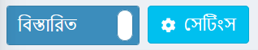

# নপকমার্স ইন্টারফেস

এই অধ্যায় নপকমার্স ইন্টারফেসের মূল বিষয়গুলি অন্তর্ভুক্ত করা হবে।

একবার লগ ইন করার পরে, আপনার ওয়েবসাইটের শীর্ষে **প্রশাসন** হাইপারলিঙ্ক দেখতে হবে। অথবা অ্যাডমিন এলাকা খুলতে আপনি কেবল আপনার সাইটের URL এর শেষে `/admin` যোগ করতে পারেন। উদাহরণস্বরূপ: `www.example.com/admin`।

নপকমার্স প্রশাসন এলাকায় লগ ইন করার পর যে প্রথম পর্দাটি প্রদর্শিত হয় তা হল *ড্যাশবোর্ড*:

ড্যাশবোর্ডে নিম্নলিখিত বিভাগ রয়েছে:

* **নপকমার্স নিউজ** একটি বিভাগ যেখানে নপকমার্স থেকে গুরুত্বপূর্ণ খবর, বিক্রয় এবং প্রচারের তথ্য দেখানো হয়।

* **সাধারণ পরিসংখ্যান** আপনার ওয়েব স্টোর যার মধ্যে রয়েছে অর্ডারের সংখ্যা, মুলতুবি ফেরত অনুরোধ, নিবন্ধিত গ্রাহক এবং কম স্টক পণ্য।

* আপনার ওয়েব স্টোরের গুরুত্বপূর্ণ পরিসংখ্যান দেখানো অন্যান্য বিভাগগুলি: **অর্ডার সমূহ, নতুন গ্রাহক, অর্ডার টোটাল, অসম্পূর্ণ অর্ডার,  সর্বশেষ অর্ডার, জনপ্রিয় অনুসন্ধানের কীওয়ার্ড, সংখ্যা বিবেচনায় সর্বোচ্চ বিক্রেতা, পরিমাণ বিবেচনায় সর্বোচ্চ বিক্রেতা**: 

এই প্রতিবেদনগুলি সম্পর্কে আরও জানুন [এখানে](xref:en/running-your-store/reports)।

ড্যাশবোর্ড বিভাগগুলি সহজেই ভেঙে যায়! [আইটেম](_static/admin-area-overview/item.png) আইকন।

## সাধারণ নপকমার্স পৃষ্ঠার উপাদান

### সাইডবার

প্রশাসন এলাকায় প্রতিটি পৃষ্ঠার বাম দিকে সাইডবার স্থাপন করা হয়েছে। এটি আপনাকে নপকমার্স প্রশাসকের কার্যকারিতার মাধ্যমে নেভিগেট করার অনুমতি দেয়।

লোগোর পাশে "হ্যামবার্গার" আইকনে ক্লিক করে সাইডবারটি সহজেই ভেঙে ফেলা যায়! [ড্যাশবোর্ড২](_static/admin-area-overview/hamburger.jpg)

### অনুসন্ধান ক্ষেত্র

সাইডবারের উপরে, একটি অনুসন্ধান ক্ষেত্র রয়েছে। আপনি যে অংশে নেভিগেট করতে চান তার একটি নাম টাইপ করা শুরু করুন, সার্চ লাইন বিকল্পগুলি স্বয়ংক্রিয়ভাবে প্রস্তাব করে, সরাসরি প্রয়োজনীয় দিকে এগিয়ে যান।

### সিস্টেম মেনু

ইন্টারফেসের এই অংশটি লগ-ইন করা ব্যবহারকারীর নাম, লগআউট বোতাম, পাবলিক স্টোর লিঙ্ক এবং একটি ছোট মেনু দেখায় যেখান থেকে ব্যবহারকারী ক্যাশে সাফ করতে বা অ্যাপ্লিকেশন পুনরায় চালু করতে পারেন।

## মৌলিক এবং বিস্তারিত মোড

প্রশাসন এলাকায় কিছু পৃষ্ঠায় আপনি নিম্নলিখিত সুইচ দেখতে পাবেন:

এই দুই অবস্থানের *মৌলিক-বিস্তারিত* সুইচ আপনাকে পৃষ্ঠা প্রদর্শন মোডের মধ্যে স্যুইচ করতে দেয়।

ব্যবহারের সুবিধার জন্য, আমরা **মৌলিক** মোড তৈরি করেছি যেখানে সবচেয়ে ঘন ঘন সেটিংস দেখানো হয়।

যদি আপনি একটি পৃষ্ঠায় একটি প্রয়োজনীয় সেটিং খুঁজে না পান, তাহলে সমস্ত উপলব্ধ সেটিংস দেখতে **বিস্তারিত** মোডে যান।

কিছু পাতায়, সুইচটির পাশে একটি **সেটিংস** বাটন থাকে। আপনি প্রয়োজনীয় সেটিংস যোগ/অপসারণ করে আপনার প্রয়োজন অনুযায়ী মৌলিক মোড সেট আপ করতে এটি ব্যবহার করতে পারেন।

উপলব্ধ সেটিংসের একটি তালিকা দেখতে **সেটিংস** ক্লিক করুন। **পছন্দসই সেটিং** এর চেকবক্সে টিক দিন। যোগ করা সেটিংসগুলি তখন **মৌলিক** মোডে প্রদর্শিত হবে।

