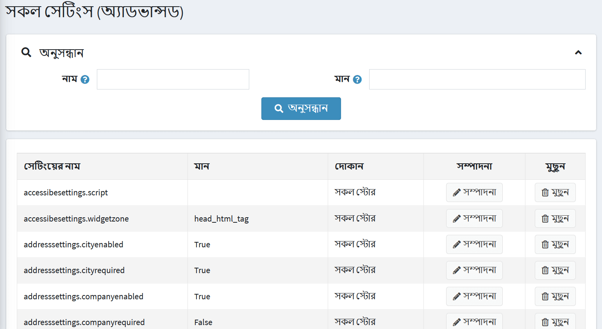
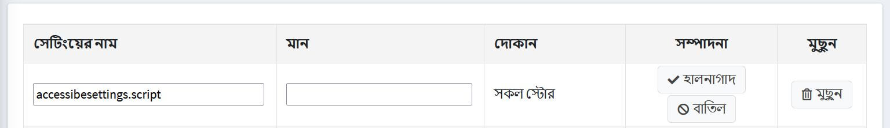

# সব সেটিংস

*সমস্ত সেটিংস* একটি পর্দায় সাইটের সমস্ত সেটিংস পরিবর্তন করার জন্য একটি উন্নত সরঞ্জাম। উদাহরণস্বরূপ, আপনি একাধিক দোকান পেয়েছেন এবং সেটিং-ভিত্তিক প্রথম স্টোরের একটি সঠিক কপি তৈরি করতে হবে। তারপরে *সমস্ত সেটিংস* এর সাহায্যে এক পর্দায় সমস্ত পরিবর্তন করা আপনার অনেক সময় বাঁচাতে পারে।

> [!NOTE]
>
> এই উইন্ডোতে সেটিংস পরিবর্তন শুধুমাত্র উন্নত ব্যবহারকারীদের জন্য সুপারিশ করা হয়। এই সেটিংস পরিবর্তন করার সুপারিশ করা হয় না যদি না ব্যবহারকারী সিস্টেমের সাথে খুব পরিচিত হয়।

সেটিংস সংজ্ঞায়িত করতে:

**কনফিগারেশন → সেটিংস → সমস্ত সেটিংস (উন্নত)** এ যান। *সমস্ত সেটিংস (উন্নত)* উইন্ডো প্রদর্শিত হয়:

## একটি নতুন সেটিং যোগ করুন

আপনি পৃষ্ঠার নীচে *নতুন রেকর্ড যোগ করুন* প্যানেল ব্যবহার করে একটি নতুন সেটিং যুক্ত করতে পারেন। একটি নতুন সেটিংয়ের জন্য নিম্নলিখিত ক্ষেত্রগুলি সংজ্ঞায়িত করুন:

**সেটিং নাম লিখুন**।
* সেটিং এর **মান** লিখুন।
* সংজ্ঞায়িত করুন যেখানে **স্টোর** সেটিং প্রযোজ্য।

এই সেটিং যোগ করতে **নতুন রেকর্ড যোগ করুন** ক্লিক করুন।

## বিদ্যমান সেটিং সম্পাদনা করুন

বিদ্যমান সেটিং সম্পাদনা করতে সেটিং লাইনের **সম্পাদনা** বাটনে ক্লিক করুন। আপনি **সেটিং নাম** এবং এর **মান** সম্পাদনা করতে সক্ষম হবেন। তারপর পরিবর্তনগুলি সংরক্ষণ করতে **আপডেট** ক্লিক করুন।

