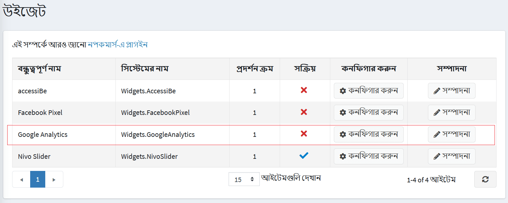
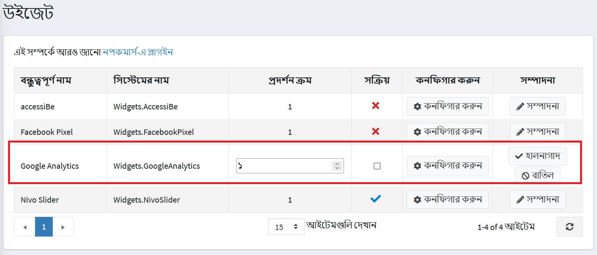
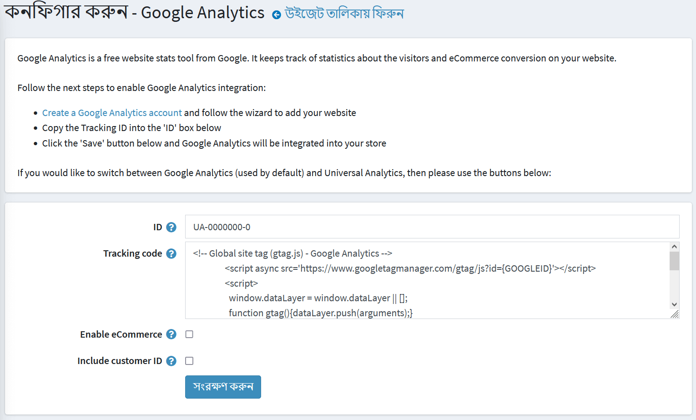

# গুগল অ্যানালিটিক্স প্লাগইন

এই বিভাগে বর্ণনা করা হয়েছে কিভাবে আপনার দোকানে **গুগল অ্যানালিটিক্স** প্লাগইন যোগ এবং সংহত করা যায়।

গুগল অ্যানালিটিক্স প্লাগইন কনফিগার করতে:

**কনফিগারেশন → উইজেটস** এ যান। *উইজেট* উইন্ডো প্রদর্শিত হয়:

## প্লাগইনটি সক্রিয় করুন

**গুগল বিশ্লেষণ** এর পাশে **সম্পাদনা করুন** ক্লিক করুন। উইন্ডোটি প্রসারিত করা হয়েছে, নিম্নরূপ:

গুগল অ্যানালিটিক্স প্লাগইন সক্ষম করতে **সক্রিয় আছে** চেকবক্স নির্বাচন করুন। পরিবর্তনের পরিবর্তে **আপডেট** বাটনে ক্লিক করুন।

## প্লাগইন কনফিগার করুন

**গুগল বিশ্লেষণ** এর পাশে **কনফিগার করুন** ক্লিক করুন। *কনফিগার - গুগল অ্যানালিটিক্স* উইন্ডোটি নিম্নরূপ প্রদর্শিত হবে:

গুগল অ্যানালিটিক্স ইন্টিগ্রেশন সক্ষম করতে নিম্নলিখিত পদক্ষেপগুলি সম্পাদন করুন:

* নিচের লিঙ্কে একটি এইচটিটিপি গুগল অ্যানালিটিক্স অ্যাকাউন্ট তৈরি করুন [http://www.google.com/analytics/](http://www.google.com/analytics/)
* ফর্মের **আইডি** বক্সে **গুগল অ্যানালিটিক্স আইডি** কপি করুন।
* গুগল বিশ্লেষণ দ্বারা তৈরি **ট্র্যাকিং কোড** লিখুন। {GOOGLEID} এবং {CUSTOMER_TRACKING} গতিশীলভাবে প্রতিস্থাপিত হবে।
* গুগল ইকমার্স ফিচারে অর্ডার সম্পর্কে তথ্য পাঠাতে **ই -কমার্স সক্ষম করুন** চেকবক্সে টিক দিন। যদি টিক করা হয় তাহলে ফলোয়িং ফিল্ডগুলি প্রদর্শিত হবে:
* চেক করুন **ই -কমার্স তথ্য পাঠাতে জেএস ব্যবহার করুন** অর্ডার সম্পন্ন পৃষ্ঠা থেকে ই -কমার্স তথ্য পাঠাতে জেএস কোড ব্যবহার করুন। কিন্তু পুননির্দেশক পেমেন্ট পদ্ধতির ক্ষেত্রে কিছু গ্রাহক এটি এড়িয়ে যেতে পারেন। অন্যথায়, এইচটিটিপি অনুরোধ ব্যবহার করে ইকমার্স তথ্য পাঠানো হবে। প্রতিবার অর্ডার দেওয়ার সময় তথ্য পাঠানো হয় কিন্তু উটিএম এই মোডে সমর্থিত নয়।
* ই -কমার্স অংশের জন্য ট্র্যাকিং কোড তৈরির সময় কর অন্তর্ভুক্ত করার জন্য **কর অন্তর্ভুক্ত করুন** চেক করুন।
* স্ক্রিপ্টে গ্রাহক শনাক্তকারী অন্তর্ভুক্ত করতে **গ্রাহক আইডি** চেকবক্সে টিক দিন।

**সেভ** ক্লিক করুন। গুগল অ্যানালিটিক্স আপনার দোকানে সংহত করা হবে।