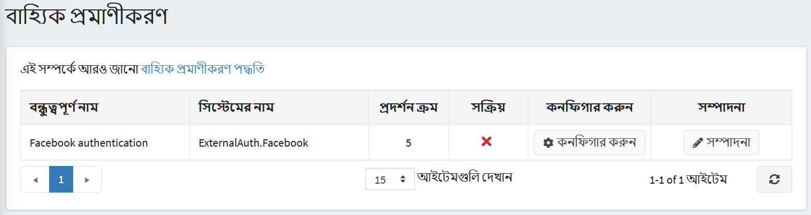
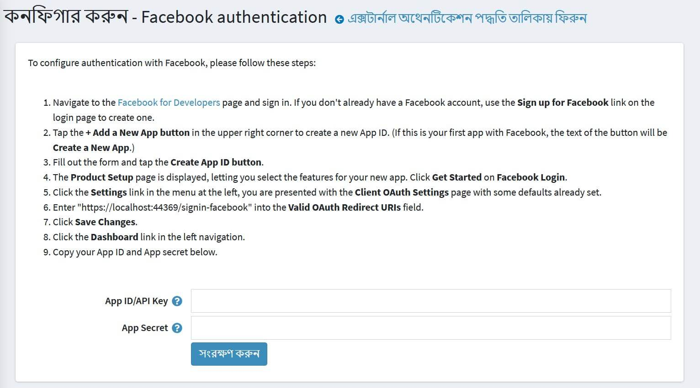

# বাহ্যিক প্রমাণীকরণ পদ্ধতি

বাহ্যিক প্রমাণীকরণ পদ্ধতি ব্যবহারকারীদের তাদের শংসাপত্র: ইমেল এবং পাসওয়ার্ড প্রবেশ না করেই একটি নপকমার্স সাইটে লগইন করার অনুমতি দেয়। ব্যবহারকারীদের একটি বহিরাগত সাইট (যেমন ফেসবুক, গুগল, ইত্যাদি) ব্যবহার করে প্রমাণীকরণ করা যেতে পারে। ফেসবুকের মাধ্যমে নপকমার্স এর অন্তর্নির্মিত বাহ্যিক প্রমাণীকরণ রয়েছে। আপনি [মার্কেটপ্লেস](https://www.nopcommerce.com/marketplace) থেকে প্লাগইন ব্যবহার করে অন্যান্য পদ্ধতি সেট আপ করতে পারেন।

একটি বহিরাগত প্রমাণীকরণ পদ্ধতি কনফিগার এবং সক্রিয় হিসাবে চিহ্নিত করার পরে, ব্যবহারকারীরা লগইন পৃষ্ঠায় একটি নতুন প্রমাণীকরণ বিকল্প দেখতে পাবেন।

## বাহ্যিক প্রমাণীকরণ পদ্ধতিগুলি পরিচালনা করুন

**কনফিগারেশন → প্রমাণীকরণ → বাহ্যিক প্রমাণীকরণ** এ যান। *বাহ্যিক প্রমাণীকরণ* উইন্ডো প্রদর্শিত হয়:

একটি প্রমাণীকরণ পদ্ধতির পাশে **সম্পাদনা করুন** ক্লিক করুন এবং পদ্ধতিটি সক্রিয় করতে **সক্রিয়** টিক দিন। আপনি পদ্ধতি প্রদর্শন করতে পারেন **ডিসপ্লে অর্ডার**। তারপর পরিবর্তনগুলি সংরক্ষণ করতে **আপডেট** বাটনে ক্লিক করুন।

পদ্ধতি কনফিগারেশনের জন্য **কনফিগার করুন** ক্লিক করুন।

## ফেসবুক প্রমাণীকরণ পরিচালনা করুন

ফেসবুক প্রমাণীকরণ পদ্ধতি একটি অন্তর্নির্মিত বাহ্যিক প্রমাণীকরণ প্লাগইন। ফেসবুকের সাথে প্রমাণীকরণ কনফিগার করতে, দয়া করে এই পদক্ষেপগুলি অনুসরণ করুন:

১। **কনফিগারেশন → প্রমাণীকরণ → বাহ্যিক প্রমাণীকরণ** পৃষ্ঠায় **কনফিগার করুন** ফেসবুক প্রমাণীকরণের পাশে ক্লিক করুন। *কনফিগার - ফেসবুক প্রমাণীকরণ* উইন্ডো প্রদর্শিত হয়:

   

২। [ডেভেলপারদের জন্য ফেসবুক](https://developers.facebook.com/apps) পৃষ্ঠায় নেভিগেট করুন এবং সাইন ইন করুন। আপনার যদি ইতিমধ্যে ফেসবুক অ্যাকাউন্ট না থাকে, লগইন পৃষ্ঠায় ফেসবুকের জন্য সাইন আপ লিঙ্কটি ব্যবহার করুন একটি তৈরি করতে।

৩। একটি নতুন অ্যাপ আইডি তৈরি করতে উপরের ডানদিকে কোণায় **+একটি নতুন অ্যাপ বোতাম যোগ করুন** আলতো চাপুন। (যদি এটি ফেসবুকের সাথে আপনার প্রথম অ্যাপ হয় তবে বোতামের পাঠ্য হবে **একটি নতুন অ্যাপ তৈরি করুন**।)

৪। ফর্মটি পূরণ করুন এবং **অ্যাপ আইডি বাটন তৈরি করুন** আলতো চাপুন।

৫। *প্রোডাক্ট সেটআপ* পৃষ্ঠা প্রদর্শিত হয়, যা আপনাকে আপনার নতুন অ্যাপের জন্য বৈশিষ্ট্য নির্বাচন করতে দেয়। *ফেসবুক লগইন* এ **শুরু করুন** ক্লিক করুন।

৬। বাম দিকের মেনুতে **সেটিংস** লিংকে ক্লিক করুন, আপনাকে ইতিমধ্যেই সেট করা কিছু ডিফল্ট সহ *ক্লায়েন্ট ওঅথ সেটিংস* পৃষ্ঠা উপস্থাপন করা হয়েছে।

৭। আপনার সাইটের ইউআরএল- এর পরিবর্তে 'yoursitename.com' এর পরিবর্তে **বৈধ ওঅথ পুননির্দেশিত ইউআরআইস** ক্ষেত্রের মধ্যে 'https://yoursitename.com/signin-facebook' লিখুন।

৮। **পরিবর্তনগুলি সংরক্ষণ করুন** ক্লিক করুন।

৯। বাম নেভিগেশনে **ড্যাশবোর্ড** লিঙ্কে ক্লিক করুন।

১০। প্লাগইন কনফিগারেশন পৃষ্ঠায় আপনার **অ্যাপ আইডি/এপিআই কী** এবং **অ্যাপ সিক্রেট** ফর্মটিতে অনুলিপি করুন।

**সেভ** বাটনে ক্লিক করুন। পাবলিক স্টোরের লগইন পৃষ্ঠায় নতুন যোগ করা প্রমাণীকরণ পদ্ধতি দেখুন।

## আরো দেখুন

* [নপকমার্স-এ প্লাগইনগুলি](xref:bn/getting-started/advanced-configuration/plugins-in-nopcommerce)
