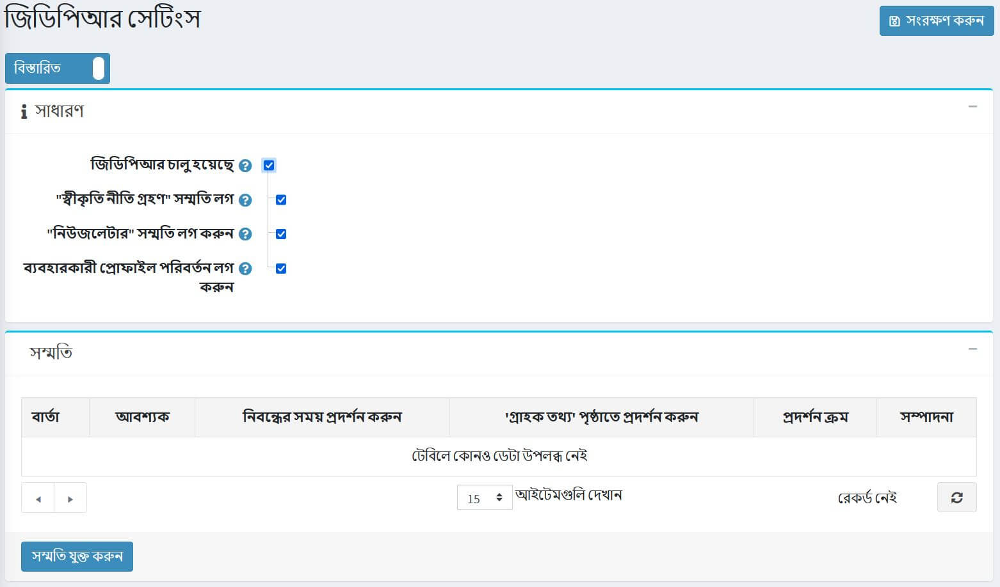
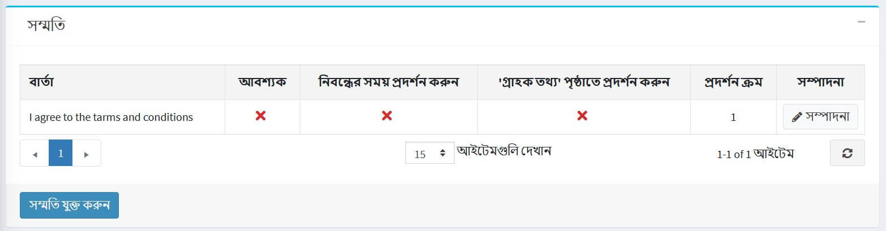
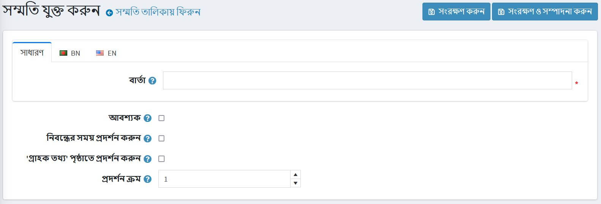
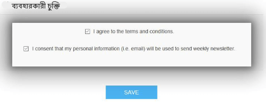
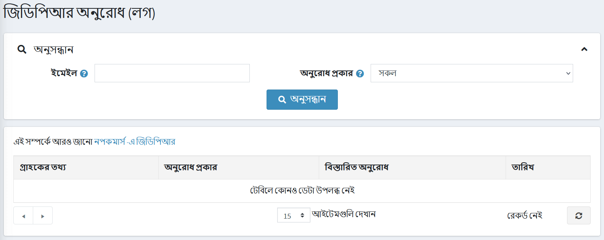
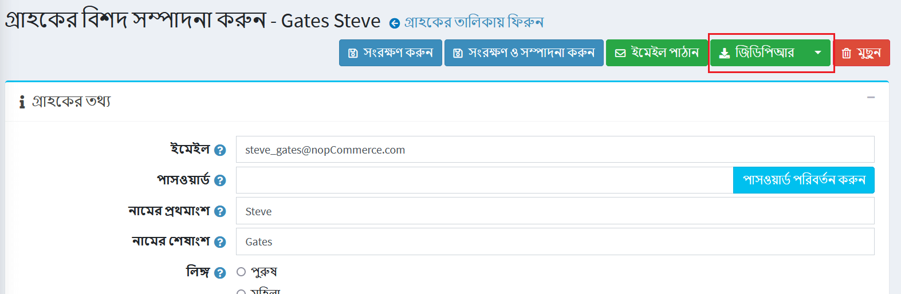

# জিডিপিআর সেটিংস

*জিডিপিআর* (জেনারেল ডেটা প্রোটেকশন রেগুলেশন) হল একটি সংশোধিত ইউরোপীয় ইউনিয়নের নতুন ডেটা গোপনীয়তা আইন যা সমস্ত কোম্পানি তাদের ইউরোপীয় গ্রাহকদের ব্যক্তিগত তথ্য সংগ্রহ, ব্যবহার এবং ভাগ করে নেওয়ার উপর প্রভাব ফেলে। ২৪ মে, ২০১৬ তারিখে প্রযোজ্য প্রবিধান এবং ২৫ মে, ২০১৮ থেকে প্রযোজ্য। ডিজিটাল যুগে ব্যক্তিদের মৌলিক অধিকারকে শক্তিশালী করতে এবং ডিজিটাল একক বাজারে কোম্পানি এবং পাবলিক সংস্থার জন্য বিধিগুলি স্পষ্ট করে ব্যবসার সুবিধার্থে প্রবিধান একটি অপরিহার্য পদক্ষেপ। ।

আরও তথ্যের জন্য (অনুগ্রহ করে এই উৎসটি দেখুন):

[https://ec.europa.eu/info/law/law-topic/data-protection/data-protection-eu_en](https://ec.europa.eu/info/law/law-topic/data-protection/data-protection-eu_en)

## জিডিপিআর কনফিগার করুন

আপনার নপকমার্স দোকানে জিডিপিআর সেটিংস সক্ষম করতে **প্রশাসন → কনফিগারেশন → সেটিংস → জিডিপিআর সেটিংস** এ যান।

তারপর **জিডিপিআর সক্ষম** চেকবক্সে টিক দিন। অতিরিক্ত সেটিংস আপনাকে নিম্নলিখিত ক্রিয়াকলাপগুলির একটি লগ ক্যাপচার করার অনুমতি দেবে:

* **লগ "গোপনীয়তা নীতি গ্রহণ করুন" সম্মতি**।
* **লগ "নিউজলেটার" সম্মতি**।
* **লগ ব্যবহারকারীর প্রোফাইল পরিবর্তন**।

আপনি আপনার নপকমার্স সাইটে সম্মতি যোগ করতে পারেন *সম্মতি* প্যানেলের **সম্মতি যোগ করুন** বাটনে ক্লিক করে:

একটি নতুন সম্মতি যোগ করার জন্য আপনাকে *সম্মতি যোগ করুন* উইন্ডোতে পুননির্দেশিত করা হবে:

নিম্নলিখিত সম্মতি সেটিংস সংজ্ঞায়িত করুন:

* **বার্তা** বা প্রশ্ন যা গ্রাহকদের কাছে প্রদর্শিত হবে।
* যদি **সম্মতির প্রয়োজন হয়**।
* যদি সম্মতি **নিবন্ধনের সময় প্রদর্শিত হয়**।
* যদি তাদের সম্মতি **"গ্রাহক তথ্য" পৃষ্ঠায়** "আমার অ্যাকাউন্ট" বিভাগে প্রদর্শিত হয়।
* **ডিসপ্লে অর্ডার** হল সম্মতি প্রদর্শনের অর্ডার। ১ তালিকার প্রথম আইটেমটি উপস্থাপন করে।

গ্রাহকের তথ্য পৃষ্ঠায় সম্মতির বিকল্পের একটি উদাহরণ এখানে দেওয়া হল:

যদি আপনি সম্মতি লগ সেটিংস সক্ষম করেন তাহলে আপনি লগ অ্যাক্টিভিটি দেখতে পারেন: **প্রশাসন → গ্রাহক → জিডিপিআর অনুরোধ (লগ)**।

যখন জিডিপিআর সেটিং সক্ষম করা হয়, তখন দোকানের মালিক যেমন কাজ করতে পারেন:

* **স্থায়ী মুছে ফেলুন** গ্রাহকের রেকর্ড মুছে ফেলার জন্য।
* **গ্রাহকদের ডেটা রপ্তানির জন্য ডেটা রপ্তানি করুন**

এটি করার জন্য **প্রশাসন → গ্রাহক → সম্পাদনা গ্রাহক** পৃষ্ঠায় যান।

## টিউটোরিয়াল

* [নপকমার্স-এ জিডিপিআর সেটিংস পরিচালনা করা](https://www.youtube.com/watch?v=6bLc_TDqD18&feature=youtu.be)
