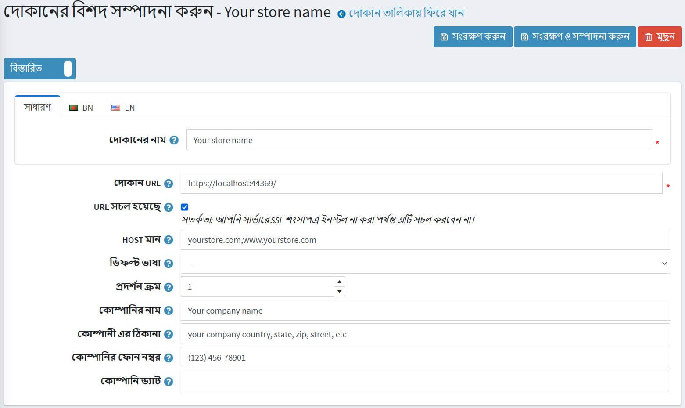

---
title: কিভাবে এসএসএল সার্টিফিকেশন ইনস্টল এবং কনফিগার করবেন
uid: bn/getting-started/advanced-configuration/how-to-install-and-configure-ssl-certification
author: git.mariannk
contributors: git.MDRashedKhanMenon
---

# কিভাবে এসএসএল সার্টিফিকেশন ইনস্টল এবং কনফিগার করবেন

একটি এসএসএল সার্টিফিকেট কি? এসএসএল মানে সিকিউর সকেট লেয়ার। এসএসএল সার্টিফিকেট আপনার ওয়েবসাইটের পরিচয় যাচাই করে, এবং ভিজিটরদের আপনার সাইটে পাঠানো বা প্রাপ্ত তথ্য এনক্রিপ্ট করে। যখন আপনার এসএসএল সার্টিফিকেট আপনার ওয়েবসাইটকে সুরক্ষিত করে, তখন আপনার গ্রাহকরা নিশ্চিন্ত থাকতে পারেন যে তারা যে কোনো সুরক্ষিত পৃষ্ঠায় যে তথ্য প্রবেশ করে তা ব্যক্তিগত এবং সাইবার দুর্বৃত্তদের দ্বারা দেখা যাবে না।

## কিভাবে এসএসএল সার্টিফিকেট পাবেন

১। প্রথমে, আপনার ওয়েবসাইটে এসএসএল বাস্তবায়নের জন্য, আপনাকে এসএসএল সার্টিফিকেট প্রদানকারী ওরফে সার্টিফিকেশন অথরিটি থেকে একটি এসএসএল সার্টিফিকেট পেতে হবে। প্রচুর সার্টিফিকেট কর্তৃপক্ষ আছে যা আপনি আপনার ওয়েবসাইটে এসএসএল সার্টিফিকেট সুরক্ষিত করার জন্য যেতে পারেন, যেমন SSL.com, Namecheap বা GoDaddy।

২। তারপর, আপনাকে আপনার সার্ভারে কেনা এসএসএল সার্টিফিকেট ইনস্টল করতে হবে। এটি কিভাবে করবেন তা সার্ভারের উপর নির্ভর করে। আরও নির্দেশাবলী এবং সুপারিশের জন্য আপনাকে এসএসএল সার্টিফিকেট প্রদানকারী নির্দেশিকা বা আপনার সার্ভার ডকুমেন্টেশন উল্লেখ করতে হবে। এই নিবন্ধে, আমি আপনাকে GoDaddy থেকে এই ধরনের নির্দেশিকাগুলির একটি লিঙ্ক প্রদান করব: [এসএসএল সার্টিফিকেট ইনস্টল করুন](https://www.godaddy.com/help/install-ssl-certificates-16623)।

৩। শেষ ধাপে, আপনাকে অ্যাডমিন এলাকায় আপনার নপকমার্স স্টোর স্থাপন করতে হবে। এটি করার জন্য **কনফিগারেশন → স্টোরস** পৃষ্ঠায় যান। আপনি যে দোকানটি সেট আপ করতে চান তা নির্বাচন করুন এবং তার পাশে **সম্পাদনা করুন** বাটনে ক্লিক করুন। *স্টোরের বিবরণ সম্পাদনা করুন* উইন্ডোটি নিম্নরূপ প্রদর্শিত হবে:
  
  - 'https://' উপসর্গ দিয়ে আপনার **স্টোর ইউআরএল** লিখুন।
  - **এসএসএএল সক্ষম** চেকবক্সে টিক দিন।
    > [!WARNING]
    >
    > আপনার সার্ভারে এসএসএল সার্টিফিকেট ইনস্টল না হওয়া পর্যন্ত এটি সক্ষম করবেন না।

## সমস্যা সমাধান

### এসএসএএল সার্টিফিকেট নিয়ে সমস্যার কারণে অ্যাডমিন প্যানেল পাওয়া যায় না

একটি সাধারণ সমস্যা হল যখন এসএসএল সার্টিফিকেট সার্ভারে ইনস্টল করা হয় না বা এসএসএল কনফিগারেশনে সমস্যা হয়। একই সময়ে, দোকানে **এসএসএএল সক্ষম** সেটিং সক্রিয় করা হয়েছিল (যেমনটি আমরা আগের বিভাগে করেছি)।

**প্রভাবিত সংস্করণ**: সব

**সমাধান**:
নিম্নলিখিত এসকিউএল ক্যোয়ারী চালান:

  ```sql
  UPDATE [dbo].[Store] SET [SslEnabled] = 'False'
  ```

### মিশ্র বিষয়বস্তু HTTP এবং এইচটিটিপিএস

মিশ্র বিষয়বস্তু ঘটে যখন একটি সাইট এসএসএল নিরাপত্তা প্রোটোকলের উপর কাজ করে, কিন্তু কিছু সম্পদ (উদাহরণস্বরূপ, ছবি) একটি অনিরাপদ এইচটিটিপি সংযোগের মাধ্যমে লোড করা হয়। এটি পৃষ্ঠায় ত্রুটি সৃষ্টি করে কারণ মূল অনুরোধটি এইচটিটিপিএস এর মাধ্যমে সুরক্ষিত ছিল।

লোড ব্যালেন্সার ব্যবহার করার সময়, এটি এইচটিটিপি এর মাধ্যমে অ্যাপ্লিকেশনের সাথে যোগাযোগ করার কারণে একই সমস্যা দেখা দিতে পারে।

**প্রভাবিত সংস্করণ**: ৪.২০ এবং নীচে

**সমাধান**:

- আপনি সেটিংস সক্রিয় করেছেন তা নিশ্চিত করুন:

  ```json
  securitysettings.forcesslforallpages = true
  ```
  
- নিশ্চিত করুন যে আপনার ওয়েবসাইট হোস্টিং সার্ভারে ৪৪৩ পোর্টে শুনছে।

**প্রভাবিত সংস্করণ**: সব

**সমাধান**:

- অনুরোধ শিরোনামে অনুপস্থিত ক্ষেত্র `UseHttpXForwardedProto`। `Appsettings.json` ফাইলে` UseHttpXForwardedProto` সেটিং সক্ষম করার চেষ্টা করুন এবং ওয়েব সাইটটি পুনরায় চালু করুন।

  ```json
  "UseHttpXForwardedProto": true
  ```

-আপনি সিএসপি "আপগ্রেড-অনিরাপদ-অনুরোধ" নির্দেশ যোগ করে এটি ঠিক করতে পারেন। এটি `web.config` ফাইলে করা যেতে পারে।
  অথবা ডকুমেন্টের `<head>` বিভাগে একই ইনলাইন নির্দেশিকা এম্বেড করে, `<meta>` উপাদান ব্যবহার করে:

  ```XML
  <meta http-equiv = "Content-Security-Policy" content = "upgrade-insecure-requests">
  ```

- ক্লাউডফ্লেয়ার ব্যবহারের ক্ষেত্রে আপনার ক্লাউডফ্লেয়ার ড্যাশবোর্ডে লগ ইন করে এবং এসএসএল সেটিংস চেক করতে `SSL/TLS app` -এ ক্লিক করে আপনার এসএসএল সেটিং `Full` বা `Flexible` মোড কিনা তা পরীক্ষা করে দেখুন।

### অসীম পুননির্দেশ লুপ (ERR_TOO_MANY_REDIRECTS)

যখন একটি অননুমোদিত ব্যবহারকারী লগইন বা শপিং কার্ট পরিদর্শন করার চেষ্টা করে, তখন সাইটটি একটি অসীম পুননির্দেশ লুপে প্রবেশ করে।

**প্রভাবিত সংস্করণ**: সব

**সমাধান**:

- ব্যবহার করা ব্রাউজারের উপর নির্ভর করে সাইটে কুকি মুছে ফেলার চেষ্টা করুন, এই পদ্ধতিটি কিছুটা ভিন্ন হতে পারে। বিকল্পভাবে, আপনি কেবলমাত্র প্রাইভেট মোডে পৃষ্ঠাটি খুলতে পারেন যাতে এটি ত্রুটির কারণ হয় কিনা তা পরীক্ষা করতে পারেন।
- সার্ভার, প্রক্সি এবং ব্রাউজার ক্যাশে সাফ করুন
- এইচটিটিপি থেকে এইচটিটিপিএস সার্ভারে পুননির্দেশ দেখুন। এটি খুব ভাল হতে পারে যে সম্ভবত আপনার সার্ভারে এইচটিটিপিএস পুননির্দেশের নিয়ম ভুল কনফিগার করা হয়েছে। আপনি আপনার আইআইএস থেকে এইচটিটিপি থেকে এইচটিটিপিএস এ একটি পুনirectনির্দেশ নিয়ম যোগ করতে পারেন। নিয়ম প্যাটার্ন নিম্নলিখিত ফর্ম আছে:

  ```xml
  <configuration>
    <system.webServer>
      <rewrite>
        <rules>
          <rule name="http_to_https" stopProcessing="true">
            <match url="(.*)" />
            <conditions logicalGrouping="MatchAll" trackAllCaptures="false">
              <add input="{এইচটিটিপিএস}" pattern="^OFF$" />
            </conditions>
            <action type="Redirect" url="https://{HTTP_HOST}/{R:1}" redirectType="SeeOther" />
          </rule>
        </rules>
      </rewrite>
    </system.webServer>
  </configuration>
  ```

- ERR_TOO_MANY_REDIRECTS প্রায়শই ক্লাউডফ্লেয়ারের মতো রিভার্স-প্রক্সি পরিষেবার কারণে হয়। এটি সাধারণত ঘটে যখন তাদের নমনীয় এসএসএল বিকল্পটি সক্রিয় থাকে এবং আপনার ওয়েব হোস্টের সাথে ইতিমধ্যেই একটি এসএসএল সার্টিফিকেট ইনস্টল করা থাকে। যখন নমনীয় নির্বাচন করা হয়, আপনার হোস্টিং সার্ভারে সমস্ত অনুরোধ পাঠানো হয় এইচটিটিপি। সম্ভবত আপনার হোস্ট সার্ভারটি ইতিমধ্যেই এইচটিটিপি থেকে এইচটিটিপিএস এ পুননির্দেশিত হয়েছে, এবং সেইজন্য একটি পুননির্দেশ লুপ ঘটে। এটি ঠিক করতে আপনাকে ক্লাউডফ্লেয়ার ক্রিপ্টো সেটিংস নমনীয় থেকে সম্পূর্ণ বা পূর্ণ (কঠোর) পরিবর্তন করতে হবে।
