# স্থানীয়করণ

নপকমার্স-এ, আপনার দোকানে বেশ কয়েকটি ভাষা ইনস্টল করা থাকতে পারে। যাইহোক, গ্রাহকরা শুধুমাত্র তাদের নির্বাচিত ভাষায় সংজ্ঞায়িত ডেটা দেখতে পাবেন।

> [!TIP]
>
> ডিফল্টরূপে, ইংরেজি ভাষা ইনস্টল করা হয়।

ইনস্টল করা ভাষাগুলি দেখতে বা সম্পাদনা করতে **কনফিগারেশন → ভাষা** এ যান:
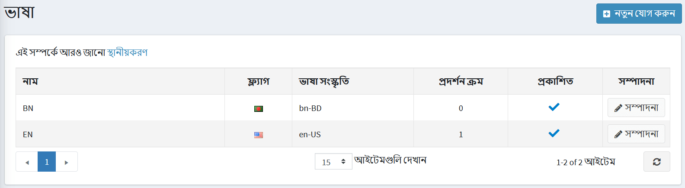

> [!NOTE]
> 
> আপনি অফিসিয়াল [মার্কেটপ্লেস](http://www.nopcommerce.com/marketplace) থেকে নতুন ভাষার প্যাক ডাউনলোড করতে পারেন।

## নতুন ভাষা যোগ করা

একটি নতুন ভাষা যোগ করতে **নতুন যোগ করুন** ক্লিক করুন। *একটি নতুন ভাষা যোগ করুন* উইন্ডোতে, নিম্নলিখিত সেটিংস সংজ্ঞায়িত করুন:

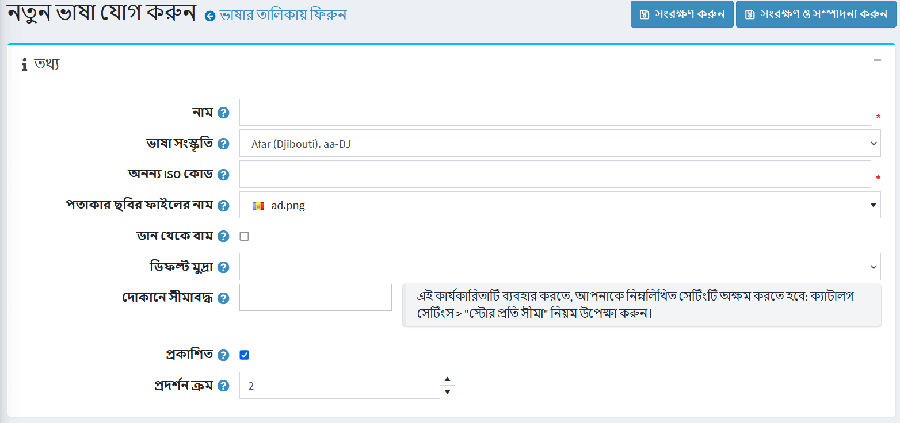

* নতুন ভাষার **নাম**।
* **ভাষা সংস্কৃতি** - একটি নির্দিষ্ট ভাষা কোড (উদাহরণস্বরূপ, অস্ট্রিয়ান জার্মানদের জন্য ডি -এটি)।
* **দ্য ইউনিক এসইও কোড** - একটি দুই অক্ষরের ভাষা এসইও কোড ব্যবহার করা হয় যেমন ইউআরএল তৈরি করতে যেমন 'http://www.yourstore.com/en/` যখন আপনার একাধিক প্রকাশিত ভাষা থাকে।

  > [!NOTE]
  >
  > একাধিক ভাষা সহ **SEO বন্ধুত্বপূর্ণ URL গুলি** বিকল্পটি **কনফিগারেশন → সেটিংস → সাধারণ সেটিংস → স্থানীয়করণ সেটিংস** প্যানেলে সক্ষম করা উচিত।

* **ফ্ল্যাগ ইমেজ ফাইলের নাম** - ফ্ল্যাগ ইমেজ ফাইলের নাম লিখুন। ছবিটি `…/ইমেজ/পতাকা` ডিরেক্টরিতে সংরক্ষণ করা উচিত। আপনি একটি পূর্বনির্ধারিত তালিকা থেকে একটি ছবিও চয়ন করতে পারেন।
* প্রয়োজন হলে **ডান থেকে বামে** টিক দিন (উদাহরণস্বরূপ, আরবি, হিব্রু ইত্যাদি)।
  
  > [!NOTE]
  >
  > সক্রিয় থিমটি RTL সমর্থন করবে (একটি উপযুক্ত CSS স্টাইল ফাইল আছে)। এই বিকল্পটি শুধুমাত্র পাবলিক স্টোরকে প্রভাবিত করে।

*একটি নির্দিষ্ট ভাষার জন্য **ডিফল্ট মুদ্রা**। যদি নির্দিষ্ট না করা হয়, তাহলে প্রথম পাওয়া একটি (সর্বনিম্ন ডিসপ্লে অর্ডার সহ) ব্যবহার করা হবে।
* **সীমিত স্টোর বিকল্প** একটি নির্দিষ্ট স্টোরের জন্য এই ভাষা সেট করার অনুমতি দেয়। আপনি একটি পূর্বনির্ধারিত তালিকা থেকে দোকান (গুলি) নির্বাচন করতে পারেন। আপনি যদি এই বিকল্পটি ব্যবহার না করেন তবে এই ক্ষেত্রটি খালি রাখুন।
  
  > [!NOTE]
  >
  > দোকান সীমা ব্যবহার করার জন্য **উপেক্ষা করুন "প্রতি দোকান সীমা" নিয়ম (সাইটওয়াইড)** **বিকল্পটি ** কনফিগারেশন → সেটিংস → ক্যাটালগ সেটিংস → পারফরম্যান্স** প্যানেলে অক্ষম করা উচিত।

* **প্রকাশ করুন** ভাষা, এই ভাষাকে আপনার দোকানের দর্শকদের দ্বারা দৃশ্যমান এবং নির্বাচিত করতে সক্ষম করতে।
**ভাষার ডিসপ্লে অর্ডার**। ১ তালিকার শীর্ষে প্রতিনিধিত্ব করে।

পরিবর্তনগুলি সংরক্ষণ করতে **সংরক্ষণ** ক্লিক করুন।

> [!NOTE]
>
> একটি নতুন ভাষা যোগ করার পর, আপনি **আমদানি সম্পদ ব্যবহার করে স্ট্রিং রিসোর্স আমদানি ও রপ্তানি করতে সক্ষম হবেন**
এবং **রপ্তানি সম্পদ** পৃষ্ঠার শীর্ষে বোতাম। ভাষা সম্পাদনা পৃষ্ঠা থেকে *স্ট্রিং রিসোর্স* প্যানেল আপনাকে বিদ্যমান ভাষা সম্পদগুলি দেখতে এবং ম্যানুয়ালি নতুন যুক্ত করতে দেবে।

## ভাষা প্যাক আমদানি করুন

আপনি যদি আপনার দোকানে একটি নতুন ভাষা যোগ করতে চান, আপনার উচিত:

১। নপকমার্স [অনুবাদ](https://www.nopcommerce.com/translations) পৃষ্ঠায় যান।

২। নপকমার্স সংস্করণ চয়ন করুন এবং পছন্দসই ভাষা প্যাক ডাউনলোড করুন।

৩। **কনফিগারেশন → ভাষা** এ যান এবং **নতুন যোগ করুন** বোতাম টিপুন।
    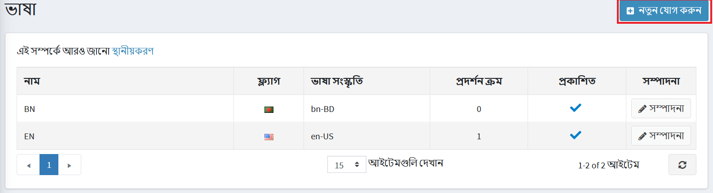

৪। প্রয়োজনীয় ক্ষেত্র পূরণ করুন এবং **সংরক্ষণ করুন এবং সম্পাদনা চালিয়ে যান** ক্লিক করুন।
  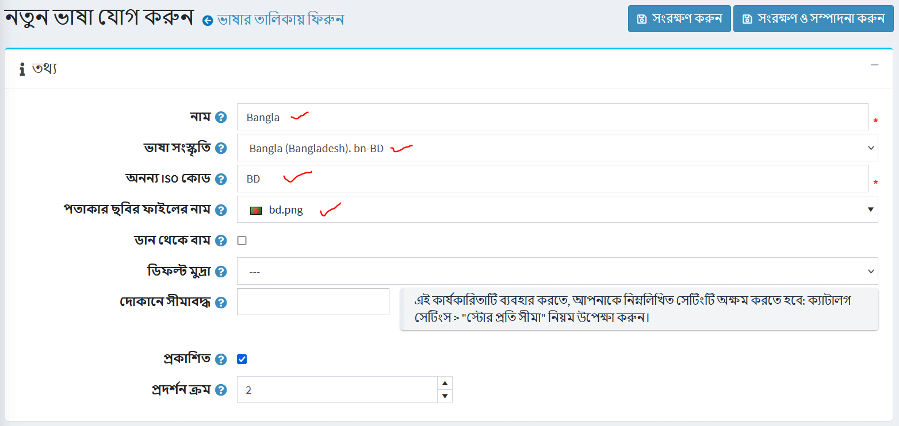

৫। **সম্পদ আমদানি করুন** ক্লিক করুন। এবং আপনার ডাউনলোড করা ভাষা প্যাক ফাইলের (*.xml) পথ নির্দিষ্ট করুন।
  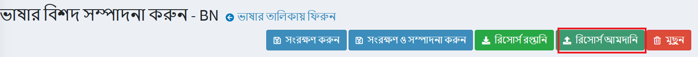

যদি আপনি অনুবাদে ভুল খুঁজে পান বা কাস্টম নামকরণ করতে চান তবে আপনি স্ট্রিং রিসোর্সগুলি *স্ট্রিং রিসোর্স* প্যানেলে সম্পাদনা করতে পারেন।

## স্ট্রিং রিসোর্স পরিচালনা করুন

**কনফিগারেশন → ভাষা** এ যান। *ভাষা* উইন্ডো প্রদর্শিত হয়:

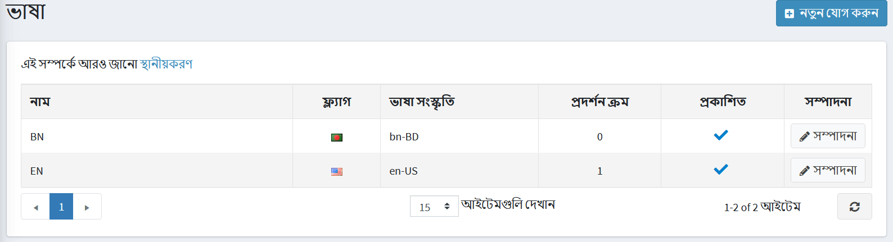

ভাষার পাশে **সম্পাদনা করুন** বাটনে ক্লিক করুন। **ভাষা বিবরণ সম্পাদনা করুন** উইন্ডোতে, **স্ট্রিং রিসোর্স** প্যানেল খুঁজুন।

উদাহরণস্বরূপ, আপনি "প্রশাসন" (নীচের ছবিতে) থেকে "কন্ট্রোল প্যানেল" থেকে পৃষ্ঠার উপরে একটি প্যানেলের নাম পরিবর্তন করতে চান।

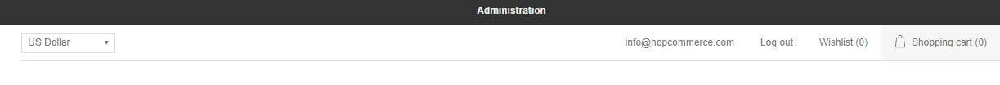
 
১। রিসোর্স নেম ফিল্ডে, "প্রশাসন" লিখুন। প্রয়োজনীয় স্ট্রিং রিসোর্স পাওয়া গেলে। এর পাশে **এডিট** ক্লিক করুন।

২। **মান** ক্ষেত্রটিতে নতুন নাম লিখুন এবং **আপডেট** ক্লিক করুন।
  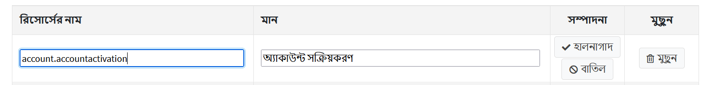

৩। পরিবর্তনগুলি বাস্তবায়িত হয়
  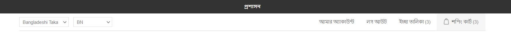

একটি নতুন স্ট্রিং রিসোর্স যুক্ত করতে **নতুন রেকর্ড যোগ করুন** প্যানেল ব্যবহার করুন। এই উইন্ডোটি আপনাকে গ্রিডে একটি নতুন রিসোর্স রেকর্ড যুক্ত করতে সক্ষম করে:
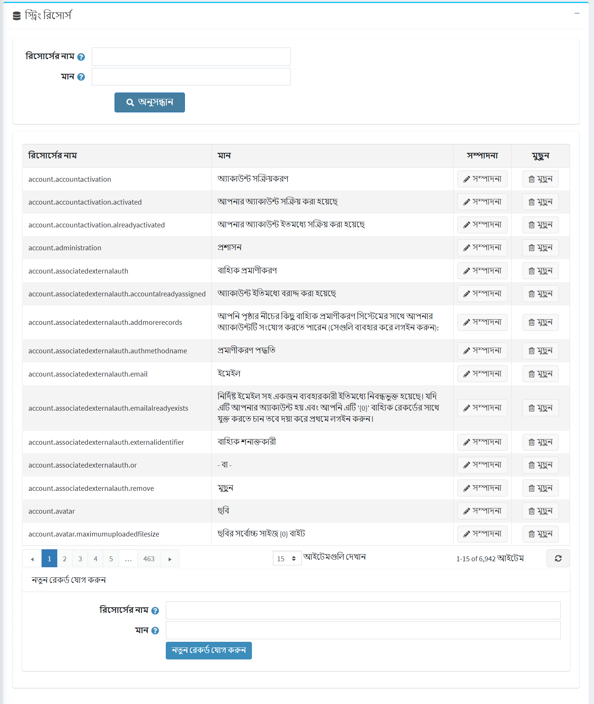

* **রিসোর্সের নাম** ফিল্ডে, রিসোর্স স্ট্রিং আইডেন্টিফায়ার লিখুন।
* **ভ্যালু** ফিল্ডে, এই রিসোর্স স্ট্রিং আইডেন্টিফায়ারের জন্য একটি মান লিখুন।

**সেভ** ক্লিক করুন।

## স্থানীয়করণ সেটিংস

স্থানীয়করণ সেটিংস কনফিগার করতে **কনফিগারেশন → সেটিংস → সাধারণ সেটিংস** এ যান:

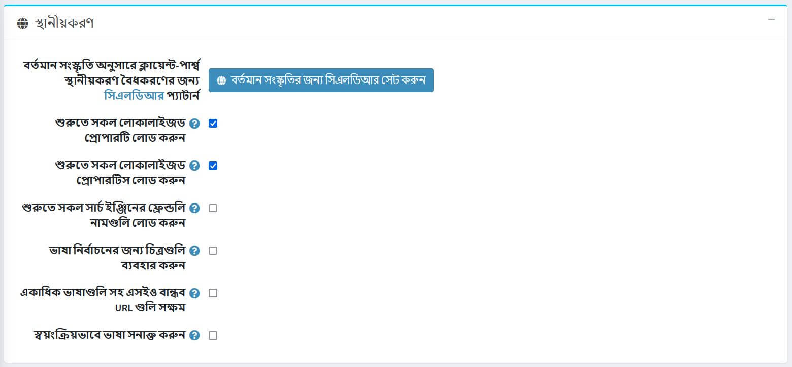

- বর্তমান সংস্কৃতি অনুসারে ক্লায়েন্ট-সাইড ভ্যালিডেশনের স্থানীয়করণের জন্য [সিএলডিআর](http://cldr.unicode.org/) প্যাটার্ন সেট করতে **বর্তমান সংস্কৃতির জন্য সিএলডিআর সেট করুন** বাটনে ক্লিক করুন।
- চেকবক্সে টিক দিন **স্টার্টআপে সমস্ত লোকাল রিসোর্স লোড করুন** অ্যাপ্লিকেশন স্টার্টআপের সমস্ত স্থানীয় রিসোর্স লোড করতে। সক্ষম হলে, সমস্ত লোকাল রিসোর্স অ্যাপ্লিকেশন স্টার্টআপে লোড করা হবে। অ্যাপ্লিকেশন শুরু হবে ধীর, কিন্তু তারপর সব পৃষ্ঠা অনেক দ্রুত খোলা যাবে।
- চেকবক্সে টিক দিন **স্টার্টআপে সমস্ত স্থানীয় বৈশিষ্ট্য লোড করুন** অ্যাপ্লিকেশন স্টার্টআপের সমস্ত স্থানীয় বৈশিষ্ট্য লোড করতে। সক্ষম হলে, সমস্ত স্থানীয় বৈশিষ্ট্য (যেমন স্থানীয় পণ্য বৈশিষ্ট্য) অ্যাপ্লিকেশন স্টার্টআপের সময় লোড করা হবে। অ্যাপ্লিকেশন শুরু হবে ধীর, কিন্তু তারপর সব পৃষ্ঠা অনেক দ্রুত খোলা যাবে। এটি শুধুমাত্র তখনই ব্যবহৃত হয় যখন আপনার দুই বা ততোধিক ভাষা সক্ষম থাকে। যখন আপনার একটি বড় ক্যাটালগ (কয়েক হাজার স্থানীয় সত্তা) থাকে তখন সক্ষম করার সুপারিশ করা হয় না।
- চেকবক্সে টিক দিন **স্টার্টআপে সমস্ত সার্চ ইঞ্জিন বান্ধব নাম লোড করুন** অ্যাপ্লিকেশন স্টার্টআপে সমস্ত সার্চ ইঞ্জিন বান্ধব নাম লোড করতে। সক্ষম হলে, সমস্ত স্লাগ (সার্চ ইঞ্জিন বন্ধুত্বপূর্ণ নাম) অ্যাপ্লিকেশন স্টার্টআপের সময় লোড হবে। অ্যাপ্লিকেশন শুরু হবে ধীর, কিন্তু তারপর সব পৃষ্ঠা অনেক দ্রুত খোলা যাবে। যখন আপনি একটি বড় ক্যাটালগ (কয়েক হাজার সত্তা) আছে সক্রিয় করার সুপারিশ করা হয় না।
- চেকবক্সে টিক দিন **ভাষা নির্বাচনের জন্য ছবি ব্যবহার করুন** ভাষার নামের পরিবর্তে ছবি ব্যবহার করতে।
- সকল ভাষার জন্য এসইও বান্ধব ইউআরএল অনুমোদনের জন্য চেকবক্সে **একাধিক ভাষা সক্ষম এসইও বন্ধুত্বপূর্ণ ইউআরএল** টিক চিহ্ন দিন । সক্ষম হলে, আপনার ইউআরএল গুলি হবে `http://www.yourStore.com/en/` অথবা `http://www.yourStore.com/ru/` (এসইও বন্ধুত্বপূর্ণ)।
- গ্রাহক ব্রাউজার সেটিংসের উপর ভিত্তি করে ভাষা সনাক্ত করার জন্য চেকবক্সে **ভাষা স্বয়ংক্রিয়ভাবে সনাক্ত করুন**

## সত্তাগুলিকে স্থানীয়করণ করুন

যদি আপনার দোকানে একাধিক ভাষা ইনস্টল করা থাকে তবে আপনি কিছু ক্ষেত্র প্রবেশ করতে পারবেন যা বিভিন্ন ভাষায় গ্রাহকদের কাছে প্রদর্শিত হবে। উদাহরণ স্বরূপ:

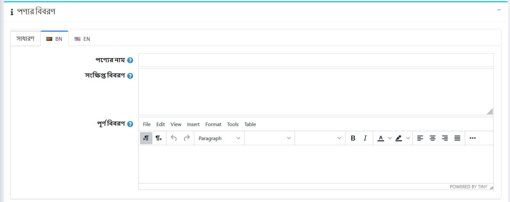

- *স্ট্যান্ডার্ড ট্যাবে* পাঠ্যটি প্রবেশ করান যা গ্রাহকদের কাছে প্রদর্শিত হবে যদি স্থানীয় ক্ষেত্রগুলি নির্দিষ্ট না করা হয়।
- ভাষার নাম সহ *ট্যাবে* স্থানীয় পাঠ্য লিখুন।