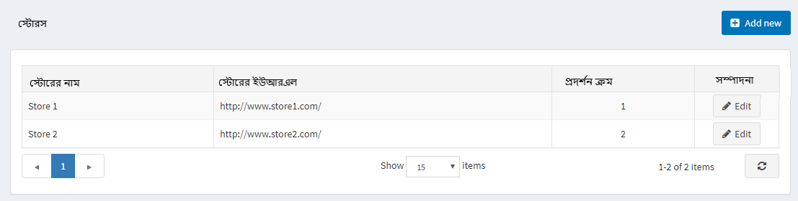
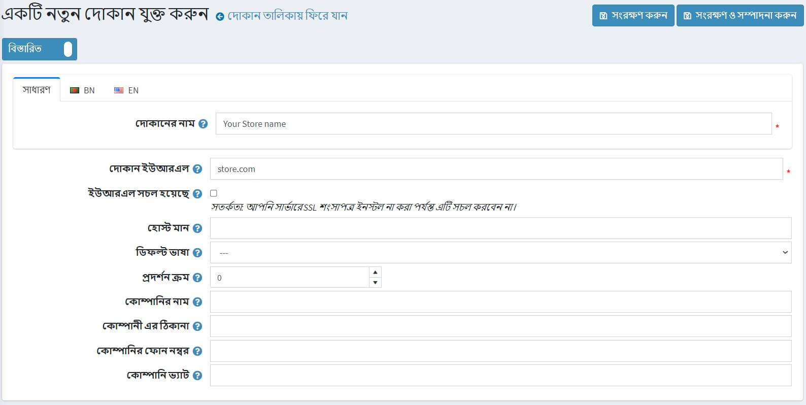
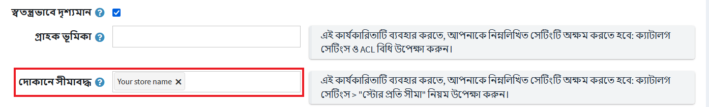
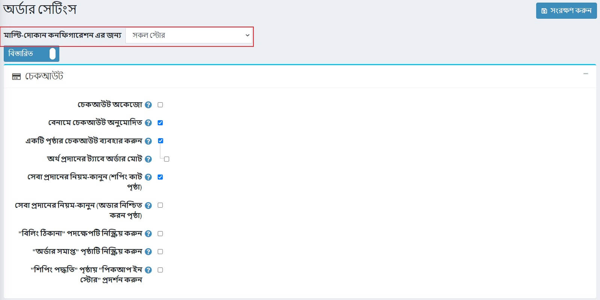

# মাল্টি-স্টোর

নপকমার্স আপনাকে একক নপকমার্স ইনস্টলেশন থেকে একটি ইন্টারফেস ব্যবহার করে একাধিক দোকান চালাতে সক্ষম করে।

এটি আপনাকে বিভিন্ন ডোমেইনে একাধিক ফ্রন্ট-এন্ড স্টোর হোস্ট করতে এবং আপনার একক প্রশাসন প্যানেল থেকে সমস্ত অ্যাডমিন অপারেশন পরিচালনা করতে সক্ষম করে। আপনি দোকানের মধ্যে ক্যাটালগ ডেটা ভাগ করতে পারেন, উদাহরণস্বরূপ একাধিক দোকানে একটি পণ্য রাখতে পারেন এবং আপনার গ্রাহকরা একই শংসাপত্র ব্যবহার করে আপনার সমস্ত দোকানে লগইন করতে পারেন।

## মাল্টি-স্টোর কনফিগার করা

### হোস্টিং কন্ট্রোল প্যানেলের অংশ

নিম্নলিখিত উদাহরণে আমরা দুটি নমুনা দোকানের সেটআপ বর্ণনা করব, নিম্নরূপ:

* `www.store1.com`
* `www.store2.com`

১। `www.store1.com` এ সাইটটি আপলোড এবং ইনস্টল করুন। এটিই একমাত্র জায়গা যেখানে নপকমার্স ফাইল এবং ডিএলএল সংরক্ষণ করা হয়।
      > [!NOTE]
      >
      > নিচের অধ্যায়ে নপকমার্স কিভাবে ইনস্টল করতে হয় তা পড়ুন: [নপকমার্স ইনস্টল করা](xref:bn/installation-and-upgrading/install-nopcommerce/index)।

২। `www.store2.com` এর কন্ট্রোল প্যানেল থেকে (মানে আপনার হোস্টিং কন্ট্রোল প্যানেল, নপকমার্স প্রশাসন এলাকা নয়) নিশ্চিত করুন যে `www.store2.com`- এ সমস্ত অনুরোধ ফরওয়ার্ড করা হয়েছে (পুন redনির্দেশিত নয়) `www.store1- এ .com`। CNAME রেকর্ড ব্যবহার করে এটি সম্পাদন করুন। এই পদক্ষেপটি গুরুত্বপূর্ণ।

৩। `www.store1.com` এর কন্ট্রোল প্যানেল থেকে, `www.store2.com` এর জন্য একটি ডোমেইন উপনাম কনফিগার করুন। এই পদক্ষেপটি কিছু ব্যবহারকারীর জন্য জটিল হতে পারে (আপনার সমস্যা থাকলে আপনার সিস্টেম প্রশাসককে এই পদক্ষেপটি করতে বলুন)।

উপরের ধাপগুলি সম্পন্ন করার পর, আপনার ব্রাউজার থেকে `www.store2.com` অ্যাক্সেস করার সময়, `www.store1.com` এর বিষয়বস্তু প্রদর্শিত হবে। পরবর্তী ধাপ হল নপকমার্স প্রশাসন এলাকায় দোকানগুলি কনফিগার করা যা নীচে বর্ণনা করা হবে। তারপরে আপনি উভয় দোকানের জন্য সামগ্রী আপলোড শুরু করতে পারেন।

৪। ঐচ্ছিক (নমুনা): এই ধাপটি নীচের প্লেসক কন্ট্রোল প্যানেল থেকে সম্পাদিত হতে পারে
  
যখন `www.store2.com` কে `www.store1.com` এ পুননির্দেশিত করা হয়, তখন প্লেস্কের ওয়েব সার্ভার `www.store2.com` প্রদর্শন করতে জানে না কারণ এটি নাম-ভিত্তিক ভার্চুয়াল হোস্টিং ব্যবহার করে। অতএব, আপনাকে অবশ্যই `www.store2.com` এর জন্য একটি ডোমেইন উপনাম তৈরি করতে হবে, যেমনটি নিচে বর্ণিত হয়েছে:

*সার্ভার অ্যাডমিনিস্ট্রেশন প্যানেল থেকে সরাসরি বা **কন্ট্রোল প্যানেলে** লিঙ্কের মাধ্যমে `www.store1.com` এর ডোমেইন প্যানেলে লগ ইন করুন।

**ওয়েবসাইট এবং ডোমেইন** ট্যাব থেকে, ট্যাবের নিচের দিকে **নতুন ডোমেইন উপনাম যোগ করুন** লিঙ্কটি নির্বাচন করুন।

 * সম্পূর্ণ উপনাম লিখুন যেমন- `store2.com`।

*নিশ্চিত করুন যে **ওয়েব পরিষেবা** বিকল্প নির্বাচন করা হয়েছে।

**মেল** পরিষেবা ঐচ্ছিক। আপনি যদি www.store2.com থেকে ইমেলগুলি একইভাবে পুননির্দেশিত করতে চান তবে এই বিকল্পটি পরীক্ষা করুন।

**প্রাথমিক ডোমেইনের সাথে সিএনক্রোনাইজ ডিএনএস জোন নিশ্চিত করুন** বিকল্পটি অনির্বাচিত।

### নপকমার্স প্রশাসন এলাকা অংশ

একবার ইনস্টলেশন এবং টেকনিক্যাল সেটআপ হয়ে গেলে, আপনি আপনার দোকানগুলি পরিচালনা করতে পারেন নপ্যাকার্স প্রশাসন এলাকা থেকে। **কনফিগারেশন → স্টোরস** এ যান। *স্টোরস* উইন্ডো প্রদর্শিত হয়:

> [!NOTE]
> 
> ডিফল্টরূপে, শুধুমাত্র একটি দোকান তৈরি করা হয়।

বেশ কয়েকটি দোকান সেট আপ করতে **নতুন যোগ করুন** ক্লিক করুন এবং নিম্নলিখিত স্টোর সেটিংস সংজ্ঞায়িত করুন:

* **স্টোরের নাম** সংজ্ঞায়িত করুন।
* আপনার দোকানের **স্টোর ইউআরএল** লিখুন।
* যদি আপনার দোকান এসএসএল সুরক্ষিত থাকে তবে **এসএসএল সক্রিয়** চেকবক্স নির্বাচন করুন। এসএসএল (সিকিউর সকেটস লেয়ার) হল একটি ওয়েব সার্ভার এবং ব্রাউজারের মধ্যে একটি এনক্রিপ্ট করা লিঙ্ক স্থাপনের জন্য মানসম্মত নিরাপত্তা প্রযুক্তি। এই লিঙ্কটি নিশ্চিত করে যে ওয়েব সার্ভার এবং ব্রাউজারের মধ্যে পাস করা সমস্ত ডেটা ব্যক্তিগত এবং অবিচ্ছেদ্য থাকবে। এসএসএল একটি শিল্প মান এবং লক্ষ লক্ষ ওয়েবসাইট তাদের গ্রাহকদের সাথে তাদের অনলাইন লেনদেনের সুরক্ষায় ব্যবহার করে।

  > [!IMPORTANT]
  >
  > আপনার সার্ভারে এসএসএল সার্টিফিকেট ইন্সটল করার পরেই এই অপশনে টিক দিন। অন্যথায়, আপনি আপনার সাইটে অ্যাক্সেস করতে পারবেন না এবং আপনার ডাটাবেসের ([স্টোর] টেবিলে) উপযুক্ত রেকর্ড ম্যানুয়ালি সম্পাদনা করতে হবে।

  > [!TIP]
  >
  > নিম্নলিখিত অধ্যায়ে এসএসএল সেট আপ করার বিষয়ে আরও পড়ুন: [এসএসএল সার্টিফিকেশন কিভাবে ইনস্টল এবং কনফিগার করবেন](xref:bn/getting-start/advanced-configuration/how-to-install-and-configure-ssl-certification)।

* **হোস্ট মান** ক্ষেত্র হল আপনার দোকানের সম্ভাব্য HTTP_HOST মানগুলির একটি তালিকা (উদাহরণস্বরূপ, `store1.com`,` www.store1.com`)। এই ক্ষেত্রটি পূরণ করা কেবল তখনই প্রয়োজন যখন আপনার কাছে বর্তমান দোকান নির্ধারণের জন্য একটি মাল্টি-স্টোর সমাধান থাকে। এই ক্ষেত্রটি স্বতন্ত্র ইউআরএলগুলিতে অনুরোধগুলি আলাদা করতে সক্ষম করে এবং বর্তমান স্টোর নির্ধারণ করে। **সিস্টেম → সিস্টেম তথ্য** এ আপনি বর্তমান HTTP_POST মান দেখতে পারেন।
* **ডিফল্ট ভাষা** ফিল্ডে, আপনার দোকানের একটি ডিফল্ট ভাষা বেছে নিন। আপনি এটিকে অনির্বাচিতও রেখে দিতে পারেন। এই ক্ষেত্রে, প্রথম পাওয়া একটি (সর্বনিম্ন ডিসপ্লে অর্ডার সহ) ব্যবহার করা হবে।
* এই দোকানের জন্য **ডিসপ্লে অর্ডার** নির্ধারণ করুন। ১ তালিকার শীর্ষে প্রতিনিধিত্ব করে।
* **কোম্পানির নাম** সংজ্ঞায়িত করুন।
* **কোম্পানির ঠিকানা** সংজ্ঞায়িত করুন।
* **আপনার কোম্পানির ফোন নম্বর** সেট করুন।
**কোম্পানি ভ্যাট** ক্ষেত্রে, আপনার কোম্পানির ভ্যাট লিখুন (ইইউতে ব্যবহৃত)।

**কনফিগারেশন → স্টোরস** পৃষ্ঠায় **নতুন যোগ করুন** বাটনে ক্লিক করে এবং অনুরূপ ক্ষেত্রগুলি পূরণ করে অন্য একটি দোকান যুক্ত করুন।

দুটি দোকান এখন একটি একক নপকমার্স ইনস্টলেশন ব্যবহার করে কনফিগার করা হয়েছে, নিম্নরূপ:

* www.store1.com
* www.store2.com

> [!NOTE]
>
> মাল্টি-স্টোর সমাধান (HTTP_HOST দ্বারা দোকানের পার্থক্য) একই ডোমেইনের ভার্চুয়াল ডিরেক্টরিতে সাইটগুলির জন্য কাজ করে না।

উদাহরণস্বরূপ, আপনার একটি দোকান `http://www.site.com/store1` এবং দ্বিতীয় দোকান `http://www.site.com/store2` এ থাকতে পারে না, যেহেতু এই উভয় সাইটের জন্য HTTP_HOST মান একই (`www.site.com`)।

## মাল্টি-স্টোরের জন্য সত্তাগুলি কনফিগার করা

একবার দোকানগুলি সেটআপ এবং কনফিগার হয়ে গেলে, আপনি প্রতিটি দোকানের জন্য আপনার সত্তা নির্ধারণ করতে পারেন। নিচের প্রত্যেকটির জন্য বিবরণ পাতার **সীমিত দোকানে** ক্ষেত্র পূরণ করে এটি করুন: [পণ্য](xref:bn/running-your-store/catalog/products/index), [Categories](xref:bn/running-your-store/catalog/category), [Manufacturers](xref:bn/running-your-store/catalog/Manufactures), [Languages](xref:bn/getting-start/advanced-configuration/localization) , [মুদ্রা](xref:bn/getting-start/configure-payment/advanced-configuration/currencies), [বার্তা টেমপ্লেট](xref:bn/running-your-store/content-management/message-template), [ব্লগ ](xref:bn/running-your-store/content-management/blog), [News](xref:bn/running-your-store/content-management/news), [বিষয়](xref:bn/running-your-store/content-management/topics-pages)।

**সীমিত দোকানে** ক্ষেত্রের নিচে স্ক্রোল করুন এবং ড্রপডাউন মেনু থেকে বিদ্যমান দোকানের নাম নির্বাচন করুন, যেমন *পণ্যের বিবরণ সম্পাদনা করুন* স্ক্রিনে দেখানো হয়েছে:

## মাল্টি-স্টোরের জন্য সেটিংস কনফিগার করা

বিভিন্ন [থিম](xref:bn/getting-start/design-your-store/choose-and-install-a-theme) এছাড়াও বিভিন্ন দোকানের জন্য কনফিগার করা যায়।

উপরন্তু, আপনি প্রতি দোকান কোন সেটিং মান ওভাররাইড করতে পারেন। উদাহরণস্বরূপ, **সেটিংস → অর্ডার সেটিংস** এ যান এবং **ড্রপডাউনের জন্য** মাল্টি-স্টোর কনফিগারেশন দেখুন যেখানে আপনি যে স্টোরটি পছন্দ করতে চান সেটি সেটিং ওভাররাইড করতে পারেন:

যখন আপনি দোকানটি চয়ন করবেন তখন পৃষ্ঠাটি রিফ্রেশ হবে এবং আপনি নির্বাচিত দোকানের জন্য কোন ক্ষেত্র নির্ধারণ করতে পারবেন। তারপর সেটিংস সেভ করতে শুধু **সেভ** ক্লিক করুন।