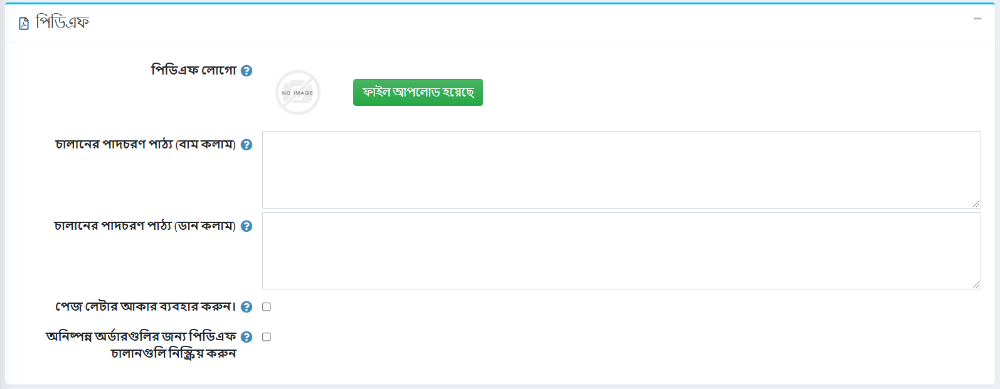

# পিডিএফ সেটিংস

একটি দোকান চালানোর সময় আপনার স্বয়ংক্রিয়ভাবে তৈরি হওয়া পিডিএফ ফাইলগুলির প্রয়োজন হতে পারে, যেমন চালান এবং চুক্তির শর্তাবলী।

পিডিএফ সেটিংস সংজ্ঞায়িত করতে **কনফিগারেশন → সেটিংস → সাধারণ সেটিংস** এ যান এবং *পিডিএফ* প্যানেল খুঁজুন:

* **পিডিএফ লোগো এলাকায়**, আপলোড করার জন্য লোগো ফাইলটি টেনে আনুন এবং ড্রপ করুন। এই চিত্র ফাইলটি পিডিএফ অর্ডারের চালানে প্রদর্শিত হবে। এটি একটি ছোট ছবি ব্যবহার করার জন্য সুপারিশ করা হয়।
* **ইনভয়েস ফুটার টেক্সট (বাম কলাম)** ফিল্ডে, টেক্সট লিখুন যা জেনারেটেড ইনভয়েসের নীচে প্রদর্শিত হবে (বাম কলাম)।
* **ইনভয়েস ফুটার টেক্সট (ডান কলাম)** ফিল্ডে, টেক্সট লিখুন যা জেনারেটেড ইনভয়েসের নীচে প্রদর্শিত হবে (ডান কলাম)।
* টিক করুন **লেটার পেজ সাইজ ব্যবহার করুন** যদি আপনি চান আপনার পিডিএফ ডকুমেন্টে লেটার পেজের সাইজ থাকে। যখন এই চেকবক্সটি অনির্বাচিত হয়, A4 পৃষ্ঠার আকারটি ডিফল্টরূপে ব্যবহৃত হয়।
* টিক করুন **পেন্ডিং অর্ডারের জন্য পিডিএফ ইনভয়েস অক্ষম করুন** যদি আপনি না চান যে আপনার গ্রাহকরা পেন্ডিং অর্ডারের জন্য পিডিএফ ইনভয়েস প্রিন্ট করতে পারবেন।

## টিউটোরিয়াল

* [পিডিএফ ইনভয়েসে ব্যবসার তথ্য (ব্র্যান্ডিং) যোগ করা](https://youtu.be/TeXmuNWsdD4)
