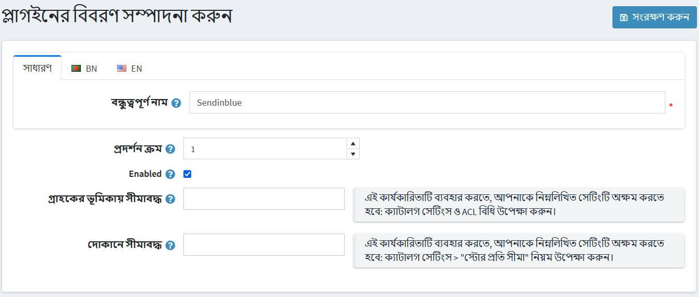

# নপকমার্স-এ প্লাগইন

প্লাগইনগুলি উপাদানগুলির একটি সেট যা একটি নপকমার্স স্টোরে নির্দিষ্ট ক্ষমতা যুক্ত করে। প্লাগইনগুলির উদাহরণগুলির মধ্যে রয়েছে পেমেন্ট মডিউল, শিপিং রেট গণনা পদ্ধতি এবং আরও অনেক কিছু। এই বিভাগটি বর্ণনা করে কিভাবে ম্যানুয়ালি প্লাগইন ইনস্টল করতে হয়।

নপকমার্স এর বিভিন্ন প্লাগইন রয়েছে, যা আপনার স্টোর ফাংশন এর সম্প্রসারণ করে, তার [মার্কেটপ্লেস](http://www.nopcommerce.com/marketplace) এ। প্লাগইনগুলি মার্কেটপ্লেস থেকে ডাউনলোড করে অথবা অ্যাডমিন প্যানেল থেকে সরাসরি স্টোরফ্রন্টে প্রবেশ করে ইনস্টল করা যায়।

মার্কেটপ্লেসে প্লাগইনগুলি বিভাগ, সংস্করণ, নাম বা রেটিং দ্বারা বাছাই করা যায় এবং বিনামূল্যে বা অর্থ প্রদান করা যায়।

মার্কেটপ্লেসে উপলব্ধ প্লাগইনগুলি নপকমার্স টিম, সমাধান অংশীদার বা তৃতীয় পক্ষের বিক্রেতাদের দ্বারা বিকশিত হয়।

> [!NOTE]
>
> "নপকমার্স টীম দ্বারা" লেবেলযুক্ত প্লাগইনগুলি নপকমার্স টিম দ্বারা বিকশিত হয় এবং অবাধে বিতরণ করা হয়। থার্ড-পার্টি সার্ভিস কানেক্টরগুলি *টেকনোলজি পার্টনারশিপ প্রোগ্রাম* এর মধ্যে বিকশিত হয়, তারা নপকমার্স [প্রিমিয়াম সাপোর্ট সার্ভিসেস](http://www.nopcommerce.com/nopcommerce-premium-support-services) এর অধীন এবং এছাড়াও অবাধে বিতরণ করা হয়।

## একটি প্লাগইন ইন্সটল করতে

1. ব্যবহারকারীর প্লাগইন আপলোড করার জন্য দুটি বিকল্প আছে। আপনি যেটি সবচেয়ে সুবিধাজনক মনে করেন তা ব্যবহার করতে পারেন:
    * প্লাগইনটি আপনার নপকমার্স ডিরেক্টরিতে `/plugins` ফোল্ডারে আপলোড করুন। এবং আপনার অ্যাপ্লিকেশন পুনরায় আরম্ভ করুন (অথবা **প্লাগইন তালিকা পুনরায় লোড করুন** বাটনে ক্লিক করুন)।
    **প্লাগইন বা থিম আপলোড করুন** প্লাগইন বা থিম আপলোড করুন বোতামটি আপনার স্থানীয় স্টোরেজে প্লাগইন সহ আর্কাইভের অবস্থানের পথ নির্দেশ করে।

    > [!TIP]
    >
    > আপনি আমাদের [এক্সটেনশন ডিরেক্টরি](https://www.nopcommerce.com/marketplace) থেকে আরো নপকমার্স প্লাগইন ডাউনলোড করতে পারেন।

    

১। নতুন ইনস্টল করা প্লাগইনটি খুঁজে পেতে প্লাগইনগুলির তালিকা দিয়ে নিচে স্ক্রোল করুন।

২। প্লাগইনটি ইনস্টল করতে **ইনস্টল** লিঙ্কে ক্লিক করুন।

৩। ইনস্টলেশন প্রক্রিয়া শেষ করার জন্য উপরের প্যানেলের **রিস্টার্ট অ্যাপ্লিকেশন বদল করার জন্য** বোতামে ক্লিক করুন।

৪। প্লাগইন প্লাগইন তালিকায় প্রদর্শিত হয় (**কনফিগারেশন → স্থানীয় প্লাগইন**)।
    > [!NOTE]
    > 
    > যদি আপনি মিডিয়াম ট্রাস্টে নপকমার্স চালাচ্ছেন, তাহলে আপনার `\Plugins\bin\` ডিরেক্টরিটি সাফ করার পরামর্শ দেওয়া হচ্ছে।

## একটি প্লাগইন কনফিগার করতে

১। **কনফিগারেশন → স্থানীয় প্লাগইন** এ যান। প্লাগইন তালিকা প্রদর্শিত হয়:

	
২। প্লাগইন এর কনফিগারেশন পৃষ্ঠায় যেতে প্লাগইন এর পাশে **কনফিগার** লিঙ্কে ক্লিক করুন। যদি কোন প্লাগিনের পাশে **কনফিগার** বাটন না থাকে, তাহলে এটি নির্দেশ করে যে প্লাগইনটির কোন কনফিগারেশনের প্রয়োজন নেই।

## প্লাগিনের বন্ধুত্বপূর্ণ নাম পরিবর্তন করতে, অর্ডার এবং সীমাবদ্ধতা প্রদর্শন করুন

১। **কনফিগারেশন → স্থানীয় প্লাগইন** এ যান। প্লাগইন তালিকা প্রদর্শিত হয়:

	
২। প্লাগইন এর পাশে **এডিট** বাটনে ক্লিক করুন। নিম্নরূপ প্লাগইন বিশদ সম্পাদনা করুন:

	
৩। **বন্ধুত্বপূর্ণ নাম** লিখুন।

৪। **ডিসপ্লে অর্ডার** ফিল্ডে, এই প্লাগইনটি প্রদর্শনের জন্য প্রয়োজনীয় অবস্থান নির্ধারণ করুন। ১ তালিকার শীর্ষে প্রতিনিধিত্ব করে।

৫। যদি আপনি দোকানে প্লাগইনটি সক্ষম করতে চান তবে **সক্রিয় করা** ক্ষেত্রটিতে টিক দিন।

৬। **সীমিত থেকে গ্রাহকের ভূমিকা** ড্রপ-ডাউন তালিকা আপনি এই প্লাগইন ব্যবহার করতে সক্ষম হতে চান এমন ভূমিকা নির্বাচন করুন।

৭। **সীমিত দোকানে** ক্ষেত্রের মধ্যে, যে দোকানগুলিতে প্লাগইন ব্যবহার করা হবে তা সংজ্ঞায়িত করুন।

৮। পৃষ্ঠার শীর্ষে **সেভ** ক্লিক করুন।

## একটি প্লাগইন আনইনস্টল করতে

১। **কনফিগারেশন → স্থানীয় প্লাগইন** এ যান। প্লাগইন তালিকা প্রদর্শিত হয়:

২। আনইনস্টল করার জন্য প্লাগইনটির পাশে **আনইনস্টল** লিঙ্কে ক্লিক করুন। প্লাগইনটি আনইনস্টল করা আছে। **ইনস্টলেশন কলামের লিঙ্কটি** **ইন্সটল** এ পরিবর্তন করে আপনাকে যে কোন সময় প্লাগইন পুনরায় ইনস্টল করতে সক্ষম করে।

৩। আনইনস্টলেশন প্রক্রিয়া শেষ করতে উপরের প্যানেলের **রিস্টার্ট অ্যাপ্লিকেশন পরিবর্তন করতে আবেদন করুন** বোতামে ক্লিক করুন।

## টিউটোরিয়াল

- [একটি প্লাগইন ইনস্টল করা (সংস্করণ ৩.৯০ - ৪.১০)](https://youtu.be/eLDsSm-4gKA)
- [প্রতি গ্রাহকের ভূমিকাতে প্লাগইনগুলিতে অ্যাক্সেস পরিচালনা করা](https://www.youtube.com/watch?v=52lVVpQ3Qag)
