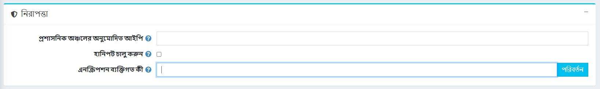
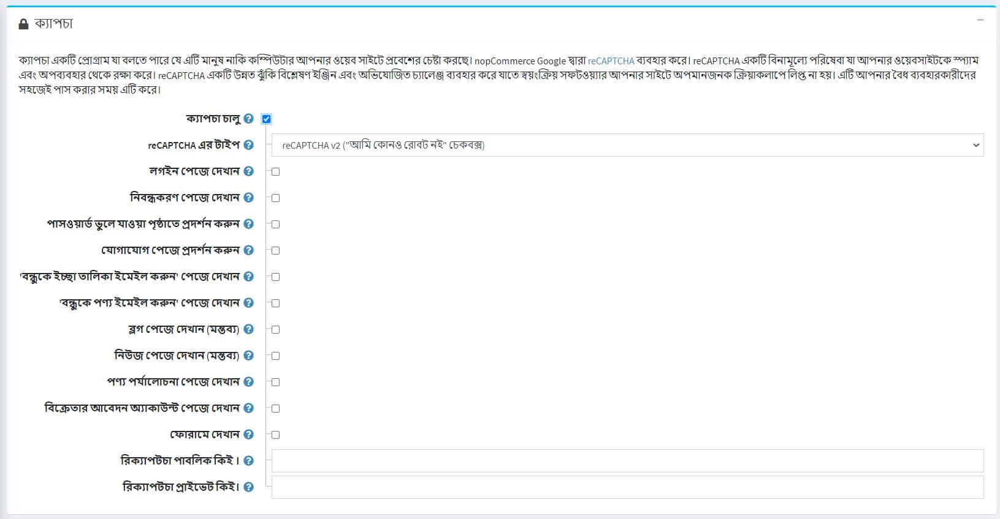

# নিরাপত্তা সেটিংস

নিরাপত্তা সেটিংস পরিচালনা করতে **কনফিগারেশন → সেটিংস → সাধারণ সেটিংস** এ যান।

এই পৃষ্ঠাটি মাল্টি-স্টোর কনফিগারেশন সক্ষম করে, এর মানে হল যে একই স্টোরিং সকল স্টোরের জন্য সংজ্ঞায়িত করা যেতে পারে, অথবা স্টোর থেকে স্টোরে আলাদা হতে পারে। আপনি যদি একটি নির্দিষ্ট দোকানের জন্য সেটিংস পরিচালনা করতে চান, মাল্টি-স্টোর কনফিগারেশন ড্রপ-ডাউন তালিকা থেকে তার নামটি চয়ন করুন এবং তাদের জন্য কাস্টম মান নির্ধারণ করতে বাম পাশে সমস্ত প্রয়োজনীয় চেকবক্সে টিক দিন। আরও তথ্যের জন্য [মাল্টি-স্টোর](xref:bn/get-start/advanced-configuration/multi-store) পড়ুন।

## নিরাপত্তা

নিম্নরূপ *নিরাপত্তা* সেটিংস সংজ্ঞায়িত করুন:

* **অ্যাডমিন এলাকা অনুমোদিত আইপি** ক্ষেত্রের মধ্যে, আইপি ঠিকানাগুলি প্রবেশ করান যা ব্যাকএন্ড অ্যাক্সেস করার অনুমতি দেয়। যদি আপনি ব্যাকএন্ডে অ্যাক্সেস সীমাবদ্ধ করতে না চান তবে এই ক্ষেত্রটি খালি রাখুন। IP ঠিকানাগুলির মধ্যে কমা ব্যবহার করুন (উদাহরণস্বরূপ, 127.0.0.10, 232.18.204.16)।
* [হানিপট](https://en.wikipedia.org/wiki/Honeypot_(computing)) সক্ষম করতে **হানিপট সক্ষম করুন** টিক করুন কম্পিউটারের পরিভাষায়, একটি মধুচক্র হল একটি ফাঁদ যা সনাক্ত করা, বিচ্যুত করা বা কিছু পদ্ধতিতে তথ্য সিস্টেমের অননুমোদিত ব্যবহারের প্রচেষ্টাকে প্রতিহত করা।
**এনক্রিপশন প্রাইভেট কী** ফিল্ডে, সংবেদনশীল ডেটা সংরক্ষণের জন্য ব্যবহৃত এনক্রিপশন প্রাইভেট কী লিখুন। এই কী পরিবর্তন করতে যেকোনো সময় **পরিবর্তন** ক্লিক করুন। এই ব্যক্তিগত কী ব্যবহার করে সমস্ত সংবেদনশীল তথ্য এনক্রিপ্ট করা হয়।

> [!NOTE]
> 
> আপনি এনক্রিপশন কী পরিবর্তন করার আগে আপনার ডাটাবেসের ব্যাকআপ করার পরামর্শ দেওয়া হচ্ছে। সংবেদনশীল ডেটা সমস্ত ক্রেডিট কার্ড তথ্য অন্তর্ভুক্ত করে (শুধুমাত্র যখন এই ক্রেডিট কার্ডের তথ্য স্টোর ডাটাবেসে সংরক্ষিত থাকে)।

## ক্যাপচা

ক্যাপচা একটি প্রোগ্রাম যা বলতে পারে যে এটি মানুষ নাকি কম্পিউটার আপনার ওয়েব সাইটে প্রবেশের চেষ্টা করছে। নপকমার্স গুগল দ্বারা reCAPTCHA ব্যবহার করে। reCAPTCHA একটি বিনামূল্যে পরিষেবা যা আপনার ওয়েবসাইটকে স্প্যাম এবং অপব্যবহার থেকে রক্ষা করে। reCAPTCHA একটি উন্নত ঝুঁকি বিশ্লেষণ ইঞ্জিন এবং অভিযোজিত চ্যালেঞ্জ ব্যবহার করে যাতে স্বয়ংক্রিয় সফটওয়্যার আপনার সাইটে অপমানজনক ক্রিয়াকলাপে লিপ্ত না হয়। এটি আপনার বৈধ ব্যবহারকারীদের সহজেই পাস করার সময় এটি করে।

নিম্নরূপ *ক্যাপচা* সেটিংস সংজ্ঞায়িত করুন:

**ক্যাপচা সক্ষম** টিক থাকলে এই প্যানেলটি নিম্নলিখিত সেটিংস প্রকাশ করবে:
* **reCAPTCHA এর ধরন**: reCAPTCHA v2 অথবা reCAPTCHA v3 নির্বাচন করুন। তাদের মধ্যে পার্থক্য হল যে reCAPTCHA v2 দেখায় "আমি রোবট নই" চেকবক্স কিন্তু reCAPTCHA v3 গ্রাহকদের জন্য অদৃশ্য। [ReCAPTCHA v2](https://developers.google.com/recaptcha/docs/display) এবং [reCAPTCHA v3](https://developers.google.com/recaptcha/docs/v3) সম্পর্কে আরও পড়ুন।
* **reCAPTCHA v3 স্কোর থ্রেশহোল্ড** সক্রিয় করা হয় যখন reCAPTCHA v3 নির্বাচন করা হয়। স্কোর থ্রেশহোল্ড সম্পর্কে আরও পড়ুন [এখানে](https://developers.google.com/recaptcha/docs/v3)।
* **লগইন** পৃষ্ঠায় ক্যাপচা দেখান।
* **নিবন্ধন** পৃষ্ঠায় ক্যাপচা দেখান।
* **ভুলে যাওয়া পাসওয়ার্ড** পৃষ্ঠায় ক্যাপচা দেখান।
* **আমাদের সাথে যোগাযোগ করুন** পৃষ্ঠায় ক্যাপচা দেখান।
* ক্যাপচা দেখান **একটি বন্ধুকে ইমেইল ইচ্ছার তালিকা** পৃষ্ঠায়।
* ক্যাপচা দেখান **একটি বন্ধুকে ইমেল পণ্য** পৃষ্ঠায়।
* ক্যাপচা দেখান **ব্লগ পৃষ্ঠায় (মন্তব্য)**।
* **নিউজ পেজে ক্যাপচা দেখান (মন্তব্য)**।
* **পণ্যের পর্যালোচনা** পৃষ্ঠায় ক্যাপচা দেখান।
* **বিক্রেতা অ্যাকাউন্টের জন্য আবেদন করুন** পৃষ্ঠায় ক্যাপচা দেখান।
* **ফোরাম** পৃষ্ঠায় ক্যাপচা দেখান।
* ReCAPTCHA **পাবলিক কী** লিখুন।
* ReCAPTCHA **ব্যক্তিগত কী** লিখুন।

> [!NOTE]
>
> Recaptcha v1 এর জন্য ড্রপড সাপোর্ট।
