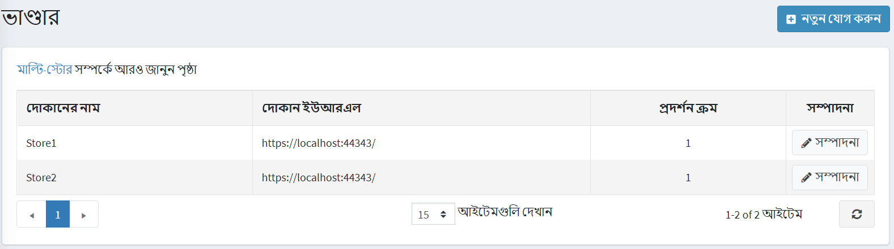
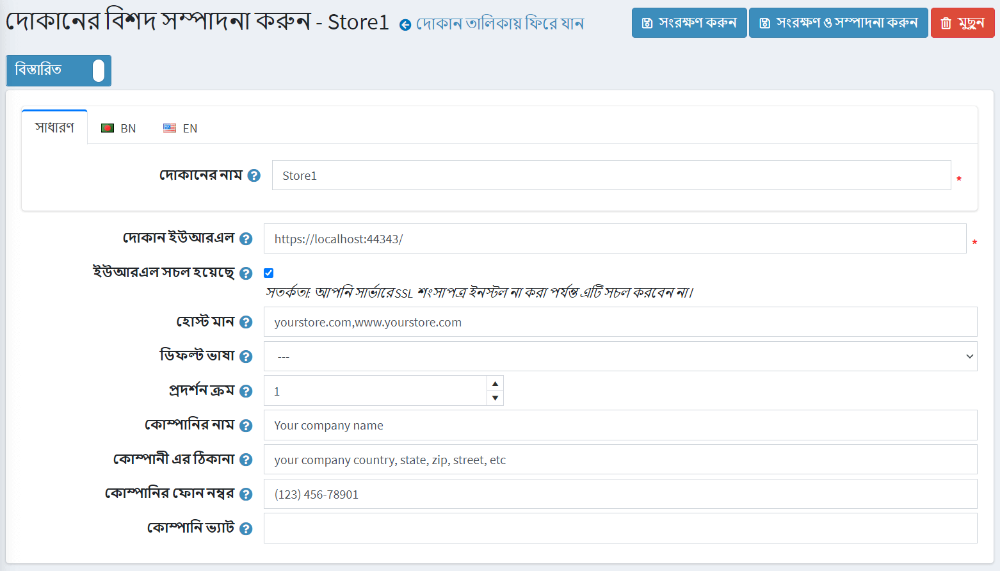

# আপনার স্টোরের তথ্য

ডিফল্ট নপকমার্স ইনস্টলেশনের দ্বারা, শুধুমাত্র একটি দোকান তৈরি করা হয় এবং কনফিগার করা প্রয়োজন, যেমনটি নিচে বর্ণিত হয়েছে।
ডিফল্ট স্টোর সেট আপ করতে, **কনফিগারেশন → স্টোরস** এ যান।

এটি কনফিগার করার জন্য একটি ডিফল্ট স্টোরের পাশে **এডিট** ক্লিক করুন।

নিম্নরূপ আপনার প্রধান দোকানের বিবরণ কনফিগার করুন:

* **স্টোরের নাম** সংজ্ঞায়িত করুন।
* **আপনার দোকানের** স্টোর ইউআরএল লিখুন।
*যদি আপনার দোকান এসএসএল সুরক্ষিত থাকে তবে **এসএসএল সক্রিয়** চেকবক্স নির্বাচন করুন। এসএসএল (সিকিউর সকেটস লেয়ার) হল একটি ওয়েব সার্ভার এবং ব্রাউজারের মধ্যে একটি এনক্রিপ্ট করা লিঙ্ক স্থাপনের জন্য মানসম্মত নিরাপত্তা প্রযুক্তি। এই লিঙ্কটি নিশ্চিত করে যে ওয়েব সার্ভার এবং ব্রাউজারের মধ্যে পাস করা সমস্ত ডেটা ব্যক্তিগত এবং অবিচ্ছেদ্য থাকবে। এসএসএল একটি শিল্প মান এবং লক্ষ লক্ষ ওয়েবসাইট তাদের গ্রাহকদের সাথে তাদের অনলাইন লেনদেনের সুরক্ষায় ব্যবহার করে।

  > [!IMPORTANT]
  >
  > আপনার সার্ভারে এসএসএল সার্টিফিকেট ইন্সটল করার পরেই এই অপশনে টিক দিন। অন্যথায়, আপনি আপনার সাইটে অ্যাক্সেস করতে পারবেন না এবং আপনার ডাটাবেসের ([স্টোর] টেবিলে) উপযুক্ত রেকর্ড ম্যানুয়ালি সম্পাদনা করতে হবে।

  > [!TIP]
  >
  > নিম্নলিখিত অধ্যায়ে এসএসএল সেট আপ করার বিষয়ে আরও পড়ুন: [এসএসএল সার্টিফিকেশন কিভাবে ইনস্টল এবং কনফিগার করবেন](xref:bn/getting-start/advanced-configuration/how-to-install-and-configure-ssl-certification)।

* **HOST মান** ক্ষেত্র হল আপনার দোকানের সম্ভাব্য HTTP_HOST মানগুলির একটি তালিকা (উদাহরণস্বরূপ, `yourstore.com`, `www.yourstore.com`)। এই ক্ষেত্রটি পূরণ করা তখনই প্রয়োজন যখন আপনার কাছে বর্তমান দোকান নির্ধারণের জন্য [মাল্টি-স্টোর সলিউশন](xref:bn/getting-start/advanced-configuration/multi-store) থাকে। এই ক্ষেত্রটি স্বতন্ত্র ইউআরএলগুলিতে অনুরোধগুলি আলাদা করতে সক্ষম করে এবং বর্তমান স্টোর নির্ধারণ করে। **সিস্টেম → সিস্টেম তথ্য** এ আপনি বর্তমান HTTP_POST মান দেখতে পারেন।
**ডিফল্ট ভাষা** ফিল্ডে, আপনার দোকানের একটি ডিফল্ট ভাষা বেছে নিন। আপনি এটিকে অনির্বাচিতও রেখে দিতে পারেন। এই ক্ষেত্রে, প্রথম পাওয়া একটি (সর্বনিম্ন ডিসপ্লে অর্ডার সহ) ব্যবহার করা হবে।
* এই দোকানের জন্য **ডিসপ্লে অর্ডার** নির্ধারণ করুন। 1 তালিকার শীর্ষে প্রতিনিধিত্ব করে।
* **কোম্পানির নাম** সংজ্ঞায়িত করুন।
* **কোম্পানির ঠিকানা** সংজ্ঞায়িত করুন।
* **আপনার কোম্পানির ফোন নম্বর** সেট করুন।
* **কোম্পানি ভ্যাট** ক্ষেত্রে, আপনার কোম্পানির ভ্যাট লিখুন (ইইউতে ব্যবহৃত)।

## আরো দেখুন

* [মাল্টি-স্টোর স্থাপন করা](xref:bn/getting-start/advanced-configuration/multi-store)
* [দেশগুলি](xref:bn/get-start/configure-shipping/advanced-configuration/countries-states)
* [ভাষা](xref:bn/get-start/advanced-configuration/localization)
* [নিরাপত্তা সেটিংস](xref:bn/get-start/advanced-configuration/security-settings)
* [পিডিএফ সেটিংস](xref:bn/getting-start/advanced-configuration/pdf-settings)
* [জিডিপিআর সেটিংস](xref:bn/getting-start/advanced-configuration/gdpr-settings)
