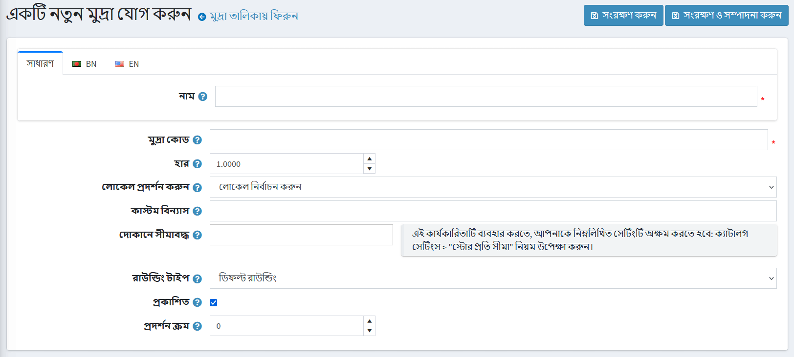

# মুদ্রা

নপকমার্স-এ, **শুধুমাত্র প্রাথমিক দোকানের মুদ্রা ব্যবহার করা হয়**। প্রাথমিক স্টোর মুদ্রা হল সেই মুদ্রা যার বিপরীতে অন্য সব অনুমোদিত মুদ্রা কনফিগার করা হবে। যদিও নপকমার্স আপনার পণ্যের মূল্য প্রদর্শনের জন্য একাধিক মুদ্রা থাকার অনুমতি দেয়, প্রাথমিক মুদ্রা অনলাইন পেমেন্ট গেটওয়েগুলির মাধ্যমে পেমেন্ট লেনদেনের জন্য ব্যবহৃত হয়।

আপনি যদি একটি অনলাইন পেমেন্ট গেটওয়ে ব্যবহার করেন (যেমন পেপাল), পেমেন্ট গেটওয়েতে টাকা পাঠানো হয় এবং প্রাথমিক স্টোরের মুদ্রায় আপনি যে মূল্য লিখেছেন তা হবে।

প্রাথমিক দোকান মুদ্রা শুধুমাত্র স্টোর প্রশাসকদের দ্বারা ব্যবহৃত হয়। এটি পণ্যের মূল্য নির্ধারণের জন্য ব্যবহৃত হয় এবং প্রকাশিত মুদ্রার সমান হতে হবে না।

আপনার যদি শুধুমাত্র একটি প্রকাশিত মুদ্রা থাকে, দোকানটি মুদ্রা নির্বাচক বা মূল্য সহ কোন মুদ্রা প্রতীক প্রদর্শন করবে না। যদি একাধিক মুদ্রা প্রকাশিত হয়, তবে সমস্ত মূল্য বর্তমানে নির্বাচিত মুদ্রা দ্বারা চিহ্নিত করা হয়। নপকমার্স কোন মুদ্রা অপসারণের সুপারিশ করে যা প্রয়োজন হয় না।

নপকমার্স প্রকাশিত মুদ্রার পরিমাণ গণনার জন্য একটি **বিনিময় হার** ব্যবহার করে। মুদ্রা যোগ বা সম্পাদনা করলে বিনিময় হার প্রবেশ করা হয়। বিকল্পভাবে, আপনি পরিমাণ গণনা করার জন্য একটি **রিয়েল-টাইম এক্সচেঞ্জ** রেট পরিষেবা ব্যবহার করতে পারেন, এবং পণ্যের মূল্য প্রদত্ত বিনিময় হার দ্বারা গুণিত হয়।

বিনিময় হার দৈনিক ভিত্তিতে ওঠানামা করে। অতএব, বর্তমান থাকার জন্য আপনি যতবার প্রয়োজন বিনিময় হার সম্পাদনা করতে পারেন। প্রকৃত লেনদেন শুধুমাত্র আপনার দোকানের প্রাথমিক মুদ্রায় পরিচালিত হয়। ক্রেডিট কার্ড লেনদেনের ক্ষেত্রে, ব্যাংকগুলি সাধারণত বর্তমান মুদ্রার মানগুলির উপর ভিত্তি করে স্বয়ংক্রিয়ভাবে বিনিময় করবে।

মুদ্রা সেটিংস নির্ধারণ করতে **কনফিগারেশন → মুদ্রা** এ যান।

**বর্তমান বিনিময় হার প্রদানকারী** ড্রপডাউন তালিকা থেকে, বিনিময় হার প্রদানকারী নির্বাচন করুন যা লাইভ রেট পেতে ব্যবহার করা হবে।

> [!NOTE]
>
> ডিফল্টরূপে ননকমার্সে শুধুমাত্র একটি বিনিময় হার প্রদানকারী পাওয়া যায় - ইসিবি। ইসিবি থেকে লাইভ রেট পেতে আপনার প্রাথমিক বিনিময় হারের মুদ্রা হিসেবে ইউরো নির্বাচন করা উচিত।

 প্রতি ঘণ্টায় মুদ্রার হারগুলির একটি স্বয়ংক্রিয় আপডেট পাওয়ার জন্য **অটো আপডেট সক্ষম** চেকবক্সে টিক দিন।

 **সেভ** ক্লিক করুন।

> [!NOTE]
>
> ডিফল্টরূপে, সমস্ত মুদ্রার হার প্রতি ঘন্টায় একবার আপডেট হয়। আপনি মুদ্রার হার আপডেট করার সেটিংস পরিবর্তন করতে পারেন **সিস্টেম → সময়সূচী কাজ**, বেছে নিন **মুদ্রা বিনিময় হার আপডেট করুন**।

## একটি নতুন মুদ্রা যোগ করুন

**নতুন যোগ করুন** বাটনে ক্লিক করুন।

মুদ্রা সেটিংস সংজ্ঞায়িত করুন:

* মুদ্রা **নাম**।
* **মুদ্রা কোড**. মুদ্রা কোডের তালিকার জন্য, এখানে যান: https://bn.wikipedia.org/wiki/ISO_4217
* মুদ্রার প্রাথমিক বিনিময় হারের বিপরীতে বিনিময় **হার** লিখুন।
* **ডিসপ্লে লোকেল** ড্রপডাউন তালিকা থেকে, মুদ্রার মানগুলির জন্য ডিসপ্লে লোকেল নির্বাচন করুন।
মুদ্রার মানগুলিতে প্রয়োগ করতে **কাস্টম ফর্ম্যাটিং** লিখুন। এই ক্ষেত্রে, আপনি পাবলিক স্টোরে প্রদর্শিত মুদ্রার জন্য কোন চিহ্ন, দশমিক স্থান সংখ্যা ইত্যাদি উল্লেখ করতে পারেন।
* **স্টোরে সীমাবদ্ধ** ড্রপ-ডাউন তালিকা থেকে একটি পূর্বনির্ধারিত দোকান নির্বাচন করুন। এই কার্যকারিতা প্রয়োজন না হলে ক্ষেত্রটি খালি রাখুন।
  > [!NOTE]
  >
> এই কার্যকারিতাটি ব্যবহার করার জন্য, আপনাকে নিম্নলিখিত সেটিংটি অক্ষম করতে হবে: **ক্যাটালগ সেটিংস "উপেক্ষা করুন" প্রতি দোকান সীমা "নিয়ম (সাইটওয়াইড)**। মাল্টি-স্টোর কার্যকারিতা সম্পর্কে আরও পড়ুন [এখানে](xref:bn/getting-start/advanced-configuration/multi-store)।

**রাউন্ডিং টাইপ** ড্রপ-ডাউন তালিকা থেকে রাউন্ডিংয়ের যে কোন একটি ধরন বেছে নিন:
  * *ডিফল্ট রাউন্ডিং*
  * *০.০৫ ব্যবধানের সাথে রাউন্ডিং (০.০৬ রাউন্ড থেকে ০.১০)*
  * *০.০৫ ব্যবধান (০.০৬ রাউন্ড থেকে ০.০৫) দিয়ে নিচে গোলাকার*
  * *০.১০ ব্যবধানে (১.০৫ রাউন্ড থেকে ১.১০)*
  * *০.১০ বিরতি দিয়ে নিচে গোলাকার (১.০৫ রাউন্ড থেকে ১.০০)*
  * *০.৫০ বিরতি দিয়ে রাউন্ডিং*
  * *১.০০ ব্যবধানে রাউন্ডিং (১.০১-১.৪৯ রাউন্ড থেকে ১.০০, ১.৫০-১.৯৯ রাউন্ড থেকে ২.০০)*
  * *১.০০ ব্যবধানে (১.০১-১.৯৯ রাউন্ড থেকে ২.০০)*

* এই মুদ্রাকে দৃশ্যমান করতে এবং আপনার দোকানের দর্শকদের দ্বারা নির্বাচিত করতে **প্রকাশিত** চেকবক্স নির্বাচন করুন। নপকমার্স একটি বহু মুদ্রার মূল্য প্রদর্শন সমর্থন করে। আপনার যদি বেশ কয়েকটি প্রকাশিত মুদ্রা থাকে, গ্রাহকরা তাদের পছন্দসই মুদ্রা নির্বাচন করতে সক্ষম হবে।
**ডিসপ্লে অর্ডার** ফিল্ডে, এই মুদ্রার ডিসপ্লে অর্ডার লিখুন। ১ এর মান তালিকার শীর্ষে প্রতিনিধিত্ব করে।

**সেভ** ক্লিক করুন।

## লাইভ রেট পান

*মুদ্রা* উইন্ডোর উপরের ডানদিকে **লাইভ রেট পান** বাটনে ক্লিক করুন। প্যানেলটি নীচের পৃষ্ঠার নীচে প্রসারিত করা হয়েছে:

এখানে **সব প্রয়োগ করুন** ক্লিক করুন অথবা **প্রয়োজনীয় হার** বোতামটি ব্যবহার করে সমস্ত প্রয়োজনীয় মুদ্রার জন্য ম্যানুয়ালি নতুন রেট প্রয়োগ করুন।

## টিউটোরিয়াল

* [নপকমার্সে মুদ্রা পরিচালনা](https://www.youtube.com/watch?v=2nzVxGyc5-M)
