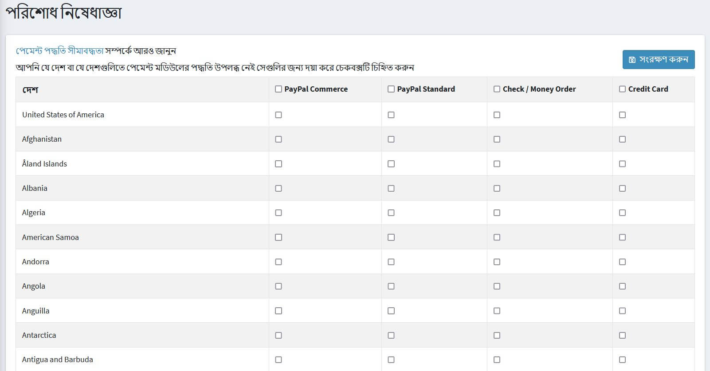

# Payment method restrictions

Payment method restrictions allow you to restrict payments coming from certain countries.

To restrict payment method go to **Configuration → Payment restrictions**.

Select the checkbox(es) for the country or countries in which you want the payment method(s) to not be available.

Click **Save**.

> [!NOTE]
> 
> If required, you can select the entire restriction column for all countries.
