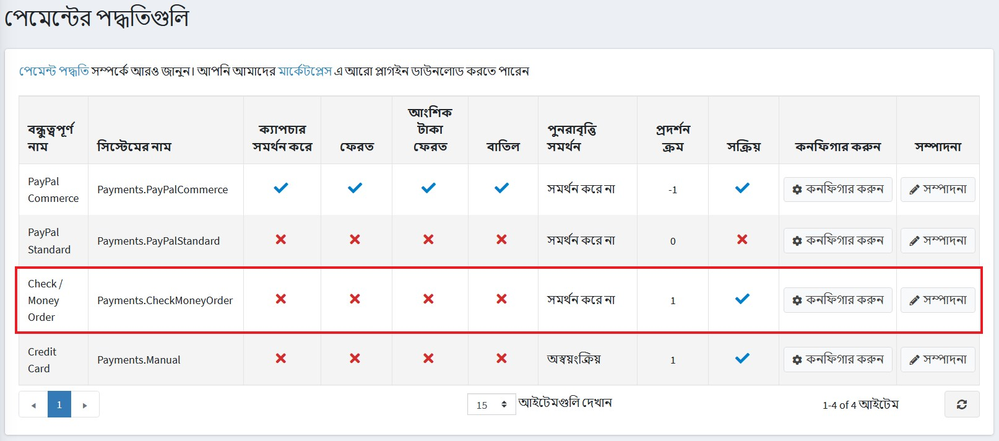
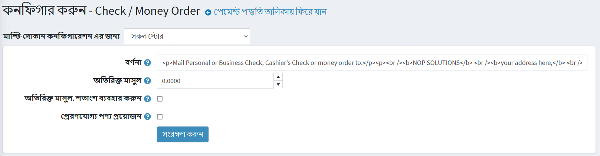
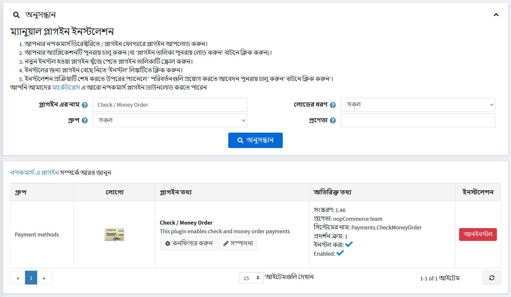
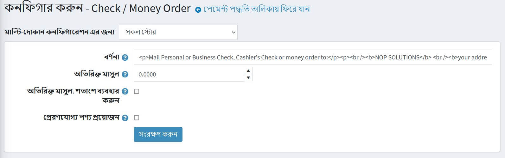

---
title: চেক/মানি অর্ডার
uid: bn/getting-started/configure-payments/payment-methods/check-money-order
author: git.AndreiMaz
contributors: git.MDRashedKhanMenon
---

# চেক/মানি অর্ডার

চেক/মানি অর্ডার প্রায়ই সরকারী সংস্থা বা বড় ব্যবসা দ্বারা ব্যবহৃত হয়। আপনার সাইটের মাধ্যমে সরাসরি অর্থ প্রদানের পরিবর্তে, ক্রেতারা অনুরোধ করবেন যে আপনি তাদের একটি **ক্রয় আদেশ (PO)** পাঠান, এবং তারা অর্থ প্রদান ফেরত পাঠাবে। বেশিরভাগ অর্ডার প্রসেসিং সফটওয়্যারের বাইরে পরিচালিত হয়।

এই পেমেন্ট পদ্ধতি কনফিগার করতে **কনফিগারেশন → পেমেন্ট পদ্ধতি** এ যান। **চেক/মানি অর্ডার (Payments.CheckMoneyOrder)** পেমেন্ট পদ্ধতির তালিকা খুঁজুন:

## পদ্ধতিটি সক্রিয় করুন, এর নাম সম্পাদন করুন এবং অর্ডার প্রদর্শন করুন

আপনি পেমেন্ট পদ্ধতির নাম সম্পাদনা করতে পারেন যা পাবলিক স্টোর বা এর ডিসপ্লে অর্ডারে গ্রাহকদের জন্য প্রদর্শিত হবে। এটি করার জন্য পেমেন্ট পদ্ধতি তালিকা পৃষ্ঠায় প্লাগইন সারিতে **সম্পাদনা করুন** বাটনে ক্লিক করুন। আপনি **বন্ধুত্বপূর্ণ নাম** এবং **ডিসপ্লে অর্ডার** লিখতে পারবেন। এই সারিতে আপনি প্লাগইনটি সক্রিয় করতে পারেন অথবা **সক্রিয়** ক্ষেত্র ব্যবহার করে এটিকে নিষ্ক্রিয় করতে পারেন। **আপডেট** বাটনে ক্লিক করুন। আপনার পরিবর্তনগুলি সংরক্ষণ করা হবে।

## পেমেন্ট পদ্ধতি কনফিগার করুন

**কনফিগারেশন → পেমেন্ট পদ্ধতিতে** চেক/মানি অর্ডার (Payments.CheckMoneyOrder) **পেমেন্ট পদ্ধতি খুঁজুন এবং** **কনফিগার করুন** বাটনে ক্লিক করুন। *কনফিগার - চেক/মানি অর্ডার* উইন্ডো প্রদর্শিত হবে, নিম্নরূপ:

নিম্নলিখিত পদ্ধতিতে পেমেন্ট পদ্ধতি সেট আপ করুন:

* **বিবরণ** ক্ষেত্রটিতে চেকআউটের সময় গ্রাহকদের দেখানো তথ্য প্রবেশ করান।
* এই পদ্ধতি ব্যবহারের জন্য **অতিরিক্ত ফি** নির্ধারণ করুন।
* **অতিরিক্ত ফি -তে। শতাংশ ব্যবহার করুন** ক্ষেত্র অর্ডার মোট একটি শতাংশ অতিরিক্ত ফি প্রয়োগ করতে হবে কিনা তা নির্ধারণ করুন। সক্ষম না হলে, একটি নির্দিষ্ট মান ব্যবহার করা হয়।
* চিপআউট চলাকালীন এই পেমেন্ট পদ্ধতি প্রদর্শন করার জন্য জাহাজযোগ্য পণ্য প্রয়োজন কিনা তা **শিপেবল পণ্য প্রয়োজন** ফিল্ড সূচক।

**সেভ** ক্লিক করুন।

## দোকান এবং গ্রাহকের ভূমিকা সীমাবদ্ধ

আপনি সঞ্চয় এবং গ্রাহকের ভূমিকা সীমিত করতে পারেন। এর মানে হল যে পদ্ধতিটি শুধুমাত্র নির্দিষ্ট দোকান বা গ্রাহকের ভূমিকার জন্য উপলব্ধ হবে। আপনি এটি *প্লাগইন তালিকা* পৃষ্ঠা থেকে করতে পারেন।

১। **কনফিগারেশন → স্থানীয় প্লাগইন** এ যান। আপনি সীমাবদ্ধ করতে চান এমন প্লাগইন খুঁজুন। আমাদের ক্ষেত্রে এটি **চেক/মানি অর্ডার**। এটি দ্রুত খুঁজে পেতে পৃষ্ঠার শীর্ষে *অনুসন্ধান* প্যানেলটি ব্যবহার করুন এবং **প্লাগইন নাম** অথবা **পেমেন্ট পদ্ধতি** বিকল্প ব্যবহার করে **গ্রুপ** দ্বারা অনুসন্ধান করুন।

২। **সম্পাদনা করুন** বাটনে ক্লিক করুন এবং *প্লাগইন বিশদ সম্পাদনা করুন* উইন্ডোটি প্রদর্শিত হবে, নিম্নরূপ:

৩। আপনি নিম্নলিখিত সীমা সেট করতে পারেন:

**গ্রাহকের ভূমিকা সীমাবদ্ধ** ক্ষেত্রটিতে এক বা একাধিক গ্রাহকের ভূমিকা বেছে নিন যেমন প্রশাসক, বিক্রেতা, অতিথি, যারা এই প্লাগইনটি ব্যবহার করতে পারবেন। আপনার যদি এই বিকল্পের প্রয়োজন না হয় তবে এই ক্ষেত্রটি খালি রাখুন।

> [!Important]
> এই কার্যকারিতাটি ব্যবহার করার জন্য, আপনাকে নিম্নলিখিত সেটিংটি অক্ষম করতে হবে: **ক্যাটালগ সেটিংস → এসিএল নিয়ম উপেক্ষা করুন (সাইটওয়াইড)**। অ্যাক্সেস নিয়ন্ত্রণ তালিকা সম্পর্কে আরও পড়ুন [এখানে](xref:bn/running-your-store/customer-management/access-control-list)।

* একটি নির্দিষ্ট দোকানে এই প্লাগইন সীমাবদ্ধ করার জন্য **সীমিত দোকানে** বিকল্পটি ব্যবহার করুন। আপনার যদি একাধিক দোকান থাকে তবে তালিকা থেকে একটি বা একাধিক নির্বাচন করুন। আপনি যদি এই বিকল্পটি ব্যবহার না করেন তবে এই ক্ষেত্রটি খালি রাখুন।

> [!Important]
> এই কার্যকারিতাটি ব্যবহার করার জন্য, আপনাকে নিম্নলিখিত সেটিংটি অক্ষম করতে হবে: **ক্যাটালগ সেটিংস "উপেক্ষা করুন" প্রতি দোকান সীমা "নিয়ম (সাইটওয়াইড)**। মাল্টি-স্টোর কার্যকারিতা সম্পর্কে আরও পড়ুন [এখানে](xref:bn/getting-start/advanced-configuration/multi-store)।

**সেভ** ক্লিক করুন।
