---
title: পেপ্যাল ​​স্মার্ট পেমেন্ট বোতাম
uid: bn/getting-started/configure-payments/payment-methods/paypal-smart-payment-buttons
author: git.mariannk
contributors: git.MDRashedKhanMenon
---

# পেপ্যাল ​​স্মার্ট পেমেন্ট বোতাম

স্মার্ট পেমেন্ট বাটন সহ পেপ্যাল ​​চেকআউট আপনার ক্রেতাদের একটি সরলীকৃত এবং নিরাপদ চেকআউট অভিজ্ঞতা দেয়। পেপ্যাল ​​বুদ্ধিমানভাবে আপনার ক্রেতাদের কাছে সবচেয়ে প্রাসঙ্গিক পেমেন্ট প্রকারগুলি উপস্থাপন করে, স্বয়ংক্রিয়ভাবে তাদের জন্য পে সহ ভেনমো, পেপ্যাল ​​ক্রেডিট, ক্রেডিট কার্ড পেমেন্ট, আইডিয়াল, ব্যাঙ্ককন্টাক্ট, সফট এবং অন্যান্য পেমেন্ট প্রকারগুলি ব্যবহার করে তাদের ক্রয় সম্পন্ন করা সহজ করে তোলে।

## চলচ্চিত্র মাধ্যমে শিক্ষা

পেপ্যাল স্মার্ট পেমেন্ট বাটন কনফিগার করতে শিখতে এই [ভিডিও টিউটোরিয়াল](https://youtu.be/lJxVqjwUFkY) দেখুন।

## পেমেন্ট পদ্ধতি কনফিগার করুন

পেপ্যাল ​​স্মার্ট পেমেন্ট বাটন প্লাগইন কনফিগার করতে **কনফিগারেশন → পেমেন্ট পদ্ধতি** এ যান। তারপর পেমেন্ট পদ্ধতি তালিকায় **পেপাল স্মার্ট পেমেন্ট বাটন** পেমেন্ট পদ্ধতি খুঁজুন:

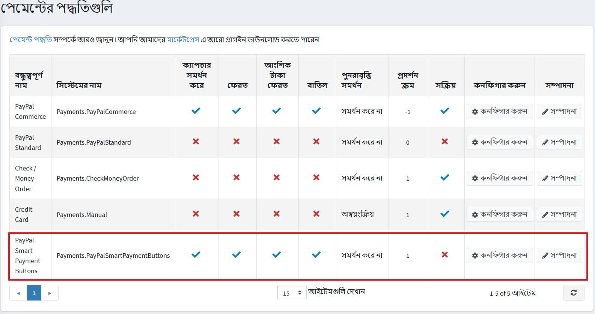

পেপ্যাল ​​স্মার্ট পেমেন্ট বাটন কনফিগার করার জন্য পরবর্তী ধাপগুলি অনুসরণ করুন:

### ১। পেমেন্ট পদ্ধতি সক্রিয় করুন

এটি করার জন্য পেমেন্ট পদ্ধতি তালিকা পৃষ্ঠায় প্লাগইন সারিতে **সম্পাদনা করুন** বাটনে ক্লিক করুন। **সক্রিয়** চেকবক্সে টিক দিয়ে প্লাগইনটি সক্রিয় করুন। **আপডেট** বাটনে ক্লিক করুন। আপনার পরিবর্তনগুলি সংরক্ষণ করা হবে।

### ২। একটি পেপ্যাল ​​অ্যাকাউন্ট তৈরি করুন

আপনার যদি ইতিমধ্যেই পেপ্যাল ​​অ্যাকাউন্ট থাকে তবে শুধু [পরবর্তী বিভাগ] (#3-সেট-আপ-দ্য পেপাল-ডেভেলপার-ড্যাশবোর্ড) -এ যান।

[পেপ্যাল](https://www.paypal.com/us/webapps/mpp/referral/paypal-business-account2?partner_id=9JJPJNNPQ7PZ8) এ একটি ব্যবসায়িক অ্যাকাউন্ট নিবন্ধন করুন । তারপর আপনার এবং আপনার ব্যবসা সম্পর্কে তথ্য পূরণ করুন:

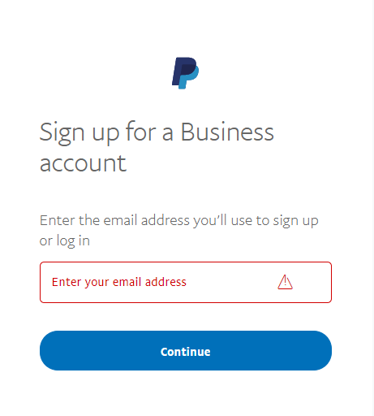

> [!NOTE]
>
> আপনার যদি ইতিমধ্যে একটি অ্যাকাউন্ট থাকে তবে আপনাকে অনুমোদনের দিকে পুননির্দেশিত করা হবে।

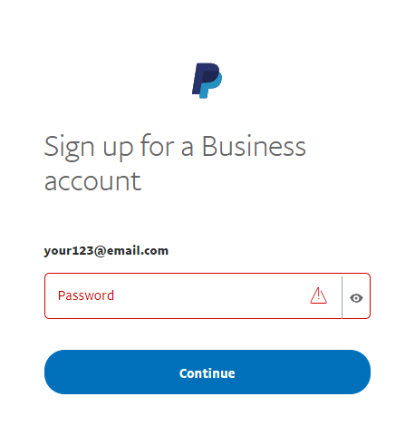

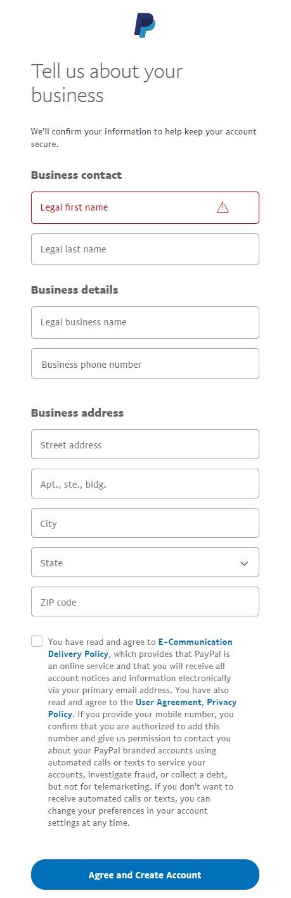

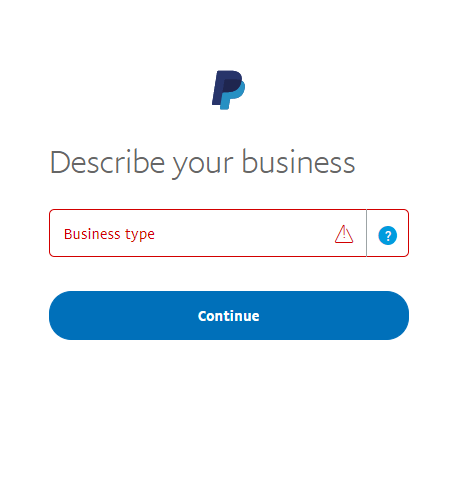

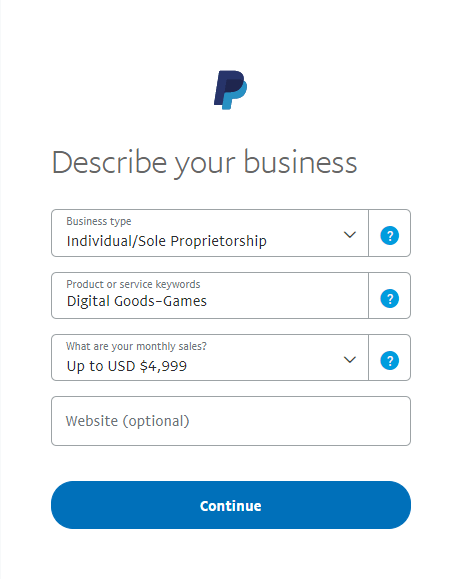

### ৩। পেপ্যাল ​​ডেভেলপার ড্যাশবোর্ড সেট আপ করুন

* আপনার পেপ্যাল ​​অ্যাকাউন্টের শংসাপত্র সহ [বিকাশকারী ড্যাশবোর্ড](https://developer.paypal.com/developer/applications) এ লগ ইন করুন।

* **আমার অ্যাপস এবং ক্রেডেনশিয়ালস** এ, লাইভ এবং স্যান্ডবক্স টেস্টিং অ্যাপের মধ্যে স্যুইচ করতে টগল ব্যবহার করুন।
    
  
* **REST API অ্যাপস** বিভাগে নেভিগেট করুন এবং **অ্যাপ তৈরি করুন** ক্লিক করুন।
    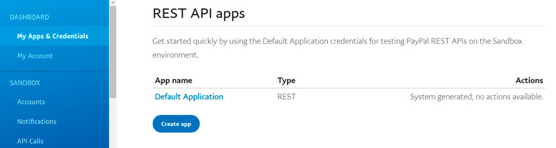

* আপনার অ্যাপের জন্য একটি নাম লিখুন এবং **অ্যাপ তৈরি করুন** ক্লিক করুন। অ্যাপের বিবরণ পৃষ্ঠা খোলে এবং আপনার পরিচয়পত্র প্রদর্শন করে।

* আপনার অ্যাপের জন্য **ক্লায়েন্ট আইডি** এবং **গোপন** কপি করে সংরক্ষণ করুন।

* আপনার অ্যাপের বিশদ পর্যালোচনা করুন এবং যদি আপনি কোনও পরিবর্তন করেন তবে আপনার অ্যাপ্লিকেশনটি সংরক্ষণ করুন।

### ৪। নপকমার্স এ পেমেন্ট পদ্ধতি কনফিগার করুন

* **কনফিগারেশন → পেমেন্ট পদ্ধতি** পেজে **পেপাল স্মার্ট পেমেন্ট বাটন** পেমেন্ট পদ্ধতি খুঁজুন এবং **কনফিগার করুন** ক্লিক করুন। *কনফিগার - পেপাল স্মার্ট পেমেন্ট বাটন* পৃষ্ঠাটি নিম্নরূপ প্রদর্শিত হবে:
    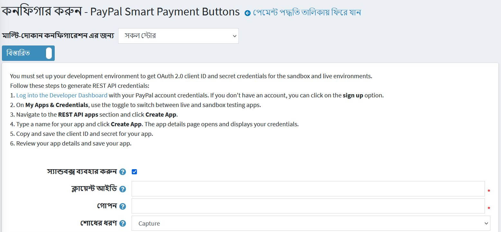

* *কনফিগার - পেপ্যাল ​​স্মার্ট পেমেন্ট বাটন* পৃষ্ঠায় নিম্নলিখিত সেটিংস সংজ্ঞায়িত করুন:
* আপনি যদি প্রথমে পেমেন্ট পদ্ধতি পরীক্ষা করতে চান তবে **স্যান্ডবক্স ব্যবহার** করুন।
* আপনি আগের ধাপে সেভ করা **ক্লায়েন্ট আইডি** লিখুন।
* আপনি আগের ধাপে সংরক্ষিত **গোপন** লিখুন।
* **পেমেন্টের ধরন** বেছে নিন অবিলম্বে পেমেন্ট ক্যাপচার করুন অথবা অর্ডার তৈরির পরে অর্ডারের জন্য পেমেন্ট অনুমোদন করুন।

* তারপর *পেপ্যাল বিশিষ্টভাবে* প্যানেলে এগিয়ে যান:
    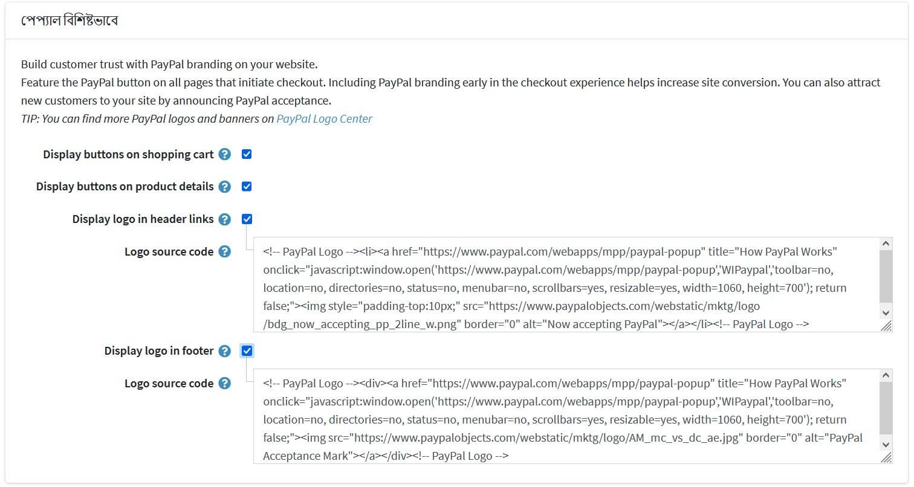
  
    এই প্যানেলে ডিসপ্লে সেটিংস সংজ্ঞায়িত করুন:

  * **শপিং কার্টে ডিসপ্লে বোতাম টিপুন** ডিফল্ট চেকআউট বোতামের পরিবর্তে শপিং কার্ট পৃষ্ঠায় পেপাল বোতাম প্রদর্শন করতে চেকবক্স।

  * পণ্যের বিবরণ পৃষ্ঠায় পেপাল বোতামগুলি প্রদর্শন করতে **পণ্যের বিবরণে প্রদর্শন** বোতামগুলি টিক দিন, তাদের উপর ক্লিক করা ডিফল্ট 'অ্যাড টু কার্ট' বোতামের আচরণের সাথে মেলে।

  * হেডার লিঙ্কে পেপ্যাল ​​লোগো প্রদর্শনের জন্য **হেডার লিঙ্কগুলিতে প্রদর্শন লোগো** চেকবক্সে টিক দিন। এই লোগো এবং ব্যানারগুলি আপনার ক্রেতাদের জানানোর একটি দুর্দান্ত উপায় যে আপনি নিরাপদে তাদের পেমেন্ট প্রক্রিয়া করার জন্য পেপ্যাল ​​বেছে নিয়েছেন।
  * যদি আগের চেকবক্সে টিক দেওয়া থাকে **লোগো সোর্স কোড** ক্ষেত্র প্রদর্শিত হয়। এই ক্ষেত্রে, লোগোর সোর্স কোড লিখুন। পেপ্যাল ​​লোগো সেন্টারে আরও লোগো এবং ব্যানার খুঁজুন। আপনি আপনার থিম এবং সাইট স্টাইলে সঠিকভাবে ফিট করার জন্য কোডটি সংশোধন করতে পারেন।

  * **পাদলেখের মধ্যে পেপ্যাল ​​লোগো প্রদর্শন করতে** পাদলেখের ডিসপ্লে লোগো চেকবক্সে টিক দিন। এই লোগো এবং ব্যানারগুলি আপনার ক্রেতাদের জানানোর একটি দুর্দান্ত উপায় যে আপনি নিরাপদে তাদের পেমেন্ট প্রক্রিয়া করার জন্য পেপ্যাল ​​বেছে নিয়েছেন।
  * যদি আগের চেকবক্সে টিক দেওয়া থাকে **লোগো সোর্স কোড** ক্ষেত্র প্রদর্শিত হয়। এই ক্ষেত্রে, লোগোর সোর্স কোড লিখুন। পেপ্যাল ​​লোগো সেন্টারে আরও লোগো এবং ব্যানার খুঁজুন। আপনি আপনার থিম এবং সাইট স্টাইলে সঠিকভাবে ফিট করার জন্য কোডটি সংশোধন করতে পারেন।

প্লাগইন সেটিংস সেভ করতে **সেভ** ক্লিক করুন।

## দোকান এবং গ্রাহকের ভূমিকা সীমাবদ্ধ

আপনি সঞ্চয় এবং গ্রাহকের ভূমিকা সীমিত করতে পারেন। এর মানে হল যে পদ্ধতিটি শুধুমাত্র নির্দিষ্ট দোকান বা গ্রাহকের ভূমিকার জন্য উপলব্ধ হবে। আপনি এটি *প্লাগইন তালিকা* পৃষ্ঠা থেকে করতে পারেন।

* **কনফিগারেশন → স্থানীয় প্লাগইন** এ যান। আপনি সীমাবদ্ধ করতে চান এমন প্লাগইন খুঁজুন। আমাদের ক্ষেত্রে এটি **পেপাল স্মার্ট পেমেন্ট বাটন**। এটি দ্রুত খুঁজে পেতে পৃষ্ঠার শীর্ষে *অনুসন্ধান* প্যানেলটি ব্যবহার করুন এবং **প্লাগইন নাম** অথবা **পেমেন্ট পদ্ধতি** বিকল্প ব্যবহার করে **গ্রুপ** দ্বারা অনুসন্ধান করুন।

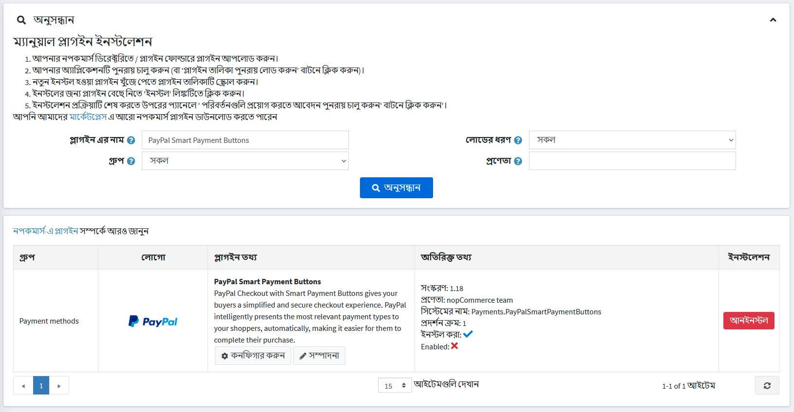

* **সম্পাদনা** বাটনে ক্লিক করুন এবং *প্লাগইন বিশদ সম্পাদনা করুন* উইন্ডো প্রদর্শিত হবে, নিম্নরূপ:

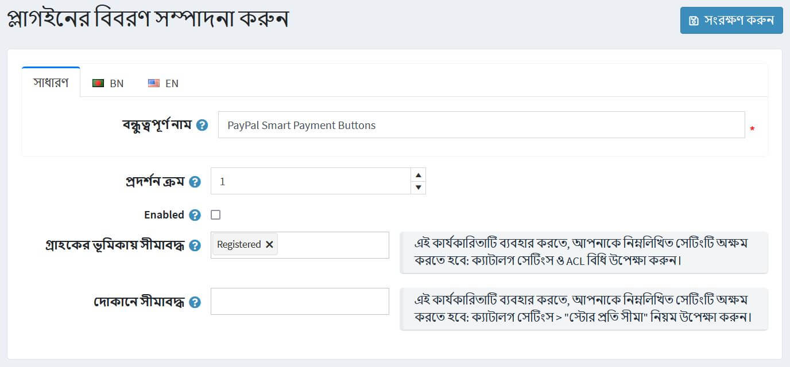

* আপনি নিম্নলিখিত সীমা সেট করতে পারেন:

**গ্রাহকের ভূমিকা সীমাবদ্ধ** ক্ষেত্রটিতে এক বা একাধিক গ্রাহকের ভূমিকা বেছে নিন যেমন প্রশাসক, বিক্রেতা, অতিথি, যারা এই প্লাগইনটি ব্যবহার করতে পারবেন। আপনার যদি এই বিকল্পের প্রয়োজন না হয় তবে এই ক্ষেত্রটি খালি রাখুন।

> [!Important]
> এই কার্যকারিতাটি ব্যবহার করার জন্য, আপনাকে নিম্নলিখিত সেটিংটি অক্ষম করতে হবে: **ক্যাটালগ সেটিংস → এসিএল নিয়ম উপেক্ষা করুন (সাইটওয়াইড)**। অ্যাক্সেস নিয়ন্ত্রণ তালিকা সম্পর্কে আরও পড়ুন [এখানে](xref:bn/running-your-store/customer-management/access-control-list)।

* একটি নির্দিষ্ট দোকানে এই প্লাগইন সীমাবদ্ধ করার জন্য **সীমিত দোকানে** বিকল্পটি ব্যবহার করুন। আপনার যদি একাধিক দোকান থাকে তবে তালিকা থেকে একটি বা একাধিক নির্বাচন করুন। আপনি যদি এই বিকল্পটি ব্যবহার না করেন তবে এই ক্ষেত্রটি খালি রাখুন।

> [!Important]
>এই কার্যকারিতাটি ব্যবহার করার জন্য, আপনাকে নিম্নলিখিত সেটিংটি অক্ষম করতে হবে: **ক্যাটালগ সেটিংস → এসিএল নিয়ম "উপেক্ষা করুন" প্রতি দোকান সীমা "নিয়ম (সাইটওয়াইড)**। মাল্টি-স্টোর কার্যকারিতা সম্পর্কে আরও পড়ুন [এখানে](xref:bn/getting-start/advanced-configuration/multi-store)।

**সংরক্ষণ** ক্লিক করুন।
