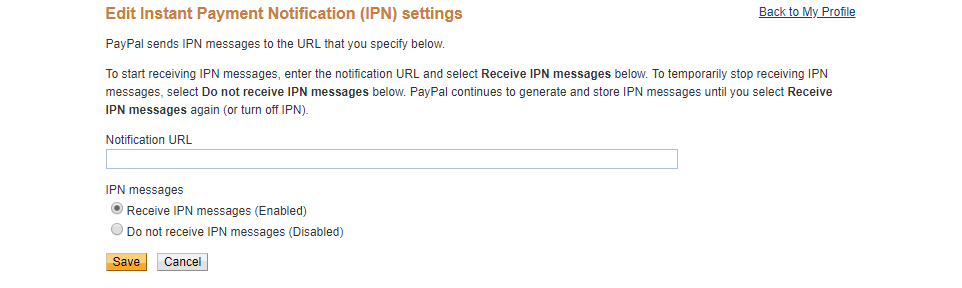
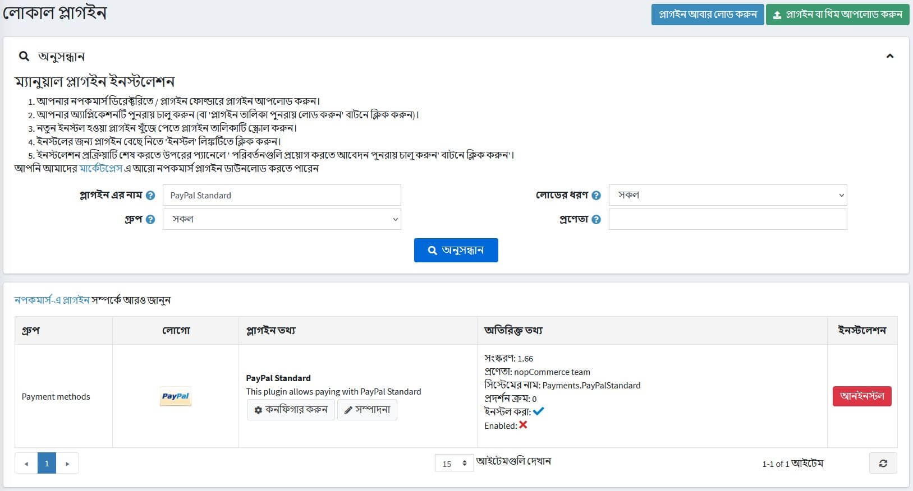

# পেপ্যাল ​​স্ট্যান্ডার্ড

অনলাইনে ক্রেডিট কার্ড এবং পেপ্যাল ​​পেমেন্ট নিরাপদভাবে গ্রহণ করার সবচেয়ে সহজ উপায় হল পেপ্যাল ​​স্ট্যান্ডার্ড।

পেপ্যাল ​​স্ট্যান্ডার্ড প্লাগইন কনফিগার করতে **কনফিগারেশন → পেমেন্ট পদ্ধতি** এ যান। তারপর পেমেন্ট পদ্ধতি তালিকায় **পেপাল স্মার্ট পেমেন্ট বাটন** পেমেন্ট পদ্ধতি খুঁজুন:

## পদ্ধতিটি সক্রিয় করুন, এর নাম সম্পাদন করুন এবং অর্ডার প্রদর্শন করুন

আপনি পেমেন্ট পদ্ধতির নাম সম্পাদনা করতে পারেন যা পাবলিক স্টোর বা এর ডিসপ্লে অর্ডারে গ্রাহকদের জন্য প্রদর্শিত হবে। এটি করার জন্য পেমেন্ট পদ্ধতি তালিকা পৃষ্ঠায় প্লাগইন সারিতে **সম্পাদনা করুন** বাটনে ক্লিক করুন। আপনি **বন্ধুত্বপূর্ণ নাম** এবং **ডিসপ্লে অর্ডার** লিখতে পারবেন। এই সারিতে আপনি প্লাগইনটি সক্রিয় করতে পারেন অথবা **সক্রিয়** ক্ষেত্র ব্যবহার করে এটিকে নিষ্ক্রিয় করতে পারেন। **আপডেট** বাটনে ক্লিক করুন। আপনার পরিবর্তনগুলি সংরক্ষণ করা হবে।

## পেমেন্ট পদ্ধতি কনফিগার করুন

পেমেন্ট পদ্ধতি হিসাবে **পেপ্যাল ​​স্ট্যান্ডার্ড** প্লাগইন ব্যবহার করতে অনুগ্রহ করে এই পদক্ষেপগুলি অনুসরণ করুন:

১। Www.paypal.com এ একটি ব্যবসায়িক অ্যাকাউন্ট নিবন্ধন করুন। লিঙ্কটি অনুসরণ করুন [https://www.paypal.com/bizsignup/](https://www.paypal.com/bizsignup/)। তারপর আপনার এবং আপনার ব্যবসা সম্পর্কে তথ্য পূরণ করুন:

   

   > [!NOTE]
   >
   > আপনার যদি ইতিমধ্যে একটি অ্যাকাউন্ট থাকে তবে আপনাকে অনুমোদনের দিকে পুননির্দেশিত করা হবে।

   

   

   

   

২। উপরের ন্যাভিগেশন বারে, **সেটিংস** আইকনে ক্লিক করুন 

৩। বাম প্যানেলে **ওয়েবসাইট পেমেন্ট** নির্বাচন করুন এবং **ওয়েবসাইট পছন্দ** লাইনে **আপডেট** এ ক্লিক করুন।

   
৪। **ওয়েবসাইটের পেমেন্টের জন্য অটো রিটার্ন** বিভাগে সুইচটি সেট করুন **অন**। আমাদের ক্ষেত্রে এটি `http://localhost:15536/Plugins/PaymentPayPalStandard/PDTHandler` কিন্তু আপনার সাইটের ইউআরএল দিয়ে localhost প্রতিস্থাপন করতে ভুলবেন না।

   
৫। **পেমেন্ট ডেটা ট্রান্সফার** বিভাগে সুইচটি **অন** এ সেট করুন এবং **আইডেন্টিটি টোকেন কপি করুন।**

   
৬। নপকমার্স এর অ্যাডমিন প্যানেলে প্লাগইন কনফিগার করতে **কনফিগারেশন → পেমেন্ট পদ্ধতি** এ যান। **পেপ্যাল ​​স্ট্যান্ডার্ড** লাইনে **কনফিগার** এ ক্লিক করুন।

   

৭। **বিজনেস ইমেইল** ফিল্ডে paypal.com- এ একটি বিজনেস অ্যাকাউন্ট রেজিস্টার করার সময় নির্দিষ্ট একটি ইমেইল লিখুন।

৮। **পিডিটি আইডেন্টিটি টোকেন** ফিল্ডে কপি করা **আইডেন্টিটি টোকেন** ক্লজ #5 থেকে লিখুন।

৯। ক্লিক করুন **সংরক্ষণ করুন**।

**আইপিএন**(তাত্ক্ষণিক পেমেন্ট বিজ্ঞপ্তি) সক্রিয়করণের জন্য:

১০। বাম প্যানেলে **বিজ্ঞপ্তি** নির্বাচন করুন এবং তাত্ক্ষণিক পেমেন্ট বিজ্ঞপ্তি **লাইনে আপডেট করুন** লাইনে ক্লিক করুন।

   

১১। **আইপিএন** সম্পর্কিত তথ্যের সাথে নিজেকে পরিচিত করুন এবং **আইপিএন সেটিংস চয়ন করুন** ক্লিক করুন।

   

১২। **আইপিএন বার্তা গ্রহণ করুন (সক্ষম)** নির্বাচন করুন। **নোটিফিকেশন ইউআরএল হিসাবে** আপনার আইপিএন হ্যান্ডলারের ইউআরএল লিখুন।

   

১৩। ক্লিক করুন **সংরক্ষণ করুন।** আপনি একটি বার্তা পাবেন যে আপনি সফলভাবে আইপিএন সক্রিয় করেছেন।

> [!NOTE]
>
> তাত্ক্ষণিক পেমেন্ট বিজ্ঞপ্তি (আইপিএন) হল পেপালের বার্তা পরিষেবা যা একটি লেনদেন প্রভাবিত হলে একটি বিজ্ঞপ্তি পাঠায়। একবার আইপিএন ইন্টিগ্রেটেড হয়ে গেলে, বিক্রেতারা তাদের ব্যাক অফিস স্বয়ংক্রিয় করতে পারেন যাতে অর্ডার পূরণ করতে তাদের অর্থ প্রদানের জন্য অপেক্ষা করতে হয় না।

## দোকান এবং গ্রাহকের ভূমিকা সীমাবদ্ধ

আপনি সঞ্চয় এবং গ্রাহকের ভূমিকা সীমিত করতে পারেন। এর মানে হল যে পদ্ধতিটি শুধুমাত্র নির্দিষ্ট দোকান বা গ্রাহকের ভূমিকার জন্য উপলব্ধ হবে। আপনি এটি *প্লাগইন তালিকা* পৃষ্ঠা থেকে করতে পারেন।

১৪। **কনফিগারেশন → স্থানীয় প্লাগইন** এ যান। আপনি সীমাবদ্ধ করতে চান এমন প্লাগইন খুঁজুন। আমাদের ক্ষেত্রে এটি **পেপ্যাল ​​স্ট্যান্ডার্ড**। এটি দ্রুত খুঁজে পেতে পৃষ্ঠার শীর্ষে *অনুসন্ধান* প্যানেলটি ব্যবহার করুন এবং **প্লাগইন নাম** অথবা **পেমেন্ট পদ্ধতি** বিকল্প ব্যবহার করে **গ্রুপ** দ্বারা অনুসন্ধান করুন।

   

১৫। **সম্পাদনা করুন** বাটনে ক্লিক করুন এবং *প্লাগইন বিশদ সম্পাদনা করুন* উইন্ডোটি প্রদর্শিত হবে, নিম্নরূপ:

   

১৬। আপনি নিম্নলিখিত সীমা সেট করতে পারেন:

   - **গ্রাহকের ভূমিকা সীমিত** ক্ষেত্রের মধ্যে এক বা একাধিক গ্রাহকের ভূমিকা বেছে নিন যেমন প্রশাসক, বিক্রেতা, অতিথি, যারা এই প্লাগইনটি ব্যবহার করতে পারবেন। আপনার যদি এই বিকল্পের প্রয়োজন না হয় তবে এই ক্ষেত্রটি খালি রাখুন।

     > [!IMPORTANT]
     >
     > এই কার্যকারিতাটি ব্যবহার করার জন্য, আপনাকে নিম্নলিখিত সেটিংটি অক্ষম করতে হবে: **ক্যাটালগ সেটিংস → এসিএল নিয়ম উপেক্ষা করুন (সাইটওয়াইড)**। অ্যাক্সেস নিয়ন্ত্রণ তালিকা সম্পর্কে আরও পড়ুন [এখানে](xref:bn/running-your-store/customer-management/access-control-list)।

   - একটি নির্দিষ্ট দোকানে এই প্লাগইন সীমাবদ্ধ করার জন্য **সীমিত দোকানে** বিকল্পটি ব্যবহার করুন। আপনার যদি একাধিক দোকান থাকে তবে তালিকা থেকে একটি বা একাধিক নির্বাচন করুন। আপনি যদি এই বিকল্পটি ব্যবহার না করেন তবে এই ক্ষেত্রটি খালি রাখুন।

     > [!IMPORTANT]
     >
     > এই কার্যকারিতাটি ব্যবহার করার জন্য, আপনাকে নিম্নলিখিত সেটিংটি অক্ষম করতে হবে: **ক্যাটালগ সেটিংস "উপেক্ষা করুন" প্রতি দোকান সীমা "নিয়ম (সাইটওয়াইড)**। মাল্টি-স্টোর কার্যকারিতা সম্পর্কে আরও পড়ুন [এখানে](xref:bn/getting-start/advanced-configuration/multi-store)।

   - **সেভ** ক্লিক করুন।

## জ্ঞাত সমস্যা

### ত্রুটি: এই মুহূর্তে জিনিসগুলি কাজ করছে বলে মনে হচ্ছে না (পেপ্যাল)

যদি আপনি উপরের ত্রুটিটি দেখেন "এই মুহূর্তে জিনিসগুলি কাজ করছে বলে মনে হচ্ছে না। অনুগ্রহ করে পরে আবার চেষ্টা করুন"

ত্রুটি আপনার পেপ্যাল ​​অ্যাকাউন্টের মধ্যে একটি সেটিং দ্বারা সৃষ্ট হয়।

**ধাপ ১**: "পণ্য ও পরিষেবা" এর অধীনে বাম সাইডবারে "ওয়েবসাইট পেমেন্ট" ক্লিক করুন

**ধাপ ২**: "ওয়েবসাইট পছন্দ" বিভাগের পাশে "আপডেট" ক্লিক করুন

**ধাপ ৩**: "এনক্রিপ্টেড ওয়েবসাইট পেমেন্টস" বিভাগে স্ক্রোল করুন এবং ডান দিক থেকে "বন্ধ" নির্বাচন করুন এবং তারপরে আপনার পরিবর্তনগুলি সংরক্ষণ করুন।

পরিবর্তনটি সংরক্ষণ করার পরে আপনি আপনার সাইটে ফিরে যেতে পারেন এবং আবার বোতাম/ফর্মগুলি চেষ্টা করুন এবং সেগুলি কাজ করা উচিত।
