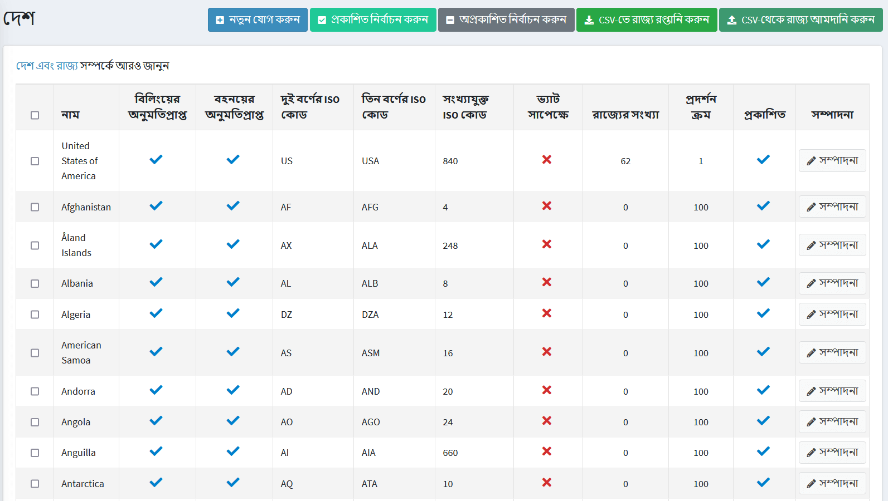

# দেশ, রাজ্য

এই বিভাগ কীভাবে দেশগুলি (যেখানে আপনার গ্রাহকরা অবস্থিত) এবং রাজ্যগুলি পরিচালনা করতে বর্ণনা করে।

দেশ এবং রাজ্য সংজ্ঞায়িত করতে **কনফিগারেশন → দেশ** এ যান।

> [!TIP]
> 
> ডিফল্টরূপে, সমস্ত দেশ আপলোড করা হয়। আপনি দেশগুলি নির্বাচন করে এবং পৃষ্ঠার শীর্ষে সংশ্লিষ্ট বোতামে ক্লিক করে *প্রকাশ* এবং *অপ্রকাশিত* করতে পারেন।

## একটি নতুন দেশ যুক্ত করুন

একটি নতুন দেশ যুক্ত করতে **নতুন যোগ করুন** ক্লিক করুন।

*দেশের তথ্য* প্যানেলে নিম্নলিখিত দেশের সেটিংস সংজ্ঞায়িত করুন:

* দেশের **নাম**।
* **এই দেশে অবস্থিত গ্রাহকদের বিলিং করার অনুমতি দেয়**
* **এই দেশে অবস্থিত গ্রাহকদের** শিপিংয়ের অনুমতি দেয়।
* এই দেশের **দুই অক্ষরের আইএসও** কোড লিখুন।
* এই দেশের **তিনটি অক্ষর আইএসও** কোড লিখুন।
* এই দেশের **সংখ্যাসূচক আইএসও কোড** কোড লিখুন।
* **ভ্যাট -এর বিষয়** চেকবক্স নির্বাচন করুন, এই দেশের গ্রাহকদের ইইউ ভ্যাট (ইউরোপীয় ইউনিয়ন ভ্যালু অ্যাডেড ট্যাক্স) আদায় করা হয় কিনা তা নির্দেশ করতে।

> [!NOTE]
>
> এই ক্ষেত্রটি কেবল তখনই ব্যবহার করা হয় যখন কর সেটিংস পৃষ্ঠায় ইইউ ভ্যাট বিকল্প সক্রিয় থাকে (**কনফিগারেশন → সেটিংস → ট্যাক্স সেটিংস**)।

* একটি নির্দিষ্ট স্টোরকে একটি দেশে বেঁধে দিতে **স্টোরের মধ্যে সীমিত** স্টোরে প্রয়োজনীয় স্টোর নির্বাচন করুন, নিম্নরূপ:

> [!NOTE]
>
> এই তালিকাটি তখনই ব্যবহৃত হয় যখন আপনার বেশ কয়েকটি দোকান কনফিগার থাকে। আরও তথ্যের জন্য [মাল্টি-স্টোর](xref:bn/get-start/advanced-configuration/multi-store) পড়ুন।

* নতুন প্রকাশিত নিবন্ধনের জন্য এবং শিপিং এবং বিলিং ঠিকানা তৈরির জন্য এই দেশকে দৃশ্যমান করতে **প্রকাশিত** চেকবক্সে টিক দিন।
* এই দেশের **ডিসপ্লে অর্ডার** লিখুন। ১ এর মান তালিকার শীর্ষে প্রতিনিধিত্ব করে।

**সেভ** ক্লিক করুন।

## নতুন রাজ্য এবং প্রদেশ যোগ করা

*রাজ্য এবং প্রদেশ* প্যানেলে, আপনি দেশের রাজ্য এবং প্রদেশ যোগ করতে পারেন।

> [!TIP]
>
> ডিফল্টরূপে, মার্কিন যুক্তরাষ্ট্রের রাজ্যগুলি যোগ করা হয়।

একটি নতুন রাজ্য বা প্রদেশ যুক্ত করতে প্যানেলের নীচে **একটি নতুন রাজ্য/প্রদেশ যোগ করুন** বাটনে ক্লিক করুন।

নিম্নলিখিত রাজ্য/প্রদেশের বিবরণ সংজ্ঞায়িত করুন:

* **রাজ্য বা প্রদেশের নাম**
* **প্রদেশ বা রাজ্যের জন্য সংক্ষিপ্তকরণ**।
* ওয়েবসাইটটিতে রাজ্য বা প্রদেশ প্রকাশ করতে **প্রকাশিত** চেকবক্সে টিক দিন।
* **ডিসপ্লে অর্ডার** ফিল্ডে, এই প্রদেশ বা রাজ্যের ডিসপ্লে অর্ডার লিখুন। ১ এর মান তালিকার শীর্ষে প্রতিনিধিত্ব করে।

**সেভ** ক্লিক করুন

## রপ্তানি/আমদানি রাজ্য

আপনি সিস্টেমে যোগ করা সমস্ত দেশের রাজ্যের একটি তালিকা রপ্তানি করতে পারেন, অথবা **কনফিগারেশন → দেশ** পৃষ্ঠার শীর্ষে সংশ্লিষ্ট বোতামগুলি ব্যবহার করে অতিরিক্তগুলি আমদানি করতে পারেন।

> [!NOTE]
> 
> আমদানি করা আপনার ফাইলের ফর্ম্যাটটি রপ্তানি করা ফাইলটির মতো হওয়া উচিত।