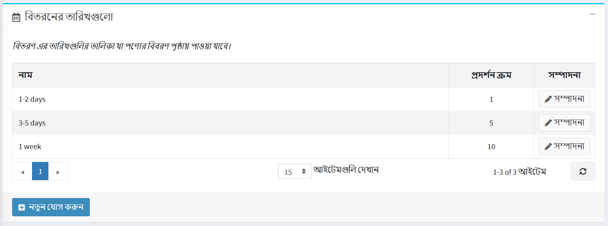
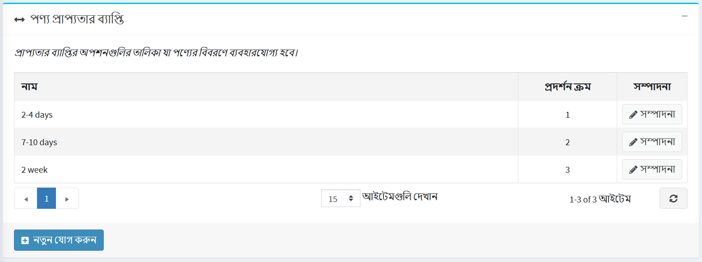
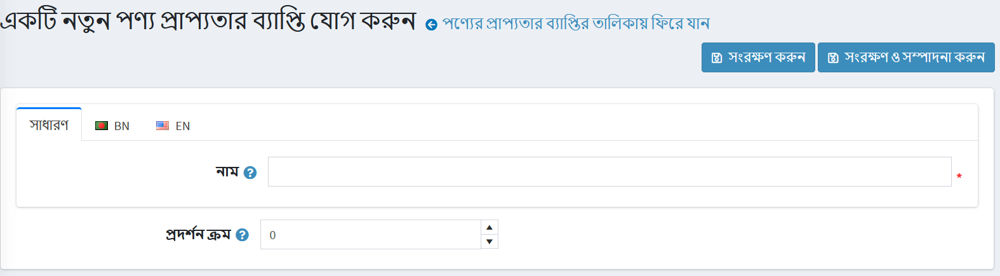

# তারিখ এবং রেঞ্জ

## ডেলিভারির তারিখ

ডেলিভারির তারিখ হল সময়সীমা যা গ্রাহকের কাছে আনুমানিক ডেলিভারি সময় প্রদর্শন করে। বিতরণের তারিখ পণ্যগুলিতে প্রয়োগ করা যেতে পারে এবং পণ্যের বিবরণ পৃষ্ঠাগুলিতে প্রদর্শিত হতে পারে।

**কনফিগারেশন → শিপিং → তারিখ এবং রেঞ্জ** এ যান। নিম্নলিখিত দুটি প্যানেল *তারিখ এবং রেঞ্জ* উইন্ডোতে প্রদর্শিত হবে:

### ডেলিভারির তারিখের প্যানেল

**নতুন যোগ করুন** ক্লিক করুন। *একটি নতুন ডেলিভারি তারিখ যোগ করুন* উইন্ডো প্রদর্শিত হয়:

* **নাম** ক্ষেত্রের মধ্যে, নতুন বিতরণের তারিখের নাম লিখুন, সাধারণত, এটি একটি তারিখ পরিসীমা।
* **ডিসপ্লে অর্ডার** ফিল্ডে, এই ডেলিভারির তারিখের ডিসপ্লে অর্ডার লিখুন। ১ তালিকার শীর্ষে প্রতিনিধিত্ব করে।

**সেভ** বাটনে ক্লিক করুন।

### পণ্যের প্রাপ্যতা পরিসীমা প্যানেল

এখানে আপনি পণ্যের প্রাপ্যতা রেঞ্জ সেট করতে পারেন। এই বিকল্পগুলি পণ্য সম্পাদনা পৃষ্ঠায় প্রদর্শিত হবে।

আপনার নিজস্ব পরিসর যোগ করতে **নতুন যোগ করুন** ক্লিক করুন। *একটি নতুন পণ্য প্রাপ্যতা পরিসীমা যোগ করুন* উইন্ডো প্রদর্শিত হয়:

* **নাম** ক্ষেত্রটিতে নতুন পরিসরের নাম লিখুন, উদাহরণস্বরূপ, ২ মাস।
* **ডিসপ্লে অর্ডার** ফিল্ডে, এই প্রাপ্যতা পরিসরের ডিসপ্লে অর্ডার লিখুন। ১ তালিকার শীর্ষে প্রতিনিধিত্ব করে।

**সেভ** বাটনে ক্লিক করুন।