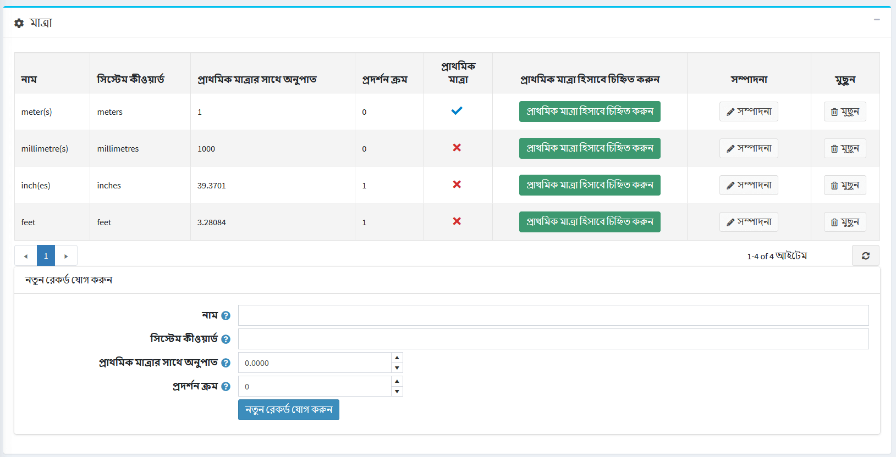
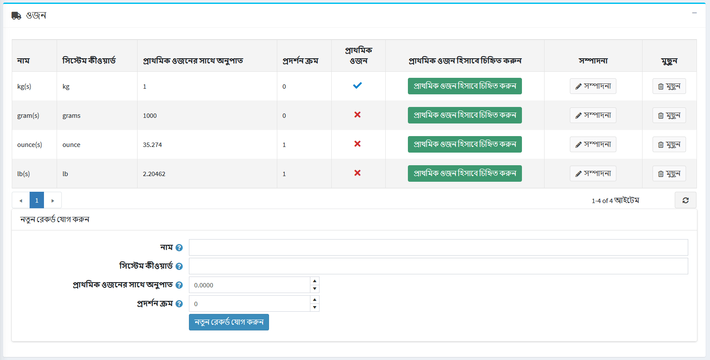

# পরিমাপ 

এই বিভাগে বর্ণনা করা হয়েছে কিভাবে ওজন এবং মাত্রার নতুন একক যোগ করা যায়।

নতুন মাত্রা বা ওজন যোগ করতে:

**কনফিগারেশন → শিপিং → পরিমাপ** এ যান। *মাত্রা* এবং *ওজন* বিভাগগুলি নিম্নরূপ বর্ধিত করা হয়েছে:

বিভাগের নীচে নিম্নলিখিত নতুন ইউনিটের বিবরণ সংজ্ঞায়িত করুন:
* **নতুন মাত্রা (ওজন) ইউনিটের নাম**।
* এই ইউনিটের জন্য **সিস্টেম কীওয়ার্ড**।
* **প্রাথমিক মাত্রার অনুপাত (ওজন)** একক।
* **তালিকাতে পরিমাপের ক্রম প্রদর্শন করুন। ১ এর মান তালিকার শীর্ষে প্রতিনিধিত্ব করে।

তারপর **নতুন রেকর্ড যোগ করুন** ক্লিক করুন।

নতুন মাত্রা (ওজন) ইউনিট *মাত্রা* (*ওজন*) টেবিলে যোগ করা হয়েছে।

> [!NOTE]
>
> আপনি প্রাথমিক মাত্রা (ওজন) **প্রাথমিক মাত্রা (ওজন)** হিসাবে চিহ্নিত করে ক্লিক করে সেট করতে পারেন।

উপরে বর্ণিত হিসাবে পরিমাপের বিবরণ সম্পাদনা করতে তার পাশে **সম্পাদনা করুন** ক্লিক করুন।
