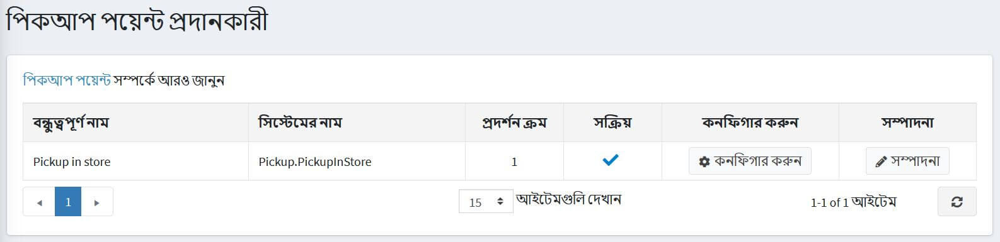
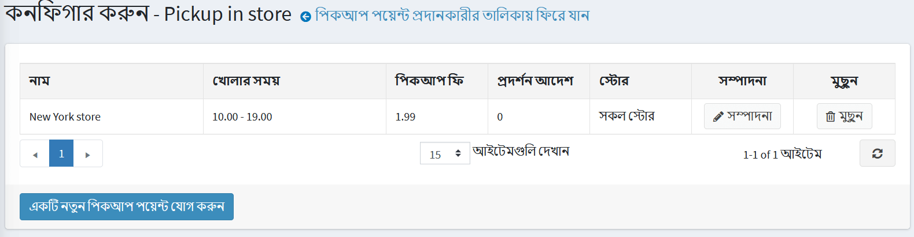
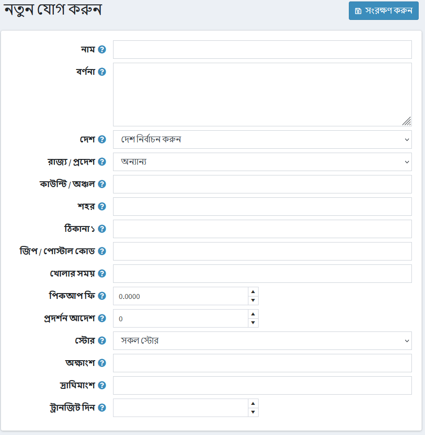

# পিকআপ পয়েন্ট

পিকআপ পয়েন্ট হল একটি বিকল্প যেখানে গ্রাহকরা পার্সেল পেতে পারে এমন একটি পয়েন্ট নির্বাচন করার নমনীয়তা প্রদান করে।

> [!NOTE]
>
> এই বিকল্পটি তখনই পাওয়া যাবে যখন চেকবক্স **"পিক আপ ইন স্টোর" সক্ষম** শিপিং সেটিংস পৃষ্ঠায় টিক দেওয়া থাকে (**কনফিগারেশন → সেটিংস → শিপিং সেটিংস**)।

পিকআপ পয়েন্ট প্রদানকারীদের পরিচালনা করতে:

**কনফিগারেশন → শিপিং → পিকআপ পয়েন্ট** এ যান,*পিকআপ পয়েন্ট প্রদানকারী* পৃষ্ঠা প্রদর্শিত হয়:

ডিফল্টরূপে, শুধুমাত্র একটি **পিকআপ ইন স্টোর** বিকল্প উপলব্ধ। পিকআপ পয়েন্ট প্রদানকারী সক্রিয় আছে তা নিশ্চিত করুন। যদি না হয় তবে **এডিট** বাটনে ক্লিক করুন এবং **সক্রিয়** কলামের চেকবক্সে টিক দিন। তারপর **আপডেট** বাটনে ক্লিক করে পরিবর্তনগুলি সংরক্ষণ করুন।

বিদ্যমান পিকআপ পয়েন্ট সম্পাদনা করতে অথবা গ্রিডে নতুন **কনফিগার** ক্লিক করুন। *কনফিগার - পিকআপ ইন স্টোর* পৃষ্ঠা খোলা হবে:

ক্লিক করুন **একটি নতুন পিকআপ পয়েন্ট যোগ করুন**,*নতুন যোগ করুন* উইন্ডো প্রদর্শিত হবে:

নিম্নলিখিত বিবরণ সংজ্ঞায়িত করুন:

* **পিকআপ পয়েন্টের নাম**।
* **বর্ণনা** প্রয়োজন হলে।
* ড্রপ-ডাউন তালিকা থেকে একটি **দেশ** নির্বাচন করুন।
* ড্রপ-ডাউন তালিকা থেকে একটি **রাজ্য/প্রদেশ** নির্বাচন করুন।
* **শহর**।
* **ঠিকানা ১**.
* **জিপ/পোস্টাল কোড**।
* পিকআপ পয়েন্ট **খোলার সময়**।
* **পিকআপ ফি** প্রয়োজন।
* **এই পিকআপ পয়েন্টের ডিসপ্লে অর্ডার**।
* **এই স্টোর (গুলি)** এই পিকআপ পয়েন্ট ব্যবহার করে।

**পরিবর্তনগুলোর সংরক্ষন করুন**

আগে প্রবেশ করা বিবরণ সম্পাদনা করতে পিকআপ পয়েন্টের পাশে **সম্পাদনা করুন** ক্লিক করুন।