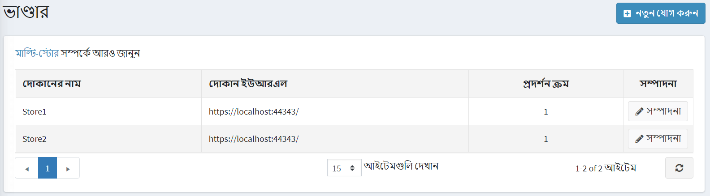
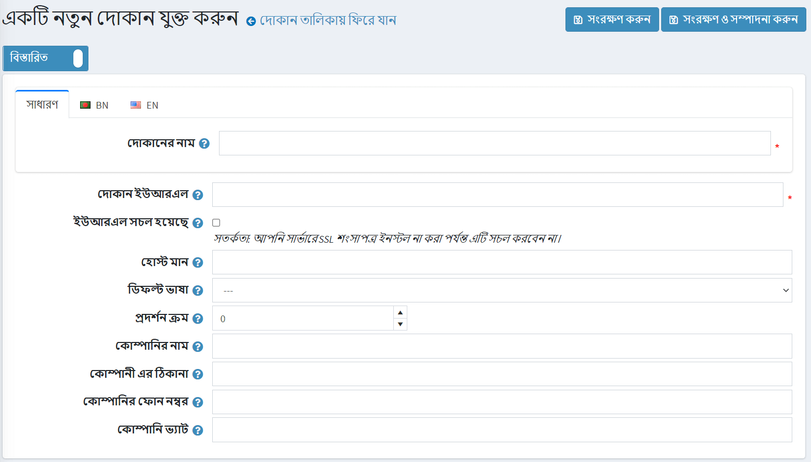
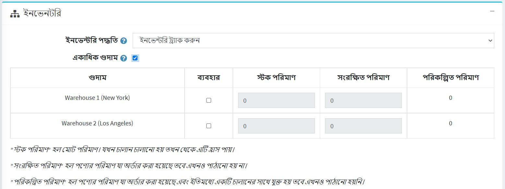

# গুদাম

নপকমার্স একাধিক গুদাম সমর্থন করে। এই সরঞ্জামটি একটি দোকানের মালিককে বিভিন্ন গুদামে তালিকাভুক্তির ট্র্যাক রাখতে এবং রসদ উন্নত করতে দেয়।

নিচের অংশে বর্ণনা করা হয়েছে কিভাবে গুদাম যুক্ত করা যায়। এর মধ্যে রয়েছে গুদামের বিবরণ, যেমন নাম, দেশ, ঠিকানা এবং আরও অনেক কিছু। নতুন গুদাম যুক্ত করতে:

১। যান **কনফিগারেশন → শিপিং → গুদাম**। *গুদাম* জানালা প্রদর্শিত হয়:
    

২। **নতুন যোগ করুন** ক্লিক করুন। *একটি নতুন গুদাম যুক্ত করুন* উইন্ডো প্রদর্শিত হয়:
    

৩। নিম্নলিখিত গুদামের বিবরণ সংজ্ঞায়িত করুন:
    * **নাম**।
    * গুদামের **দেশ**।
    * **গুদামের রাজ্য/প্রদেশ**।
    * **গুদামের কাউন্টি/অঞ্চল**।
    * গুদামের **শহর**।
    * **গুদামের ঠিকানা**।
    * **গুদামের জিপ/পোস্টাল কোড**।
    * **গুদামের ফোন নম্বর**।
    * **এডমিন মন্তব্য** ক্ষেত্রের মধ্যে, অভ্যন্তরীণ ব্যবহারের জন্য একটি ঐচ্ছিক মন্তব্য বা তথ্য লিখুন।

তারপরে আপনি আপনার পণ্যগুলির জন্য একটি গুদাম চয়ন করতে পারবেন বা এমনকি পণ্য সম্পাদনা পৃষ্ঠায় একাধিক গুদাম কার্যকারিতা ব্যবহার করতে সক্ষম হবেন:

