---
title: ম্যানুয়াল (স্থির বা ওজন এবং মোট দ্বারা)
uid: bn/getting-started/configure-shipping/shipping-providers/manual
author: git.AndreiMaz
contributors: git.MDRashedKhanMenon
---

# ম্যানুয়াল (স্থির বা ওজন এবং মোট দ্বারা)

ম্যানুয়াল (স্থির বা ওজন দ্বারা এবং মোট) শিপিং নির্দিষ্ট ফি নির্ধারণ করতে বা ওজন দ্বারা এবং মোট পূর্বনির্ধারিত শিপিং পদ্ধতিতে ফি গণনার অনুমতি দেয়।

আপনার দোকানে এই পদ্ধতিটি কিভাবে প্রয়োগ করা যায় তার উদাহরণ দেখতে অনুগ্রহ করে নিচের [উদাহরণ](#example) বিভাগটি দেখুন।

## ম্যানুয়াল শিপিং প্রদানকারী সংজ্ঞায়িত করুন

**কনফিগারেশন → শিপিং → শিপিং প্রদানকারী** এ যান। *শিপিং প্রদানকারী* উইন্ডো প্রদর্শিত হয়:

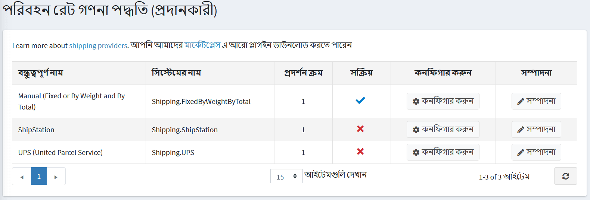

নিম্নরূপ ম্যানুয়াল শিপিং রেট গণনা পদ্ধতি সক্ষম করুন:

* **ম্যানুয়াল (স্থির বা ওজন এবং মোট)** সারিতে, **সম্পাদনা** বাটনে ক্লিক করুন।
* **সক্রিয়** কলামে, চেকবক্স চেক করুন।
* **আপডেট** বাটনে ক্লিক করুন। *মিথ্যা* বিকল্পটি *সত্য *হয়ে যায়।

তালিকার ম্যানুয়াল (স্থির বা ওজন এবং মোট) বিকল্পের পাশে **কনফিগার করুন** বাটনে ক্লিক করুন।

আপনি *স্থির হার* শিপিং ফি গণনা শিপিংয়ে পরিবর্তন করতে পারেন *ওজন/মোট* গণনার মাধ্যমে পৃষ্ঠার উপরের বোতামে ক্লিক করুন।

## নির্দিষ্ট হার কনফিগার করুন

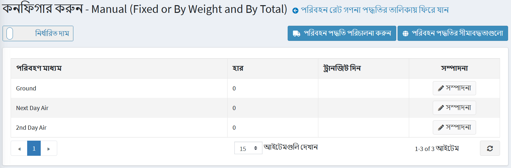

একটি শিপিং পদ্ধতির পাশে **এডিট** বাটনে ক্লিক করুন এবং এর জন্য **রেট** এবং **ট্রানজিট দিন** (প্রয়োজন হলে) লিখুন।

**আপডেট** ক্লিক করুন।

> [!NOTE]
> 
>আপনি  ক্লিক করে অ্যাক্সেস করা *শিপিং পদ্ধতি উইন্ডোতে* শিপিং পদ্ধতি যোগ/অপসারণ করতে পারেন এবং উপরে ক্লিক করে নির্বাচিত দেশগুলির জন্য কিছু পদ্ধতি সীমাবদ্ধ করতে পারেন! [বিধিনিষেধ](_static/manual/manual-shipping-restrictions.png) শীর্ষে।

## ওজন/মোট দ্বারা হার কনফিগার করুন

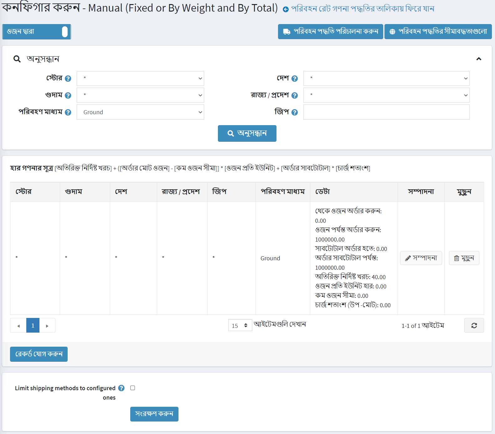

**ওজন এবং মোট দ্বারা শিপিং** বিকল্প একটি চালানের ওজন এবং মোটের উপর ভিত্তি করে বিভিন্ন শিপিং ফি সেট করার অনুমতি দেয়। ওজন এবং চালানের মোটের উপর নির্ভর করে বিভিন্ন ফি চার্জ করার ক্ষমতা কোম্পানির শিপিং খরচ কম রাখতে সাহায্য করে যখন ভারী আইটেম পাঠানো হয়, তবুও হালকা পণ্য কেনা গ্রাহকদের যুক্তিসঙ্গত শিপিং খরচ অফার করে।

সূত্র ব্যবহার করুন **[অতিরিক্ত নির্দিষ্ট খরচ] + ([অর্ডার মোট ওজন] - [কম ওজন সীমা]] & বার; [ওজন প্রতি ইউনিট হার] + [অর্ডার সাবটোটাল] & বার; [চার্জ শতাংশ]** ফি গণনা করতে, যেখানে:

* **অতিরিক্ত নির্দিষ্ট খরচ** - যদি ওজন একটি নির্দিষ্ট স্তরের (ওজন কম সীমা) এর অধীনে থাকে তাহলে চালানের খরচ।
* **ওজন প্রতি ইউনিট হার** - কম ওজন সীমার উপরে প্রতিটি ওজন ইউনিটের খরচ।
* **অর্ডার সাবটোটাল এবং চার্জ পার্সেন্ট** - অর্ডার সাবটোটালের উপর ভিত্তি করে অতিরিক্ত খরচ গণনার জন্য প্যারামিটার।

উদাহরণস্বরূপ, যদি আপনার নিম্নলিখিত শিপিং শর্ত থাকে:

* ওজন ০ থেকে ১ পাউন্ড এবং $ ১ থেকে সাবটোটাল অর্ডার করুন এবং সাবটোটাল $ ১০ এ অর্ডার করুন খরচ ১০ ডলার। আপনি **নিম্নলিখিত শিপিং নিয়ম** তৈরি করা উচিত:
* থেকে ওজন অর্ডার করুন: **০**
* ওজন অর্ডার করুন: **১**
* থেকে উপ -মোট অর্ডার করুন: **১**
* সাবটোটাল অর্ডার করুন: **১০**
* অতিরিক্ত নির্দিষ্ট খরচ: **১০**
* কম ওজন সীমা: **০**
* ওজন ইউনিট প্রতি হার: **০**
* ওজন ১.১ পাউন্ড থেকে ২ পাউন্ড এবং $ ১১ থেকে সাবটোটাল অর্ডার করুন এবং সাবটোটাল $ ১০০০০০০ অর্ডার করুন খরচ হল $ ১৫। আপনি **নিম্নলিখিত শিপিং নিয়ম** তৈরি করা উচিত:
* থেকে ওজন অর্ডার করুন: ** ১.০০০ **
* ওজন অর্ডার করুন: **২**
* থেকে উপ -মোট অর্ডার করুন: **১১**
* সাবটোটাল অর্ডার করুন: **১০০০০০০**
* অতিরিক্ত নির্দিষ্ট খরচ: **১৫**
* কম ওজন সীমা: **০**
* ওজন ইউনিট প্রতি হার: **০**
* ২ পাউন্ডের বেশি প্রতি অতিরিক্ত ০.৫ পাউন্ডের জন্য খরচ $ ৩। আপনাকে **নিম্নলিখিত শিপিং নিয়ম তৈরি করতে হবে**:
* যদি আপনার স্থির খরচ $ ১৫ এবং $ ৬ প্রতি পাউন্ড ২ পাউন্ডের উপরে হয়
* থেকে ওজন অর্ডার করুন: **২.০০০১**
* ওজন অর্ডার করুন: **৯৯৯৯৯**
* অতিরিক্ত নির্দিষ্ট খরচ: **১৫**
* কম ওজন সীমা: **২**
* ওজন ইউনিট প্রতি হার: **৩**
  
> [!NOTE] 
> 
> এটি অতিরিক্ত ওজনের জন্য আনুপাতিকভাবে চার্জ করবে;
> উদাহরণ ২.১ পাউন্ডের জন্য এটি $ ১৫ + (০.১ * ৬) = $ ১৫.৬ চার্জ করবে

একটি নতুন শিপিং নিয়ম যোগ করতে, **রেকর্ড যোগ করুন** ক্লিক করুন। * নতুন রেকর্ড যোগ করুন * উইন্ডো প্রদর্শিত হয়:

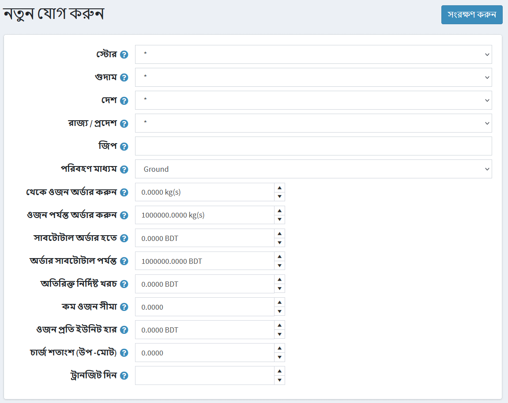

নিম্নলিখিত তথ্য সংজ্ঞায়িত করুন:

* **স্টোর** যেখানে গণনা করা ফি প্রয়োগ করা হবে। সমস্ত দোকানে নিয়ম প্রয়োগ করতে * বেছে নিন।
* **গুদাম** যেখান থেকে শিপিং করা হবে। সমস্ত গুদামে নিয়ম প্রয়োগ করতে * বেছে নিন।
* **দেশ, রাজ্য/প্রদেশ, জিপ** একটি চালানের গন্তব্যস্থল।
* পূর্বনির্ধারিত বিকল্পগুলির তালিকা থেকে একটি **শিপিং পদ্ধতি** নির্বাচন করুন। শিপিং পদ্ধতি যোগ/অপসারণের জন্য উপরে **শিপিং পদ্ধতিগুলি পরিচালনা করুন** অথবা আরও জানতে [শিপিং পদ্ধতি কনফিগার করুন](#configure-shipping-methods) বিভাগে যান।
* **থেকে ওজন অর্ডার করুন এবং** ক্ষেত্রগুলিতে ওজন অর্ডার করুন। যদি গ্রাহকের চালানের ওজন এই সীমার মধ্যে পড়ে, অতিরিক্ত খরচ ঠিক করা হবে এবং এই রেকর্ড অনুযায়ী হিসাব করা হবে।
* ক্ষেত্রগুলি ব্যবহার করে এই রেকর্ডের জন্য মূল্যের নিয়মগুলি কনফিগার করুন **থেকে অর্ডার সাবটোটাল, অর্ডার সাবটোটাল থেকে, অতিরিক্ত নির্দিষ্ট খরচ, কম ওজন সীমা, ওজন প্রতি ইউনিট হার, চার্জ শতাংশ (সাবটোটালের)** ক্ষেত্র।
* **ট্রানজিট দিন** ক্ষেত্রের সংজ্ঞা দিন যা ডেলিভারির দিন সংখ্যা নির্ধারণ করে।

> [!NOTE]
> 
> নিশ্চিত করুন যে সেটিং **কনফিগারেশন → সেটিংস → শিপিং সেটিংস সংশ্লিষ্ট পণ্যের মাত্রা এবং ওজন বিবেচনা করুন** সত্য।

**সেভ** ক্লিক করুন।

> [!NOTE]
>
> আপনি যদি আপনার গ্রাহকদের শুধুমাত্র সেই স্ক্রিনে কনফিগার করা পদ্ধতিতে সীমাবদ্ধ রাখতে চান তবে **কনফিগার করা শিপিং পদ্ধতি সীমাবদ্ধ করুন** পৃষ্ঠার নীচে চেকবক্সে টিক দিন।

## শিপিং পদ্ধতি কনফিগার করুন

একজন দোকানের মালিক *ম্যানুয়াল (নির্দিষ্ট বা ওজন এবং মোট)* প্রদানকারীর মধ্যে প্রয়োজনীয় শিপিং পদ্ধতির তালিকা নির্ধারণ করতে পারেন। শিপিং পদ্ধতিগুলি পরিচালনা করতে:

**কনফিগারেশন → শিপিং → শিপিং প্রদানকারী** এ যান। তারপর *ম্যানুয়াল (স্থির বা ওজন এবং মোট)* প্রদানকারীর পাশে **কনফিগার করুন** বাটনে ক্লিক করুন। কনফিগারেশন উইন্ডো প্রদর্শিত হয়:

**শিপিং পদ্ধতি পরিচালনা করুন** ক্লিক করুন,*শিপিং পদ্ধতি উইন্ডো*প্রদর্শিত হয়:

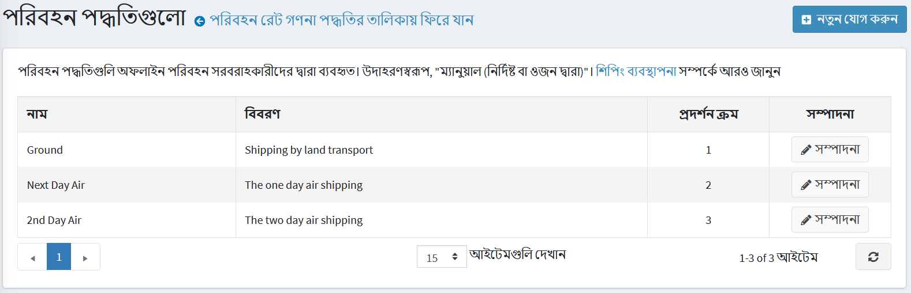

**নতুন যোগ করুন** বাটনে ক্লিক করুন,*একটি নতুন শিপিং পদ্ধতি যোগ করুন*উইন্ডোটি নিম্নরূপ প্রদর্শিত হবে:

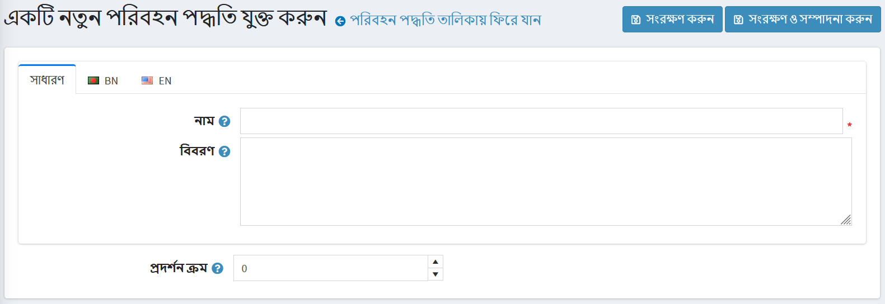

একটি নতুন রেকর্ডের জন্য নিম্নলিখিত ক্ষেত্রগুলি সংজ্ঞায়িত করুন:

**একজন গ্রাহকের দ্বারা দেখা শিপিং পদ্ধতির নাম**।
* **বর্ণনা** শিপিং পদ্ধতির জন্য একজন গ্রাহক দেখেছেন।
শিপিং পদ্ধতির **ডিসপ্লে অর্ডার**। ১ এর মান তালিকার শীর্ষে প্রতিনিধিত্ব করে।

**সেভ** ক্লিক করুন।

> [!NOTE]
> 
> উপরে বর্ণিত হিসাবে, বিদ্যমান শিপিং পদ্ধতি সম্পাদনা করতে আপনি *শিপিং পদ্ধতি* উইন্ডোতে **সম্পাদনা** ক্লিক করতে পারেন।

## শিপিং পদ্ধতির বিধিনিষেধ

একটি দোকানের মালিক নির্দিষ্ট দেশে নির্দিষ্ট শিপিং পদ্ধতির জন্য সীমাবদ্ধতা নির্ধারণ করতে পারে। এটি করার জন্য, **কনফিগারেশন → শিপিং → শিপিং প্রদানকারী** এ যান। *ম্যানুয়াল (নির্দিষ্ট বা ওজন এবং মোট)* প্রদানকারীর পাশে **কনফিগার করুন** বাটনে ক্লিক করুন। কনফিগারেশন উইন্ডো প্রদর্শিত হয়:

**শিপিং পদ্ধতি বিধিনিষেধ** ক্লিক করুন,*শিপিং পদ্ধতি বিধিনিষেধ* উইন্ডো প্রদর্শিত হয়:

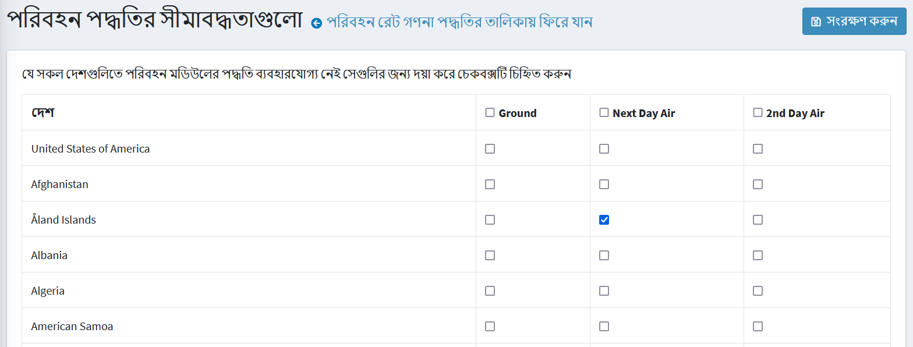

আপনার এক বা একাধিক শিপিং পদ্ধতি নির্বাচন করুন, যা আপনি নির্দিষ্ট দেশে অক্ষম করতে চান।

প্রয়োজন হলে, আপনি সমস্ত দেশের জন্য সম্পূর্ণ সীমাবদ্ধতা কলাম নির্বাচন করতে পারেন।

**সেভ** ক্লিক করুন।

## উদাহরণ

লেই বলছেন যে আপনার একটি স্টোর আছে মার্কিন যুক্তরাষ্ট্রে এবং ইউএসএ এবং কানাডায় জাহাজ। আপনি উপলব্ধ তিনটি শিপিং পদ্ধতি সেট আপ করেছেন, যেমন:
- **স্থল** যা স্থল পরিবহনের মাধ্যমে শিপিংয়ের অনুমতি দেয়।
- **পরের দিন এয়ার** যা একদিন এয়ার শিপিং প্রদান করে।
- **দ্বিতীয় দিনের এয়ার** দুই দিনের এয়ার শিপিংয়ের অনুমতি দেয়।

> [!TIP]
>
> আপনি কনফিগার - *ম্যানুয়াল (স্থির বা ওজন এবং মোট দ্বারা)* পৃষ্ঠায় **শিপিং পদ্ধতি পরিচালনা করুন** বোতামে ক্লিক করে আপনার নিজের শিপিং পদ্ধতি যুক্ত করতে পারেন।

তাহলে ধরা যাক শিপিং ফি অর্ডার মোট এবং শিপিং ঠিকানার উপর নির্ভর করে। উদাহরণ স্বরূপ:
- যদি কোন গ্রাহক অর্ডারের জন্য $ ১৫০ প্রদান করে তবে আমরা শুধুমাত্র মার্কিন যুক্তরাষ্ট্রে **গ্রাউন্ড** পদ্ধতিতে একটি বিনামূল্যে শিপিং প্রদান করি। অর্ডার মোট $ ১৫০ এর কম হলে আমরা $ ১০ চার্জ করব। মার্কিন যুক্তরাষ্ট্রে ডেলিভারিতে ৫ দিন সময় লাগবে।
- কানাডার জন্য, একজন গ্রাহকের **গ্রাউন্ড** পদ্ধতিতে বিনামূল্যে শিপিং করার জন্য $ ২৫০ এর জন্য অর্ডার করা উচিত। অর্ডার মোট $ ২৫০ এর কম হলে আমরা $ ২০ চার্জ করব। এই ক্ষেত্রে ডেলিভারি ৭ দিন লাগবে।
- যদি কোন গ্রাহকের **পরের দিন এয়ার** ডেলিভারির প্রয়োজন হয় তাহলে ইউএসএ এর জন্য $ ৬০ খরচ হবে। ধরা যাক আপনি কানাডার জন্য **পরের দিন এয়ার** বিকল্পটি অক্ষম করতে চান।
- যদি একজন গ্রাহক আরও একদিন অপেক্ষা করতে প্রস্তুত থাকেন তবে আমরা সুপারিশ করি **২ য় দিনের এয়ার** শিপিং ব্যবহার করার জন্য যা মার্কিন যুক্তরাষ্ট্র এবং কানাডার জন্যও $ ৪০ খরচ করে।

উপরের সমস্ত প্রয়োজনীয়তা বিবেচনা করে আমরা নিম্নলিখিত পদ্ধতিতে *কনফিগার - ম্যানুয়াল (স্থির বা ওজন এবং মোট)* পৃষ্ঠায় পেমেন্ট পদ্ধতি সেট আপ করব:

- **গ্রাউন্ড** পদ্ধতি
  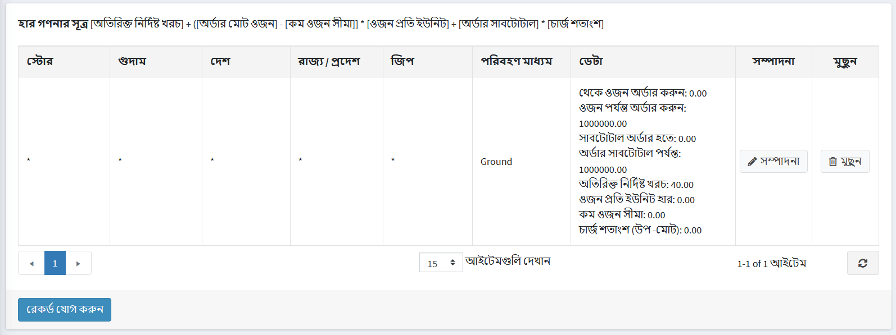

- **পরের দিন এয়ার** পদ্ধতি
  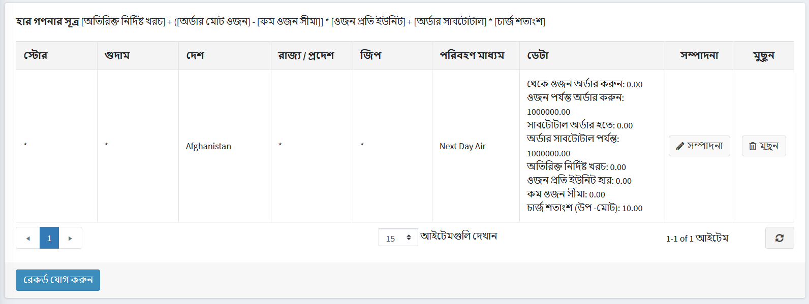

- **২য় দিনের এয়ার** পদ্ধতি
  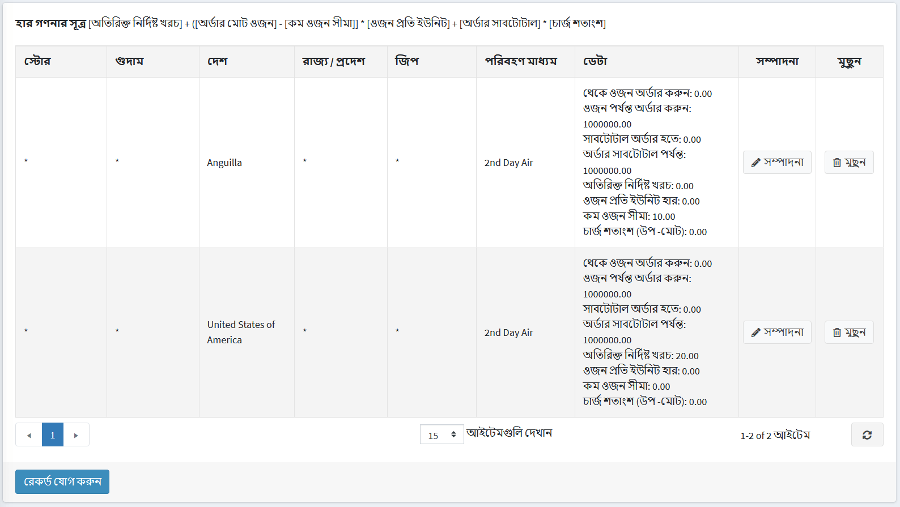

কানাডার জন্য **পরের দিন এয়ার** অপশনটি নিষ্ক্রিয় করতে **শিপিং পদ্ধতি সীমাবদ্ধতা** বাটনে ক্লিক করুন এবং*শিপিং পদ্ধতির বিধিনিষেধগুলি*পূরণ করুন:

### আসুন দেখি পাবলিক স্টোরে শিপিং অপশনগুলো কেমন দেখাচ্ছে

১. যখন ইউএসএ থেকে একজন গ্রাহক পণ্য পৃষ্ঠা (বা শপিং কার্ট পৃষ্ঠা) পরিদর্শন করেন তখন শিপিংয়ের অনুমানটি নিম্নরূপ প্রদর্শিত হয়:
  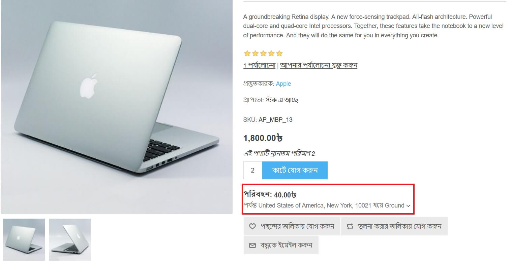
    > [!TIP]
    >
    > যাইহোক, আপনি **আনুমানিক শিপিং সক্ষম (কার্ট পৃষ্ঠা)** এবং **আনুমানিক শিপিং সক্ষম (পণ্য পৃষ্ঠা)** চেকবক্সগুলি **কনফিগারেশন → সেটিংস → শিপিং সেটিংস** পৃষ্ঠায় আনচিক করে শিপিং অনুমান অক্ষম করতে পারেন।

    যখন গ্রাহক শিপিংয়ের বিবরণের জন্য এগিয়ে যান তখন নিম্নলিখিত বিকল্পগুলি প্রদর্শিত হবে:
    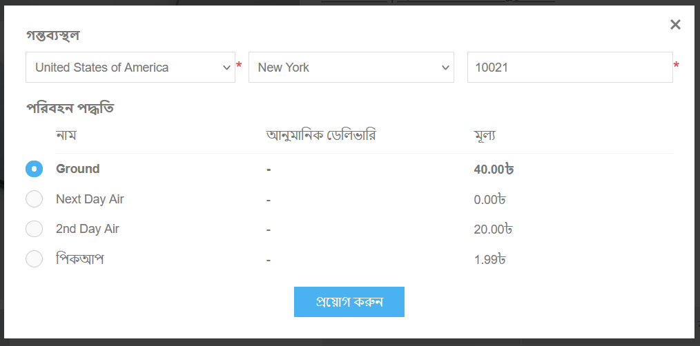

২. যখন একজন গ্রাহক শিপিং প্রাক্কলন উইন্ডো থেকে কানাডা নির্বাচন করেন তখন নিম্নলিখিত বিকল্পগুলি প্রদর্শিত হবে:
  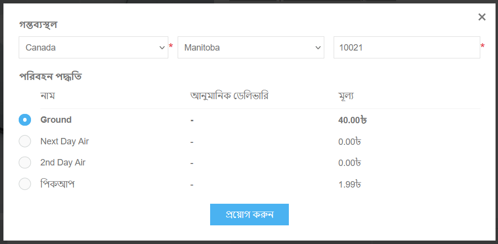
    যেমন আপনি দেখতে পারেন **পরের দিন এয়ার** বিকল্পটি আর পাওয়া যায় না।

> [!TIP]
>
> যদি আপনি আপনার গ্রাহকদের পিকআপ পয়েন্ট প্রদান করতে চান তাহলে [পিকআপ পয়েন্ট](xref:bn/get-start/configure-shipping/advanced-configuration/pickup-points) অধ্যায়ে এটি কিভাবে সেট আপ করবেন তা দেখুন।

## টিউটোরিয়াল

* [ম্যানুয়াল শিপিং পদ্ধতি কনফিগার করা](https://www.youtube.com/watch?v=1nYj0NqVUWw&t=8s)