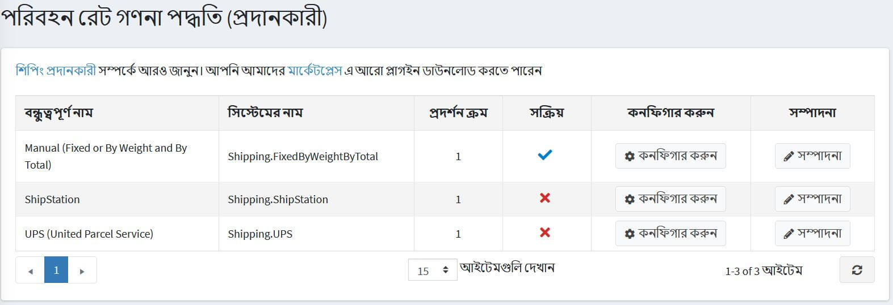
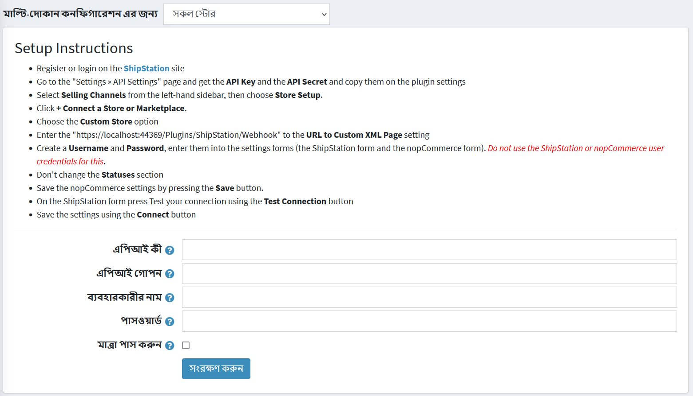

# শিপস্টেশন

**শিপস্টেশন** ইন্টিগ্রেশন প্লাগইন ব্যবহার করতে দয়া করে এই পদক্ষেপগুলি অনুসরণ করুন:

১। [শিপস্টেশন](https://www.shipstation.com/?ref=partner-nopcommerce&utm_campaign=partner-referrals&utm_source=nopcommerce&utm_medium=partner-referral) সাইটে নিবন্ধন করুন বা লগইন করুন।

২। নপকমার্স এডমিন এলাকায় **কনফিগারেশন → শিপিং → শিপিং প্রদানকারী** এ যান।

* এই পদ্ধতিটি সক্রিয় করুন, নিম্নরূপ:
* শিপস্টেশন সারিতে, **সম্পাদনা** বাটনে ক্লিক করুন।
* **সক্রিয়** কলামে, চেকবক্স চেক করুন।
* **আপডেট** বাটনে ক্লিক করুন। মিথ্যা অপশনটি **সত্য** হয়ে যায়।
* তালিকার শিপস্টেশন বিকল্পের পাশে **কনফিগার করুন** বাটনে ক্লিক করুন। *কনফিগার - শিপস্টেশন* উইন্ডোটি নিম্নরূপ প্রদর্শিত হয়: 

৩। শিপস্টেশন প্রদানকারীর কাছ থেকে প্রাপ্ত নিম্নলিখিত তথ্যগুলি প্রবেশ করান:
    **এপিআই কী** এবং **এপিআই সিক্রেট**: এই তথ্যটি উপলব্ধ ক্যারিয়ারের একটি তালিকা পেতে ব্যবহৃত হয়। আপনি সেগুলি শিপস্টেশন সাইটে *সেটিংস - এপিআই সেটিংস* পৃষ্ঠায় পেতে পারেন।
    > [!NOTE]
    > যদি আপনি শিপিং খরচ স্বয়ংক্রিয়ভাবে নির্ধারণ করার পরিকল্পনা না করেন, তাহলে এই ডেটা প্রবেশ করার প্রয়োজন নেই।
    > কিন্তু এই ক্ষেত্রে, প্লাগইনটি শিপিং পদ্ধতি প্রদানকারী হিসাবে কাজ করা বন্ধ করে দেবে এবং আপনাকে নিশ্চিত করতে হবে যে একই ধরনের আরেকটি সক্রিয় প্লাগইন আছে।

* একটি **ব্যবহারকারীর নাম** এবং **পাসওয়ার্ড** তৈরি করুন, সেগুলি সেটিংস ফর্ম (শিপস্টেশন ফর্ম এবং নপকমার্স ফর্ম) এ প্রবেশ করুন। আপনার সার্ভার এবং শিপস্টেশন সার্ভারের মধ্যে ডেটা নিরাপদ স্থানান্তরের জন্য এই ডেটা প্রয়োজন। সবসময় তাদের গোপন রাখুন।

    > [!Important] 
    > এই ক্ষেত্রগুলির জন্য শিপস্টেশন বা নপকমার্স ব্যবহারকারীর শংসাপত্র ব্যবহার করবেন না।

    * শিপস্টেশন সার্ভারে মাত্রা পাঠানোর প্রয়োজন হলে **পাসের মাত্রা** চেকবক্স চেক করুন। যখন এই প্যারামিটারটি সক্রিয় হয়, অতিরিক্ত প্যারামিটার **প্যাকিং টাইপ** উপস্থিত হয়। এই প্যারামিটারটি পাঠানো ডেটার ধরনের জন্য দায়ী। [প্যাকিং টাইপ](_static/shipstation/packing-type.jpg)