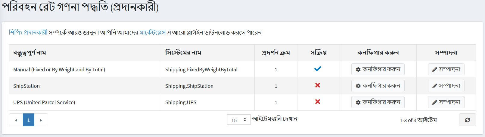
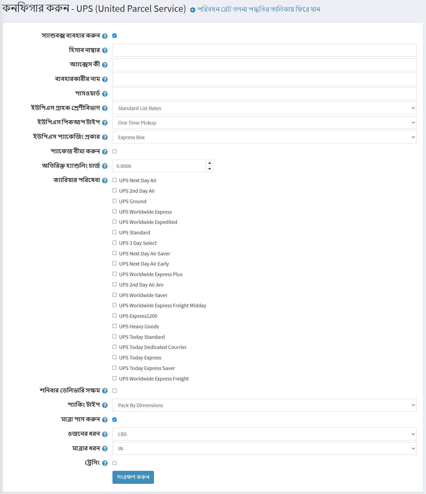

# ইউপিএস

ইউপিএস -এ আপনার অ্যাকাউন্ট অ্যাক্সেস করতে ব্যবহারকারীর নাম, একটি পাসওয়ার্ড এবং একটি **এক্সএমএল লাইসেন্স নম্বর** ব্যবহার করুন, যা আপনাকে নিবন্ধন প্রক্রিয়ার পরে প্রদান করা হবে।

## ইউপিএস রিয়েল টাইম শিপিং ক্যালকুলেশন নির্ধারণ করুন

১। নিম্নলিখিতগুলি পেতে [https://www.ups.com/upsdeveloperkit?loc=en_USque(https://www.ups.com/upsdeveloperkit?loc=en_US) এ গিয়ে একটি UPS অ্যাকাউন্ট তৈরি করুন:
    * ইউজার নেম আইডি
    * পাসওয়ার্ড
    * এক্সএমএল অ্যাক্সেস লাইসেন্স নম্বর

২। নপকমার্স এডমিন এলাকায় **কনফিগারেশন → শিপিং → শিপিং প্রদানকারী** এ যান।
 
৩। এই পদ্ধতিটি সক্রিয় করুন, নিম্নরূপ:
    * ইউপিএস (ইউনাইটেড পোস্টাল সার্ভিস) সারিতে, **এডিট** বাটনে ক্লিক করুন।
    * **সক্রিয়** কলামে, চেকমার্ক চেক করুন।
    * **আপডেট** ক্লিক করুন। *মিথ্যা *বিকল্পটি *সত্য *হয়ে যায়।

৪। তালিকায় ইউপিএস (ইউনাইটেড পার্সেল সার্ভিস) বিকল্পের পাশে **কনফিগার করুন** ক্লিক করুন।
   *কনফিগার-ইউপিএস (ইউনাইটেড পার্সেল সার্ভিস)* উইন্ডো প্রদর্শিত হয়, নিম্নরূপ: 

৫। ইউপিএস প্রদানকারীর কাছ থেকে প্রাপ্ত নিম্নলিখিত তথ্য লিখুন:

* পরীক্ষার পরিবেশ ব্যবহার করতে **ব্যবহার করুন স্যান্ডবক্স** চেকবক্সে টিক দিন।
	* ইউপিএস প্রদানকারীর **অ্যাকাউন্ট নম্বর** লিখুন।
	* প্রদানকারীর কাছ থেকে প্রাপ্ত **অ্যাক্সেস কী** লিখুন।
	* প্রদানকারীর কাছ থেকে প্রাপ্ত আপনার **ব্যবহারকারীর** নাম লিখুন।
	* প্রদানকারীর কাছ থেকে প্রাপ্ত **পাসওয়ার্ড** লিখুন
* আপনার প্রয়োজনীয় **ইউপিএস গ্রাহক শ্রেণীবিভাগ** নির্বাচন করুন, নিম্নরূপ:
	* শিপার নম্বরের সাথে যুক্ত হার
	* দৈনিক দর
	* খুচরা মূল্য
	* আঞ্চলিক হার
	* সাধারণ তালিকা হার
	* স্ট্যান্ডার্ড তালিকা হার
* প্রয়োজনীয় **ইউপিএস পিকআপ টাইপ** নির্বাচন করুন, নিম্নরূপ:
	* দৈনিক পিকআপ
	* গ্রাহক কাউন্টার
	* ওয়ান টাইম পিকআপ
	* কল এয়ারে
	* চিঠি কেন্দ্র
	* বিমান পরিষেবা কেন্দ্র
* প্রয়োজনীয় **ইউপিএস প্যাকেজিং টাইপ** নির্বাচন করুন, নিম্নরূপ:
	* অজানা
	* চিঠি
	* গ্রাহক সরবরাহকৃত প্যাকেজ
	* নল
	* পি এ কে
	* এক্সপ্রেস বক্স
	* 10 কেজি বাক্স
	* 25 কেজি বাক্স
	* প্যালেট
	* ছোট এক্সপ্রেস বক্স
	* মাঝারি এক্সপ্রেস বক্স
	* বড় এক্সপ্রেস বক্স
	* প্যাকেজটি বীমা করা হবে তা নির্দেশ করতে **বীমা প্যাকেজ** চেকবক্সে টিক দিন।
	* **অতিরিক্ত হ্যান্ডলিং চার্জ লিখুন** আপনার গ্রাহকদের চার্জ করার জন্য এটি একটি অতিরিক্ত ফি।
	* **আপনি যে ক্যারিয়ার পরিষেবাগুলি** আপনার গ্রাহকদের দিতে চান তা নির্বাচন করুন।
	* **শনিবার ডেলিভারি সক্ষম** এর জন্য রেট পেতে চেক করুন।
* **প্যাকিং টাইপ** নির্বাচন করুন, নিম্নরূপ:
	* মাত্রা অনুযায়ী প্যাক করুন
	* প্রতি প্যাকেজে একটি আইটেম দ্বারা প্যাক করুন
	* ভলিউম অনুযায়ী প্যাক করুন
	* হারের জন্য অনুরোধ করার সময় প্যাকেজের মাত্রা পাস করতে **পাসের মাত্রা** চেকবক্সে টিক দিন।
* **ওজন ধরন** - পাউন্ড বা কিলোগ্রাম নির্বাচন করুন।
* **মাত্রা টাইপ** - ইঞ্চি বা সেন্টিমিটার নির্বাচন করুন।
* সিস্টেম লগে সিস্টেম ট্রেসিং রেকর্ড করতে **ট্রেসিং** চেকবক্সে টিক দিন। সম্পূর্ণ অনুরোধ এবং প্রতিক্রিয়া XML লগ করা হবে (অ্যাক্সেস কী/ব্যবহারকারীর নাম, পাসওয়ার্ড সহ)। এটি একটি উত্পাদন পরিবেশে সক্ষম করবেন না।

**সেভ** ক্লিক করুন।