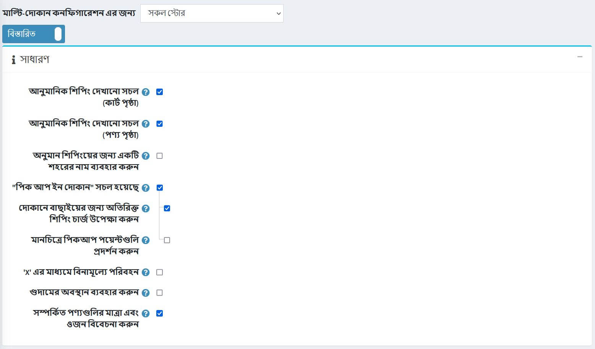
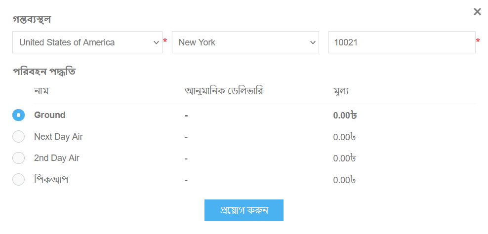
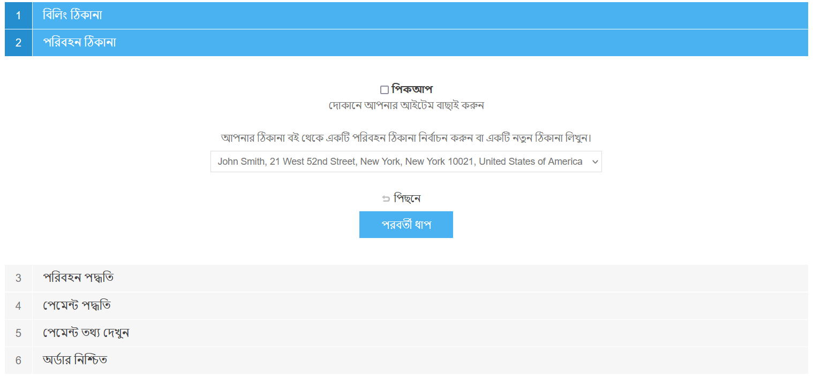
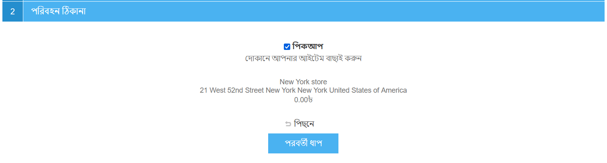

# শিপিং সেটিংস

এই অধ্যায়ে বর্ণনা করা হয়েছে কিভাবে একটি দোকানের শিপিংয়ের বিবরণ সেট করা যায়। অবস্থান এবং গুদাম সেট ছাড়াও, অন্যান্য জিনিস আছে যা ভাল রসদ অন্তর্ভুক্ত।

শিপিং সেটিংস পরিচালনা করতে **কনফিগারেশন → সেটিংস → শিপিং সেটিংস** এ যান।

নিম্নলিখিত পদ্ধতিতে *সাধারণ* প্যানেলে আপনার শিপিং সেটিংস সংজ্ঞায়িত করুন:

* শপিং কার্ট পৃষ্ঠায় গ্রাহকের শিপিং ঠিকানার উপর ভিত্তি করে **আনুমানিক শিপিং তথ্য প্রদর্শনের জন্য** আনুমানিক শিপিং সক্ষম (কার্ট পৃষ্ঠা) চেক করুন। নিচের স্ক্রিনশট দেখুন।
* চেক করুন **আনুমানিক শিপিং সক্ষম (পণ্য পৃষ্ঠা)** পণ্যের বিবরণ পৃষ্ঠায় গ্রাহকের শিপিং ঠিকানার ভিত্তিতে আনুমানিক শিপিং তথ্য প্রদর্শন করতে। নিচের স্ক্রিনশট দেখুন।

* শিপিং অ্যাড্রেস ধাপে চেকআউটের সময় পিকআপ ইন স্টোর বিকল্পটি প্রদর্শন করতে **"পিক আপ ইন স্টোর" সক্ষম** নির্বাচন করুন। ব্যবহারকারীরা নিম্নলিখিত স্ক্রিন দেখতে পাবেন:

 

* প্রয়োজনে **দোকানে তোলার জন্য অতিরিক্ত শিপিং চার্জ উপেক্ষা করুন** চেকবক্সে টিক দিন।
* যদি আপনি গুগল মানচিত্রে তাদের প্রদর্শন করতে চান তাহলে মানচিত্রে **পিকআপ পয়েন্ট প্রদর্শন করুন** বেছে নিন। এই বিকল্পটি নির্বাচিত হলে গ্রাহকদের একটি শিপিং ঠিকানা লিখতে হবে না এবং একটি শিপিং পদ্ধতি বেছে নিতে হবে।

> [!Note]
>
> আপনি 'পিক আপ ইন স্টোর' বিকল্পের জন্য একটি ফি নির্দিষ্ট করতে পারেন। এটি করার জন্য **কনফিগারেশন → শিপিং → পিকআপ পয়েন্ট** এ যান এবং উপযুক্ত পিকআপ পয়েন্ট প্রদানকারীকে কনফিগার করুন। এখানে আরো জানুন: [পিকআপ পয়েন্ট](xref:bn/getting-start/configure-shipping/advanced-configuration/pickup-points)।

* নির্দিষ্ট পরিমাণের উপর অর্ডারের জন্য বিনামূল্যে শিপিং সক্ষম করতে, 'ক' **এর উপর ফ্রি শিপিং** টিক করুন। নিম্নলিখিত ক্ষেত্রটি প্রদর্শিত হয়, যা আপনাকে 'ক' এর মান নির্ধারণ করতে সক্ষম করে।
* **'ক' ক্ষেত্রের মানটিতে**, সেই মানটি প্রবেশ করান, যার উপরে এর চেয়ে বেশি পরিমাণের সমস্ত অর্ডার বিনামূল্যে শিপিংয়ের যোগ্যতা অর্জন করবে।
* **ট্যাক্স সহ 'ক' গণনা করুন**। যদি এটি টিক করা না হয়, তাহলে কর বাদে মান গণনা করা হয়।
* শিপিং রেটের অনুরোধ করার সময় এটি ব্যবহার করতে **গুদামের অবস্থান ব্যবহার করুন** টিক দিন। যখন আপনি একাধিক গুদাম থেকে জাহাজ পাঠান তখন এটি কার্যকর।
* টিক করুন **সংশ্লিষ্ট পণ্যের মাত্রা এবং ওজন বিবেচনা করুন** সংযুক্ত পণ্যের মাত্রা এবং শিপিংয়ে ওজন বিবেচনা করুন, উদাহরণস্বরূপ যদি প্রধান পণ্য ইতিমধ্যেই সেগুলি অন্তর্ভুক্ত করে তবে আনচেক করুন।

নিম্নলিখিত পদ্ধতিতে *বিজ্ঞপ্তি* প্যানেলে আপনার শিপিং সেটিংস সংজ্ঞায়িত করুন:

* টিক করুন **গ্রাহককে একাধিক স্থান থেকে শিপিং সম্পর্কে অবহিত করুন** যদি প্রয়োজন হয়। যখন আপনি একাধিক গুদাম থেকে জাহাজ পাঠান তখন এটি কার্যকর।
* টিপ করুন **ডিসপ্লে শিপমেন্ট ইভেন্ট (গ্রাহক)**, গ্রাহকদের তাদের চালানের বিবরণ পৃষ্ঠায় শিপমেন্ট ইভেন্টগুলি দেখতে সক্ষম করতে।

> [!NOTE]
>
>দ্রষ্টব্য: সক্ষম হওয়ার জন্য, এই বৈশিষ্ট্যটি একটি চালান গণনা পদ্ধতি দ্বারা সমর্থিত হতে হবে।

* টিপ করুন **ডিসপ্লে শিপমেন্ট ইভেন্ট (স্টোর মালিক)**, স্টোর মালিকদের তাদের চালানের বিবরণ পৃষ্ঠায় শিপমেন্ট ইভেন্টগুলি দেখতে সক্ষম করতে।

> [!NOTE]
>
>দ্রষ্টব্য: সক্ষম হওয়ার জন্য, এই বৈশিষ্ট্যটি অবশ্যই একটি চালান গণনা পদ্ধতি দ্বারা সমর্থিত হতে হবে।

তারপর *চেকআউট* সেটিংস সংজ্ঞায়িত করুন:

* চেক করুন **শিপিং মোট লুকান যদি শিপিং প্রয়োজন না হয়** চেকবক্স যদি আপনি শিপিংয়ের প্রয়োজন না হয় তবে *শিপিং মোট* লেবেল লুকিয়ে রাখতে চান।
* চেকআউটের সময় **"একই ঠিকানায় শিপিং** চেকবক্স" একই ঠিকানায় জাহাজ "বিকল্পটি প্রদর্শন করুন (" বিলিং ঠিকানা "ধাপ)। এই ক্ষেত্রে যথাযথ বিকল্প সহ "শিপিং ঠিকানা" বাদ দেওয়া হবে।

> [!NOTE]
>
> এই সেটিংটি ব্যবহার করার সময় নিশ্চিত করুন যে সমস্ত বিলিং দেশ (**কনফিগারেশন → দেশ**) শিপিং সমর্থন করে (**শিপিংয়ের অনুমতি দেয়** চেকবক্সে টিক দেওয়া আছে)।

**বাইপাস শিপিং পদ্ধতি পৃষ্ঠায় টিক দিন** যদি শুধুমাত্র একটি শিপিং পদ্ধতি পাওয়া যায়। চেকআউট প্রক্রিয়ার সময় এই পৃষ্ঠাটি প্রদর্শিত হবে না।

*শিপিং মূল বিবরণ* সংজ্ঞায়িত করুন:

* **দেশ** নির্বাচন করুন।
* **রাজ্য/প্রদেশ** নির্বাচন করুন।
* **কাউন্টি/অঞ্চল** সংজ্ঞায়িত করুন।
* প্রয়োজনীয় **সিটি** লিখুন।
* প্রয়োজনীয় **ঠিকানা 1** লিখুন।
* প্রয়োজনীয় **জিপ/পোস্টাল কোড লিখুন**।

**সেভ** ক্লিক করুন।
