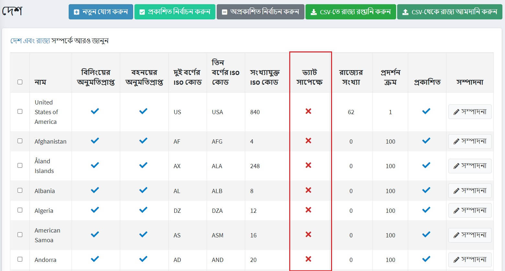
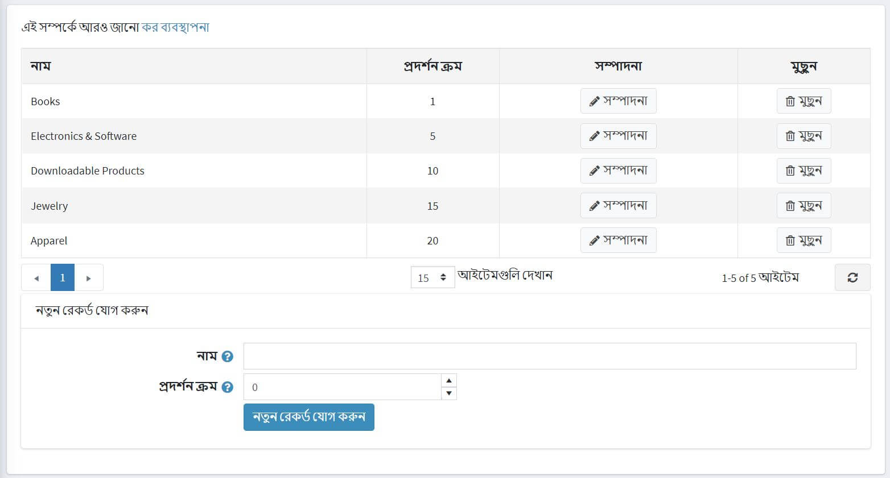
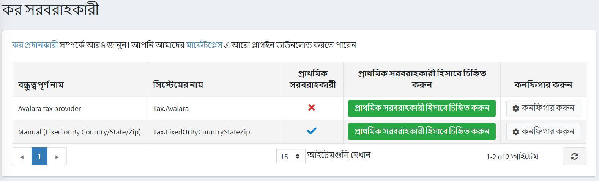
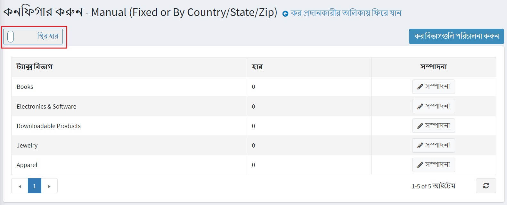
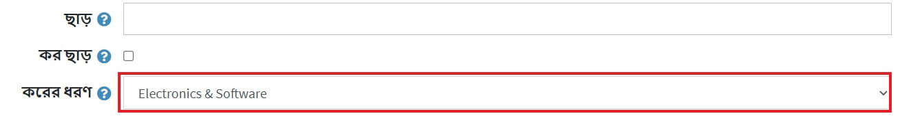

---
title: কর কনফিগার
uid: bn/getting-started/configure-taxes/index
author: git.AndreiMaz
contributors: git.MDRashedKhanMenon
---

# কর কনফিগার

এই অধ্যায় নপকমার্স ট্যাক্স টুলস এর সেটিংস কভার করে।

> [!NOTE]
>
> এই অধ্যায়ে নপকমার্স- এর অন্তর্নির্মিত কর যন্ত্র অন্তর্ভুক্ত রয়েছে, তৃতীয় পক্ষের কর পরিষেবাগুলি নয়।

নপকমার্স বহিরাগত পরিষেবাগুলিকেও সমর্থন করে, কিন্তু তাদের একটি [মার্কেটপ্লেস](http://www.nopcommerce.com/marketplace) থেকে প্লাগইন লাগাতে হবে। এই ধরনের মডিউল ইনস্টল করার প্রক্রিয়া [প্লাগইন](xref:bn/developer/plugins/index) অধ্যায়ে বর্ণিত হয়েছে।

## ইইউ ভ্যাট কনফিগারেশন গাইড

ইইউতে দোকানগুলির জন্য নপকমার্স ভ্যাট সমর্থন স্থাপন করতে **কনফিগারেশন → সেটিংস → ট্যাক্স সেটিংস** এ যান।

*সাধারণ* প্যানেলে:

* **শিপিং ঠিকানা** **এর উপর ভিত্তি করে** ট্যাক্স সেট করুন।

*ভ্যাট* প্যানেলে:

* টিক দিন **ইইউ ভ্যাট সক্ষম**। এটি নিশ্চিত করবে যে কর কেবল ইইউ -র মধ্যে চালানের জন্য নেওয়া হয়।
* আপনার দেশ যে **দেশ** নির্বাচন করুন।
* প্রযোজ্য হলে, ভ্যাট ছাড়ের অনুমতি দিন *টিক দিন। এটি নিশ্চিত করবে যে আপনার ভ্যাট নিবন্ধিত গ্রাহকরা যারা ইইউ -এর মধ্যে কিন্তু যে দেশের দোকানে অবস্থিত সে দেশের বাইরে শিপিং করছে তাদের ভ্যাট নেওয়া হবে না।
* ভ্যাট ভ্যালিডেশন এড়িয়ে যেতে **ভ্যাট সর্বদা বৈধ** চেকবক্সে টিক দিন। প্রবেশ করা ভ্যাট নম্বর সর্বদা বৈধ থাকবে। সঠিক ভ্যাট নম্বর প্রদান করা একজন ক্লায়েন্টের দায়িত্ব হবে।
* যদি আপনি **মূসক অব্যাহতি** চেক করেন, তাহলে আপনি "**ব্যবহার করুন ওয়েব পরিষেবা**" এবং "**নতুন ভ্যাট নম্বর জমা দিলে প্রশাসককে অবহিত করুন**" চেকবক্সগুলিতে টিক দিতে পারেন।

* **সেভ** বাটনে ক্লিক করুন।

**কনফিগারেশন → দেশ** এ যান। নিশ্চিত করুন যে সমস্ত দেশ ভ্যাটের আওতাভুক্ত **ভ্যাট সাপেক্ষে** সত্য*সেট করা আছে।

> [!NOTE]
>
> জার্সি, গার্নসি এবং অন্যান্য চ্যানেল দ্বীপপুঞ্জ যুক্তরাজ্যের অংশ নয় এবং ভ্যাটের আওতায় নেই। আপনি যদি সেই জায়গাগুলিতে বিক্রি করেন তবে আপনাকে এটি পরিবর্তন করতে হতে পারে।

**কনফিগারেশন → ট্যাক্স বিভাগ** এ যান।

আপনার দেশে প্রতিটি ভ্যাট হারের জন্য একটি ট্যাক্স বিভাগ সেট করুন। উদাহরণস্বরূপ, "স্ট্যান্ডার্ড রেট", "জিরো রেট", "ডিসকাউন্ট রেট"। ডিফল্ট ক্লাসগুলি মুছে দিন যা ইতিমধ্যে আছে এবং প্রযোজ্য নয়।

**কনফিগারেশন → কর প্রদানকারী** এ যান। **ম্যানুয়াল (নির্দিষ্ট বা দেশ/রাজ্য/জিপ দ্বারা)** ডিফল্ট করুন **প্রাথমিক প্রদানকারী হিসাবে** চিহ্নিত করুন বোতামটি ব্যবহার করুন।

**ম্যানুয়াল (নির্দিষ্ট বা দেশ/রাজ্য/জিপ দ্বারা)** প্রদানকারীর লাইনে **কনফিগার করুন** ক্লিক করুন পৃষ্ঠার শীর্ষে আপনি সুইচ দেখতে পাবেন। সেখানে **স্থির হার** বেছে নিন।

এই পৃষ্ঠায় আপনি আপনার ভ্যাট হারের বিভাগগুলি দেখতে পারেন। প্রতিটি বিভাগের পাশে **সম্পাদনা করুন** ক্লিক করুন এবং শতাংশ হার লিখুন। তারপর **আপডেট** বাটনে ক্লিক করুন।

নিশ্চিত করুন যে সমস্ত পণ্যের তাদের [পণ্যের পৃষ্ঠাগুলি](xref:bn/running-your-store/catalog/products/add-products) এ তাদের জন্য একটি ট্যাক্স বিভাগ নির্ধারিত আছে।

# আরো দেখুন

* [ট্যাক্স সেটিংস](xref:bn/get-start/configure-tax/tax-settings)
* [কর প্রদানকারী](xref:bn/get-start/configure-tax/tax-providers/index)

