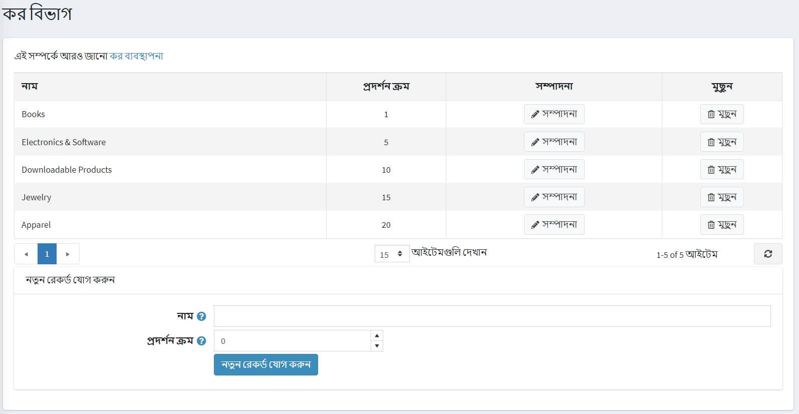

# অ্যাভালারা ট্যাক্স প্রদানকারী

## অ্যাভাট্যাক্স এর সাথে সংযোগ করুন

অ্যাভাট্যাক্স ইন্টিগ্রেশন ইনস্টল করার পরে আপনাকে ইন্টিগ্রেশন কনফিগার করতে হবে।

> [!NOTE]
> 
> নিশ্চিত করুন যে প্লাগইনটি "সক্রিয়" (**কনফিগারেশন → স্থানীয় প্লাগইন**) হিসাবে ইনস্টল এবং চেক করা আছে। প্লাগিনটি সক্ষম করতে **সম্পাদনা করুন** ক্লিক করুন এবং **সক্রিয় আছে** চেকবক্সটি চেক করুন।

অ্যাভালারা ট্যাক্স প্রদানকারী কনফিগার করতে যান **কনফিগারেশন → ট্যাক্স প্রদানকারী**।

**প্রাথমিক প্রদানকারী হিসাবে চিহ্নিত করুন** ক্লিক করুন।

তালিকায় অ্যাভালারা ট্যাক্স প্রদানকারী বিকল্পের পাশে **কনফিগার করুন** ক্লিক করুন।

পৃষ্ঠার উপরে নির্দেশাবলী অনুসরণ করুন, প্রতিটি ক্ষেত্রের ফাংশন টীকা করা হয় যখন "?" উপর ঝুলছে।

১। আপনার অ্যাভালারা ট্যাক্স শংসাপত্র কনফিগার করুন:

* **অ্যাকাউন্ট আইডি**: আপনার অ্যাভাট্যাক্স অ্যাকাউন্ট সক্রিয়করণ প্রক্রিয়ার সময় প্রদান করা হয়েছে।
* **লাইসেন্স কী**: আপনার অ্যাভাট্যাক্স অ্যাকাউন্ট সক্রিয়করণ প্রক্রিয়ার সময় প্রদান করা হয়েছে।
* **কোম্পানি**: অ্যাভাট্যাক্স অ্যাডমিন কনসোলে কোম্পানির প্রোফাইল আইডেন্টিফায়ার।
* **ব্যবহার করুন স্যান্ডবক্স** পরীক্ষা লেনদেন করতে সক্ষম।
* **কমেন্ট লেনদেন** সেভ করার পরেই লেনদেন করতে সক্ষম হয়।
* **ঠিকানা যাচাই করুন** প্রবেশ করা ঠিকানা যাচাই করতে সক্ষম।
* **ট্যাক্স মূল ঠিকানা** অ্যাভালারা পরিষেবাগুলিতে ট্যাক্স অনুরোধের জন্য ব্যবহৃত হয়।
* **লগিং সক্ষম করুন** অ্যাভালারা পরিষেবাগুলিতে সমস্ত অনুরোধ লগিং সক্ষম করে।

২। **সেভ করুন** এবং টেস্ট কানেকশন করতে **টেস্ট কানেকশন** বাটনে ক্লিক করুন।

৩। পরীক্ষা কর গণনা করার জন্য*পৃষ্ঠার নীচে ঠিকানা ফর্মটি পূরণ করুন (দয়া করে মনে রাখবেন, নপকমার্স অ্যাভালারা ট্যাক্স প্লাগইন শুধুমাত্র মার্কিন ঠিকানায় লেনদেন করে) এবং **পরীক্ষা কর লেনদেন** ক্লিক করুন।

## অ্যাভালারা অ্যাভাট্যাক্স কোড বরাদ্দ করুন

**কনফিগারেশন → ট্যাক্স বিভাগ** এ নেভিগেট করুন।

পৃষ্ঠার উপরের ডানদিকে আপনি ব্র্যান্ডেড **অ্যাভালারা ট্যাক্স কোড** বাটন দেখতে পাবেন। এটিতে ক্লিক করলে ড্রপ-ডাউন মেনু নিম্নলিখিত মেনুটি দেখাবে:

* **অ্যাভালারা রপ্তানি কর কোডগুলি** - আপনার দোকান থেকে আপনার কোডগুলি আপনার অ্যাভালারা ব্যাকএন্ডে রপ্তানি করে।
* **আমদানি করা অ্যাভালারা সিস্টেম ট্যাক্স কোড** - সব অ্যাভালারা ট্যাক্স কোড আমদানি করে।
* **মুছে দিন অ্যাভালারা সিস্টেম ট্যাক্স কোড** - অ্যাভালারা থেকে রপ্তানি করা সব কোড মুছে দেয়।

## একজন গ্রাহককে একটি করদাতাদের কর ছাড়ের বিভাগ নির্ধারণ করুন

১। ক্লিক করুন **গ্রাহক → গ্রাহক সম্পাদনা করুন**।

২। হাইলাইট করা **সত্তা ব্যবহার কোড** ক্ষেত্র খুঁজুন এবং ক্ষেত্র নির্বাচন করুন, উপযুক্ত গ্রাহক টাইপ কোড নির্বাচন করুন।

৩। **সেভ** ক্লিক করুন

> [!NOTE]
>
> **ট্যাক্স ছাড়** চেকবক্স চেক করার প্রয়োজন নেই: **সত্তা ব্যবহার কোড** বরাদ্দ করা যথেষ্ট।

## একটি আইটেমের জন্য একটি অ্যাভাটপ্লেস সিস্টেম ট্যাক্স কোড বরাদ্দ করুন

১। **ক্যাটালগ → পণ্য** এ যান।

২। পণ্যের বিবরণ পর্দা খুলতে একটি পণ্য নির্বাচন করুন এবং **সম্পাদনা করুন** ক্লিক করুন।

৩। পণ্যের বিবরণ স্ক্রিনে, **মূল্য** প্যানেলে **ট্যাক্স বিভাগ** ক্ষেত্রের ড্রপ-ডাউন তালিকা থেকে উপযুক্ত কোড বরাদ্দ করুন।

১। **গুরুত্বপূর্ণ:** নিশ্চিত করুন যে **এসকেইউ** প্রবেশ করা হয়েছে, ভাল নেভিগেশনের জন্য অ্যাভালারা ব্যাকএন্ডে।

২। ক্লিক করুন **সংরক্ষণ করুন**।

৩। সমস্ত উপলব্ধ অ্যাভালটেস সিস্টেম ট্যাক্স কোডগুলির একটি তালিকা দেখতে, [http://taxcode.avatax.avalara.com](http://taxcode.avatax.avalara.com) দেখুন।

## গ্রাহকের ঠিকানা যাচাই করুন

১। নিশ্চিত করুন **ঠিকানা যাচাই করুন** চেকবক্স চালু আছে, সেক্ষেত্রে ঠিকানাটি স্বয়ংক্রিয়ভাবে যাচাই করা হবে।

২। ব্যবহারকারী নিম্নলিখিত পর্দা দেখতে পাবেন:

