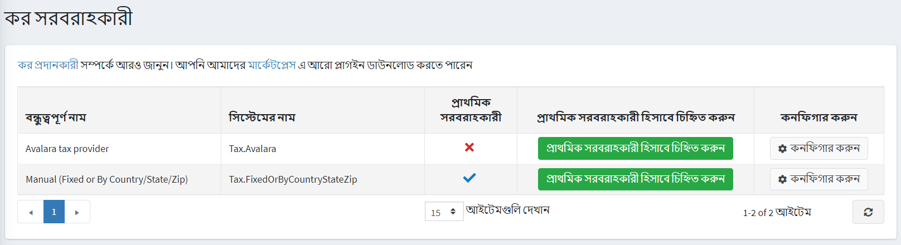

# কর প্রদানকারী

ট্যাক্স রেট প্রদানকারীদের সংজ্ঞায়িত করতে **কনফিগারেশন → ট্যাক্স প্রদানকারী** এ যান।

কর গণনার জন্য শুধুমাত্র একটি কর হার প্রদানকারী ব্যবহার করা যেতে পারে। নতুন কর প্রদানকারী যোগ করা শুধুমাত্র উন্নত ব্যবহারকারীদের জন্য সুপারিশ করা হয়।
ডিফল্ট কর প্রদানকারী নির্বাচন করতে **প্রাথমিক প্রদানকারী হিসেবে চিহ্নিত করুন** বাটনে ক্লিক করুন।

> [!TIP]
> 
> ডিফল্টরূপে, নপকমার্স-এ বেশ কিছু কর প্রদানকারী পাওয়া যায়, কিন্তু নপকমার্স [মার্কেটপ্লেস](https://www.nopcommerce.com/marketplace) এ আপনি আরো কর প্রদানকারী খুঁজে পেতে পারেন।

কর প্রদানকারীদের কনফিগারেশন নিম্নলিখিত অধ্যায়ে বর্ণিত হয়েছে:
* [আভালারা কর প্রদানকারী](xref:bn/get-start/configure-tax/tax-providers/avalara)
ম্যানুয়াল
